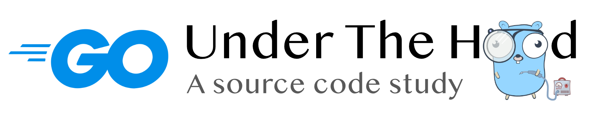

  

  

A source code study of Go | Based on <code>go1.14</code>

## To Readers

The Go language has been released for ten years since its inception in 2009.
During the past decade, the popularity of Go has gradually increased. The Go team releases a new version of Go every six months.
Looking at the history of most programming languages, it’s amazing that Go itself doesn't change too much during its evolution. The Go users are able to write backward-compatible applications continuesly.

From the perspective of language design, Go is designed to be simplicity, low cost of parallelism and concurrency.
It's hard not to be curious regarding the implementation mechanisms behind Go and the specific working principles behind its elegant design.
This book is a book all about Go language source code.

Readers of this book may be curious: language design is always evolving, source code is always changing, why bother to study the source code that may never be applied in actual work?
There is a saying that "software engineering happens when the code is read by a non-original author". During the process of reading the source code, we gain further and deeper understanding to the language itself.
More importantly, we can understand the fundamentals behind a design, and what are the technical engineering practices while implementing such a design.

In addition, there will be readers asking, there are so many articles on source code analysis, why should you wrote yet another book on source code analysis?
A very important reason is that when I started to read the Go source and other related articles,
it is found that most of the existing articles has been outdated, and there is no process in analyzing how the code was evolved, i.e. the background, related knowledge, and development history of a piece of code.
In the meantime, the development of the Go runtime is quite active, so I hope to be able to learn more about the latest version of the development while reading the code, as well as be able to have a certain understanding of the evolutionary history.

## Structure and Contents

This book covers the core source code of the entire Go language, including but not limited to the Go runtime `runtime` that Go users can directly reach, the compiler `cmd/compile` related to key language features, and many important standard libraries `sync`/`reflect`/`errors` and so on.
In rare cases, this book will cover the implementation differences cross different platforms, primarily based on Linux/Darwin amd64 and WebAssembly introduced in Go 1.11.

The book is divided into four parts. The first part briefly reviews the basic theories related to the Go runtime and the compiler, and briefly discusses the life cycle of the Go program in its final chapter.
The second part focuses on Go's runtime mechanism, which includes the scheduler, memory allocator, garbage collector, debugging mechanism, and ABI for the Go program.
The third part covers Go compiler mechanism, including the Go compiler translation for keywords, the behavior for cgo programs, and the linker.
The last part of the book discusses some standard libraries that rely on the runtime and compiler, as well as the package that are important to our daily development. Note that rhis book only introduces the cooperation between these standard libraries and the runtime and compiler, and does not analyze the source code of the entire package.

## Getting started

- [🇨🇳 简体中文](./book/zh-cn/TOC.md)
- 🇬🇧 English (Unplanned)

## Acknowledgements

The author has limited time and language skills. If readers find any mistakes of the book or any language improvements, please feel free to open an [Issues](https://github.com/changkun/go-under-the-hood/issues/new/choose) or start a [Pull request](https://github.com/changkun/go-under-the-hood/pulls). For detailed guidelines, please refer to [How to contribute](./CONTRIBUTING.md).

The author would like to thank [@egonelbre](https://github.com/egonelbre/gophers) for his charming gopher design.

<a href="https://github.com/changkun/go-under-the-hood">Go under the hood</a> &copy; 2018 - 2020 <a href="https://changkun.de">Changkun Ou</a>

