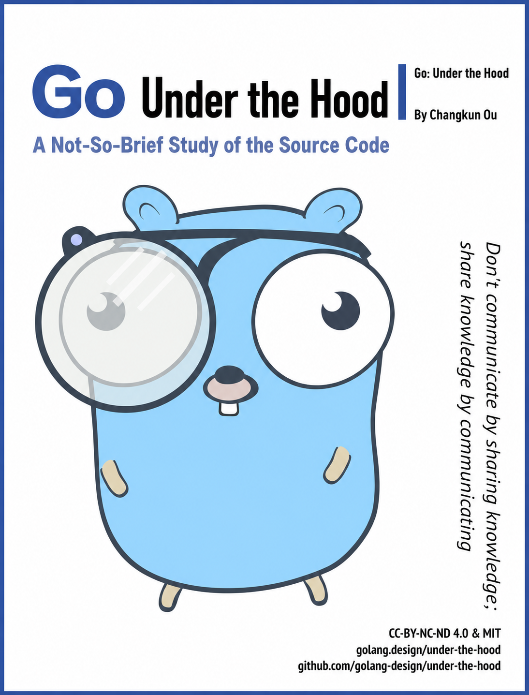

# Go: Under the Hood

Current content is based on `go1.26`

 

Go has been around for more than a decade since its birth in 2009. Looking across the history
of most programming languages, it is striking how little Go itself has changed over its decade
of evolution: its users keep writing applications that stay backward compatible. From the
standpoint of language design, for a language built from the start around the principles of low
cost, high concurrency, and simplicity, it is hard not to be curious about the implementation
mechanisms and the concrete workings behind that simple surface. This book discusses the
technical principles in the Go source engineering and how they have evolved.

## To the Reader

The reader may wonder: designs keep evolving and source keeps changing, so why spend effort
studying source that one may never touch at work? The author thinks otherwise, because
"software engineering happens the moment code is read by someone other than its original author."
In reading the source, beyond deepening our understanding of the language itself, what matters
more is grasping the fundamental principles a design rests on, together with the engineering
decisions, practices, and implementation techniques that others applied while building it. Code
can always be rebuilt from scratch, but principles "live forever."

The vision for this book is to cover every facet of the Go language. This includes the Go runtime
components that user code touches directly, the toolchain tightly bound to key language features,
many important standard libraries, and more. In some cases the book discusses implementation
differences across platforms, with the focus on Linux/amd64.

## Prerequisites

The reader should have some basic computer science literacy, having taken at least one course in
**programming** and one in **data structures**, comfortable for instance discussing concepts such
as hash tables and red-black trees. Basic knowledge of **discrete mathematics** and **probability**,
with some understanding of predicates, random variables, and the like, will help with parts of the
book.

The book does not assume that the reader already knows how to use Go, so it gives a quick tour of
the Go language specification at the start. If you already have experience coding in Go, that will
help you read the book.

## About This Edition

The content of this book has been systematically rewritten and revised against **Go 1.26**, covering
five parts: the panorama and history, language features, concurrency, memory, and the compiler and
toolchain. Every section tries to return to the thread of "problem, design, evolution, trade-off,
implementation," cross-checked against the Go source and primary design documents.

Even so, the source keeps evolving, and the book is bound to contain omissions or material that
goes stale across versions. If the reader suspects a passage is wrong, please open an Issue or a
Pull Request in the repository, and we will keep revising.

## Start Reading

- [Read online](https://golang.design/under-the-hood/)

## Community Support

Updates to the book and some additional references can be found on the book's home page
( https://golang.design/under-the-hood ) and its GitHub repository
( https://github.com/golang-design/under-the-hood ). This is an open-source book created under the
[golang.design](https://golang.design) initiative. The reader can raise questions about the book's
content on GitHub, report errors, or even take part in the writing. The author welcomes
[Issues](https://github.com/golang-design/under-the-hood/issues/new/choose) and
[Pull Requests](https://github.com/golang-design/under-the-hood/pulls) on the repository; for the
details please see [how to contribute](https://github.com/golang-design/under-the-hood/blob/master/CONTRIBUTING.md).
If you would like to follow updates to this repository, click `Watch`. If you enjoy the book, we are
also glad to receive your `Star` and your support.

## Acknowledgments

The lead author ([@changkun](https://changkun.de)) first wishes to thank
[@yangwenmai](https://github.com/yangwenmai), founder of [Go 夜读](https://talkgo.org/), for
sponsoring the [golang.design](https://golang.design) initiative. We also wish to thank the core
members of the [Go 夜读](https://talkgo.org/) community group for the Go community environment they
have worked to build, namely [@qcrao](https://github.com/qcrao),
[@eddycjy](https://github.com/eddycjy), [@FelixSeptem](https://github.com/FelixSeptem), along with
friends in the community who actively join and discuss Go-related questions, namely
[@cch123](https://github.com/cch123).

This book could not have been written without the support of many attentive readers. We have
received helpful feedback and errata from, among others: [@two](https://github.com/two),
[@yangxikun](https://github.com/yangxikun), [@cnbailian](https://github.com/cnbailian),
[@choleraehyq](https://github.com/choleraehyq), [@PureWhiteWu](https://github.com/PureWhiteWu),
[@hw676018683](https://github.com/hw676018683), [@wangzeping722](https://github.com/wangzeping722),
[@l-qing](https://github.com/l-qing). We are sincerely grateful for their questions and corrections.
Errors no doubt remain, and we welcome further corrections and feedback.

Finally, special thanks to [@egonelbre](https://github.com/egonelbre/gophers) for the Gopher artwork.

## License

&copy; 2018-2026 The [golang.design](https://golang.design) Initiative Authors. Licensed under [CC-BY-NC-ND 4.0](https://creativecommons.org/licenses/by-nc-nd/4.0/).
