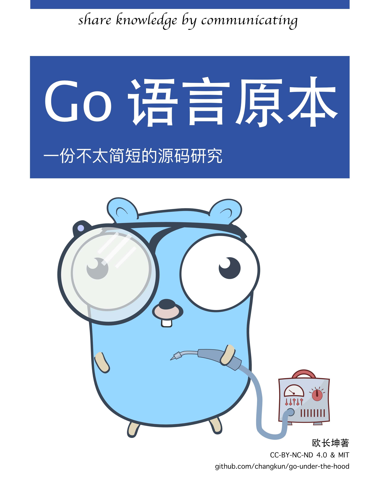
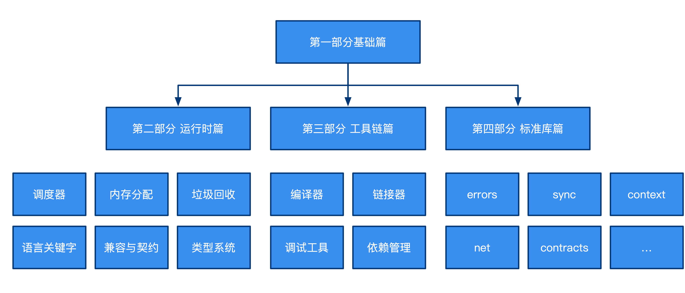

# Go 语言原本

内容基于 `go1.14`

Go 语言从 2009 年诞生之初已有十余年的历史。
在这十年的过程中，Go 语言的热度逐渐上升，Go 语言团队也在持续不断的每隔六个月的时间就发布一个全新的 Go 版本。
纵观大多数编程语言的历史进程，令人惊讶的是 Go 语言自身在进化的这十余年间，
语言本身并未发生太大变化，Go 语言的用户能够持续不断写出向后兼容的应用。
从语言设计的角度而言，作为一门从诞生之初就考虑低成本高并发、简洁等原则的语言，
很难让人不对其简洁设计背后的各项实现机制以及具体工作原理所好奇。
本书就是一本讨论 Go 语言源码工程中的技术原理及其演进历程的书籍。

## 本书的写作目标

读者可能会好奇，设计总在演进、源码总在变化，为什么要耗费力气研究实际工作中可能永远不会接触的源码？
笔者以为不然，因为『软件工程发生在代码被非原作者阅读之时』，在阅读源码的过程中，
我们除了能进一步加深对语言本身的理解，更重要的则是理解某个设计背后所使用的根本原理，
以及当其他人在实现这个设计的过程中发生的工程决策、实践与实现技巧。
代码总是可以推倒重来，但原理却能『永生』。

另外也能会有读者问，源码分析的文章这么多，为什么还要专门写关于源码分析的书？
一个很重要的原因在于笔者在开始阅读 Go 源码并查阅部分资料时，
发现已经存在的资料大多已经存在一定程度上的过时，
同时在分析源码的过程中并没有细致到介绍某段代码的的产生背景、相关知识，
更没有详细的调研并介绍技术的理论原理和发展历程。
这使得笔者在阅读这类资料时无法鉴别其内容的正确性。由于 Go 运行时的开发是相当活跃的，
因此本书希望对整个 Go 源码的技术原理和演进历史进行一个相对完整的介绍。

注意，目前所有正文内容均为临时写作阶段，内容可能较为混乱，当全文初稿完成后会针对以下目标进行优化：

- 行文逻辑优化，补充大量配图
- 源码删减，只保留核心逻辑
- 对实际原理进行精炼，并延伸至理论
- 加强理论部分的描述，消除时效性较强的内容
- 理论与实践为主，代码为辅

## 全书的组织结构

本书内容涵盖整个 Go 语言的核心源码，这包括用户代码能直接接触的 Go 运行时组件、
与关键语言特性强相关的的编译工具链、诸多重要的标准库 `sync`、`context`、`reflect` 和 `errors` 等等。
在极少数情况下，本书会讨论不同平台下的实现差异，主要以 Linux amd64 为主，只在独立设计的章节中讨论其他平台，例如 macOS 的 darwin 平台、WebAssembly 等。

本书共分为四个主要部分：

- 第一部分简要回顾了与 Go 运行时及编译器相关的基础理论，并在其最后一章中简要讨论了 Go 程序的生命周期。
- 第二部分着重关注 Go 的运行时机制，这包括调度器、内存分配器、垃圾回收器、调试机制以及程序的 ABI 以及运行时的类型系统等。
- 第三部分则着眼于 Go 的编译器、链接器以及相关工具链，包括 Go 编译器对关键字的翻译行为、逃逸分析、对 cgo 程序的翻译过程等等。
- 第四部分则讨论了一些依赖运行时和编译器的标准库，本书只介绍这些标准库与运行时和编译器之间的配合，并不会完整的整个包的源码进行分析。

## 阅读的预备知识

阅读本书的读者应该具备一些基本的计算机科学素养，至少学过一门**程序设计**课程以及**数据结构**的课程，具备基本的**离散数学**和**概率论**知识将对阅读本书的部分章节有所帮助。

本书并未要求读者已经掌握使用 Go 语言，因此会在开篇快速介绍 Go 语言的语言规范，已经具备 Go 语言编码和相关开发经验对阅读本书会有所帮助。

## 开始阅读

- [网站在线](https://changkun.de/golang/)

## 社区的支持

本书的主页（ https://changkun.de/golang ）以及 GitHub 仓库（ https://github.com/changkun/go-under-the-hood ）上可以找到本书的更新以及一些额外的参考资料。
读者还可以在 GitHub 仓库上向作者发起关于本书内容的问题，或报告本书存在的错误。
笔者欢迎您提交从 GitHub 提交 [Issues](https://github.com/changkun/go-under-the-hood/issues/new/choose) 或 [Pull request](https://github.com/changkun/go-under-the-hood/pulls)。
其具体细节请参考[如何参与贡献](../../CONTRIBUTING.md)。
如果您想要关注本仓库的更新情况，可以点击仓库的 `Watch`。如果您喜欢本书，我们也非常高兴能够收到您的 `Star` 和捐款。

## 致谢

本书的写作离不开诸多热心读者的支持，笔者收到了来自下列人员的有帮助的评价和勘误：@two, @yangxikun, @cnbailian, @choleraehyq, @PureWhiteWu。笔者真心感谢这些人对本书内容的质疑与指正。当然，书中还可能有错误存在，希望得到更多的指正和反馈。

另外，笔者还希望感谢他在 [Go 夜读](https://reading.developerlearning.cn/) 社区小组的朋友们表示感谢，感谢他们提供让笔者持续接触 Go 的机会，他们是：@yangwenmai, @qcrao, @eddycjy, @FelixSeptem。

最后，作者特别希望感谢 [@egonelbre](https://github.com/egonelbre/gophers) 所提供的 gopher 图片设计。

## 许可

[Go under the hood](https://github.com/changkun/go-under-the-hood) | CC-BY-NC-ND 4.0 & MIT &copy; [changkun](https://changkun.de)
