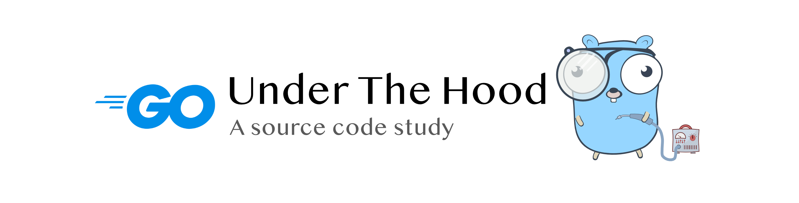

  

  

A source code study of Go | Based on <code>go1.12</code>

&copy; 2018 - 2019 <a href="https://changkun.de">changkun</a>

<a href="https://github.com/changkun/go-under-the-hood">Go under the hood</a> | CC-BY-NC-ND 4.0 | MIT

