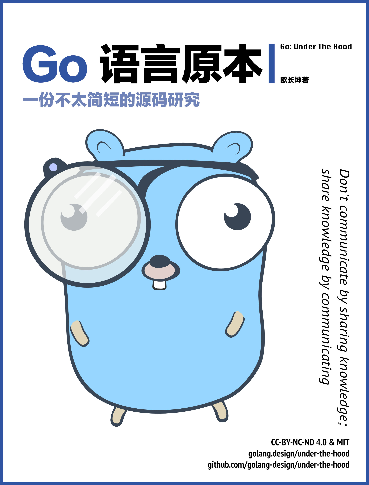

# Go 语言原本

当前内容基于 `go1.14`

Go 语言从 2009 年诞生之初已有十余年的历史。
纵观大多数编程语言的历史进程，令人惊讶的是 Go 语言自身在进化的这十余年间，
语言本身并未发生太大变化，Go 语言的用户能够持续不断写出向后兼容的应用。
从语言设计的角度而言，作为一门从诞生之初就考虑低成本、高并发、简洁等原则的语言，
很难让人不对其简洁设计背后的各项实现机制以及具体工作原理所好奇。
本书就是一本讨论 Go 语言源码工程中的技术原理及其演进历程的书籍。

## 致读者的话

读者可能会好奇，设计总在演进、源码总在变化，为什么要耗费力气研究实际工作中可能永远不会接触的源码？
笔者以为不然，因为『软件工程发生在代码被非原作者阅读之时』，在阅读源码的过程中，
我们除了能进一步加深对语言本身的理解，更重要的则是理解某个设计背后所使用的根本原理，
以及当其他人在实现这个设计的过程中发生的工程决策、实践与实现技巧。
代码总是可以推倒重来，但原理却能『永生』。

本书的创作愿景是涵盖整个 Go 语言的方方面面。这包括用户代码能直接接触的 Go 运行时组件、
与关键语言特性强相关的工具链、诸多重要的标准库等等。在部分情况下，
本书会讨论不同平台下的实现差异，但着重以 Linux amd64 为主。

## 阅读的预备知识

阅读本书的读者应该具备一些基本的计算机科学素养，至少学过一门**程序设计**课程以及**数据结构**的课程，例如能够熟悉地谈论散列表、红黑树等概念。若你具备基本的**离散数学**和**概率论**知识，对谓词、随机变量等数学概念具有一定程度的理解，那么将会对阅读本书的部分章节有所帮助。

本书的参考文献分为两种不同的类型。在每个章节后都附有进一步阅读的参考文献，
这类文献的主要目的是将读者指向书中尚未进一步深入探讨的话题，通常这类话题已经超出全书的讨论范畴，
这类文献给对该内容感兴趣的读者一个进一步阅读的空间；
其二是书后的参考文献，这些文献是在编写本书时引用、参考的主要文献，读者可以根据自己的需求选择并查阅本书参考过的文献。

本书并未要求读者已经掌握使用 Go 语言，因此会在开篇快速介绍 Go 的语言规范。如果你已经具备 Go 语言编码和相关开发经验，则会对阅读本书有所帮助。

## 免责声明

注意，目前本书还属于相当早期的创作阶段。如果读者在阅读过程中怀疑某段内容的描述是错误的，
那么它很可能就是错误的。本书目前的大致创作进度：█░░░░░░░░░ (9.9%/100%)

## 开始阅读

- [网站在线](https://golang.design/under-the-hood/)

## 社区的支持

本书的主页（ https://golang.design/under-the-hood ）以及 GitHub 仓库（ https://github.com/golang-design/under-the-hood ）上可以找到本书的更新情况以及一些额外的参考资料。
这是一本属于 [golang.design](https://golang.design) initiative 旗下创作的开源书籍，读者还可以在 GitHub 仓库上发起关于本书内容的问题，或报告本书存在的错误。
笔者欢迎您在 GitHub 仓库上提交 [Issues](https://github.com/golang-design/under-the-hood/issues/new/choose) 或 [Pull Request](https://github.com/golang-design/under-the-hood/pulls)。
其具体细节请参考[如何参与贡献](https://github.com/golang-design/under-the-hood/blob/master/CONTRIBUTING.md)。
如果您想要关注本仓库的更新情况，可以点击仓库的 `Watch`。如果您喜欢本书，我们也非常高兴能够收到您的 `Star` 和资助。

## 致谢

笔者首先希望感谢 [Go 夜读](https://reading.developerlearning.cn/) 的创始人 [@yangwenmai](https://github.com/yangwenmai) 为 [golang.design](https://golang.design) 计划提供赞助。

其次，笔者还希望感谢 [Go 夜读](https://reading.developerlearning.cn/) 社区小组的核心成员，感谢他们努力建设的 Go 语言社区环境，他们是：[@qcrao](https://github.com/qcrao), [@eddycjy](https://github.com/eddycjy), [@FelixSeptem](https://github.com/FelixSeptem)，以及社区里的朋友们积极参与并讨论 Go 语言的相关问题，他们是：[@cch123](https://github.com/cch123)。

当然，本书的写作离不开诸多热心读者的支持，笔者收到了来自下列人员的有帮助的评价和勘误：[@two](https://github.com/two), [@yangxikun](https://github.com/yangxikun), [@cnbailian](https://github.com/cnbailian), [@choleraehyq](https://github.com/choleraehyq), [@PureWhiteWu](https://github.com/PureWhiteWu), [@hw676018683](https://github.com/hw676018683), [@wangzeping722](https://github.com/wangzeping722), [@l-qing](https://github.com/l-qing)。笔者真心感谢这些人对本书内容的质疑与指正。当然，书中还可能有错误存在，希望得到更多的指正和反馈。

最后，笔者特别感谢 [@egonelbre](https://github.com/egonelbre/gophers) 所提供的 gopher 图片设计。

## 许可

[Go: Under the Hood](https://github.com/golang-design/under-the-hood) | CC-BY-NC-ND 4.0 & MIT &copy; [changkun](https://changkun.de)
