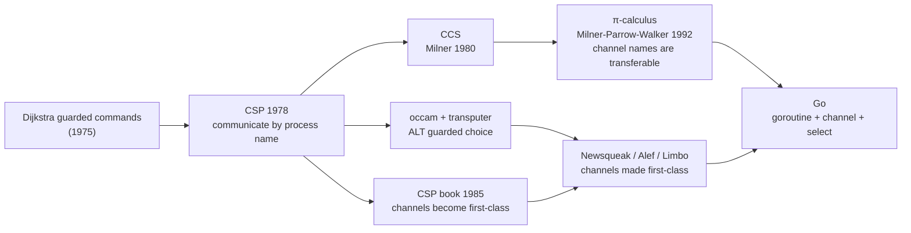

# 1.3 Communicating Sequential Processes

> This section comes with an online talk: [YouTube](https://www.youtube.com/watch?v=Z8ZpWVuEx8c), [Google Slides](https://changkun.de/s/csp/).

The intellectual source of Go's concurrency model is **Communicating Sequential Processes** (CSP), which Hoare proposed in CACM in 1978. This section traces that lineage from the perspective of the history of ideas, because it explains why goroutines and channels look the way they do today. The implementation details of channels and select (the ring buffer in hchan, the pairing of `gopark` and `goready`, the two-round locking in `selectgo`) are left for [Chapter 10](../../part3concurrency/ch10chan/readme.md). Here we are concerned with "why CSP", and with how that choice has shaped the appearance of Go programs.

## 1.3.1 The Core Claim of CSP

In the 1970s, multi-core processors were still a research topic, not yet within the ordinary programmer's view. Means for coordinating concurrent entities were already plentiful by then: semaphores (Dijkstra, 1965), monitors (Hoare, 1974), locks and mutexes, message passing. In 1979 Lauer and Needham even proved that "message passing" and "shared memory plus locking" are equivalent in expressive power, two faces of the same thing. Hoare's choice within this landscape was to make communication (that is, input and output) a basic element of the programming language, and to use it as the sole means of coordination.

The core of CSP is a counterintuitive claim: **processes do not share state; they coordinate only by passing messages.** In the world of shared memory, multiple threads read and write the same block of memory, relying on locks to keep from trampling one another, which is both dangerous (data races, deadlocks) and hard to reason about. CSP goes the opposite way: each sequential process guards its own state, and when it needs to cooperate it **sends a message**, handing off data and control through a single synchronous act of communication. Go distills this claim into its well-known maxim: "**Do not communicate by sharing memory; instead, share memory by communicating.**"

There is a point of historical fact that needs clearing up here. It is often passed over in a single sentence, yet it is precisely the key to understanding the relationship between Go and CSP.

## 1.3.2 CSP in 1978: Communicating by Process Name, Without Channels

A reader who opens Hoare's original 1978 paper will find something unexpected: that language has **no first-class channels**. Communication is not a matter of dropping data into some anonymous pipe; it **names a process directly**. The two basic operators are:

- `p!value`: **send** a value to the process named `p`;
- `q?var`: **receive** a value from the process named `q`, storing it into `var`.

The sender writes down the name of the receiver, and the receiver writes down the name of the sender; the communication happens only when both parties **rendezvous** at their corresponding statements, at which point the value is copied across and each side proceeds. The whole language stands on a handful of operators: sequence `;`, parallel `||`, assignment `:=`, input `?`, output `!`, guard `→`, choice `□`, and repetition `*`. For example,

```
[west::DISASSEMBLE || X::COPY || east::ASSEMBLE]
```

launches three parallel processes that address one another by name. This "communicate by process name" design has a plain virtue: the language need not introduce an extra concept such as a channel. But its cost is just as direct. A subprocess must know the name of the process that uses it, which makes it hard to encapsulate into a reusable library; and the parallel composition `[a::P || b::Q]` is an operation with a variable number of operands, which cannot be reduced algebraically any further. Hoare himself corrected both of these in his 1985 book.

Abstracting the communicating entity into **a channel that can be named independently and passed as a value** came only later: it was established in the **occam** language of the early 1980s (running on the transputer processor), and was paired with a revised process algebra in the **1985 CSP book**. What Go inherits is exactly this later, channel-centric line, not the 1978 process-name addressing. So when we write `make(chan int)` in Go, store it in a variable, stuff it into a struct, or even receive one channel from another channel, we are drawing on the tradition of occam and the 1985 book, not on that seminal paper.

## 1.3.3 The Lineage of Process Algebra: From CCS to the π-calculus

CSP is not a lone peak. Around the same time, Robin Milner was developing another strand of **process algebra**, **CCS** (Calculus of Communicating Systems, Milner 1980). CCS and CSP are concerned with the same question (how to formally describe and characterize the behavior and equivalence of concurrent processes), with different emphases in technique: CCS takes "both parties synchronizing on a single action" as the atom of its algebra, and developed **bisimulation** as a tool for characterizing process equivalence.

The step that truly connects CCS to Go's bloodline is its successor, the **π-calculus** (Milner, Parrow, Walker 1992). The π-calculus adds **mobility** to process algebra: the name of a channel can itself be passed as a message along a channel. One process sends the name of some channel to another process, which thereby gains the ability to communicate on that channel, so that the **topology of communication can change at run time**. This is exactly what `chan chan T` (a channel of channels) expresses in Go, and the theoretical counterpart of the design in which "a channel is a first-class value". The snippet below, which sends a "reply channel" out along with the request, is the most common Go form of π-calculus-style mobility:

```go
type request struct {
    arg   int
    reply chan int // send along the reply channel as well
}

func server(reqs <-chan request) {
    for r := range reqs {
        r.reply <- r.arg * r.arg // send the result back along the channel the caller provided
    }
}
```

Drawing the whole lineage together makes Go's place clear:



That middle line, Newsqueak / Alef / Limbo, is a continuous series of experimental languages built by Rob Pike and others over two decades at Bell Labs. They progressively "made first-class" occam's channels and guarded choice; Go's `<-` communication operator and its `select` statement are inherited from here ([1.1](./history.md)). Go is therefore not an out-of-thin-air application of a single paper, but stands at the end of this engineering lineage.

## 1.3.4 occam's ALT and Go's select

CSP has one more legacy worth singling out: **guarded choice**. It originates in Dijkstra's guarded commands, became `ALT` in occam, and is `select` in Go. The problem it solves is this: a process facing several communications at once should handle whichever one becomes ready first, without having to prescribe an order in advance. In the CSP of 1978, it is written as

```
*[X?V() → val := val+1 □ val > 0; Y?P() → val := val-1]
```

`□` separates several guarded branches, each guarded by an input; if several guards are ready at once, one is chosen **at random** to execute. This "random" choice is not laziness but a way to provide **fairness**, preventing any one communication from being starved indefinitely. Go's `select` inherits this semantics unchanged: when multiple cases are ready at once, the runtime picks one pseudo-randomly ([Chapter 10](../../part3concurrency/ch10chan/readme.md)).

## 1.3.5 Go's Concurrency Model: Let the Code Speak

With the lineage laid out, coming down to Go itself, the model has only two things: **goroutines** (sequential processes) and **channels** (communication). A `go` keyword starts a goroutine, and a `<-` completes one communication.

The most basic form is a single send and a single receive:

```go
ch := make(chan int)
go func() { ch <- 42 }() // one goroutine sends
v := <-ch                // another goroutine receives, getting 42
```

Whether a channel is buffered determines whether this communication is a **synchronous rendezvous** or an **asynchronous delivery**, which corresponds exactly to the two forms of CSP 1978. An unbuffered channel is a pure rendezvous: the sender blocks until some receiver is in place, and the two meet strictly at the point of communication. A buffered channel lets the sender go a step ahead while the buffer is not full, relaxing one synchronization into a bounded queue (the CSP of 1978 did not take buffered communication as a primitive; Hoare **simulated** a buffer using an unbuffered process, and the **concept** of "relaxing synchronization with a bounded queue" is precisely the conceptual forerunner of the buffered channel):

```go
unbuffered := make(chan int)    // capacity 0: send blocks until a receiver is in place (rendezvous)
buffered := make(chan int, 4)   // capacity 4: send when not full, no need to wait for a receiver
```

`select` lets a goroutine choose among several communications, and through `default` it can make a non-blocking attempt, and through `time.After` it can time out:

```go
select {
case v := <-in:
    handle(v)
case out <- result:
    // sent successfully
case <-time.After(time.Second):
    // time out and exit, avoiding a permanent block
}
```

With these three things, the classic CSP patterns become the natural way to write code. That DISASSEMBLE → COPY → ASSEMBLE example from Hoare's 1978 paper (read in from 80-column cards, flow it character by character, then lay it out for 125-column printing) is in essence a **pipeline**: each process does one small thing in sequence, channels connect upstream to downstream, and data flows along the channels. Translated into Go, it is a few goroutines strung together:

```go
// COPY: pass characters from upstream to downstream unchanged, and close downstream at end of input
func copyStage(west <-chan rune, east chan<- rune) {
    for c := range west {
        east <- c
    }
    close(east) // closing means "I am done"; downstream's range then ends
}

// String the three stages into a pipeline: the upstream close propagates stage by stage, and the whole pipeline winds down naturally
func reformat(cardfile <-chan []rune, lines chan<- string) {
    west, east := make(chan rune), make(chan rune)
    go disassemble(cardfile, west)
    go copyStage(west, east)
    assemble(east, lines) // the final stage runs synchronously in the current goroutine
}
```

There is a Go-specific convention at work here: use `close` to express "the data stream has ended", and downstream's `for range` will exit naturally once the channel is closed and drained, so the close signal propagates stage by stage along the pipeline. The other side of the same technique is to use a dedicated **done channel** to broadcast cancellation: once it is closed, every goroutine listening on it is immediately unblocked at `<-done`:

```go
func worker(in <-chan int, done <-chan struct{}) {
    for {
        select {
        case v := <-in:
            process(v)
        case <-done: // as soon as upstream closes done, return here immediately
            return
        }
    }
}
```

This way of "moving data along channels and propagating signals with close" is the recurring skeleton of Go concurrency code, and the underlying form of the cancellation mechanism in the `context` package.

## 1.3.6 CSP and the Actor Model

Contemporary with CSP, but taking another road, is the **Actor model** proposed by Hewitt and others in 1973, which received its most complete engineering realization in Erlang (Armstrong and others, 1980s). Both hold that "do not share state, cooperate through messages"; they part ways on **who a message is addressed to, when it arrives, and whether an entity has an identity**:

| Dimension | CSP / Go | Actor / Erlang |
| --- | --- | --- |
| Communication medium | the anonymous channel, which is a "value" | the actor with an identity, addressed by its address (PID) |
| What the sender names | a channel | a receiver |
| Entity identity | a goroutine has no externally exposed identity | each actor has a unique address that can be referenced and supervised |
| Default timing | unbuffered means synchronous rendezvous | asynchronous delivery into the receiver's mailbox |
| Buffering | a channel's capacity is explicitly bounded | a mailbox is conceptually unbounded |
| Multi-way choice | `select` chooses among several channels | the receiver picks messages from the mailbox by pattern matching |
| Failure model | no built-in semantics, relies on convention (panic/done) | supervision trees, "let it crash", links and monitors |

In one sentence: CSP lets you **name the pipe of communication**; Actor lets you **name the other end of communication**. Go chose the former, so goroutines do not know who each other are, only that they jointly hold a channel; whoever holds the channel can take part in this communication. Erlang chose the latter, so each process has an address and a mailbox, and on top of this grows a **fault-tolerance system** for which CSP has no counterpart: processes can link to and supervise one another, and one crash can let the supervisor restart it according to a strategy. Each road has its strengths, and Go did not copy either of them wholesale.

## 1.3.7 Go's Choices Within CSP, and Why This Lineage Matters

Go does not treat CSP as dogma; every change reflects its engineering taste:

- **Not pure CSP.** Go **keeps** shared memory and locks ([11 Synchronization](../../part3concurrency/ch11sync)). It takes CSP as the **preferred** rather than the **only** means: use a channel when flow is best expressed by a channel, and use a lock when a small piece of state is best guarded by a lock. This lack of dogma is exactly the Go style.
- **Channels are first-class values.** They can be passed, stored, and sent over a channel, letting the communication topology change at run time (the π-calculus-style mobility of 1.3.3).
- **Goroutines are extremely cheap.** A CSP "process" is a goroutine in Go ([9.3](../../part3concurrency/ch09sched/mpg.md)), starting from just a 2KB stack, able to exist by the million at once, turning "open one process per concurrent task" from theoretical elegance into practical feasibility.
- **`select` is guarded choice.** occam's `ALT` became `select` in Go.

Choosing the CSP lineage has deeply shaped the appearance of Go programs. It encourages us to imagine a concurrent program as "a group of small processes, each running sequentially and connected to one another by channels": data flows along channels, ownership transfers with it, and so "a given piece of data is held by only one goroutine at any one moment" becomes a natural result, greatly lightening the mental burden of contention and locks. This is of a piece with Go's overall philosophy of "explicit and simple" ([1.2](./go.md)): communication is explicit (you can see every channel), and the units of concurrency are cheap and independent. Once you understand this lineage of ideas, from the process names of 1978, through occam and the π-calculus, to the experimental languages of Bell Labs, you can then read [9 The Scheduler](../../part3concurrency/ch09sched/readme.md) and [10 Channels and select](../../part3concurrency/ch10chan/readme.md) and see both the trees (the implementation details) and the forest (why it is designed this way).

## Further Reading

1. C. A. R. Hoare. "Communicating Sequential Processes." *Communications of the ACM*,
   21(8): 666-677, 1978. https://doi.org/10.1145/359576.359585 (the seminal CSP paper, communicating by process name);
   book: *Communicating Sequential Processes.* Prentice-Hall, 1985. (channels made first-class, algebra revised)
2. Robin Milner. *A Calculus of Communicating Systems.* LNCS 92, Springer, 1980. (CCS)
3. Robin Milner, Joachim Parrow, David Walker. "A Calculus of Mobile Processes, I & II."
   *Information and Computation*, 100(1): 1-77, 1992. (the π-calculus, the mobility of transferable channel names)
4. Carl Hewitt, Peter Bishop, Richard Steiger. "A Universal Modular ACTOR Formalism for
   Artificial Intelligence." *IJCAI*, 1973. (the Actor model)
5. Joe Armstrong. *Making Reliable Distributed Systems in the Presence of Software Errors.*
   PhD thesis, KTH, 2003. https://erlang.org/download/armstrong_thesis_2003.pdf (Erlang and supervision trees)
6. INMOS Ltd. *occam Programming Manual.* Prentice-Hall, 1984. (occam's channels and ALT)
7. Rob Pike. *Concurrency Is Not Parallelism.* 2012. https://go.dev/blog/waza-talk
8. The Go Authors. *Share Memory By Communicating.* https://go.dev/blog/codelab-share ;
   this book's [10 Channels and select](../../part3concurrency/ch10chan/readme.md) (the implementation of hchan/select).
