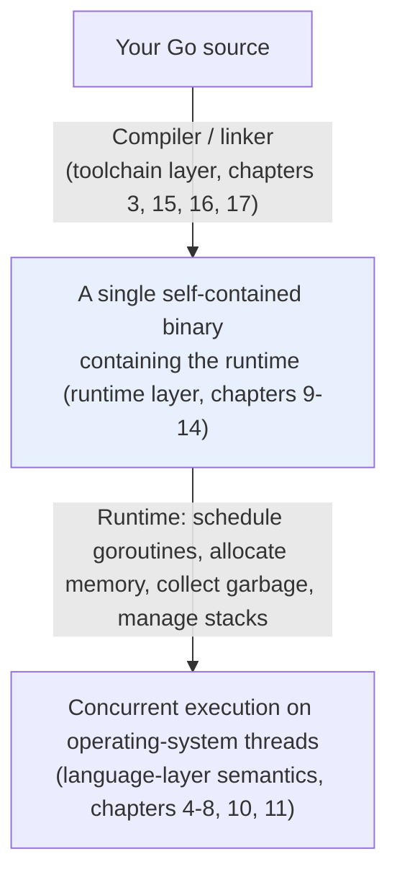

# 1.2 An Overview of the Go Language

This section builds a skeleton for the whole book. It is not a syntax manual; Go's syntax is explained clearly in any introductory book, and repeating it would serve no purpose.
What we want to do is first establish a **bird's-eye view of the whole**: which layers make up Go, which **distinctive** design decisions it carries,
and where in this book each of those decisions is developed. Once you have read this section, you can dive into any later chapter without losing your way.

## 1.2.1 A Three-Layer View and a Heavy Runtime

Go can be understood in three layers, and this book is organized roughly along these three layers plus the historical groundwork.

**The language layer**, the thing you write directly: syntax, the type system, concurrency primitives, error handling. It is deliberately small and orthogonal; 25 keywords are the whole of it.

**The runtime layer**, the "small operating system" that is compiled into the same binary as your program and quietly supports it from behind: the goroutine scheduler, the memory allocator, the garbage collector, stack management. This is Go's heaviest part, and the part most worth dissecting.

**The toolchain layer**, the machinery that turns source code into a program that can run, be diagnosed, and be maintained: the compiler, the linker, the module system, testing and observability tools.



One striking feature of Go is that its **runtime layer is unusually heavy**. A C program carries almost no runtime; a Java program puts its runtime inside a separate virtual machine. Go takes a third path: it **takes over the complexity that properly belongs to the operating system**, scheduling, garbage collection, stack management, **into a runtime that is compiled and linked together with your code**, in exchange for simplicity at the upper level: a single `go` keyword starts a goroutine that executes concurrently, manages memory automatically, and can block at any depth. This is why a Go binary runs on its own even with `FROM scratch`: it carries a tiny operating system of its own (this thread of "carrying its own runtime" runs all the way from [3.5 Bootstrapping](../ch03life/boot.md) through to [14 Execution Stacks](../../part4memory/ch14stack)).
The cost is a larger binary and considerable complexity in the runtime itself, but the gain is extremely simple deployment, with concurrency and memory management transparent to the user. Most of this book is precisely a dissection of this "tiny operating system hidden inside the binary".

## 1.2.2 A Few Distinctive Design Decisions

Go's character is concentrated in a handful of decisions that differ from mainstream languages. Below, each is illustrated with a short piece of code that points out its shape, indicates where it belongs in this book, and makes clear what it buys and what it pays.

**Concurrency is a first-class citizen of the language (CSP).** Starting a concurrent execution needs only `go`, coordination uses channels, and you never touch a thread library or locks.

```go
ch := make(chan int)
go func() { ch <- compute() }() // start a goroutine, send the result into the channel when done
result := <-ch                  // wait and receive here; communication is synchronization
```

Behind this lie the idea of CSP ([1.3](./csp.md)), cheap stackful coroutines and an M:N scheduler ([9](../../part3concurrency/ch09sched)), and the implementation of channels ([10](../../part3concurrency/ch10chan)). The trade-off is this: you gain the convenience of "spawning one goroutine for each concurrent thing", at the cost of the runtime having to carry a complex scheduler.

**Interfaces are structural and implicitly satisfied.** As long as a type has the methods an interface requires, it **automatically** satisfies that interface, with no `implements` declaration.

```go
type Reader interface { Read(p []byte) (int, error) }

// Any type with a Read([]byte)(int,error) method automatically is a Reader,
// even if its author never heard of Reader. This lets interfaces be defined
// for someone else's type "after the fact".
```

This embodies composition over inheritance and structural over nominal typing ([4.2](../../part2lang/ch04type/interface.md)). The trade-off is this: you gain extremely loose coupling (small interfaces adapt everywhere), at the cost of interface calls being indirect and hard to inline across an interface.

**Errors are values, not exceptions.** Errors are passed explicitly through ordinary return values and handled explicitly, with none of the implicit jumps of `try/catch`.

```go
f, err := os.Open(name)
if err != nil {
    return fmt.Errorf("open %s: %w", name, err) // wrap context, propagate explicitly
}
defer f.Close() // defer writes the cleanup next to the acquisition
```

`error`, `%w` wrapping, and `defer` are covered in [7](../../part2lang/ch07errors) and [6.2](../../part2lang/ch06func/defer.md) respectively. The trade-off is this: you gain error paths that are visible everywhere with nowhere to hide, at the cost of a screen full of `if err != nil`.

**Value semantics and a small set of core containers.** Go has no vast container library; almost everything is built on three things: arrays/slices, maps, and channels. A slice is "a view onto a segment of an underlying array", and assignment passes this lightweight view rather than a full copy.

```go
s := []int{1, 2, 3}
t := append(s, 4) // may share the underlying array with s, or may allocate anew, depending on cap
```

This design of "value semantics first, a few built-in containers" ([5 Data Structures](../../part2lang/ch05data)) keeps the flow of data clear, at the cost of needing to understand a few traps such as slice aliasing.

**Explicit over implicit.** No operator overloading, no implicit numeric conversions; unused imports and variables are compile errors outright. Looking at a line of Go code, you can almost always guess what it does, and this "no magic" is a deliberate design discipline ([1.1](./history.md)).

## 1.2.3 A Map of This Book

With these threads laid out, the structure of the whole book becomes clear, and behind every chapter stands a concrete trade-off:

- **Part 1, Overview and History** (this part): design philosophy and history ([1](.)), assembly and the calling convention ([2](../ch02asm), building one's own toolchain for control), and the life cycle of a program ([3](../ch03life), from the `go` command to the birth and death of `main`).
- **Part 2, Language Features**: the type system and interfaces ([4](../../part2lang/ch04type), structural versus nominal), data structures ([5](../../part2lang/ch05data), the memory layout of slices and maps), functions/defer/panic ([6](../../part2lang/ch06func)), error handling ([7](../../part2lang/ch07errors), values versus exceptions), and generics ([8](../../part2lang/ch08generics), thirteen years of restraint).
- **Part 3, Concurrency**: the scheduler ([9](../../part3concurrency/ch09sched), cooperative plus signal-based preemption), channels and select ([10](../../part3concurrency/ch10chan)), and synchronization primitives and the memory model ([11](../../part3concurrency/ch11sync), only sequentially consistent atomics).
- **Part 4, Memory**: the memory allocator ([12](../../part4memory/ch12alloc), tcmalloc plus GC metadata), garbage collection ([13](../../part4memory/ch13gc), a relentless pursuit of low latency), and execution-stack management ([14](../../part4memory/ch14stack), growable contiguous stacks).
- **Part 5, Compiler and Toolchain**: the compiler pipeline ([15](../../part5toolchain/ch15compile), the red line of compilation speed), tools and observability ([16](../../part5toolchain/ch16tools)), and modules and dependencies ([17](../../part5toolchain/ch17modules), minimal version selection versus constraint solving).

## 1.2.4 A Consistent Orientation

Looking at these pillars together, you find that they are not a pile of unrelated features but obey a single set of values, a set already stated in [1.1](./history.md): **simplicity over complexity, explicit over implicit, composition over inheritance, readability and maintainability over cleverness, and compilation speed and engineering scale over a language's ultimate expressive power.** For this reason, understanding any one part of Go is best done by returning to this set of orientations for comparison. Why the scheduler is cooperative plus signal-based preemption ([9.7](../../part3concurrency/ch09sched/preemption.md)), why the memory model exposes only sequentially consistent atomics ([11.9](../../part3concurrency/ch11sync/mem.md)), why generics waited thirteen years and were then made so restrained ([8.1](../../part2lang/ch08generics/history.md)): the answers all point back here in the end.

The dissection in this book is both an account of "how Go is implemented" and, more so, a repeated confirmation of "why Go chose as it did". Read on with this map and this set of orientations in hand, and every implementation detail will turn from an isolated point of knowledge into one more concrete unfolding of the same design philosophy.

## Further Reading

1. The Go Authors. *The Go Programming Language Specification.* https://go.dev/ref/spec
2. Rob Pike. *Go at Google: Language Design in the Service of Software Engineering.* 2012.
   https://go.dev/talks/2012/splash.article
3. The Go Authors. *Effective Go.* https://go.dev/doc/effective_go
4. Alan A. A. Donovan, Brian W. Kernighan. *The Go Programming Language.* 2015.
5. Rob Pike. *Go Proverbs.* https://go-proverbs.github.io/
