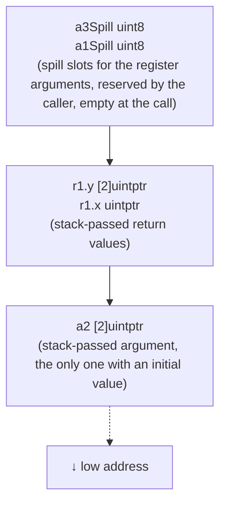
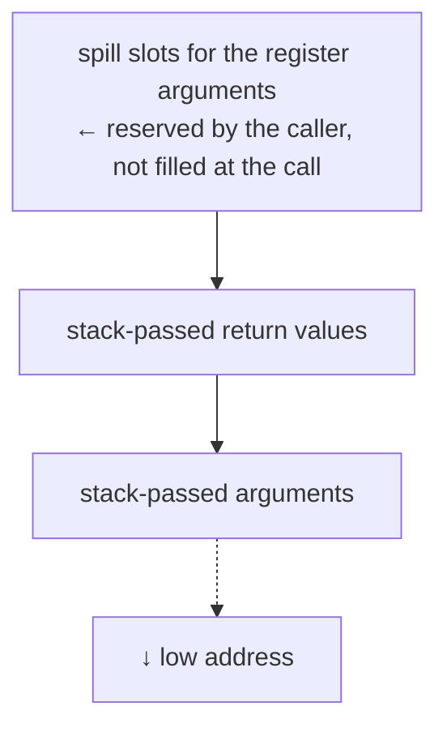

# 2.4 Argument Passing and Stack Frame Layout

[2.3](./callconv.md) laid out the division of labor between the two ABIs and the recursive algorithm for assigning arguments. That was the "rule". This section grounds the rule in a concrete example: given a signature that mixes scalars and arrays, how exactly are the arguments arranged in the stack frame, why does a register argument still reserve a spill slot on the stack, and how does the stack growth check that nearly every function pays for in its prologue hitch a ride on preemption. Finally we return to the overall question of "why a custom ABI" and combine these two sections into a complete answer.

## 2.4.1 An Example Mixing Stack and Register Passing

An abstract rule is never as clear as an example. Take that carefully designed signature from the ABI specification, which deliberately contains both a scalar that can go into a register and an array that must travel on the stack:

```go
func f(a1 uint8, a2 [2]uintptr, a3 uint8) (
    r1 struct{ x uintptr; y [2]uintptr }, r2 string)
```

Following the recursive assignment of [2.3.1](./callconv.md), on amd64 (with integer registers `RAX, RBX, ...`) the result is:

- `a1` and `a3` are scalars that can go into registers, assigned to `RAX` and `RBX`;
- `a2` is a non-trivial array, **falling back entirely to the stack**;
- the return value `r1` contains an array and also travels on the stack; `r2` is a `string`, split into its base and len parts, returned via `RAX` and `RBX` (on return the registers are counted afresh from the start, so there is no conflict with the incoming arguments).

So on entry only `a2` has an initial value on the stack. The stack frame layout is as follows, and the remaining regions are uninitialized at the call:



This example makes three things clear at once: scalars go into registers first, values containing an array travel on the stack as a whole, and **every register argument still keeps a spill slot on the stack** ready for use. Compare it against the "all-stack" ABI0 of [2.3.1](./callconv.md) and the difference is obvious: under ABI0, `a1`, `a3`, and `a2` are all laid out in order on the stack, with no registers and no need for spill slots; ABIInternal moves everything it can into registers, and what it saves is exactly those few reads and writes of stack memory.

## 2.4.2 Stack Frames, Spill Slots, and Register Conventions

A call pushes one **stack frame**, which from high to low address holds, in turn: the stack-passed argument area and stack-passed return value area that the caller reserves for the callee, the callee's local variables, the registers that must be saved, and the return address. Drawn on amd64 with the convention that low addresses are at the bottom, a call that passes arguments in registers has roughly this frame:



The **spill space** here is a design specific to the register ABI, and also a delicate trade-off. Passing arguments in registers saves stack reads and writes, but registers are overwritten by later instructions. Once a function needs to grow its stack partway through (see the next section), there must be somewhere to "spill" these register arguments for safekeeping. The key point is that **this temporary space is reserved by the caller within its own stack frame**, not the callee. The reason is that when the callee grows its stack, its own frame may have no room to spare at all; having the caller prepare the space in advance gives the stack growth path somewhere to land. This slot also serves as the "home" of the arguments: traceback printing of arguments and `reflect` call argument reduction both rely on it, a single arrangement that serves several purposes.

Registers fall into two kinds of convention. On amd64, `R14` always points to the **current goroutine** (that is, `g`), `RSP`/`RBP` are the stack pointer and frame pointer, and `RDX` carries the closure context when calling a closure. Worth pointing out: Go's ABIInternal **has no distinction between caller-saved and callee-saved registers**. A call may overwrite any register that has no fixed meaning, including the argument registers. This simplifies the implementation, at the cost that if the caller still needs a value in some register after the call, it is responsible for saving it itself.

## 2.4.3 The Stack Growth Check in the Prologue, and the Ride Preemption Takes on It

Go's calling convention also bakes in something few other ABIs have: the **stack growth check**. A Go goroutine's stack is very small (2KB initially) and grows on demand ([14 Execution Stack](../../part4memory/ch14stack)). This requires that nearly every function, before doing its real work, first confirm that the current stack space is still sufficient. So the compiler inserts a small check in the **prologue** of nearly every function: it compares the stack pointer `SP` against `g.stackguard0`, and if it is not enough, jumps to `morestack` to grow the stack, then re-executes this function from the start. Below is a real capture by `go tool objdump` of an ordinary function prologue (on arm64, `R28` is `g`, and `16(R28)` is `g.stackguard0`, isomorphic to amd64):

```asm
MOVD 16(R28), R16            // R16 = g.stackguard0
CMP  R16, RSP                // compare the stack pointer against the stack guard boundary
BLS  <morestack tail>        // SP is below the boundary, the stack is nearly exhausted, jump to grow it
MOVD.W R30, -32(RSP)         // check passed, normal stack frame setup
...                          // function body
// the tail jumped to from the start of the prologue:
MOVD R30, R3
CALL runtime.morestack_noctxt.abi0(SB)   // grow the stack
JMP  this function(SB)        // after growth, return to the prologue and rerun
```

Note the `.abi0` suffix in the tail. `morestack` is implemented in hand-written assembly and uses ABI0, exactly the boundary described in [2.3.1](./callconv.md).

The prologue code is not uniform. The compiler optimizes it in three tiers by frame size (`StackSmall = 128`, `StackBig = 4096` bytes): for a function whose frame is $\le$ `StackSmall`, the margin reserved at the bottom of the stack is enough to hold it, so a single `CMP guard, SP` plus one jump suffices, saving a subtraction instruction; for a frame between the two, it must first compute `SP - framesize` and then compare; for a frame $\ge$ `StackBig`, it does not compare at all and unconditionally calls `morestack`. This penny-pinching of "saving one instruction for small-frame functions" matters precisely because this check appears in **nearly every function**, and the constant saved, multiplied by the call frequency, adds up considerably.

What is truly clever is that this check, born for stack growth, is hitched a ride by Go's **cooperative preemption** ([9.7](../../part3concurrency/ch09sched/preemption.md)). When the runtime wants a goroutine to yield the CPU, it does not need to set up a separate interruption mechanism; it only needs to rewrite that goroutine's `stackguard0` into a sentinel value `stackPreempt` that is **always larger than any legal `SP`**:

```go
// Request preemption: change the stack guard boundary to the sentinel value (sketch from runtime/preempt.go)
gp.preempt = true
gp.stackguard0 = stackPreempt   // a value that no legal SP will ever satisfy
```

Now, the next time this goroutine enters any function prologue and runs that `CMP guard, SP`, the check is bound to "fail" and jump into `morestack`. `morestack` discovers that `stackguard0` is `stackPreempt` rather than a genuine stack shortage, and takes the opportunity to hand control back to the scheduler, completing a yield; after yielding it resets `stackguard0` back to `stack.lo + stackGuard`. A seemingly pure ABI detail (that stack check in the prologue) serves both **stack growth** and **cooperative preemption** at once. This is Go's typical technique of stacking several mechanisms onto the same low-cost checkpoint: since you pay for the checkpoint on every call anyway, let it serve more than one purpose. Of course, this path only takes effect at function calls and can do nothing for a tight loop that contains no calls; that is the other half asynchronous preemption must fill, which [9.7](../../part3concurrency/ch09sched/preemption.md) develops in detail.

## 2.4.4 Why a Custom ABI

Go did not adopt the standard ABI of its host platform (such as the System V AMD64 ABI on amd64), but instead defined its own two ABIs from scratch. This is a choice with both a clear cost and a clear benefit.

It becomes clearer placed in the lineage. Most native compiled languages (C, C++, Rust) reuse the platform ABI directly, so they can call one another, and call the operating system interface, at zero cost, at the price of being locked to the platform's conventions and hard to customize for their own runtime. Languages with a managed runtime generally start their own: the JVM and CLR both have their own internal calling conventions, meeting the platform ABI only at controlled boundaries like JNI and P/Invoke. Go takes the latter path, and goes further: even its assembler ([2.1](./asm.md)) is its own, and the whole toolchain has complete say over the calling convention. The System V ABI passes integer arguments in `rdi, rsi, rdx, rcx, r8, r9`, yet Go chose a different sequence, `RAX, RBX, RCX, ...`, and pinned `R14` to the current goroutine, freedoms the platform ABI could not grant.

The cost is that **it cannot interoperate directly with external object files**. Calling a piece of C code (cgo) means crossing the ABI boundary: Go's register conventions, stack layout, and `g` pointer convention are all different from the C world, and every crossing requires switching stacks, saving and restoring a batch of registers, and adjusting the calling convention. This is a real overhead, and one of the roots of why "a cgo call is not cheap" ([15 Compiler](../../part5toolchain/ch15compile)).

The benefit is **complete control over the calling convention**. The most persuasive evidence is exactly that switch from stack to registers in [2.3.1](./callconv.md): the evolution from ABI0 to ABIInternal brought roughly a 5% speedup to the whole ecosystem, without a single line of user code changing. The reason this could happen transparently is precisely that **this ABI is Go's own**, not bound to compatibility with any external convention; the runtime and the compiler belong to the same project and evolve in step, so changing the ABI disturbs no one. Had Go bound itself to the platform's System V ABI in the first place, this kind of optimization would either have been impossible or would have broken binary compatibility with the outside world.

This is the same philosophy from a different angle as [2.1](./asm.md) maintaining its own Plan 9 assembler and [6.1](../../part2lang/ch06func/func.md) polishing the calling convention again and again: **Go would rather sacrifice seamless interoperation with the outside world than give up sovereignty over its own implementation.** It is this sovereignty that lets it optimize the runtime's low-level machinery, time and again, without disturbing user code. A performance gain never comes for free; this time, what it trades away is the convenience of free interoperation with the C world.

## Further Reading

1. The Go Authors. *Go internal ABI specification (ABIInternal).*
   https://github.com/golang/go/blob/master/src/cmd/compile/abi-internal.md
   (spill slots, stack frame layout, register mappings for each architecture)
2. The Go Authors. *runtime/stack.go, preempt.go, internal/abi/stack.go.*
   https://github.com/golang/go/tree/master/src/runtime
   (prologue stack check, the `stackPreempt` sentinel, `StackSmall`/`StackBig` frame tiers)
3. This book: [2.1 The Plan 9 Assembly Language](./asm.md), [2.3 Calling Convention and the Register ABI](./callconv.md),
   [6.1 Function Calls](../../part2lang/ch06func/func.md),
   [14 Execution Stack Management](../../part4memory/ch14stack),
   [9.7 Cooperation and Preemption](../../part3concurrency/ch09sched/preemption.md),
   [15 Compiler](../../part5toolchain/ch15compile).
