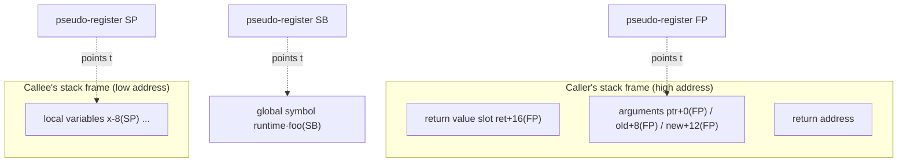

# 2.1 The Plan 9 Assembly Language

Read the source of the Go runtime long enough, and sooner or later you run into code that looks
like assembly yet not quite like any assembly you are familiar with. That is Go's
**Plan 9 style assembly**. We will keep returning to it as we dissect the scheduler, stack
switching, and atomic operations: `gogo`, `mcall`, `morestack`, and `asyncPreempt` are all assembly
routines. This section explains what it is, why it exists, and the few key concepts you need in
order to read it. We do not aim to teach the reader to write Plan 9 assembly, which is the subject
of another book; we aim to turn it into a **reading vocabulary**: when a later section mentions some
assembly routine, the reader knows what kind of abstraction layer it lives in and what each symbol
points to.

The examples in this section are drawn from `runtime/asm_amd64.s` and `internal/runtime/atomic`.
These routines are fairly stable across versions. To keep the focus on design, we have trimmed a
few experimental branches unrelated to this section (such as `GOEXPERIMENT` guards); for the
complete definitions, please consult the corresponding source files.

## 2.1.1 Why Go Has Its Own Assembly

Go's assembly descends from the assembler tradition of the **Plan 9 operating system**. Plan 9 was
a research system built at Bell Labs after Unix, and several of Go's designers (Ken Thompson, Rob
Pike, Russ Cox) came from there, carrying the ideas of that toolchain into Go. Its key trait is
this: **it is not the native assembly of any one CPU, but a semi-abstract, cross-architecture
unified intermediate assembly**. One syntax, one set of pseudo-instructions and pseudo-registers,
translated by the toolchain `cmd/asm` into the real instructions of each target architecture, amd64,
arm64, riscv64, and others. This is entirely unlike the GNU as design, where each architecture has
its own dialect.

This choice serves one of Go's original hard goals: **one toolchain, cross-compilation out of the
box**. When the assembly layer is itself cross-architecture, porting the runtime to a new
architecture degenerates into "add a backend for this unified syntax" rather than "relearn an
assembly and rewrite the entire runtime." The cost is equally real: Go has to maintain its own
assembler, linker, and object file format (`cmd/internal/obj`), an entire extra layer of
infrastructure to feed. What it buys is **complete control** over code generation, calling
conventions, and coordination with the runtime. This trade-off of "build it ourselves rather than
reuse off-the-shelf parts" will reappear in the custom ABI of [2.3 Calling Conventions](./callconv.md)
and in the function calls of [6.1](../../part2lang/ch06func/func.md), and it is one of the main
threads in understanding the Go runtime.

So why does Go **need** to descend to assembly at all? The vast majority of Go code of course never
touches it, but the runtime has a few places where the compiler is powerless and a human must hand
write the machine-level glue:

- **Stack switching**. `gogo` and `mcall` ([9.4](../../part3concurrency/ch09sched/schedule.md)) have
  to directly swap SP and PC from one goroutine's live state to another, an operation that does not
  exist in a high-level language.
- **The prologue of stack growth**. `morestack` is called when the stack is too small, and it must
  precisely save the current function's live state before switching to the g0 stack.
- **Atomic operations**. CAS, atomic add, and the like require issuing specific CPU instructions
  (such as `CMPXCHG` with the `LOCK` prefix), which the compiler will not generate out of thin air.
- **Signal and system call entry points**. Saving and restoring live state during signal handling
  ([9.6](../../part3concurrency/ch09sched/signal.md)), and entering and leaving a syscall, all
  require arranging registers precisely, bypassing the compiler.

What these places have in common is that the object they manipulate is "the live state of execution"
itself (the stack pointer, the program counter, the registers), precisely what a high-level language
hides away. Assembly is that last thin, unavoidable layer of glue between the runtime and the
hardware.

## 2.1.2 The Four Pseudo-Registers

The thing in Plan 9 assembly most likely to confuse, and the thing best understood first, is its
**pseudo-registers**. They do not necessarily correspond to some real physical register; they are
an abstraction the toolchain provides: you use them to express intent ("the first argument," "the
second local variable," "some global symbol"), and `cmd/asm` is responsible for mapping that intent
onto each architecture's real registers and addressing modes. It is exactly this abstraction layer
that lets one piece of assembly be reused across architectures. There are four in all:

- **FP** (Frame Pointer): accesses a function's **input arguments and return values**, given as a
  symbol plus an offset, such as `ptr+0(FP)` or `ret+16(FP)`. The arguments live in the caller's
  stack frame, and FP points to their base.
- **SP** (Stack Pointer): accesses the current function's **local variables**, such as `x-8(SP)`.
  Note that this is the **pseudo-register** SP, which means something different from the hardware SP;
  see the trap below.
- **PC** (Program Counter): the current instruction address, used for jumps and branches.
- **SB** (Static Base): accesses **global symbols**, such as `runtime·gogo(SB)`. All function names
  and global variable names are given as offsets from SB; you can think of SB as "the starting point
  of the entire address space."

A one-line mnemonic: **FP handles arguments, SP handles locals, SB handles globals, PC handles
jumps**. These four give names to the three kinds of data a function touches at runtime (what is
passed in, what is its own temporary, what is external and global) and to control flow. The figure
below shows where the first three point during a single call:

On most architectures the stack grows toward lower addresses: arguments and return values are
prepared by the caller and land at **higher** addresses, accessed with FP plus a positive offset;
the callee's local variables land at **lower** addresses, accessed with SP plus a negative offset.
Once you understand this figure, the assembly routines in the runtime turn from gibberish into
"precise reads and writes of the stack and registers."

### A Trap That Repeatedly Trips Up the Reader: Pseudo SP Versus Hardware SP

Plan 9 has **two SPs**, written differently and meaning different things:

- The **named** `sym+offset(SP)`, such as `x-8(SP)`, refers to the **pseudo-register SP**, the
  local-variable region relative to the current stack frame.
- The **unnamed** `offset(SP)`, such as `0(SP)` or `8(SP)`, refers to the **hardware stack pointer
  SP**, a real machine register.

The two have different offset baselines, and confusing them reads out a completely wrong address. A
practical test is to look for a symbol name: with a name (`x-8(SP)`) it is the pseudo SP, accessing
a local variable; with a bare offset (`8(SP)`) it is the hardware SP, used mostly when pushing
arguments onto the stack or in routines like `morestack` that arrange the machine stack directly.
This is exactly the first mine the "reading vocabulary" should defuse for the reader.

Having grasped the pseudo-registers and the addressing syntax, the next step is to apply them to a
complete routine: how a hand-written assembly function declares its own symbol and declares the size
of its stack frame. That is exactly what [2.2 Stack Frames and Symbols in Assembly](./frame.md) does,
where three real routines, `Cas`, `gogo`, and `morestack`, will line these conventions up point by
point.

## Further Reading

1. The Go Authors. *A Quick Guide to Go's Assembler.* https://go.dev/doc/asm
   (the authoritative reference for pseudo-registers, addressing, `TEXT`/`DATA`/`GLOBL`, and frame
   size)
2. Rob Pike. *A Manual for the Plan 9 Assembler.* https://9p.io/sys/doc/asm.html
   (the direct source of Go's assembly syntax)
3. Rob Pike. *How to Use the Plan 9 C Compiler.* http://doc.cat-v.org/plan_9/2nd_edition/papers/comp
   (background on the Plan 9 toolchain and register conventions)
4. The Go Authors. *cmd/asm, cmd/internal/obj.* https://github.com/golang/go/tree/master/src/cmd/asm
   (the implementation that translates the unified assembly to each architecture's backend)
5. This book: [2.2 Stack Frames and Symbols in Assembly](./frame.md) (the `Cas`/`gogo`/`morestack`
   routines), [2.3 Calling Conventions and the Register ABI](./callconv.md) (the custom ABI),
   [6.1 Function Calls](../../part2lang/ch06func/func.md).
