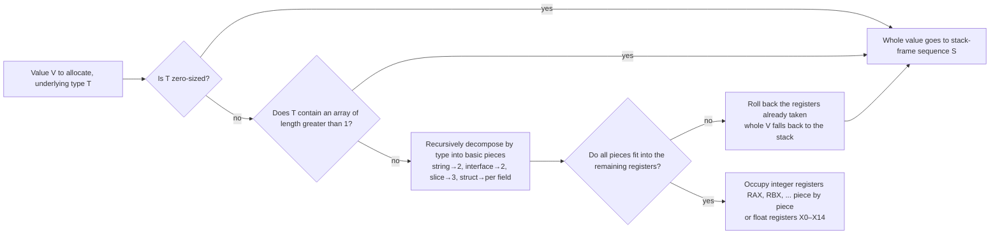

# 2.3 Calling Convention and the Register ABI

> The register names, stack-frame layout, and prologue code in this text use amd64 as the example.
> Other architectures (arm64, riscv64, and so on) share the same structure but differ in register names; you can
> cross-reference the "Architecture specifics" section of `src/cmd/compile/abi-internal.md`.

A single function call, at the machine level, has to answer a string of concrete questions: where do the arguments go, where does the return value go, who is responsible for saving which registers, how is the stack frame laid out, where is the return address pushed. Pinning down the answers to these questions is the calling convention, often also called the ABI (application binary interface). The ABI is not a piece of code but a **contract**: the code generated by the compiler, the hand-written Plan 9 assembly ([2.1](./asm.md)), and the low-level routines inside the runtime are written independently of one another, yet they have to mesh exactly at the moment of the call. Once the contract is fixed, all three sides arrange their data according to it, and none of them needs to know the internal details of the others.

[6.1](../../part2lang/ch06func/func.md) already covered, from the language's viewpoint, the evolution of function calls from the stack to registers; what it cared about was "what happens, in Go semantics, in a single `f(a, b)`". This section, together with [2.4 Argument Passing and Stack-Frame Layout](./args.md), supplies the other half at the assembly and runtime level: for the same call, what is the convention once it lands on machine instructions. Put together, the topic of function calls is finally told in full.

## 2.3.1 Two ABIs: ABI0 and ABIInternal

Go maintains two calling conventions at once, and understanding their division of labor is the key to reading those odd symbol annotations in the runtime.

**ABI0** is the early, **stack-based** convention: all arguments and return values are passed through stack memory without exception. The caller lays out the arguments in order within its own stack frame, and the callee reads them from fixed offsets. Its virtue is a stable, predictable layout: a human can work out the offset of every argument. Hand-written assembly therefore follows ABI0 across the board, and `go.dev/doc/asm` describes exactly this stable ABI. ABI0 has one property that is often overlooked: it is the only ABI Go **promises to keep stable**, the one reliable seam between assembly and Go.

**ABIInternal** is the **register-based** internal convention introduced in Go 1.17: it puts arguments and return values into registers as much as possible, saving a great deal of reading and writing of stack memory. Every function compiled from Go source uses ABIInternal. The word "Internal" in its name is a deliberate warning: this ABI is **not stable**, it changes with the Go version, and no external code should depend on its details. The payoff is roughly a 5% overall speedup, and that speedup is completely transparent to user code; not a single character of source changes, and a recompile delivers it.

On amd64, ABIInternal passes integer arguments and return values in the following 9 integer registers in order, and floats in `X0`-`X14`:

```
RAX, RBX, RCX, RDI, RSI, R8, R9, R10, R11
```

Argument allocation is **recursive**: a value is decomposed by its type into basic pieces, and each piece occupies one register. A `string` decomposes into two registers, a pointer and a length; a `[]T` decomposes into three; a small struct is spread out field by field. Anything that does not fit (registers exhausted, or a value containing a non-trivial array) falls back to passing the whole value on the stack. This rule has one boundary worth remembering: **any argument containing an array always goes on the stack**, because indexing into an array requires computing an offset, and an offset cannot live in a register; in the Go 1.15 standard library only 0.7% of function signatures contain an array, and making an exception for that tiny minority is not worth it, so they simply go entirely on the stack.

Drawing this recursive decision into a single chart, each argument (or return value) walks through it independently:



The crux is that "roll back" edge: allocation is **all or nothing**. If any piece of a value cannot fit into a register, the registers tentatively taken must all be returned, the whole value goes on the stack instead, and "half in registers, half on the stack" is never allowed. This is precisely to handle the case where the callee takes the **address** of an argument: if the value were split in two, taking its address would mean reassembling it in memory, at a cost proportional to the value's size, which does not pay off (see the Rationale section of `abi-internal.md`). Return values use the same algorithm, except the register count is reset from the start before allocation, so incoming arguments and return values can reuse the same batch of registers without interfering with each other.

Having two ABIs coexist means the boundary needs **bridging**. When ABIInternal Go code calls an ABI0 assembly function, or the reverse, the two sides do not agree on "where the arguments are", and the linker automatically inserts a small piece of **wrapper code** (the ABI wrapper) to move the arguments: placing the actual arguments from registers into their corresponding positions on the stack, or moving them back the other way. This bridging is specified by the internal ABI proposal (27539) and is transparent to both sides of the call. It shows its hand in the symbol table, where the same name in the runtime often carries an ABI annotation suffix:

```
runtime.morestack_noctxt.abi0       // the ABI0 version
runtime.systemstack<ABIInternal>    // the ABIInternal version
```

When reading runtime disassembly, seeing annotations like `·f<ABIInternal>` and `·g.abi0` tells you the linker may have built a bridge there. Most of the time you do not need to care that the bridge exists; only when hand-written assembly directly calls a Go function, or is called by Go in reverse, do you need to be clear about which side of the ABI you stand on.

Having laid out the two ABIs and the argument-allocation algorithm, [2.4 Argument Passing and Stack-Frame Layout](./args.md) next uses a mixed example to land it on a concrete stack frame, and fills in the spill slots, the stack-growth check in the prologue, and the overall account of "why a custom ABI".

## Further Reading

1. The Go Authors. *Go internal ABI specification (ABIInternal).*
   https://github.com/golang/go/blob/master/src/cmd/compile/abi-internal.md
   (The authoritative description of ABIInternal: the argument-allocation algorithm, spill slots, and the register mapping for each architecture)
2. Austin Clements et al. *Proposal: Register-based Go calling convention* (40724, Go 1.17).
   https://go.googlesource.com/proposal/+/master/design/40724-register-calling.md
   (Why a unified custom ABI rather than the platform ABI, and where the roughly 5% speedup comes from)
3. The Go Authors. *Proposal: Create an undefined internal calling convention* (27539).
   https://go.googlesource.com/proposal/+/master/design/27539-internal-abi.md
   (The design of the transparent wrapper between ABI0 and ABIInternal)
4. The Go Authors. *A Quick Guide to Go's Assembler* (ABI0, pseudo-registers, the stable assembly ABI).
   https://go.dev/doc/asm
5. This book's [2.1 The Plan 9 Assembly Language](./asm.md), [2.4 Argument Passing and Stack-Frame Layout](./args.md),
   [6.1 Function Calls](../../part2lang/ch06func/func.md).
