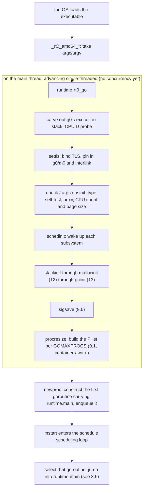

# 3.5 Bootstrapping a Go Program

The `main` function the reader writes is not the program's true first instruction. When the
operating system hands control to a Go executable, what starts running is the runtime: it has
to lay out the execution stack on the main thread, bind thread-local storage, measure the CPU
core count and the physical page size of memory, wake up the memory allocator, the garbage
collector, and the scheduler one by one, and only then create the goroutine that carries `main`
and hand it to the scheduling loop to run. In other words, a Go binary carries within it a
miniature operating system ([1.2](../ch01intro/go.md)), one that starts itself up ahead of user
code. This section walks the bootstrap chain from end to end, from the operating system's entry
symbol to the moment the first goroutine is scheduled, so we can see clearly what happens
"before `main`."

It helps to keep the outline of the bootstrap chain as three stages: the assembly entry point
hand-builds `g0` and `m0` on the main thread ([3.5.1](#351-the-assembly-entry-point-g0-m0-and-tls)),
`schedinit` lights up each subsystem in dependency order
([3.5.2](#352-schedinit-waking-the-runtime-in-order)), and then `newproc` constructs the first
goroutine while `mstart` enters the scheduling loop to run it
([3.5.3](#353-the-first-goroutine-and-the-scheduling-loop)).

## 3.5.1 The Assembly Entry Point: g0, m0, and TLS

The runtime's true entry point is written in assembly by the runtime package. Taking AMD64 as
an example, the entry symbols for Linux and macOS live in `runtime/rt0_linux_amd64.s` and
`runtime/rt0_darwin_amd64.s` respectively, and both are just a single jump into the shared
`_rt0_amd64`:

```asm
TEXT _rt0_amd64_linux(SB),NOSPLIT,$-8
	JMP	_rt0_amd64(SB)
TEXT _rt0_amd64_darwin(SB),NOSPLIT,$-8
	JMP	_rt0_amd64(SB)
```

Why split the entry point along the two dimensions of "architecture + operating system"? Because
once a program is compiled to machine code, the instruction set depends only on the CPU
architecture, while differences between operating systems show up in system-level operations such
as system calls. A single `_rt0_amd64` can be shared by multiple operating systems, and each
operating system then jumps into it from its own entry symbol. `rt0` is short for `runtime0`,
denoting the genesis of the runtime; every subsequent object of the same kind derived from it
carries the suffix `1`, and `g0` and `m0` get their names from this.

`_rt0_amd64` first takes the arguments the operating system passed in off the stack, then jumps
into `rt0_go`, where the real work happens. When the program has just started, the first two slots
at the stack pointer SP are `argc` and `argv`:

```asm
TEXT _rt0_amd64(SB),NOSPLIT,$-8
	MOVQ	0(SP), DI	// argc
	LEAQ	8(SP), SI	// argv
	JMP	runtime·rt0_go(SB)
```

`rt0_go` is the backbone of the whole bootstrap. It first moves the arguments onto an aligned
stack, then performs the first real piece of bootstrapping: on the segment of operating-system
stack the main thread is currently using, it "claims" the execution stack for `g0`. `g0` is each
thread's scheduling stack, and the runtime's own code (scheduling, stack growth, and certain
phases of garbage collection) runs on it rather than on a user goroutine's stack:

```asm
TEXT runtime·rt0_go(SB),NOSPLIT|NOFRAME|TOPFRAME,$0
	MOVQ	DI, AX			// argc
	MOVQ	SI, BX			// argv
	SUBQ	$(5*8), SP		// align to an even stack
	ANDQ	$~15, SP
	MOVQ	AX, 24(SP)
	MOVQ	BX, 32(SP)

	// use this stack given by the OS to carve out g0's execution stack
	MOVQ	$runtime·g0(SB), DI
	LEAQ	(-64*1024)(SP), BX
	MOVQ	BX, g_stackguard0(DI)		// g0.stackguard0
	MOVQ	BX, g_stackguard1(DI)		// g0.stackguard1
	MOVQ	BX, (g_stack+stack_lo)(DI)	// g0.stack.lo = SP - 64KB
	MOVQ	SP, (g_stack+stack_hi)(DI)	// g0.stack.hi = SP

	// probe processor information via CPUID
	MOVL	$0, AX
	CPUID
	(...)
```

`g0` and `m0` are a pair of global variables that exist statically from the very start of the
program, needing no allocation. `g0` is `m0`'s scheduling stack, and `m0` represents the main
thread. The next task is to let the two recognize each other, and the precondition for that is
this: a thread must be able to find, at any moment, which goroutine is "currently running." This
job is carried by thread-local storage (TLS).

TLS gives each thread its own independent `g` pointer. A great deal of runtime code relies on
`getg()` to fetch the current goroutine, and underneath that is a single TLS read. On Linux,
setting up TLS comes down to a system call that points the base of the FS segment register at
`m0.tls`:

```asm
TEXT runtime·settls(SB),NOSPLIT,$32
	ADDQ	$8, DI			// the ELF convention uses -8(FS)
	MOVQ	DI, SI
	MOVQ	$0x1002, DI		// 0x1002 == ARCH_SET_FS
	MOVQ	$SYS_arch_prctl, AX
	SYSCALL
	(...)
	RET
```

Different operating systems part ways at this step: Darwin, OpenBSD, Plan 9, Solaris, and illumos
each have their own mechanism for placing TLS, and `rt0_go` uses conditional compilation to skip
the generic `settls`, letting the platform code handle it. Once TLS is ready, the runtime writes
a magic number and reads it back to verify, making sure this "find the current g" path really
works, and only then pins `g0` and `m0` into TLS and completes their mutual binding:

```asm
ok:
	get_tls(BX)
	LEAQ	runtime·g0(SB), CX
	MOVQ	CX, g(BX)		// the current g in TLS = g0
	LEAQ	runtime·m0(SB), AX
	MOVQ	CX, m_g0(AX)	// m0.g0 = g0
	MOVQ	AX, g_m(CX)		// g0.m  = m0
```

At this point the main thread has a scheduling stack, has a working `getg()` path, and `g0` and
`m0` recognize each other. Only now does the runtime have the standing to call Go code and do the
remaining initialization that is written in Go. `rt0_go` then calls `check`, `args`, and `osinit`
in turn, performing a checkup and gathering system-level data before formal initialization:

```asm
	CALL	runtime·check(SB)		// verify the compiler's assumptions about type sizes
	(...)
	CALL	runtime·args(SB)		// save argc/argv, parse auxv
	CALL	runtime·osinit(SB)		// get the CPU core count and physical page size
	CALL	runtime·schedinit(SB)	// wake up the runtime components
```

`check` is a self-test against the compiler, verifying one by one whether assumptions such as
"`int8` occupies 1 byte" and the pointer width hold. If the compiler got these wrong, every
inference the runtime makes would be off, so it would rather `throw` on the spot here. `args`
stores `argc/argv` into global variables and, on Linux, reads further along the stack into the
auxiliary vector (auxv), taking the physical page size of memory from `_AT_PAGESZ`. `osinit` gets
the CPU core count (which bears on the number of P below), and on Darwin, since the page size could
not be obtained from auxv earlier, it makes up for it here using `sysctl`. These two system-level
constants, the CPU core count and the physical page size, are the foundation for the memory and
scheduling initialization that follows.

## 3.5.2 schedinit: Waking the Runtime in Order

`schedinit` is named "scheduler initialization," but it is really the assembly shop for the entire
runtime: memory, stacks, garbage collection, signals, scheduling, almost every subsystem is lit up
here. There are hard ordering dependencies between them, and the order cannot be shuffled. With the
lock initialization and diagnostic branches trimmed away, the main sequence runs as follows:

```go
// runtime/proc.go (a trimmed sketch, keeping only the load-bearing call order)
func schedinit() {
	gp := getg()

	sched.maxmcount = 10000   // cap the maximum number of system threads
	worldStopped()            // during bootstrap the "world" is in a stopped state

	stackinit()    // stack allocator (stack cache, stack pool)
	randinit()     // random source, must come before mallocinit
	mallocinit()   // memory allocator (see 12)
	cpuinit(godebug)
	mcommoninit(gp.m, -1) // initialize m0's common fields
	modulesinit()         // module and type linking information
	typelinksinit()
	itabsinit()

	sigsave(&gp.m.sigmask) // signal mask (see 9.6)
	goargs()
	goenvs()
	gcinit()       // garbage collector (see 13)

	// decide the number of P from the CPU core count and GOMAXPROCS
	var procs int32
	if n, err := strconv.ParseInt(gogetenv("GOMAXPROCS"), 10, 32); err == nil && n > 0 {
		procs = n
		sched.customGOMAXPROCS = true
	} else {
		procs = defaultGOMAXPROCS(numCPUStartup)
	}
	if procresize(procs) != nil { // create the P list (see 9.1)
		throw("unknown runnable goroutine during bootstrap")
	}
	worldStarted() // P is runnable, the world officially starts
}
```

The order of this string of calls is itself a dependency specification. `stackinit` comes before
everything, because the subsequent initialization itself needs a stack; `randinit` must precede
`mallocinit`, because some of the allocator's randomization uses it; `mallocinit`
([12](../../part4memory/ch12alloc/)) builds the layered structure of mcache, mcentral, and mheap,
and it in turn must come before `gcinit`, because the garbage collector
([13](../../part4memory/ch13gc/)) operates on top of the arena and bitmap the allocator has laid
out. `sigsave` records the initial signal mask, setting the groundwork for the later signal
handling mechanism ([9.6](../../part3concurrency/ch09sched/signal.md)). This linear order, in which
"whoever depends on something is placed after it," is the distinguishing feature that sets
bootstrap code apart from ordinary runtime code: at this moment there is still no concurrency,
everything advances single-threaded on the main thread, and order is correctness.

The whole initialization closes with `procresize(procs)`, which creates the list of processors P
according to the number `procs` ([9.1](../../part3concurrency/ch09sched/model.md)). How is `procs`
decided? If the `GOMAXPROCS` environment variable is set explicitly, that value is used; otherwise
it takes `defaultGOMAXPROCS(numCPUStartup)`. There is an evolution here worth pointing out: early
versions took the machine's CPU core count directly as the default, but inside a container what
they often "saw" was all the cores of the host machine, rather than the CPU quota the cgroup had
allotted to this process, so too many P were opened and scheduling and GC actually suffered. Since
Go 1.25, the default on Linux changed to be cgroup-aware: at startup the runtime reads
`/proc/self/cgroup` and `cpu.max`, and rounds the CPU quota up to compute a default P count that
fits the container's real situation more closely (see `runtime/cgroup_linux.go`). This is a
concrete repair of the principle that "defaults should fit the deployment reality."

By the time `procresize` returns, the scheduler's local run queues, each P's mcache, and the rest
are all in place. Its returning a non-`nil` runnable goroutine should not happen (no goroutine has
been created yet at this moment), so a `throw` serves as the backstop. Then `worldStarted`
announces that the "world" has started, and P now meets the conditions to run goroutines. The trunk
of the runtime is assembled by this point, lacking only the first execution unit to be scheduled.

## 3.5.3 The First Goroutine and the Scheduling Loop

After `schedinit` returns, `rt0_go` has only three steps left, yet they complete the perilous leap
from "the runtime is ready" to "user code is running":

```asm
	CALL	runtime·schedinit(SB)

	// create the first goroutine that carries runtime.main
	MOVQ	$runtime·mainPC(SB), AX	// entry address
	PUSHQ	AX
	CALL	runtime·newproc(SB)
	POPQ	AX

	// start this M, enter the scheduling loop, which normally never returns
	CALL	runtime·mstart(SB)
```

`mainPC` is a data-segment symbol holding the entry address of `runtime.main`, which serves as the
starting point of the first goroutine:

```asm
DATA	runtime·mainPC+0(SB)/8,$runtime·main(SB)
GLOBL	runtime·mainPC(SB),RODATA,$8
```

Note that the entry point of the first goroutine is not the user's `main.main`, but `runtime.main`.
This layer of indirection is deliberate: `runtime.main` must first do a batch of wrap-up work that
is convenient only "within a goroutine context" (starting the system monitoring thread sysmon,
executing each package's `init`, opening up GC, and so on), and only then call the user's
`main.main`. That part is the subject of [3.6 The Life and Death of the Main Goroutine](./main.md).

`newproc` wraps the entry address into a new goroutine and enqueues it, where it waits to be
scheduled:

```go
// runtime/proc.go (sketch)
func newproc(fn *funcval) {
	gp := getg()
	pc := sys.GetCallerPC()
	systemstack(func() {
		newg := newproc1(fn, gp, pc, false, waitReasonZero)
		pp := getg().m.p.ptr()
		runqput(pp, newg, true) // put it into the current P's local run queue
		if mainStarted {
			wakep() // wake an idle P to grab work if necessary
		}
	})
}
```

`newproc1` requests a `g` structure (taking one from the free list if it can reuse it), allocates an
execution stack for it, fills in the program counter and stack frame, sets it to `_Grunnable`, and
then `runqput` throws it into the current P's local run queue
([9.1](../../part3concurrency/ch09sched/model.md)). At this moment it is only "runnable," not yet
actually running.

The final step, `mstart`, hands the main thread over to the scheduler. `mstart` switches to the
`g0` stack and enters the `schedule` scheduling loop: the loop picks a runnable goroutine from the
local or global run queue, `execute`s it, and hands control to its stack and program counter. The
only member in the queue at this moment is precisely the goroutine just enqueued, the one carrying
`runtime.main`. So the scheduler selects it, jumps into `runtime.main`, and the curtain rises on the
user's world. `mstart` normally never returns, and this main thread takes up permanent residence in
the scheduling loop from then on.

Connecting the whole chain gives the bootstrap call graph below:



Back to the sentence we opened with: by the time the scheduler first jumps into `runtime.main`, the
allocator, the collector, the scheduler, signal handling, and a set of P with their local caches are
all already running. The reader's `main` is nothing more than the first user task scheduled for
execution once this miniature operating system has finished starting up. To understand the bootstrap
is to understand the fundamental characteristic that "the runtime and user code cohabit one binary":
the program you write never runs alone, it always runs atop a layer of runtime that has already woken
up. Exactly how each component initializes internally is left to its own chapter to unfold; the next
section [3.6](./main.md) continues by looking at how `runtime.main` brings this startup to a close,
and how it lets the whole program take its final bow after the user's `main` returns.

## Further Reading

1. The Go Authors. *runtime/asm_amd64.s (`runtime·rt0_go`), rt0_linux_amd64.s, rt0_darwin_amd64.s.*
   https://github.com/golang/go/tree/master/src/runtime (the assembly entry point, the setup of g0/m0/TLS)
2. The Go Authors. *runtime/proc.go (`schedinit`, `newproc`, `mstart`, `schedule`).*
   https://github.com/golang/go/blob/master/src/runtime/proc.go
3. The Go Authors. *runtime/cgroup_linux.go (the cgroup-aware `GOMAXPROCS` default, Go 1.25+).*
   https://github.com/golang/go/blob/master/src/runtime/cgroup_linux.go
4. The Go Authors. *Package runtime documentation.* https://pkg.go.dev/runtime
5. Michael Matz, Jan Hubička, Andreas Jaeger, Mark Mitchell. *System V Application Binary
   Interface: AMD64 Architecture Processor Supplement.* 2014.
   https://www.uclibc.org/docs/psABI-x86_64.pdf (the layout of the ELF process stack and the auxiliary vector auxv)
6. This book, [1.2 An Overview of the Go Language](../ch01intro/go.md) (the perspective of a binary containing a miniature operating system),
   [9.1 The Scheduling Problem and the GMP Model](../../part3concurrency/ch09sched/model.md) (the P list and the scheduling loop),
   [9.6 The Signal Handling Mechanism](../../part3concurrency/ch09sched/signal.md).
7. This book, [Chapter 12 The Memory Allocator](../../part4memory/ch12alloc/),
   [Chapter 13 The Garbage Collector](../../part4memory/ch13gc/) (the structures built by `mallocinit` and `gcinit`),
   [3.6 The Life and Death of the Main Goroutine](./main.md).
