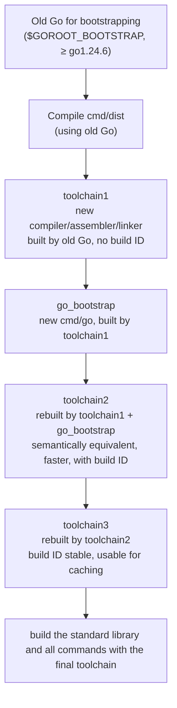

# 3.3 Bootstrapping the Language

One question sounds like a paradox: Go's compiler, assembler, linker, and runtime are all written in Go today, so where did the first program capable of compiling Go come from? Without a Go compiler, how do you compile a Go compiler? This is **bootstrapping**. It is both the classic chicken-and-egg dilemma and a piece of engineering in the history of the Go toolchain that can be retold precisely. This section answers three things: how this egg was first hatched; how, after bootstrapping, the chain for building a new version of Go works, and why the demands it places on the bootstrap version keep rising year over year; and finally, why a language that "implements itself with itself" deserves to be taken seriously.

## 3.3.1 The Egg First: From a C Toolchain to a Go Toolchain

The premise of bootstrapping is to first have a starting point that does not depend on itself. The Go toolchain's earliest (through **Go 1.4**, in 2014) compiler, assembler, linker, and `cmd/dist` were all written in **C**, and the compilers carried over Plan 9's naming (`5c`, `6c`, `8c`, `9c`, and so on, with the digits corresponding to different target architectures). This set of C programs was compiled by the system's own `gcc` or `clang`, so building Go required no pre-existing Go at all. This was the "egg".

Starting with **Go 1.5 (August 2015)**, Go completed a landmark transition: the compiler and runtime were **rewritten in Go in their entirety**, the C toolchain was deleted, and from then on the toolchain could bootstrap itself. The cost and the benefit of this move are both concrete. The benefit is that compiler developers now maintain the toolchain in Go, a memory-safe, concurrency-friendly language with built-in testing and profiling tools, and bugs in the compiler can be hunted with Go's own debugging facilities; the runtime and the compiler share one language, so collaboration across the boundary (such as escape analysis and stack management) is smoother. The cost is that building Go is no longer as self-sufficient as compiling a piece of C, it now needs "another Go that already works". How to build a new Go from an old Go became a question every release since then has had to answer.

> This rewrite landed in two steps, which can be matched against two of Cox's design documents: `go13compiler` records the process of mechanically transpiling the C-written compiler into Go, while `go15bootstrap` lays out the complete plan for removing C and bootstrapping with an older Go. `make.bash` still points to the latter in its comments today.

## 3.3.2 The Bootstrap Chain: Compiling New Go with Old Go

After bootstrapping, the starting point for building a new version of Go becomes an **older, already-working Go toolchain**, recorded in the environment variable `$GOROOT_BOOTSTRAP` (which by default looks under `$HOME` for a directory like `sdk/go1.24.6`). The whole bootstrap process is driven by `cmd/dist`, itself a deliberately "restrained" Go program that uses only the language features already present in the bootstrap version, so that it can be compiled directly by that old Go.

Bootstrapping is not "compile once" and done, but three rounds of compilation in a row, each with a reason it cannot be skipped. Drawing the chain out:



The division of labor across the three rounds is the heart of this design, and it is worth spelling out level by level:

1. **toolchain1**: `cmd/dist` first compiles the **new source code** of the compiler, assembler, linker, and so on, using the `go` command from the old bootstrap version. This toolchain is already the new version in behavior, but since it is built by the old `go` command, the binaries carry no build ID.
2. **go_bootstrap**: then toolchain1 compiles a temporary `go` command. From this step on, control of the build is handed back from `cmd/dist` to the `go` command itself.
3. **toolchain2**: using toolchain1 plus go_bootstrap, the same toolchain is **compiled again**. It is semantically equivalent to toolchain1, but because it is built with the newly compiled compiler (rather than the old bootstrap compiler), it runs faster, and this version carries a build ID.
4. **toolchain3**: toolchain2 then compiles the final version. By this point the toolchain is "a new compiler built by a new compiler that was built from scratch", its build ID is accurate and stable, suitable for feeding to the build cache.

Why more than one round? The key is build IDs and reproducibility. toolchain1 is the product of "new source plus old compiler", enough to bootstrap, but it carries traces of the old bootstrap environment (no build ID). Walking two more rounds lets the final toolchain shed the influence of the bootstrap Go entirely: toolchain3 is a new toolchain built by a new toolchain, with no remaining ties to the old Go that built it. This doubles as a self-check: if the new compiler itself has a defect, it will often surface in the toolchain2 or toolchain3 round.

Hidden here is a subtle but important judgment: toolchain2 and toolchain3 are completely identical at the source level, and ideally the two should be **byte-for-byte identical**. The reason they are split into two versions is that toolchain2 is "the new compiler compiled by the old compiler, compiled once more", while toolchain3 is "the new compiler compiling itself". Only when the latter two versions converge can we be confident that the new compiler has not carried some hidden difference that depends on "who compiled it" into the output. This is the classic **compiler fixed point**: a correct bootstrapping compiler, compiling itself again after some round, should produce stable output. Go approaches this fixed point with build IDs and the version identifiers in release builds, so that the final binary can be cached and reproduced.

An implementation detail easily overlooked: `cmd/dist` does not compile in place, but copies the source needed for bootstrapping (`cmd/compile`, `cmd/asm`, `cmd/link`, and their dependencies) into a `$GOROOT/pkg/bootstrap` workspace and uniformly rewrites their import paths to a `bootstrap/...` prefix. This way the old Go compiles a copy that is **isolated** from the final standard library, and the two same-named packages, old and new, do not contaminate each other during bootstrapping.

The entry point to the whole chain is `make.bash` (`all.bash` runs an additional round of tests on top of it). Roughly, one `make.bash` does the following in sequence: check for and locate `$GOROOT_BOOTSTRAP`, use it to build `cmd/dist`, have `cmd/dist` walk through the three rounds toolchain1 to toolchain3 above, and finally build the rest of the standard library and the commands with the final toolchain. These steps are visible to the naked eye in the terminal, and their output is almost a textual version of the diagram above:

```shell
$ GOROOT_BOOTSTRAP=$HOME/sdk/go1.24.6 ./make.bash
Building Go cmd/dist using /Users/you/sdk/go1.24.6. (go1.24.6 darwin/arm64)
Building Go toolchain1 using /Users/you/sdk/go1.24.6.
Building Go bootstrap cmd/go (go_bootstrap) using Go toolchain1.
Building Go toolchain2 using go_bootstrap and Go toolchain1.
Building Go toolchain3 using go_bootstrap and Go toolchain2.
Building packages and commands for darwin/arm64.
---
Installed Go for darwin/arm64 in /Users/you/go
```

Each line corresponds to a link in the chain: first the old bootstrap Go builds `cmd/dist`, then it lifts out, in order, toolchain1, the temporary `go` command (go_bootstrap), toolchain2, toolchain3, and finally the final toolchain, now on solid footing, lays out the standard library and the commands. Read this output, and bootstrapping is no longer an abstract concept: it is a few lines of state transitions in the terminal that can be retold.

## 3.3.3 The Ever-Rising Bootstrap Version

Bootstrapping loosened the bind on toolchain developers: they can write Go itself with increasingly new Go features. The cost comes with it: once the toolchain source uses a feature available only in some newer version (generics being the typical case), the minimum Go version that can bootstrap it has to rise accordingly. This bootstrap-version line rising all the way up is itself a profile of Go's own evolution:

| Target Go version | Minimum version required to bootstrap |
|---|---|
| Go ≤ 1.4 | C toolchain (`gcc` / `clang`) |
| Go 1.5 ~ 1.19 | Go 1.4 |
| Go 1.20 ~ 1.21 | Go 1.17 (specifically 1.17.13) |
| Go 1.22 ~ 1.23 | Go 1.20 |
| Go 1.24 onward | given by a formula |

Starting with Go 1.20 (2023), the bootstrap baseline formally said goodbye to Go 1.4, which it had relied on for nearly eight years. The trade-off behind this is recorded in issues 44505 and 54265: staying pinned to Go 1.4 meant the toolchain could never use any language feature after Go 1.5 to write itself, and this constraint was increasingly not worth it. From Go 1.24 onward, the requirement is no longer handwritten version by version, but converges into a single rule: building Go 1.N requires Go 1.M, where $M = N - 2$ rounded down to an even number. So Go 1.24 and 1.25 both require Go 1.22, and Go 1.26 and 1.27 both require Go 1.24. This formula is exactly the `requiredBootstrapVersion` in `cmd/dist`:

```go
// Building Go 1.N requires Go 1.M, M = N-2 rounded down to even (N ≥ 22)
// e.g.: Go 1.24, 1.25 require Go 1.22; Go 1.26, 1.27 require Go 1.24
requiredMinor := minor - 2 - minor%2
```

Down at Go 1.26, the minimum bootstrap version is pinned further to the patch number **go1.24.6**. If someone runs `make.bash` with an older Go, the build fails right when compiling `cmd/dist`: the source tree specially places a file that participates in compilation only under `//go:build !go1.24`, with the package name `building_Go_requires_Go_1_24_6_or_later`, using a "cannot find a valid main package" error to tell the builder about the insufficient version as early and as conspicuously as possible.

The "N-2 then round to even" margin the formula leaves is not arbitrary: it guarantees that any release can always be bootstrapped by a stable version from two to three release cycles earlier that is already widely distributed, so downstream packagers need not first obtain an overly new Go just to build a new Go. This is a concrete expression of the toolchain's care for the ecosystem, which the next section expands on.

## 3.3.4 Why Bootstrapping Matters

Bootstrapping is more than a piece of technical trivia; it has three layers of concrete significance.

**It is a signal of a language's maturity.** That a language can implement itself with itself, especially implementing system software like compilers and runtimes that demand exacting performance and low-level control, shows that both its abstraction power and its runtime efficiency are already equal to serious work. Go is not alone on this road. Self-hosting is almost a rite of passage for a system-level language's maturity: Rust's `rustc` likewise bootstraps from the previous Rust version, and like Go has to manage the constraint of "how old a version can do the bootstrapping"; GCC and LLVM also long use a round of self-compilation to ensure the compiler can compile itself. The difference lies in where each places the "starting point": Go chooses to pin the starting point at a publicly distributed old release, rather than, as some toolchains do, keep an original bootstrap path that can be traced back to assembly. The two choices each have their trade-offs: the former is simple and reproducible, but requires the bootstrap version to roll along with it; the latter is more thorough on "being rebuildable from the most primitive starting point", at the cost of maintaining that ancient path.

**It unifies the development experience.** Toolchain authors and ordinary users use the same language and the same set of tools. Problems in the compiler can be investigated directly with Go's testing, race detection, and profiling, and new language features can be "eaten" and tried out by the toolchain itself at the first opportunity: generics entering the bootstrap requirement is precisely the result of this self-digestion.

**It also places a responsibility.** The toolchain must always be bootstrappable by a **reasonably old** Go, and cannot depend on overly new features for convenience, otherwise "building Go from source" would become difficult: this is exactly the reason the N-2 formula in the previous section exists. This responsibility also leads to a deeper topic: Thompson, in *Reflections on Trusting Trust*, pointed out that a self-compiling toolchain can in theory pass a backdoor down through generations without leaving a trace in the source. Go puts this trust on an independently verifiable footing with multi-round reproducible builds, a public bootstrap chain, and checkable binaries: the convenience and the trustworthiness of bootstrapping must be guarded together with engineering discipline.

From the egg written in C, to the toolchain written in Go, constrained on its bootstrap version by a formula, compiling three rounds in pursuit of reproducibility, this bootstrap history is the best footnote to Go "proving itself with itself".

## Further Reading

1. The Go Authors. *Go 1.5 Release Notes* (compiler and runtime rewritten in Go, toolchain achieves bootstrapping).
   https://go.dev/doc/go1.5
2. Russ Cox. *Go 1.5 Bootstrap Plan* (`go15bootstrap`, the complete plan for removing C and bootstrapping with an older Go).
   https://go.googlesource.com/proposal/+/master/design/go15bootstrap.md
3. Russ Cox. *Go 1.3+ Compiler Overhaul* (`go13compiler`, mechanical transpilation of the C compiler into Go).
   https://go.googlesource.com/proposal/+/master/design/go13compiler.md
4. The Go Authors. *Installing Go from source / Bootstrap toolchain* (bootstrap version requirements and the N-2 rule).
   https://go.dev/doc/install/source
5. The Go Authors. *cmd/dist: `buildtool.go` (`minBootstrap`, import path rewriting) and `build.go` (`requiredBootstrapVersion`, toolchain1~3)*.
   https://github.com/golang/go/tree/master/src/cmd/dist
6. Go issue #44505, #54265: *Why the bootstrap baseline migrated from Go 1.4 to a newer version*.
   https://go.dev/issue/44505 , https://go.dev/issue/54265
7. Ken Thompson. *Reflections on Trusting Trust.* Communications of the ACM, 1984.
   https://dl.acm.org/doi/10.1145/358198.358210
