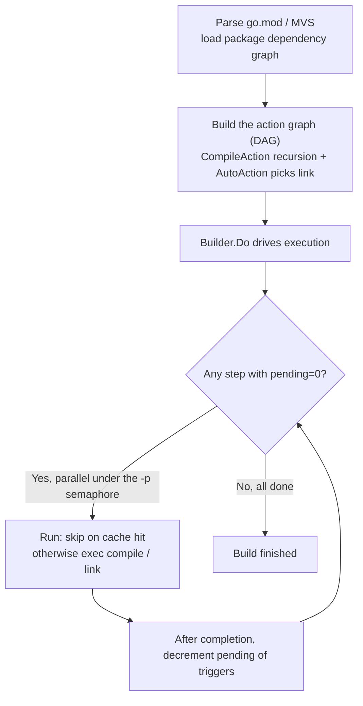

# 3.1 Starting from the `go` Command

The life cycle of a Go program begins with running the `go` command. The `go build`, `go test`,
and `go run` that readers type every day look like they merely "turn source into a binary," but
behind them hides a fact that is often misunderstood: `go` itself is not the compiler. It is a
**build orchestrator**, responsible for breaking a single build into many individual steps,
arranging their ordering and parallelism, and then invoking the real tools one by one: the
compiler `compile` ([3.2](./compile.md)), the assembler `asm`, and the linker `link`
([3.4](./link.md)). This section first makes this orchestration relationship clear, as it is the
master outline for the sections that follow: once you understand how `go` decomposes a build into
a graph and how it uses a content-addressed cache to avoid duplicate work, then turning to the
details of compilation and linking gives you a frame to stand on.

## 3.1.1 `go` Is a Build Orchestrator, Not a Compiler

The most direct way to lay out the build process of a minimal program is `go build -x`, which
prints every subcommand that `go` actually executes. For a `main` package with a single line of
`fmt.Println`, the skeleton of the output looks like this:

```shell
$ go build -x -o /dev/null .
WORK=/tmp/go-build1449454186
mkdir -p $WORK/b001/
cat >$WORK/b001/importcfg << 'EOF' # internal
# import config
packagefile fmt=/Users/.../go-build/7d/7d74...-d
packagefile runtime=/Users/.../go-build/60/60cb...-d
EOF
# invoke the compiler to compile main.go into the archive _pkg_.a
.../pkg/tool/darwin_arm64/compile -o $WORK/b001/_pkg_.a -p main -lang=go1.26 \
    -complete -buildid ... -importcfg $WORK/b001/importcfg -pack ./main.go
.../pkg/tool/darwin_arm64/buildid -w $WORK/b001/_pkg_.a # internal
cp $WORK/b001/_pkg_.a /Users/.../go-build/82/8256...-d # internal
# write the link configuration, then invoke the linker
cat >$WORK/b001/importcfg.link << 'EOF' # internal
packagefile demo=$WORK/b001/_pkg_.a
packagefile fmt=/Users/.../go-build/7d/7d74...-d
...
EOF
.../pkg/tool/darwin_arm64/link -o $WORK/b001/exe/a.out -importcfg ... $WORK/b001/_pkg_.a
```

What `go` does itself is to create a temporary working directory, write out a series of
`importcfg` files (which tell the compiler and linker where on disk the archive of each dependency
package lives), and then `exec` the two independent executables `compile` and `link`. The real
translation from source files to object code happens in tools outside of `go`. This structure of
"the main program only orchestrates and hands the dirty work to independent tools" is carried
inside the `go` command by two data types: `Builder` holds the shared state of the entire build
(working directory, the various caches, parallelism control), while `Action` is a node in the
build graph, describing "a step that must be done":

```go
// Action: a step in the build graph (a sketch, keeping only orchestration-related fields)
type Action struct {
    Mode    string         // what this step does: "build" / "link" ...
    Actor   Actor          // the function that actually runs it (invokes compile, link, etc.)
    Deps    []*Action      // steps that must complete before this one
    Package *load.Package   // the package this step processes

    actionID cache.ActionID // the cache key computed from all inputs (see 3.1.3)
    buildID  string         // the content identity of the output: actionID + hash of output content
    triggers []*Action      // the reverse edges of Deps: who this step unblocks once done
    pending  int            // how many Deps remain incomplete; ready when it reaches zero
    priority int            // execution priority, for ordering the ready queue
}
```

The `Mode`, `Deps`, and `Actor` of an `Action` together answer "what this step is, what it depends
on, and who executes it." A single `go build` is not a straight line but connects these nodes into
a graph and then drives it. The next section looks at how this graph grows out of `go.mod` and the
source code.

## 3.1.2 From go.mod to the Action Graph

The first step of a build is to figure out "which packages need to be compiled and who depends on
whom among them." This is answered by the module system: `go` parses `go.mod`, settles on the
exact version of each dependency by the Minimal Version Selection (MVS) algorithm, and loads a
package dependency graph (the details of module resolution are in
[Chapter 17](../../part5toolchain/ch17modules/readme.md)). The package dependency graph is the
input; `go` must translate it into an **action graph**, that is, a directed acyclic graph (DAG)
made of `Action` nodes.

The translation rules are plain to the point of being mechanical. For each package to be built,
recursively create a compile step for each of its imports as a dependency of this package's step;
when a `main` package is encountered, create a link step instead:

```go
// build a compile step for package p, recursively building its imports as dependencies too
func (b *Builder) CompileAction(mode, depMode BuildMode, p *load.Package) *Action {
    a := &Action{Mode: "build", Package: p, Actor: &buildActor{}}
    for _, p1 := range p.Internal.Imports {
        a.Deps = append(a.Deps, b.CompileAction(depMode, depMode, p1))
    }
    return a
}

// top-level entry: the main package links into an executable, the rest only compile into archives
func (b *Builder) AutoAction(mode, depMode BuildMode, p *load.Package) *Action {
    if p.Name == "main" {
        return b.LinkAction(mode, depMode, p)   // link step, depends on compile steps
    }
    return b.CompileAction(mode, depMode, p)
}
```

Once the recursion unfolds, the whole action graph takes shape: the leaves are packages with no
dependencies (compiling them needs only their source), the root is the link step, the link depends
on the compilation of the `main` package, and the compilation of the `main` package in turn depends
on the compilation of each package it imports, layer by layer downward. That check on `main` inside
`AutoAction` is exactly the boundary, on the build graph, between the two sections
[3.2 Compilation](./compile.md) and [3.4 Linking](./link.md).

Once the graph is built, execution is driven by `Builder.Do`. The core constraint here is
**topological order**: a step can only begin after all of its dependencies have completed. `go`
does not do a full topological sort; instead it keeps a `pending` count for each `Action` (the
number of dependencies not yet finished), decrements the `pending` of the corresponding `triggers`
as soon as a dependency completes, and the step whose count reaches zero enters a ready queue
ordered by `priority`. Multiple mutually independent steps can run in parallel, with the degree of
parallelism controlled by `-p` (defaulting to `GOMAXPROCS`) through a semaphore `readySema`. The
whole scheduling can be sketched like this:



Worth calling out is the step "skip on cache hit" in the diagram: most nodes in the action graph,
in most builds, do not in fact invoke the compiler at all. They first ask the build cache, "are
the inputs of this step exactly the same as last time?", and if so, they retrieve last time's
output directly. This cache is the fundamental reason the `go` command is so fast that it hardly
seems to be compiling, and it is the subject of the next section.

## 3.1.3 The Content-Addressed Build Cache

A clean `go build` may compile hundreds or thousands of packages, yet the second build often
returns within a second. The secret lies in a **content-addressed** build cache: the output of
each step is stored in the cache (by default under `$GOCACHE`, that is, `go env GOCACHE`) keyed by
the hash of "all the inputs that produced this output." On the next build, if the input hash of the
same step is unchanged, `go` concludes that the output must be identical and reuses it directly,
without even starting the compiler.

Everything hinges on how the "input hash" is composed. `go` uses `buildActionID` to feed all the
inputs of a compile step into a SHA-256:

```go
// compute the cache key of a compile step (a sketch, omitting cgo and other branches)
func (b *Builder) buildActionID(a *Action) cache.ActionID {
    p := a.Package
    h := cache.NewHash("build " + p.ImportPath) // mix in the Go version number as salt right at the start
    fmt.Fprintf(h, "compile\n")
    fmt.Fprintf(h, "goos %s goarch %s\n", cfg.Goos, cfg.Goarch)  // target platform
    fmt.Fprintf(h, "import %q\n", p.ImportPath)
    // the compiler's own ID (change the compiler and the cache is invalidated) and the compile arguments
    fmt.Fprintf(h, "compile %s %q %q\n", b.toolID("compile"), forcedGcflags, p.Internal.Gcflags)
    // the content hash of each source file
    for _, file := range inputFiles {
        fmt.Fprintf(h, "file %s %s\n", file, b.fileHash(filepath.Join(p.Dir, file)))
    }
    // the buildID of each dependency package (i.e. the content identity of the dependency's output)
    for _, a1 := range a.Deps {
        fmt.Fprintf(h, "import %s %s\n", a1.Package.ImportPath, contentID(a1.buildID))
    }
    return h.Sum()
}
```

Turn on `GODEBUG=gocachehash=1` and you can see the real process of these inputs being fed into the
hash one by one. For the demo package above, the string of hexadecimal on the last line is the
final `actionID`:

```shell
$ GODEBUG=gocachehash=1 go build -o /dev/null .
HASH[build demo]
HASH[build demo]: "go1.26.1"                                   # salt: the Go version number
HASH[build demo]: "compile\n"
HASH[build demo]: "goos darwin goarch arm64\n"                 # target platform
HASH[build demo]: "import \"demo\"\n"
HASH[build demo]: "compile compile version go1.26.1 [...] []\n" # compiler ID + arguments
HASH[build demo]: "file main.go KUKxlydUIi2I-10EjTIw\n"        # source file content hash
HASH[build demo]: "import fmt a-nQ4YX2Z0xMeqSMWW55\n"          # dependency fmt's output identity
HASH[build demo]: "import runtime 8asGqFcOH5UKoaTdthA0\n"      # dependency runtime's output identity
HASH[build demo]: e783bda8414d9313a775eb0d5a6eb354559cb647a628acb64782f2359965759b
```

Note the last few lines: the dependencies `fmt` and `runtime` take part in this package's hash via
their respective `buildID` (output content identity), and a `buildID` is in turn computed from its
own `actionID` plus its output content. So the entire cache key nests layer by layer along the
action graph, forming a **Merkle hash tree**: any change to a source file, a compile argument, a
dependency's output, or even the compiler version causes the keys of all steps above it to change,
so the cache is naturally invalidated; conversely, a subtree that has not been touched keeps a
constant key and is reused wholesale. This is the fundamental advantage of content addressing over
"judging new versus old by timestamp" (as in traditional `make`): it judges by **content** rather
than by **time**, so `git checkout` switching branches back and forth, or file mtimes jumping
around, will never cause a misjudgment.

For this design to be correct, it relies on an invariant: **every input that can affect the output
must enter `buildActionID` without exception.** The source code lays down an explicit
commandment for this; in `exec.go`, next to that step's execution function, it is written that "any
new influence on this logic must likewise be registered in the `buildActionID` above." Omit one,
and it means an input changed while the key did not, so the build would wrongly reuse a stale
output, which is one of the most insidious classes of bug in cache-like systems. To put a safeguard
on this invariant, `go` provides `GODEBUG=gocacheverify=1`: it makes the cache effectively void,
forcing every step to re-execute, then compares the new output byte for byte against the old output
in the cache and reports an error the moment they differ, which amounts to verifying at runtime
that "the same key really does correspond to the same output."

## 3.1.4 Reproducible Builds

The content-addressed cache can hold up only on the premise that the build is **reproducible**:
the same inputs must produce byte-for-byte identical outputs. If the compiled output carries in an
absolute path, a timestamp, or a random number from build time, the same source will produce
different binaries on two machines, the cache hit rate collapses, and there is no question of
letting a third party independently verify that "this binary was indeed compiled from this source."
Go imposes several constraints at the toolchain level for this.

The most direct one is the Go version salt in the cache key: `cache.NewHash` mixes in
`runtime.Version()` right at the start, so that `go` commands of different versions never share the
same batch of cache entries, and one version's bug does not contaminate another version's build.
Another is `-trimpath`: by default, debug information embeds the absolute source directory (inputs
like the `dir /tmp/...` line omitted from the hash trace above come from exactly this), so changing
the machine or the directory produces a different output; with `-trimpath`, the path is rewritten to
the module path plus version, and the build no longer depends on its concrete location in the file
system. Add to this that the Go compiler itself deliberately introduces no build timestamp and
eliminates nondeterminism such as map iteration, and the result makes "same source, same version,
same arguments leads to the same binary" an attainable goal. Module verification (`go.sum`, the
checksum database) then seals off the input from the dependency side; the related mechanisms are
detailed in [Chapter 17](../../part5toolchain/ch17modules/semantics.md). Reproducibility serves
both the correctness of the cache and the verifiability of the software supply chain, which is
exactly the direction the Reproducible Builds project has advocated for years.

## 3.1.5 A Unified Toolchain Contrasted with Fragmentation

Looking back at the command list mentioned in [3.1.2](#312-from-gomod-to-the-action-graph), one
finds that `go` is far more than just the `build` subcommand. Parsing, building, testing,
formatting, static checking, documentation, profiling: in Go, all of these are gathered under the
same `go` command:

```shell
go build      # compile packages and dependencies
go test       # compile and run tests (test results are cached too)
go run        # compile and run directly
go fmt        # format source code (gofmt)
go vet        # statically check suspicious constructs
go doc        # view documentation
go tool pprof # profiling
go mod        # module maintenance (tidy / download / verify ...)
```

Setting this side by side with the C/C++ world brings out the difference. Over there, compilation
relies on `gcc`/`clang`, build orchestration relies on `make` or `CMake`, `autotools`, `ninja`, and
crossing versions and platforms also requires `pkg-config` to mediate; to avoid recompiling
everything each time, the community built a separate "external compiler cache" of the `ccache`
kind; formatting is `clang-format`, static checking is `clang-tidy`, and dependency management long
had no agreed-upon answer. These tools each go their own way, with configurations independent of one
another, and assembling them for a project, getting them to work, and keeping them consistent across
a team is a craft in itself. Go builds them into the same binary, with caching, dependency
resolution, and cross-platform cross-compilation all built in and zero-configuration: on a new
machine, after `git clone`, `go build` just works, with no need to first understand a build script.

This unification is not without cost. The `go` build model is fixed; it assumes "a package is a
directory, an import is a dependency," and unlike `make` it cannot express arbitrary, cross-language
build logic with custom rules; when you need to generate code at build time, embed resources, or
chain together non-Go toolchains, `go generate` and `//go:embed` cover only the common cases, and
more complex scenarios still need an external script to fall back on. This is a trade-off that
**exchanges flexibility for consistency**: giving up the expressiveness of "being able to describe
any build" in exchange for the consistent experience of "not having to describe the build at all."
For the vast majority of Go projects, the latter is far more worthwhile than the former, and this
also fits Go's consistent leaning in language design, namely narrowing the choices so that most
people do not have to choose.

Widening the view one more layer, Google's internal Bazel takes another road: it likewise centers on
a content-addressed action cache, but it makes build rules explicit and language-agnostic, and it
supports distributing the cache and execution to a remote cluster, in service of an enormous,
multi-language monorepo. The `go` build cache can be seen as a lightweight incarnation of this idea
under the constraints of a single language and zero configuration. The distance between the two is
shrinking: the `GOCACHEPROG` protocol introduced in Go 1.21 (proposal #59719, Brad Fitzpatrick)
allows the reading and writing of the build cache to be delegated to an external program, taking
over `get`/`put` through a JSON protocol so as to plug into remote, shared, or even P2P cache
backends. This is a step by `go`, while keeping the zero-configuration default, toward feeling out a
Bazel-style extensible cache; for now it remains a relatively cutting-edge capability aimed at
authors of build infrastructure, and everyday use does not need it.

By this point the full picture of the `go` command as an orchestrator is clear: it grows an action
graph out of `go.mod` and the source, drives it in topological order in parallel, uses a
content-addressed cache to fend off duplicate work, and then hands the real work of each node to
`compile` and `link`. The next section, [3.2 Compilation](./compile.md), steps into the first of
these two steps, looking at how a package's source is translated into object code.

## Further Reading

1. The Go Authors. *Command go* (the `go` command reference, including Build and test caching and
   the various subcommands). https://pkg.go.dev/cmd/go ; see also `go help build`, `go help cache`.
2. The Go Authors. *Go Modules Reference* (`go.mod`, MVS, `go.sum`, and verifiable builds).
   https://go.dev/ref/mod
3. The Go Authors. *cmd/go/internal/work/{action.go, exec.go}, cmd/go/internal/cache/hash.go.*
   https://github.com/golang/go/tree/master/src/cmd/go (`buildActionID`, the action graph, and `Builder.Do`).
4. Brad Fitzpatrick et al. *proposal: cmd/go: support a GOCACHEPROG to use an alternative build cache.*
   golang/go#59719 (since Go 1.21). https://go.dev/issue/59719
5. The Reproducible Builds Project. https://reproducible-builds.org/
   (the independently verifiable path from source to binary, against which to read the design motivation of `-trimpath` and the version salt).
6. The Bazel Authors. *Bazel: Remote Caching.*
   https://bazel.build/remote/caching (the industrial-grade form of a content-addressed action cache).
7. This book: [3.2 Compilation](./compile.md), [3.4 Linking](./link.md), [Chapter 17 Modules](../../part5toolchain/ch17modules/readme.md).
