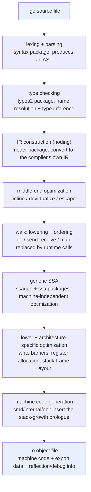

# 3.2 The Go Compilation Pipeline

[3.1](./cmd.md) explained that the real work behind `go build` is carried out by two programs, `compile` and `link`. This section zooms in on `compile` and traces the full journey from a single `.go` source file to a single `.o` object file: what each stage receives, what it produces, and why the work is cut up this way. This section is a **panorama** of the compilation pipeline. The inner workings of each stage (how the grammar is designed, what algorithm type checking uses, the optimization rules of SSA) are left to [Chapter 15](../../part5toolchain/ch15compile/readme.md) to unfold one by one. Here we only string them into a single line and point out two threads that run through all of it.

To avoid sliding back into a word-for-word recitation of the compiler's directory structure, the discussion below uses **one small example that runs through the whole journey** to tie the stages together. Keep this function in mind; the pipeline will knead and reshape it over and over until it becomes machine code:

```go
func send(ch chan int) {
	go work() // start a new goroutine
	ch <- 1   // send on the channel
}
```

It is only two lines, yet it happens to hide the second thread this section wants to stress: language keywords like `go` and `<-` are ultimately not implemented directly by CPU instructions; they are **translated by the compiler into calls into the runtime**. Let us first walk through the whole pipeline, then come back and dissect these two lines.

## 3.2.1 Two Hidden Threads: Why Talk About Them First

Before laying out the details of the pipeline, let us name the two design orientations that run through all of it, since every later stage is serving them.

The first thread is that **compilation speed itself is a first-class constraint**. From the very beginning Go treated "compilation must be fast" as a language goal rather than an afterthought ([1.1](../ch01intro/history.md)). This goal seeped into every layer of the syntax, dependency management, and compiler structure: the grammar is designed to be parsed quickly without backtracking, dependencies are carried by **compact export data** produced at compile time rather than by source, and there is no C/C++ style `#include` that contaminates layer upon layer. In *Go at Google*, Rob Pike lists this as a direct motivation for Go's birth; back then a single large C++ build at Google routinely took hours, while Go aimed to "press enter and the compile is done".

The second thread is the **conspiracy between the compiler and the runtime**. Many of Go's language features are not implemented by the compiler alone; instead the compiler emits a piece of **code that calls into the runtime**, and the runtime backs it up while the program runs. `go f()` is lowered to `runtime.newproc`, `<-ch` is lowered to `runtime.chanrecv`, every function entry has a **stack-growth prologue** inserted, types containing pointers are equipped with a **GC pointer bitmap** and a type descriptor, and every place that writes a pointer has a **write barrier** inserted. One could say the compiler lays down one agreed-upon interface after another for the runtime, and only the two together form the complete semantics. This thread will be cashed out in [3.2.6](#326-hidden-thread-one-compilation-speed-as-a-first-class-constraint) and [3.2.7](#327-hidden-thread-two-the-conspiracy-between-compiler-and-runtime).

## 3.2.2 Panorama of the Pipeline

In go1.26, `compile` can logically be divided into three segments, front end, middle end, and back end, which subdivide into the pipeline below. Its code is scattered across several subpackages of `cmd/compile/internal`, but the reader need not memorize directories, only the change in the shape of the data: source code to syntax tree to typed syntax tree to the compiler's own IR to SSA to machine-dependent SSA to machine code.



The segment that sits between the front end and the back end (the middle end plus walk) is often called the "middle-end"; it is where optimization is densest and where Go's design trade-offs show most clearly. Following this line, let us see what happens to the `send` function at each stop.

## 3.2.3 Front End: From a Character Stream to a Typed Syntax Tree

**Lexing and parsing** (`cmd/compile/internal/syntax`) is the first stop. The source is first cut into a stream of tokens (lexing), then assembled into an **abstract syntax tree** (AST) according to the grammar rules (parsing). The body of `send` is parsed into two statement nodes: a `go` statement and a send statement, each node carrying a precise source position for later error reporting and debug-info generation. Go's grammar is designed for speed and can be parsed in a single pass without backtracking, which is exactly the first item [3.2.6](#326-hidden-thread-one-compilation-speed-as-a-first-class-constraint) will detail (for grammar details see [15.1](../../part5toolchain/ch15compile/parse.md)).

**Type checking** (`cmd/compile/internal/types2`) then takes over. `types2` is a port of `go/types` that uses the AST from the `syntax` package instead. It does two things: name resolution (which declaration each identifier points to) and type inference (what type each expression has), and on top of that it applies extra checks, for example "declared but not used". Type inference for generics and constraint solving also happen at this stage, and are among the most intricate parts of the whole compiler ([8.3](../../part2lang/ch08generics/checker.md)). For `send`, this step confirms that `ch` is a `chan int`, that the `1` in `ch <- 1` is assignable to `int`, and that `work` is a function with no parameters. Once the check passes, every expression on the AST carries a definite type.

It is worth pointing out that the public packages `go/parser` and `go/types` are **not** used by the compiler. The compiler was originally written in C, and the `go/*` series was later developed separately for tools like `gofmt` and `vet`; the two share an origin but diverged.

## 3.2.4 Middle End: IR, Inlining, and Escape Analysis

The representation after type checking is not yet convenient for optimization, so there is **IR construction** (noding, `cmd/compile/internal/noder`): converting the `syntax` plus `types2` representation into the compiler's own IR (the `ir` package) and type system (the `types` package). This IR is bloodline left over from when the compiler was still written in C, and all of the middle-end and back-end code is built on it. The noding in go1.26 takes the **Unified IR** route: it serializes the code after type checking into an intermediate product, then rebuilds the IR from it, and this product also serves as the carrier for package import/export and inlining. This point is crucial for the first thread, and [3.2.6](#326-hidden-thread-one-compilation-speed-as-a-first-class-constraint) will return to it.

Once the IR is in place, the **middle end** runs several optimization passes over it: dead-code elimination, (early) devirtualization, function inlining (the `inline` package), and escape analysis (the `escape` package). **Escape analysis** is especially important; it decides whether each variable can safely live on the stack or must be allocated on the heap. This step directly determines who manages each object: objects that stay on the stack are reclaimed automatically when the function returns, while objects that escape to the heap come into the view of garbage collection ([13.1](../../part4memory/ch13gc/basic.md)). In `send`, the function passed to `go work()` and any variable captured by the new goroutine will be judged to escape, because the lifetime of the new goroutine outlives the stack frame of `send`.

## 3.2.5 Walk and Back End: Lowering, SSA, and Machine Code

After the middle end comes **walk** (`cmd/compile/internal/walk`), the last pass over the IR, which does two things. The first is **ordering**: it splits compound statements into simple statements with temporary variables and fixes the evaluation order. The second is **lowering** (desugaring): translating high-level language constructs into more primitive forms. The second thread of this section first shows itself here. `switch` is rewritten into a binary search or a jump table, while **operations on maps and channels, and the `go` statement, are replaced by calls into the runtime**. By this step the two lines of `send` become roughly this:

```go
// after walk (illustrative): go / <- are lowered to runtime calls
func send(ch chan int) {
	newproc(work)          // go work()  -> runtime.newproc
	var tmp int = 1
	chansend1(ch, &tmp)    // ch <- 1    -> runtime.chansend1
}
```

Next comes **generic SSA** (`ssagen` converts the IR into SSA, and the `ssa` package carries it). SSA (static single assignment) is a low-level intermediate representation in which each value is assigned exactly once, a property that makes data-flow analysis and optimization concise (for details see [15.2](../../part5toolchain/ch15compile/ssa.md)). During the conversion, **intrinsics** are applied (the compiler hardcodes highly optimized implementations for certain functions) and more constructs continue to be lowered (for example `copy` is turned into a memory move and a range loop is rewritten into a for loop). A series of **machine-independent** optimizations then runs: dead-code elimination, removal of redundant nil checks, constant folding, and rewriting multiplications and floating-point operations into more efficient forms. These rules do not involve any specific architecture and run identically on every `GOARCH`.

Last is the **machine-dependent** back end. It opens with the **lower pass**, which rewrites generic SSA values into variants specialized for the target architecture (for example, on amd64 merging several load-stores into a single instruction with a memory operand). After lower, another round of optimization runs along with a few key tasks: **register allocation**, **stack-frame layout** (assigning stack offsets to local variables), **pointer liveness analysis** (computing which on-stack pointers are live at each GC safe point, a prerequisite for precise GC, see [4.1](../../part2lang/ch04type/type.md) and [Chapter 13 Garbage Collection](../../part4memory/ch13gc/readme.md)), and inserting **write barriers** (a dedicated `writebarrier` pass in the `ssa` package). At this point the function has been turned into a sequence of `obj.Prog` instructions, handed to the assembler (`cmd/internal/obj`). The assembler turns them into real machine code **and inserts the stack-growth prologue at every function entry** (`stacksplit` in `cmd/internal/obj`), and writes out the final object file. Besides machine code, the object file also contains export data, reflection data, and debug info.

To see with your own eyes how `send` changes between the SSA passes, you can export a visualized SSA with one command: `GOSSAFUNC=send go build`, which generates an `ssa.html` listing the evolution of each value pass by pass.

## 3.2.6 Hidden Thread One: Compilation Speed as a First-Class Constraint

Back to the first thread. Go bakes "fast" into three layers of the pipeline, each corresponding to one of the stops above.

**The grammar layer.** Go's grammar can be scanned in a single pass without backtracking, and lexing is even simple enough to be close to regular. This compresses the first stop of [3.2.3](#323-front-end-from-a-character-stream-to-a-typed-syntax-tree) into linear time, in sharp contrast with the C++ style grammar that needs unbounded lookahead and entangles parsing with semantics.

**The dependency layer.** This is the most skillful stroke. When compiling package P, the Unified IR mentioned in [3.2.4](#324-middle-end-ir-inlining-and-escape-analysis) also writes out a body of **export data**: it serializes into the object file the type information of all exported declarations in P, the bodies of inlinable functions, the bodies of generic functions, and escape analysis's conclusions about parameters. When package Q imports P, the compiler reads only this export data of P and **does not touch P's source**. More crucially, this export data is usually "deep": it has already packed together the information that P transitively depends on and that Q might use, so Q only needs to read one file per direct dependency, without recursively expanding the whole dependency graph. This precisely eliminates the fatal flaw of `#include` in C/C++, where a header file is contaminated layer by layer along the dependency chain, and a widely referenced header gets re-parsed over and over by hundreds or thousands of translation units. Go swaps out this repeated labor for a single compact binary produced at compile time.

**The structural layer.** Go uses the **package** as the unit of compilation and compiles packages in parallel; packages are coupled only through the narrow interface of export data, which lets the whole build be highly parallel ([3.1](./cmd.md) already described how `go build` schedules these parallel compilations).

There is a cost. Deep export data tends to "swell as it travels up the dependency graph": a set of widely used types with large APIs will cause almost every package's export data to carry a copy of them. This very problem gave rise to more economical export formats such as "indexed" and "shallow" (the latter adopted by gopls, trading random on-demand reads for size). Performance trade-offs are never free; here a bit of redundancy is exchanged for a simple, single-pass-readable build system.

## 3.2.7 Hidden Thread Two: The Conspiracy Between Compiler and Runtime

The second thread is the key to understanding the Go runtime. Many readers assume that goroutines, channels, and GC are "the runtime's business" and have nothing to do with the compiler, but the two are in fact **conspiring**: the runtime defines a set of agreed-upon interfaces, and the compiler generates calls to them or the accompanying metadata at the right places; without either side the semantics are incomplete. Here we gather up the several points of conspiracy scattered above:

| Language feature | What the compiler does | Stage where it happens | The runtime side |
| --- | --- | --- | --- |
| `go f()` | lowered to `runtime.newproc(f)` | walk | the scheduler creates and enqueues the goroutine ([9.4](../../part3concurrency/ch09sched/schedule.md)) |
| `ch <- v` / `<-ch` | lowered to `runtime.chansend` / `chanrecv` | walk | channel send/receive and block/wake ([Chapter 10](../../part3concurrency/ch10chan/readme.md)) |
| function entry | inserts the stack-growth prologue (`stacksplit`) | obj assembly | `morestack` triggers stack growth ([2.2](../ch02asm/callconv.md), [Chapter 14](../../part4memory/ch14stack/readme.md)) |
| pointer write `*p = q` | inserts a write barrier | SSA `writebarrier` pass | GC uses the barrier records to maintain the tricolor invariant ([13.2](../../part4memory/ch13gc/barrier.md)) |
| types containing pointers | generates a type descriptor + GC pointer bitmap | back end / reflection data | GC uses the bitmap to scan objects precisely ([4.1](../../part2lang/ch04type/type.md), [13.1](../../part4memory/ch13gc/basic.md)) |

This table finishes telling where the two lines of `send` end up: `go work()` became a `newproc`, taken over by the scheduler; `ch <- 1` became a `chansend`, taken over by the channel's runtime implementation. And that invisible **stack-growth prologue** is carried by every Go function: at the entry it compares the stack pointer against the stack boundary, and if this call would burst the current stack, it first jumps to `morestack` to grow it before continuing, which is exactly the implementation basis that lets a goroutine start from a small stack of a few KB and grow on demand.

Putting the two threads together, the role the compiler plays in Go becomes clear: on one side it is pressed to stay lean by the constraint of "fast" (thread one), and on the other it shoulders the heavy work of laying down interfaces for the runtime (thread two). The tug between these two forces shapes every trade-off from grammar to object file. The next section ([3.3](./bootstrap.md)) asks a more fundamental question: this compiler, itself written in Go, where did it originally come from?

## Further Reading

1. The Go Authors. *Introduction to the Go compiler* (`cmd/compile/README.md`).
   https://github.com/golang/go/blob/master/src/cmd/compile/README.md
   (The first-hand basis for this section's pipeline division, including export data §7a.)
2. The Go Authors. *Introduction to the Go compiler's SSA backend*
   (`cmd/compile/internal/ssa/README.md`).
   https://github.com/golang/go/blob/master/src/cmd/compile/internal/ssa/README.md
3. Rob Pike. *Go at Google: Language Design in the Service of Software Engineering.* 2012.
   https://go.dev/talks/2012/splash.article (Lists compilation speed as a design motivation of Go.)
4. Ron Cytron, Jeanne Ferrante, et al. "Efficiently Computing Static Single Assignment Form
   and the Control Dependence Graph." *ACM TOPLAS*, 13(4), 1991.
   https://doi.org/10.1145/115372.115320 (The theoretical origin of SSA.)
5. The Go Authors. *Unified IR* (`cmd/compile/internal/noder/README.md`).
   https://github.com/golang/go/blob/master/src/cmd/compile/internal/noder/README.md
   (IR construction and the export data format.)
6. This book: [15.1 Lexing and Parsing](../../part5toolchain/ch15compile/parse.md),
   [15.2 Intermediate Representation](../../part5toolchain/ch15compile/ssa.md),
   [8.3 Type-Checking Techniques](../../part2lang/ch08generics/checker.md).
7. This book: [1.1 The Evolution of Programming Languages](../ch01intro/history.md),
   [13.2 Write Barrier Techniques](../../part4memory/ch13gc/barrier.md),
   [Chapter 14 Execution Stack Management](../../part4memory/ch14stack/readme.md).
