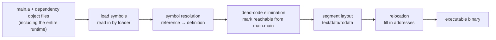

# 3.4 Module Linking

The compiler ([3.2](./compile.md)) turns each package into an object file, but an object file cannot run on its own. The object files still reference one another's functions and variables, addresses are not yet fixed, and the runtime support is still missing. Assembling these fragments into a complete program that can be loaded and executed is the job of the **linker** (`cmd/link`, usually invoked by `go build` as `go tool link`). This section looks at what the linker does, and at a few choices Go makes around linking that together explain why a Go program is so often a self-contained file that "just runs once you copy it over."

## 3.4.1 What the Linker Does

The linker's input is the object file of a main package, together with the object files of every package it transitively depends on (including the entire runtime); its output is a binary that the operating system can load and execute. In between, it carries out a few key tasks in sequence:

- **Symbol resolution**: bind every **reference** to an external symbol to its unique **definition** in some object file. A symbol is just a named address: the entry of some function, the storage of some global variable. When package A writes `fmt.Println(...)`, compiling A does not know where `fmt.Println` lives, and only leaves behind a reference to be resolved later; the linker connects it to that definition in the `fmt` package's object file.
- **Layout**: arrange the machine code and data of all symbols into the various segments of the executable by kind: code goes into text, read-write data into data, read-only data (string literals, type information) into rodata, and so on. Once the layout is fixed, the final address of every symbol is determined as well.
- **Relocation**: with addresses fixed, go back and patch all the temporary addresses filled into the references.
- **Dead-code elimination**: functions and variables unreachable from the entry point are simply never written into the final binary.

The end product is a file with its layout fully settled and its addresses all filled in. The next three sections look in turn at the three points most worth discussing: relocation (3.4.2), dead-code elimination (3.4.3), and the hallmark Go consequence that "the runtime is linked in along with everything else" (3.4.4).



## 3.4.2 Symbol Resolution and Relocation

These two steps are the core mechanism of linking, and they are worth formalizing a little.

A **relocation** can be understood as a triple $(o, S, a)$: at offset $o$ within the current symbol there is a "hole" to be filled, it should point at the target symbol $S$, and it carries an addend $a$. Once the linker has fixed the final address $\text{addr}(S)$ of $S$ after layout, it fills the hole. The two most common ways to fill it are:

$$
\text{absolute reference:} \quad \text{patch}(o) = \text{addr}(S) + a
$$

$$
\text{relative reference:} \quad \text{patch}(o) = \text{addr}(S) + a - (\text{addr}(\text{self}) + o)
$$

An absolute relocation fills in the target's real address directly (for example, taking the address of a global variable); a relative relocation fills in "the distance of the target relative to the current instruction" (for example, the `rel32` operand of `CALL` on x86). The latter lets the code be shifted as a whole without refilling, which is the basis of position-independent code (PIC) and modern ASLR. Go describes these holes with a set of architecture-independent relocation types (`objabi.RelocType`, such as `R_CALL`, `R_PCREL`, `R_ADDR`), and during the relocation phase the linker translates them into concrete machine-code patches for the target architecture.

Symbol resolution, in turn, builds the mapping from the name $S$ to a single definition. Symbols of the same name may appear in multiple object files (typically the same function instance produced by inlining, or a type descriptor generated by the compiler), and the linker must guarantee that each symbol has **exactly one** definition in the final binary, with all references pointing at it. Before Go 1.15, this step was done by building a `*sym.Symbol` object for every symbol and using one large global string-to-object hash table; the rewrite switched to integer symbol indices (see 3.4.6), precisely to save the memory and lookup cost of this table.

## 3.4.3 Dead-Code Elimination

Not all the code in the linked-in packages ends up in the final binary. Starting from the program's **roots**, mainly `main.main` and each package's `init` functions, the linker performs a reachability traversal along the "who references whom" symbol dependency graph ([reachability](https://en.wikipedia.org/wiki/Reachability)), and only symbols marked reachable take part in the subsequent layout. Unreachable functions, variables, and type information are discarded wholesale. The go1.26 implementation runs this marking pass using a min-heap as the work queue (`deadcodePass`, `src/cmd/link/internal/ld/deadcode.go`), where heap-ordered traversal is meant to improve access locality.

This can be observed directly. `-dumpdep` makes the linker print the symbol dependency graph it walks, so we can see how a single `fmt.Println` "drags" a long chain of symbols into the binary:

```shell
$ go build -a -ldflags=-dumpdep -o hello hello.go 2>&1 | grep 'main.main ->'
main.main -> main..stmp_0
main.main -> os.Stdout
main.main -> go:itab.*os.File,io.Writer
main.main -> fmt.Fprintln
```

Conversely, things nobody references are quietly removed. In the program below, `unused` is never called:

```go
package main

import "fmt"

//go:noinline
func used()   { fmt.Println("used") }

//go:noinline
func unused() { fmt.Println("unused") } // referenced by no one

func main() { used() }
```

A check with `go tool nm` (which lists the symbol table in the binary) shows `main.used` present and `main.unused` absent: it was eliminated during the link stage.

```shell
$ go build -o dc dc.go
$ go tool nm dc | grep 'main.used'
10009f4a0 T main.used
$ go tool nm dc | grep 'main.unused'    # no output: eliminated as dead code
```

Dead-code elimination matters especially for Go, for the reason in 3.4.4: every Go program links in the **entire runtime and whatever standard library it uses**, and without pruning even the plainest `hello world` would drag along a heap of code that never runs. The trickiest part of this marking pass is interfaces and reflection: for a method called through an interface or via `reflect`, the call site does not reveal in static analysis which type's implementation it lands on, so the linker must conservatively keep alive "the signature-matching methods of reachable types" (the `ifaceMethod` and `reflectSeen` in `deadcodePass` exist exactly for this). This is also why programs that use reflection heavily often cannot prune much code.

## 3.4.4 The Runtime Is Linked In Too

The point most worth remembering: **the runtime is linked in**. Your `main` package, every package it depends on, and the entire Go runtime (the scheduler, the garbage collector, the memory allocator, `netpoll`, and so on) are all stitched by the linker into the same binary. There is no external virtual machine, no interpreter; the runtime simply sits quietly inside the executable. This is exactly where the notion of a Go program "carrying its own runtime" comes from.

How big a piece is it? Take the earlier `hello` that prints a single line:

```shell
$ go tool nm hello | wc -l           # total number of symbols in the binary
2598
$ go tool nm hello | grep -c 'runtime\.'   # of which belong to runtime
1717
```

In a `hello world`, more than sixty percent of the symbols come from the runtime. This explains the impression that a Go binary "starts at a few MB by nature": what it packs is not your handful of lines, but a complete concurrent runtime. By contrast, a C program leaves most of this support (threads, memory management) to the operating system and libc, and can therefore be very small. The two trade-offs each find their place: Go exchanges a larger size for "a single file that is the whole execution environment," and the next section shows this to be its killer feature in the container era.

## 3.4.5 The Trade-offs of Static Linking

Another hallmark Go choice is **static linking by default**. A pure Go program usually compiles into a self-contained executable with no dependency on external shared libraries. Copy it to another machine of the same architecture and system and it runs, with no runtime libraries to install first. This contrasts with the common C/C++ situation of "depending on a pile of `.so`/`.dll` files, then missing libraries when you switch machines," and it is one of the reasons Go is so well received in the cloud-native era: a single Go binary dropped into an empty `FROM scratch` image is enough to work:

```dockerfile
FROM scratch
COPY hello /hello
ENTRYPOINT ["/hello"]
```

"Static by default" needs two qualifications, and should not be stated as absolute. First, **cgo pulls back dynamic dependencies**: once a program calls C code through cgo, the linker must hook up the system libc, and the binary again has dynamic dependencies. Second, **some platforms are not fully static by nature**: macOS does not provide static system libraries, so even a pure Go program still links `libSystem` dynamically. Both points are visible in experiments, and they show us where the boundary of "static" lies:

```shell
# On Linux, turn off cgo to get a fully static binary
$ CGO_ENABLED=0 GOOS=linux GOARCH=amd64 go build -o hello_linux hello.go
$ file hello_linux
hello_linux: ELF 64-bit ... statically linked, ...

# The same source on macOS: still depends on libSystem (a platform matter, not Go's fault)
$ otool -L hello
hello:
	/usr/lib/libSystem.B.dylib ...
```

`CGO_ENABLED=0` has therefore become the common switch for building portable static binaries: it disables cgo as a side effect, forcing the pure Go implementations into play (such as the `net` package's pure Go resolver) and thereby cutting the dynamic dependency on libc.

The cost of static linking must be stated plainly too. The **size** is larger, since each binary carries its own copy of the runtime and the library code it uses (the earlier `hello` is about 2.5MB); fortunately dead-code elimination and stripping can shave off part of it: `-ldflags="-s -w"` drops the symbol table and DWARF debug information, which can shrink that `hello` from about 2.5MB to about 1.7MB:

```shell
$ go build -ldflags="-s -w" -o hello_stripped hello.go   # -s drops the symbol table, -w drops DWARF
```

The more serious cost lies in **security updates**: under dynamic linking, when libc has a vulnerability, the system replaces that `.so` and restarts the process, and that is enough; static linking welds the library's code into every binary, so a security fix in any one dependency requires **recompiling and redistributing** all affected programs. Placed in lineage, this is not a problem unique to Go: people who use musl with static linking in the C world, or who rely on Rust's default static linking, sit on the same trade-off line, with portability and simple deployment on one end, and size and the ability to "patch centrally" on the other. Go made its choice aimed at the server and container scenario it targets: there, the operational cost saved by "a single file being the entire deliverable" usually outweighs the cost of recompiling and redistributing.

## 3.4.6 Evolution and Frontier of the Linker

Go's linker likewise descends from the Plan 9 tradition ([2.1](../ch02asm/asm.md)), and has been reshaped over the years. The one most worth remembering is the **large-scale rewrite** around Go 1.15, codenamed `dev.link`. At the core of the rewrite were the object file format and the internal representation of symbols: the old implementation expanded every symbol into a `*sym.Symbol` heap object and indexed them by name through one global hash table, so as symbols grew in number the memory and GC pressure rose with them; the new implementation introduced a new object file format and represented symbols uniformly as compact integer indices, managed centrally by the newly added `loader` package (`src/cmd/link/internal/loader`), "materializing" a symbol into an object only on demand. Another change was to further parallelize the internal phases of linking, for example applying relocations to symbols in parallel. By the measurements given in the Go 1.15 release notes, for a set of representative large Go programs, linking on ELF systems on amd64 was on average **about 20% faster and about 30% lower in memory** (the gains on other architectures and systems were milder, at the cost of new object files slightly larger than 1.14's). This was part of a "rewrite the linker" effort spanning multiple releases, and later versions kept improving it.

This rewrite echoes Go's long-standing obsession with **build speed** ([1.1](../ch01intro/history.md)). Linking is the last stop of the build pipeline, and whether it is fast directly determines how long you wait on every "change one line, rerun" cycle; from compilation to linking, the whole pipeline's design goal stays consistent: keep the builds of large-scale Go projects fast.

Linking still has unfinished frontiers. For very large binaries, link time and peak memory can still become bottlenecks, and generating DWARF debug information is a sizable part of the cost (which is why CI often uses `-w` to turn it off for speed); incremental linking, more aggressive parallelization, and tighter cooperation with the compiler are all directions still evolving. Next stop, we look at how this linked binary, once loaded by the operating system, "boots" itself up ([3.5](./boot.md)).

## Further Reading

1. The Go Authors. *cmd/link documentation and source (including link options such as `-dumpdep`, `-s`, `-w`).*
   https://pkg.go.dev/cmd/link ; https://github.com/golang/go/tree/master/src/cmd/link
2. The Go Authors. *src/cmd/link/internal/ld/deadcode.go (reachability marking starting from `main.main`),
   src/cmd/link/internal/loader (new object file format and symbol indices).*
   https://github.com/golang/go/tree/master/src/cmd/link/internal
3. Austin Clements et al. *Building a better Go linker (linker modernization design document, a multi-release effort).*
   https://go.dev/s/better-linker
4. The Go Authors. *Go 1.15 Release Notes (linker: new object file format, parallel relocation, on average about 20% faster
   and about 30% lower in memory).* https://go.dev/doc/go1.15
5. Rob Pike. *Go at Google: Language Design in the Service of Software Engineering (build speed as
   a first-class design goal).* 2012. https://go.dev/talks/2012/splash.article
6. This book: [2.1 Plan 9 Assembly](../ch02asm/asm.md), [3.2 Compilation Flow](./compile.md),
   [3.5 Boot and Bootstrap](./boot.md), [1.1 History and Design Philosophy](../ch01intro/history.md),
   [17 Modules and Ecosystem](../../part5toolchain/ch17modules).
