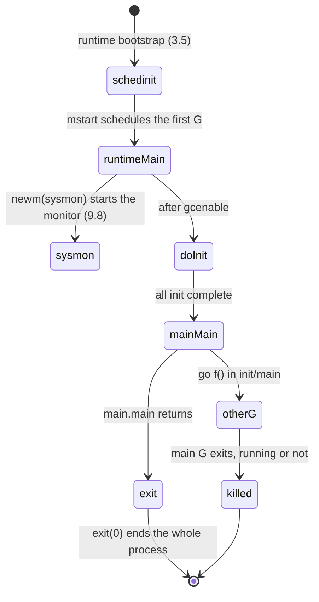

# 3.6 The Life and Death of the Main Goroutine

In [3.5](./boot.md), once `schedinit` has assembled the runtime's foundations, it does not call `runtime.main` directly. Instead it pushes that function's entry address onto the stack, hands it to `newproc` to fabricate the first Goroutine, and then lets `mstart` start the scheduling loop and pick this Goroutine out to run. The details of scheduling are left for [9 Scheduler](../../part3concurrency/ch09sched). This section trains the camera on a single moment: **the first Goroutine is already running, and it is about to execute `runtime.main`**.

This Goroutine is unlike the others. It is the first one born in the program, it carries the user's `main.main`, and it alone holds power of life and death over the whole process: the moment it returns, the process ends, even if a thousand other Goroutines elsewhere are still busy. Understanding what it does, and when it stops, is the last piece of the puzzle in understanding "how a Go program starts, and how it exits as a whole".

## 3.6.1 `runtime.main`: The Groundwork Before User Code

The `main` function in the runtime package (that is, `runtime.main`) runs on the same Goroutine as the user's `main.main`, but before it hands control to the user, it takes care of a few things that only "the first Goroutine" can do. Below is a trimmed sketch, keeping only the skeleton relevant to the lifecycle:

```go
// Entry of the main Goroutine (trimmed from runtime/proc.go)
func main() {
	mp := getg().m

	// Execution stack limit: 1GB on 64-bit, 250MB on 32-bit (decimal looks nicer in crash output)
	if goarch.PtrSize == 8 {
		maxstacksize = 1000000000
	} else {
		maxstacksize = 250000000
	}

	mainStarted = true            // allow newproc to start new Ms

	if haveSysmon {               // start the system monitor thread (see 9.8)
		systemstack(func() {
			newm(sysmon, nil, -1)
		})
	}

	lockOSThread()                // lock the main G to the main OS thread during init
	if mp != &m0 {
		throw("runtime.main not on m0")
	}

	runtimeInitTime = nanotime()  // record the moment "the world begins", must precede doInit

	doInit(runtime_inittasks)     // run the runtime's own init (incl. GC, defer types, etc.)

	gcenable()                    // enable the garbage collector (see 13)

	// run the init tasks of all modules (incl. user packages) in dependency order
	last := lastmoduledatap
	for m := &firstmoduledata; true; m = m.next {
		doInit(m.inittasks)
		if m == last {
			break
		}
	}

	unlockOSThread()

	fn := main_main               // indirect call: the linker does not yet know the main package's address
	fn()

	exit(0)                       // once the main G returns, the whole process exits
}
```

There are several spots in this skeleton worth pausing on.

`runtimeInitTime = nanotime()` is the first timestamp stamped on the entire runtime, "the world begins at this instant". The cadence of later GC triggers, scheduling statistics, and `init` tracing (the `@x ms` printed by `GODEBUG=inittrace=1`) all take it as their zero point, so it must be set before any `init` settles.

`newm(sysmon, nil, -1)` raises a monitor thread `sysmon` on the system stack that is not bound to any P. It is the runtime's "background steward", periodically preempting long-running Goroutines, reclaiming idle resources, and triggering GC on demand. The details of its work are covered in [9.8 System Monitor](../../part3concurrency/ch09sched/sysmon.md). Note that it is guarded by `haveSysmon`: on single-threaded platforms such as wasm, this thread does not exist.

Before `gcenable()`, the garbage collector is "off"; during initialization we do not want it to interfere. This step truly connects GC, after which heap growth is reclaimed at GC's pace. The mechanism is covered in [13 Garbage Collection](../../part4memory/ch13gc).

As for the `lockOSThread()`/`unlockOSThread()` pair, it exists because some platforms require certain calls during initialization to happen on the main OS thread; if the user calls `runtime.LockOSThread` inside an `init`, then `main.main` can also be kept on the main thread.

With the groundwork done, the true protagonist enters in two steps: first `doInit` runs through all the `init`s, then `main_main` runs the user's `main.main`. This carries an often-overlooked fact: **all of the user's `init` functions and `main.main` execute on the same Goroutine, strictly one after another**. If an `init` spins up another Goroutine, those Goroutines may run concurrently with later `init`s, but the order among `init`s, and from `init` to `main.main`, is always serial.

## 3.6.2 The Order of Package Initialization: `doInit` and the Dependency Graph

"What order do `init`s actually run in" is one of the things readers are most often confused about, and the thing most worth getting clear (this section answers tracked issue #75). The answer is built from two layers of rules: **between packages**, ordering follows the dependency graph; **within a package**, ordering follows variable dependencies and source order. Both layers are spelled out explicitly by the Go language specification, not by implementation detail.

### Between Packages: Imports First, Once Per Package

The specification puts it plainly in *Program initialization*: if a package has imports, the imported packages are initialized before it; when several packages import the same package, that package is initialized only once. More precisely, given all packages sorted by import path, each step picks the first package that is "not yet initialized and all of whose imports have been initialized" and initializes it, repeating until all are ready. Import relations naturally form a directed acyclic graph, so this ordering can always complete; there is no circular initialization.

The linker freezes this dependency order into each module's (moduledata's) `inittasks` list, and the runtime simply takes it as given. That `for m := &firstmoduledata` loop in `runtime.main` is exactly "traverse modules in dependency order and `doInit` each one". `doInit` itself merely hands a sequence of `initTask`s to `doInit1` to execute one by one:

```go
// The initialization task of each package (trimmed from runtime/proc.go)
type initTask struct {
	state uint32 // 0 not initialized, 1 in progress, 2 done
	nfns  uint32 // the nfns init function pointers that immediately follow
}

func doInit1(t *initTask) {
	switch t.state {
	case 2:                 // done: return directly, guaranteeing "run once per package"
		return
	case 1:                 // entered again while in progress: should not happen in the graph, means the linker got it wrong
		throw("recursive call during initialization - linker skew")
	default:
		t.state = 1
		firstFunc := add(unsafe.Pointer(t), 8)
		for i := uint32(0); i < t.nfns; i++ {  // call each init of this package in order
			p := add(firstFunc, uintptr(i)*goarch.PtrSize)
			f := *(*func())(unsafe.Pointer(&p))
			f()
		}
		t.state = 2         // mark as done
	}
}
```

The three states of `state` map the spec's two constraints precisely into code: `case 2` ensures any package is initialized at most once (even if imported from many places), while the `throw` in `case 1` is a runtime assertion of "no circular initialization"; once it fires, it means the linker's ordering went wrong.

### Within a Package: Variable Dependencies First, `init` in Source Order

Once inside a single package, the spec requires that **all package-level variables** be initialized first, and then this package's `init` functions be called in turn. The order of variables is not a simple top-to-bottom; it advances step by step according to dependency: each step picks the variable that is "earliest in declaration order and whose initialization expression depends on no uninitialized variable". The example the spec gives illustrates the point well:

```go
var (
	a = c + b  // result 9
	b = f()    // result 4
	c = f()    // result 5
	d = 3      // becomes 5 after initialization completes
)
func f() int { d++; return d }
// initialization order is d, b, c, a
```

Although `a` is written first, because it depends on `b` and `c` it is settled last; `d` has no dependency and is referenced by `f`, so it goes first. Dependency analysis looks only at lexical references in the source (and takes the transitive closure), not at runtime values, so `a = c + b` and `a = b + c` give the same order. Across files, a variable's "declaration order" is determined by the order in which files are presented to the compiler; the spec recommends that build systems present files in lexical filename order for reproducibility.

Once variables are ready, this package's `init` functions are called in turn in **the order they appear in the source**, possibly across multiple files, and the same file may declare several. An `init` cannot be referenced, and takes no arguments and returns no values; the sole reason it exists is "to be run once during initialization". This corresponds exactly to that plain `for i` loop in `doInit1`: the linker has already arranged the pointers in source order, and the runtime simply calls them in that sequence.

Putting the two layers of rules together, a program's initialization is a tree like the following, depth-first, with each node visited only once:

```go
// Illustration: import relations determine the overall order of init
package main

import (
	"fmt"        // initialize fmt and its dependencies first
	_ "net/http" // then initialize net/http and its dependencies
)

var x = compute() // package-level variables are ready before main.init

func init() { fmt.Println("main init") } // called after the variables are ready

func main() { fmt.Println("main") }
```

The dependencies of `fmt` and `net/http` are each initialized cleanly in depth-first fashion, and the low-level packages shared by several packages (such as `runtime`, `internal/*`) are initialized only once; when it is the `main` package's turn, `x` is made ready first, then `init` runs, and only then does control enter `main.main`. The entire process happens serially on the main Goroutine.

## 3.6.3 The Crucial Asymmetry: Once the Main Goroutine Dies, the Process Ends

After `main_main` returns, `runtime.main` does nothing to "wait for other Goroutines to wrap up"; it heads straight to `exit(0)`, and the process vanishes with it. Hidden here is an asymmetry in Go's concurrency model that must be kept firmly in mind:

> **The main Goroutine and an ordinary Goroutine are not equals. When an ordinary Goroutine finishes, only it leaves the stage; when the main Goroutine finishes, it takes the whole process with it. The moment `main.main` returns, all Goroutines still running are terminated on the spot, with no cleanup and no goodbye.**

The diagram below draws out this one-way lifecycle:



A direct consequence of this rule is: **if `main.main` does not actively wait, a background Goroutine may be carried off before it has run a single line**. So in a concurrent program the main Goroutine must synchronize explicitly; the common means are `sync.WaitGroup` or a channel, with mechanisms covered in [11 Synchronization Patterns](../../part3concurrency/ch11sync). The difference between the two snippets below is exactly "waiting" versus "not waiting":

```go
func main() {
	go func() { fmt.Println("may never print") }()
	// main returns at once; the child Goroutine is probably not yet scheduled, and the process has already exited
}
```

```go
func main() {
	var wg sync.WaitGroup
	wg.Add(1)
	go func() { defer wg.Done(); fmt.Println("will definitely print") }()
	wg.Wait() // the main G waits here, returning only after the child Goroutine completes
}
```

This asymmetry also corroborates another design choice: Go provides no API to "kill a Goroutine from the outside" (see [11 Synchronization Primitives and Patterns](../../part3concurrency/ch11sync)). When a Goroutine ends can only be decided by itself (a normal return or `runtime.Goexit`), the sole exception being the "collective punishment" termination of all when the main Goroutine exits. In other words, a process-level exit is the only path in Go for "forcibly ending Goroutines from the outside"; it is crude and total. Precisely for this reason, handing the decision of when to exit to the main Goroutine, and requiring developers to synchronize explicitly, is this model's trade-off: in exchange comes the simplicity of a Goroutine's own state (no intermediate "asynchronously killed" state to handle), at the cost of developers having to manage the exit timing themselves.

With that, the main thread of how a Go program goes from bootstrap, through initialization, to exiting as a whole is complete. The reader may still hold a few questions: how exactly does `mstart` schedule the main Goroutine up? What does `sysmon` do in the background? And how does the GC that `gcenable` connected actually run? These are all left to their respective chapters ([9 Scheduler](../../part3concurrency/ch09sched), [13 Garbage Collection](../../part4memory/ch13gc)).

## Further Reading

1. The Go Authors. *The Go Programming Language Specification: Package initialization & Program initialization.*
   https://go.dev/ref/spec#Package_initialization
2. The Go Authors. *runtime/proc.go (`func main`, `doInit`, `doInit1`, `initTask`).*
   https://github.com/golang/go/blob/master/src/runtime/proc.go
3. The Go Authors. *Effective Go: The init function.*
   https://go.dev/doc/effective_go#init
4. Russ Cox. *`main_init_done` can be implemented more efficiently.* Go issue #15943.
   https://github.com/golang/go/issues/15943
5. The Go Authors. *Command compile.* https://go.dev/cmd/compile/
6. This book: [3.5 Go Program Bootstrap](./boot.md), [9.8 System Monitor](../../part3concurrency/ch09sched/sysmon.md),
   [11 Synchronization Patterns](../../part3concurrency/ch11sync).
