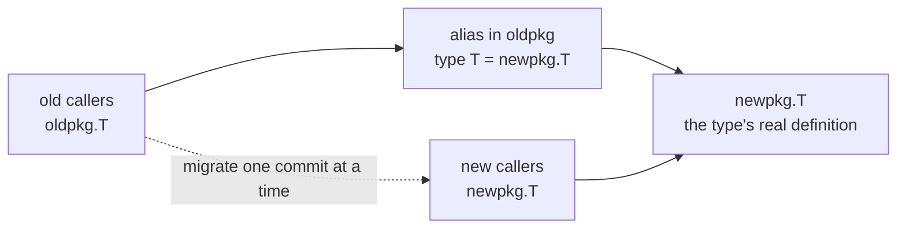

# 4.3 Type Aliases

`type A = B` (a type alias) and `type A B` (defining a new type) differ by a single equals sign, yet the
semantics are fundamentally different. The former merely gives a new name to an existing type; the latter
creates a brand-new type with its own independent identity. The distinction looks minor, but it pulls on the
whole set of rules governing type equality, method sets, and assignability ([4.1](./type.md)), and it also
pulls on a question Go has always cared about: when a body of code is no longer maintained by its original
author yet still has to evolve without breaking compatibility, how should a type migrate from one package to
another. This section first makes the semantics of aliases and defined types clear, then explains why aliases
were introduced in Go 1.9, and finally looks at the generic capability they gained in Go 1.24.

## 4.3.1 Aliases vs Defined Types

The specification gives type declarations two forms: alias declarations and type definitions. The dividing
line between them is that equals sign.

`type Celsius float64` is a type definition. It "creates a new, distinct type with the same underlying type
and operations as the given type." From then on `Celsius` and `float64` are two distinct named types
([4.1](./type.md)): each has its own identity, each can carry its own methods, and the two cannot be assigned
to each other directly, only converted explicitly.

`type byte = uint8` is an alias declaration. It merely "binds an identifier to the given type." Within the
scope of that identifier, `byte` "acts as an alias for uint8"; the two are two names for **the same type** and
are fully interchangeable. The standard library defines `byte` (`= uint8`), `rune` (`= int32`), and, since
Go 1.18, `any` (`= interface{}`) exactly this way, as predeclared aliases.

The place where aliases and defined types are most easily confused, and where the difference shows most
clearly, is the **method set**. Consider a snippet that fails to compile:

```go
import "bytes"

type AliasBuf = bytes.Buffer  // alias: this is bytes.Buffer itself
type DefBuf    bytes.Buffer   // defined type: same underlying type, but empty method set

func demo() {
	var a AliasBuf
	a.WriteString("x")        // OK: AliasBuf and bytes.Buffer are the same type, identical method sets

	var d DefBuf
	d.WriteString("x")        // compile error: DefBuf inherits none of bytes.Buffer's methods
	_ = bytes.Buffer(d)       // but can be converted back explicitly: same underlying type
}
```

`DefBuf` and `bytes.Buffer` share an underlying type, so they can be converted to each other explicitly, but
`DefBuf` is a **new type**. It does not inherit `bytes.Buffer`'s method set, so `d.WriteString` finds no
receiver. `AliasBuf`, by contrast, is not a new type at all; it **is** `bytes.Buffer`, so its method set is
naturally identical. In one sentence: a type definition creates **something new** (a new identity, an empty
method set, methods you must define yourself), while an alias only gives **a new name** to the old thing (the
same identity, the same method set).

## 4.3.2 How Others Do It: Type Synonyms and New Types

This dividing line between aliases and defined types appears almost everywhere in languages with nominal
types, only the names differ. Placing Go in that lineage shows it is not an outlier but a design choice that
has been rediscovered again and again.

- **Haskell**'s `type` declaration is exactly a type synonym, and it can carry parameters natively, for
  example `type Assoc k v = [(k, v)]`, corresponding one to one with Go's aliases (including generic aliases
  from 1.24 on); to create a new type with its own identity you use `newtype` or `data`, which corresponds to
  Go's defined types.
- **C++** has `using Name = T;` and `typedef T Name;` as non-generic aliases, while C++11's **alias
  templates** `template<class T> using Vec = std::vector<T>;` are the direct precedent for Go 1.24's generic
  aliases.
- **Rust**'s `type Km = i32;` is an alias (it produces no new type); for a new identity you use the newtype
  pattern `struct Km(i32);`.

So "synonym vs new type" is a general choice in nominal type systems: do you want a different name, or a
different identity? Go casts it as "the presence or absence of an equals sign," and for a long time it allowed
no parameters on the synonym side, which is the story of the next section.

## 4.3.3 Why Aliases Were Introduced: Large-Scale Gradual Refactoring

Aliases were added only in Go 1.9 (2017). The proposal came from Russ Cox and Robert Griesemer, and its
motivation is stated plainly: "to support gradual code repair during large-scale refactoring, especially
moving a type from one package to another." This is exactly Go's engineering orientation.

Imagine a large codebase that needs to move `oldpkg.T` to `newpkg.T`. In the era before aliases, this was an
"all or nothing" breaking change: every place that referenced `oldpkg.T` had to be changed to `newpkg.T` in
the same commit, or the code would not compile. For very large codebases (the proposal's backdrop was Google's
internal monorepo) this was nearly impossible to carry out. Go had long been able to build such transitional
bridges with forwarding declarations for `const`, `var`, and `func`, but types alone had no equivalent. The
alias fills exactly that gap.

With aliases, the migration can be split into a few steps. First settle the type into its new home, then leave
an alias in the old package as a forwarding shim:

```go
// newpkg/t.go: the type's new home
package newpkg

type T struct { /* ... */ }

// oldpkg/t.go: the old package keeps only an alias, forwarding to the new package
package oldpkg

import "path/to/newpkg"

type T = newpkg.T   // oldpkg.T and newpkg.T are the same type
```

The key is that `oldpkg.T` and `newpkg.T` are now **the same type**, not two types that merely share an
underlying type. So old and new code can be mixed and pass values to each other with no friction at all:

```go
package caller

import (
	"path/to/oldpkg"
	"path/to/newpkg"
)

func use() {
	var a oldpkg.T   // old code: still references the old name, compiles as before
	var b newpkg.T   // new code: already switched to the new name
	a = b            // OK: same type, directly assignable
}
```

Callers can change `oldpkg.T` to `newpkg.T` **in batches, step by step**. Each change can be committed
independently and pass CI independently, without waiting for all references to line up at once. Once no code
references the old name any longer, you simply delete that alias line. Throughout the migration the codebase
stays compilable and releasable.

This migration chain can be drawn as follows, with the alias as the temporary bridge between the old and new
sides:



What the alias solves is fundamentally a **software-engineering** problem (how to move a type without breaking
compatibility), not a type-theory problem. This is of a piece with a point this book stresses repeatedly:
"software engineering happens when code is maintained by someone other than its original author." For exactly
that reason the alias is deliberately positioned as scaffolding for refactoring, not an everyday modeling
tool. It introduces no new type and changes no type identity; it works purely at the **naming** level, safe
and predictable, but it should not be abused to give types a pile of fancy nicknames.

## 4.3.4 Go 1.24: Generic Type Aliases

After aliases landed, one gap hung open for a long time: they could not carry type parameters. When generics
landed in Go 1.18, generic aliases were deliberately deferred out of concern for type inference and
implementation complexity. Not until Go 1.24 (2025) did the proposal "spec: generics: permit type parameters
on aliases" (golang/go#46477) fill it in. **Generic type aliases** have been available by default ever since:

```go
type Set[T comparable] = map[T]bool   // an alias with a type parameter

func demo() {
	s := Set[string]{"a": true}   // must be instantiated before use
	_ = s
}
```

Just as with non-generic aliases, `Set[string]` and `map[string]bool` are the same type and are
interchangeable. The specification requires that a generic alias **must be instantiated when used**: writing
`Set` without type arguments is not allowed; you can only write a concrete form such as `Set[string]`. This
lets aliases play the same roles of "giving a short new name" and "gradual refactoring" inside generic code
([8 Generics](../ch08generics/readme.md)), connecting the alias mechanism and generics, two of the main
threads of Go's later evolution.

Generic aliases also bring a boundary worth noting: they cannot serve as the receiver of a method. The
specification is explicit that if the receiver type is (a pointer to) an alias, that alias **must not be
generic, and must not denote an instantiated generic type**, no matter how many layers of aliases or pointers
are involved:

```go
type GPoint[P any] = Point
type HPoint        = *GPoint[int]

func (*GPoint[P]) Draw(P) { /* ... */ }  // illegal: a receiver alias must not be generic
func (HPoint) Draw()      { /* ... */ }  // illegal: a receiver alias must not denote an instantiated generic type
```

The reasoning is still on the line drawn in 4.3.1: methods belong to a **defined type**, while an alias is
just an alias, with no method set of its own to carry. Generic aliases extend the expressive power of aliases
but do not change their essence of being "just an alias." From the implementation side, the compiler and
`go/types` build a separate `Alias` type node for aliases, where `tparams`/`targs` carry the type parameters
and arguments of a generic alias, and `Unalias` is used to unwind a chain of aliases down to the real type
behind them. This layer of indirection is the internal basis for how an alias can "change the name without
changing the identity," but it is transparent to the user.

## 4.3.5 Trade-offs

The alias is a feature deliberately kept **small**. Grasp the single rule that "an alias is only an alias, and
only a defined type is a new type," and you avoid much confusion about type equality, method sets, and
assignability, all of which is rooted in the nominal-type identity rules of [4.1](./type.md). Its cost is
exactly its restraint: an alias cannot carry methods and creates no new identity, so it cannot be used for
modeling such as "adding a layer of semantic constraint on top of an old type"; that is the job of a defined
type. Choosing between an alias and a defined type always asks the same question: do you want a different
name, or a different identity? Go 1.24's generic aliases extend the reach of this small tool into generics,
yet they keep to that boundary throughout, never letting it stray into doing what a defined type should do.

## Further Reading

1. Russ Cox, Robert Griesemer. *Proposal: Type Aliases.* 2016 (the proposal and motivation for Go 1.9
   aliases; the "gradual code repair" section is the source here).
   https://go.googlesource.com/proposal/+/master/design/18130-type-alias.md
2. Russ Cox. *Codebase Refactoring (with help from Go).* GopherCon 2016 (the background talk cited by the
   proposal above, a first-hand source for the large-scale refactoring motivation).
   https://talks.golang.org/2016/refactor.article
3. *spec: generics: permit type parameters on aliases.* golang/go#46477 (the Go 1.24 generic alias proposal).
   https://github.com/golang/go/issues/46477
4. The Go Programming Language Specification: *Type declarations / Alias declarations* (covers the byte/rune/any
   aliases, the Go 1.9 and Go 1.24 annotations, and the restriction on generic aliases as receivers).
   https://go.dev/ref/spec#Type_declarations
5. Go 1.9 Release Notes (type aliases). https://go.dev/doc/go1.9 ;
   Go 1.24 Release Notes (generic type aliases). https://go.dev/doc/go1.24
6. The Go Authors. *src/go/types/alias.go* (the `Alias` type node, `tparams`/`targs`, and `Unalias`).
   https://github.com/golang/go/blob/master/src/go/types/alias.go
7. This book: [4.1 The Runtime Type System](./type.md), [8 Generics](../ch08generics/readme.md).
