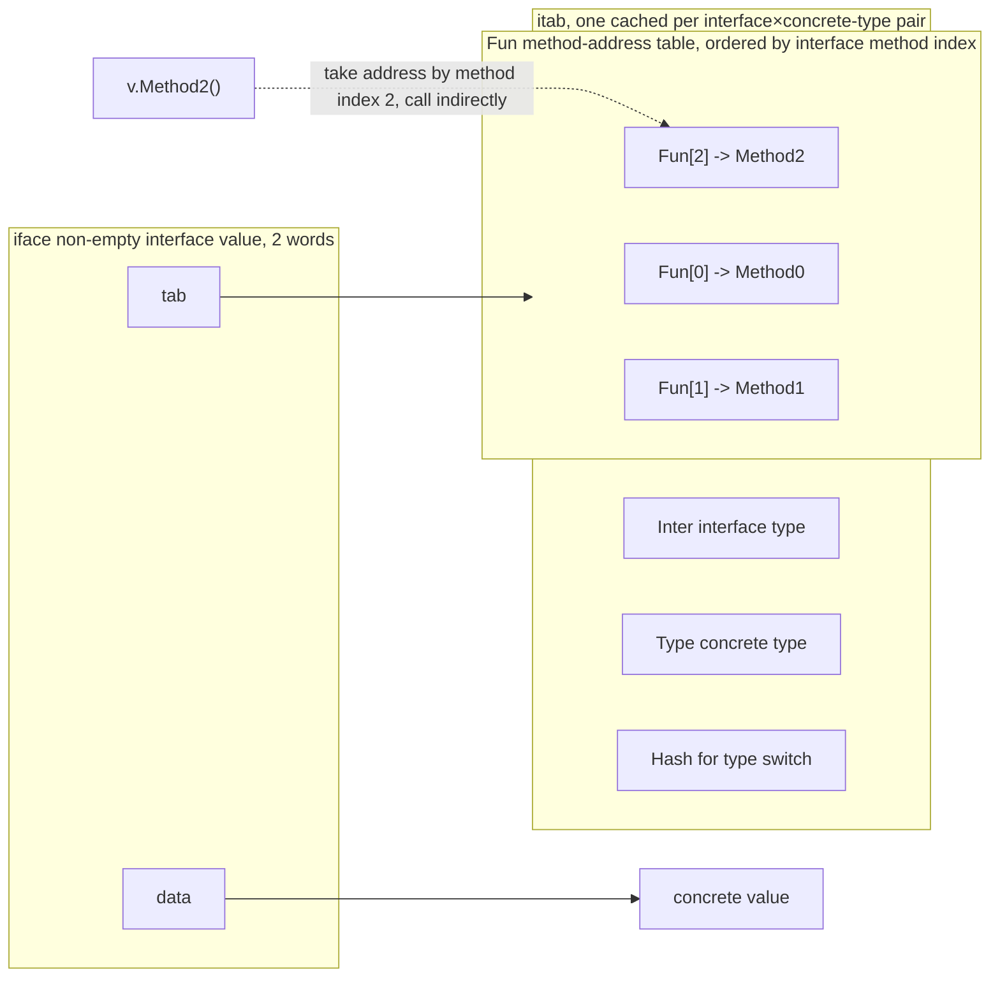

# 4.2 Interfaces

Interfaces are the soul of Go's type system. They decouple behavior from implementation, and they do it in an unusual way: structural, implicit satisfaction, unlike most mainstream languages. This section looks at how interfaces are represented at runtime, how methods are dispatched dynamically, how type assertions are realized, and where this design sits within the broader lineage of polymorphism. Following the approach of the previous sections, the structs given below are **trimmed-down sketches**: they keep only the fields relevant to the design, with comments explaining why each one exists. For the full definitions, compare against `runtime/runtime2.go`, `internal/abi/iface.go`, and `runtime/iface.go`.

## 4.2.1 Two Representations: iface and eface

An interface value is always **two words wide** at runtime, but comes in two kinds. An interface with methods (a **non-empty interface**) uses `iface`: a pointer to an `itab` plus a pointer to the concrete data. The empty interface `interface{}` (that is, `any`) uses `eface`: a pointer to the type information `_type` plus a data pointer. The empty interface has no methods and needs no method table, so it stores the type directly, saving one level of indirection:

```go
// Non-empty interface: has methods, hence needs the method table itab (sketch)
type iface struct {
    tab  *itab          // method table for interface type × concrete type (holds the dynamic type and the Fun table)
    data unsafe.Pointer // points to the concrete value (a pointer to a heap/stack copy when larger than one word or when its address is needed)
}

// Empty interface any: no methods, attaches type info directly (sketch)
type eface struct {
    _type *_type        // dynamic type of the concrete value
    data  unsafe.Pointer
}
```

`data` holds a pointer rather than the value itself. Put an `int` into an interface, and the runtime boxes it into a piece of addressable memory, then points `data` there. This is where the performance intuition that "interfaces introduce an allocation" comes from. The two-word representation is the bedrock for understanding everything that follows: dynamic dispatch, type assertions, and even the nil trap below are all direct corollaries of it.

## 4.2.2 The Typed nil: A Direct Corollary of the Two-Word Representation

An interface value **equals nil** if and only if **both words, the type and the data, are nil**. As soon as the dynamic-type word is filled in, the interface is not equal to nil, even if the data pointer is nil. Stated abstractly the rule sounds simple, but in code it becomes the famous "typed nil" trap:

```go
type MyErr struct{}
func (*MyErr) Error() string { return "boom" }

func do() error {
    var p *MyErr = nil // a concrete pointer whose value is nil
    return p           // packed into the error interface: type word = *MyErr, data word = nil
}

func main() {
    if err := do(); err != nil {
        // We enter here! err's type word is non-nil, so err != nil,
        // even though the pointer it wraps is nil.
        fmt.Println("non-nil:", err)
    }
}
```

In the `error` returned by `do`, `tab` points to the itab for "`error` × `*MyErr`" (non-nil), and only `data` is that nil pointer. The interface is therefore non-nil. This pitfall is especially common when a function signature returns `error`: the correct approach is to `return nil` explicitly, rather than returning a concrete pointer that happens to be nil. Once you understand the two-word representation from 4.2.1, this pitfall is no longer mysterious. It is not a special case but an inevitable consequence of the rule.

## 4.2.3 itab: The Method Table and Dynamic Dispatch

The `itab` (interface table) is the core of a non-empty interface. It is cached **per pair of "interface type × concrete type"**, recording the interface type, the concrete type, a type hash, and most importantly the **`Fun` method-address table**:

```go
// itab: the method table for a pair "interface × concrete type" (sketch, compare against internal/abi/iface.go)
type ITab struct {
    Inter *InterfaceType // interface type (which methods are required, and in what order)
    Type  *Type          // concrete type (the dynamic type)
    Hash  uint32         // a copy of Type.Hash, used by type switch (see 4.2.5)
    Fun   [1]uintptr     // variable length: addresses of the concrete type's implementations of each interface method; Fun[0]==0 means not implemented
}
```



The order of the `Fun` table is fixed by the **interface** (the lexicographic order of the interface's declared methods), independent of how the concrete type is written. This is precisely the mechanism of dynamic dispatch: the compiler knows at compile time the index of a given method within the interface, and at call time it only needs to fetch the address from `Fun` by that index and jump indirectly. Suppose the second method of interface `I` is `Method2`, then

```go
var v I = concrete{}
v.Method2(args)
// roughly equivalent to (pseudocode):
//   fn := v.tab.Fun[2]          // index 2 fixed at compile time, address known only at runtime
//   call fn(v.data, args)       // data passed in as the implicit receiver
```

The index is static, the address is dynamic, and that is **dynamic dispatch**: at the same call site, when `v` holds a different concrete type, it jumps to different code. Constructing an `itab` (`getitab`) is not cheap: it must check one by one whether the concrete type implements every method the interface requires, and fill in the whole `Fun` table. So the runtime uses a global hash table `itabTable` to cache constructed itabs, so the same "interface × type" pair is computed only once. The fast path of `getitab` is **lock-free**: it first uses `inter.Type.Hash ^ typ.Hash` as the hash to call `itabTable.find`, and returns on a hit (the overwhelming majority of cases); only on a miss does it take a lock, construct, and `itabAdd` to write back. There is another class of itab generated statically by the compiler (the "interface × type" pairs used by the type switches that appear in the program), filled into the table in advance during `itabsinit`.

## 4.2.4 Structural Satisfaction: The Cost and Benefit of Decoupling

Making an indirect call through a method table is, in essence, the same mechanism as the C++ virtual function table (vtable). What truly sets Go apart is that **interface satisfaction is structural and implicit**: a type automatically satisfies an interface as long as it has the method set the interface requires, without having to declare `implements` explicitly the way Java/C# do. This is the choice of **structural typing** over **nominal typing**.

The benefit is decoupling. You can define an interface that someone else's type, or even a standard-library type, happens to satisfy, without changing a single line of those types. The ecosystem of "small interfaces fitting everywhere" such as `io.Reader`/`io.Writer` springs from this: `bytes.Buffer`, `os.File`, and `net.Conn` none declare that they implement `io.Reader`, yet all of them can be caught by any function that accepts an `io.Reader`. Interface and implementation evolve independently at each end, aligned naturally in the middle by the method set.

The cost has two sides. First, implicit satisfaction makes "who implements what" no longer obvious at a glance, requiring tooling or reading to confirm (which is also why the compile-time assertion idiom `var _ io.Reader = (*T)(nil)` exists). Second, interface calls are indirect: the `Fun[n]` address fetch plus indirect jump from 4.2.3 generally cannot be inlined by the compiler across the interface boundary, so it loses the optimization that inlining could have provided. For a small method called frequently on a hot path, going through an interface versus going through the concrete type can differ in performance by a noticeable margin. Abstraction never comes for free: it buys flexibility, paid for with this bit of runtime indirection.

## 4.2.5 Type Assertions and Type Switch

`x.(T)` asserts the dynamic type of an interface. Its implementation depends on what `T` is:

- When `T` is a **concrete type**, the assertion degenerates into "compare whether the dynamic-type word in the interface and `T` are the same `_type`", a single pointer comparison.
- When `T` is **another interface** (`x.(SomeInterface)`), what is wanted is "whether `x`'s dynamic type satisfies `SomeInterface`", which requires computing or looking up an itab on the spot, exactly the `getitab` path from 4.2.3 (with the `canfail` flag, failure returns nil rather than panicking).

A **type switch** `switch v := x.(type)` uses `itab.Hash` (the copy of the dynamic type hash) for fast branching: it first roughly screens cases by hash, then precisely compares types. Two different hashes must be kept apart here: `itab.Hash` is a copy of `Type.Hash`, serving the **type switch**, carried by the itabs the compiler statically generates for the switches that appear in the program; whereas `itabTable`'s own table lookup uses a different hash, `inter.Type.Hash ^ typ.Hash`. An itab constructed dynamically at runtime has its `Hash` field set to 0, because such itabs never participate in a type switch. This explains a performance intuition: frequent interface assertions, especially the kind that asserts to an interface, and large type switches, are not zero-cost and deserve attention on hot paths.

## 4.2.6 Method Sets: Value or Pointer

Whether an interface holds a value or a pointer is determined by the **method-set rule**, which is also an extension of the two-word representation from 4.2.1: methods with a pointer receiver are **not** in the method set of a value.

```go
type T struct{}
func (t T)  Read() {}   // value receiver: both T and *T have it
func (t *T) Write() {}  // pointer receiver: only *T has it

type ReadWriter interface { Read(); Write() }

var _ ReadWriter = &T{} // OK: *T has both Read and Write
var _ ReadWriter = T{}  // compile error: T's method set lacks Write
```

The reason is not hard to see: calling a method with a pointer receiver requires obtaining the receiver's address, but if the interface holds a copy of a value, that copy may not be addressable, so the language simply excludes such methods from the value's method set. This rule is not a syntactic detail but the boundary of "what can actually be put into an interface", and like the typed nil, it is a direct corollary of the underlying representation.

## 4.2.7 Design Trade-offs: Small Interfaces and "Accept Interfaces, Return Structs"

Go's interface philosophy condenses into a few community maxims, and they are not stylistic preferences but engineering conclusions of the mechanism above.

**"The smaller the interface, the better"**: single-method interfaces (`io.Reader` and the like) are the easiest to satisfy and the easiest to compose. Rob Pike's phrasing is "The bigger the interface, the weaker the abstraction": the bigger the interface, the fewer types can satisfy it, and the thinner the decoupling benefit. **"Accept interfaces, return structs"**: use interfaces for function parameters for generality, letting the caller freely substitute implementations; use concrete types for return values, to avoid premature abstraction and to let the caller obtain the full set of capabilities rather than a view pruned by an interface. Add the typed nil of 4.2.2 and the value-versus-pointer method sets of 4.2.6, and these few points together form the common sense you cannot avoid when writing Go interfaces. Their shared undertone is: an interface is a lightweight abstraction meant for decoupling, keep it as small as you can, and abstract as late as you can.

## 4.2.8 Cross-Language Comparison

Polymorphism is realized in different ways across languages, and putting Go into this table makes its trade-offs clear:

| Language/Mechanism | Dispatch | Satisfaction | Runtime Representation | Notes |
|---|---|---|---|---|
| Go interface | dynamic (itab method table) | structural, implicit | iface = 2 words (itab pointer + data pointer) | isomorphic to vtable, but non-intrusive |
| C++ virtual functions | dynamic (vtable) | nominal, intrusive (must inherit a base class) | object embeds a vptr pointing to the class's vtable | a close relative of the itab mechanism |
| Rust trait | static (generic monomorphization, zero-cost) or dynamic (`dyn Trait`) | nominal, explicit `impl` | `dyn` is a fat pointer = data pointer + vtable pointer | `dyn Trait` is very much like Go's iface |
| Haskell type class | dictionary passing | nominal, `instance` declaration | an instance = a method dictionary, passed implicitly at the call site | same origin as Go's generics implementation (see below) |
| Java/C# interface | dynamic (interface method table) | nominal, explicit `implements` | object header + method table; the JIT optimizes with inline caches | virtual calls are sped up by runtime deoptimization/inline caches |

The Haskell line is worth singling out: type classes are implemented with **dictionary passing**, where an instance is a method dictionary passed implicitly at the call site. This is precisely the "compile-time version" of the interface itab, and it is the same idea used in the implementation of Go generics ([8 Generics](../ch08generics)). Type classes and dictionaries are two ends of the same concept, one end at runtime (the interface itab) and the other at compile time (the generic dictionary). Go's distinctiveness is combining "vtable-style efficient dynamic dispatch" with "the loose coupling of structural, implicit satisfaction": it wants both a concrete runtime representation and lightweight decoupling when writing code. Once you understand iface/itab, you understand how this combination is realized.

## Further Reading

1. Russ Cox. *Go Data Structures: Interfaces.* 2009.
   https://research.swtch.com/interfaces (a classic exposition of the iface/itab representation)
2. The Go Authors. *runtime/iface.go, internal/abi/iface.go, runtime/runtime2.go*
   (iface/eface/itab, getitab, itabTable).
   https://github.com/golang/go/blob/master/src/runtime/iface.go
3. Luca Cardelli, Peter Wegner. "On Understanding Types, Data Abstraction, and
   Polymorphism." *ACM Computing Surveys*, 17(4), 1985.
   https://doi.org/10.1145/6041.6042 (a foundational survey of polymorphism and type abstraction)
4. Philip Wadler, Stephen Blott. "How to Make ad-hoc Polymorphism Less ad hoc."
   *POPL 1989*. https://doi.org/10.1145/75277.75283 (type classes and dictionary passing)
5. Rob Pike. *Go Proverbs* ("The bigger the interface, the weaker the abstraction").
   https://go-proverbs.github.io/
6. The Go Authors. *The Go Programming Language Specification: Interface types.*
   https://go.dev/ref/spec#Interface_types (the spec definition of structural satisfaction and method sets)
7. The Rust Project. *The Rust Reference: Trait objects (`dyn Trait`).*
   https://doc.rust-lang.org/reference/types/trait-object.html (the fat-pointer representation of dynamic dispatch)
