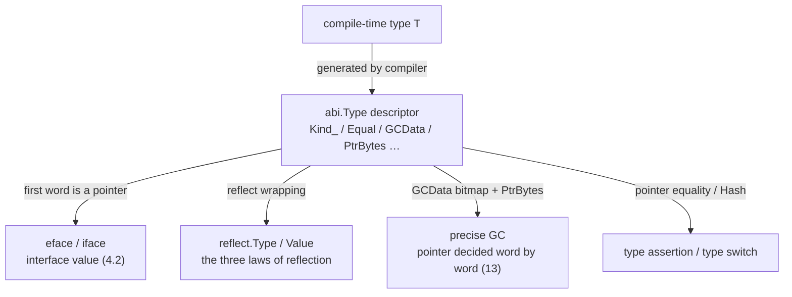

# 4.1 The Runtime Type System

Go is a statically typed language, and type checking happens at compile time. Yet Go still keeps a substantial amount of **runtime type information** (RTTI), and it is precisely this that supports interfaces ([4.2](./interface.md)), type assertions, type switches, reflection, and the garbage collector's precise identification of pointers. This section answers a seemingly simple question: of the type machinery that exists at compile time, what survives into the runtime, in what form is it kept, and what capabilities does it underpin. Once you understand the small structure called the **type descriptor** in this section, the interface ([4.2](./interface.md)), reflection, and precise GC ([13](../../part4memory/ch13gc)) all gain a common footing.

The structs given below are all **trimmed sketches**: they keep only the fields relevant to the design, with comments explaining why each one exists. For the full definitions, refer to go1.26's `internal/abi/type.go` and the `reflect` package.

## 4.1.1 Every Type Has a Descriptor

The compiler generates one **type descriptor** for **every type** used in a program. In go1.26's source it is called `abi.Type`, and the runtime internally keeps the old name `_type`. The descriptor is compiled into the read-only data section and stays resident and unchanged for the whole life of the program. The same type usually has only one descriptor within a program, a point we will use later when deciding whether two types are the same.

```go
// abi.Type: the runtime representation of a type (trimmed sketch)
type Type struct {
    Size_       uintptr // how many bytes a value of this type occupies; allocation and copying both need it
    PtrBytes    uintptr // the first this-many bytes of the value may contain pointers; GC need only scan up to here
    Hash        uint32  // hash of the type; avoids recomputation during type switches and interface table lookups
    TFlag       TFlag   // flags: whether named, whether it carries UncommonType, whether the GC bitmap is generated on demand
    Align_      uint8   // alignment of a variable of this type
    FieldAlign_ uint8   // alignment when used as a struct field
    Kind_       Kind    // kind: int, struct, slice, chan… determines how to interpret this block of memory
    // compare whether two values of this type are equal: (ptr to A, ptr to B) -> ==?
    // the compiler synthesizes it from the type's structure; maps, interface comparison, and the == operator all fall to it
    Equal func(unsafe.Pointer, unsafe.Pointer) bool
    // GC pointer bitmap: marks which words of this type are pointers, by which precise GC scans
    GCData    *byte
    Str       NameOff // offset of the type name in the name table (the readable name is resolved on demand)
    PtrToThis TypeOff // offset to the «*T» descriptor, reused when constructing a pointer type
}
```

Each field exists for some runtime capability; let us pick out a few that matter. `Size_` is what the allocator ([12](../../part4memory/ch12alloc)) and value copying rely on. `Kind_` is an enum that tells the runtime "interpret this block of memory as which type"; its values are a finite set of roughly two dozen basic kinds:

```go
type Kind uint8

const (
    Invalid Kind = iota
    Bool
    Int
    Int8
    // … the remaining integer, floating-point, and complex kinds omitted …
    Array
    Chan
    Func
    Interface
    Map
    Pointer
    Slice
    String
    Struct
    UnsafePointer
)
```

`Kind` only distinguishes down to "kind", not the specific type: the `Kind` of both `type Celsius float64` and `float64` is `Float64`, yet they are two different descriptors ([4.1.3](#413-nominal-types-and-type-identity)). `Equal` is the equality function the compiler synthesizes for the type; a map's key comparison, interface value comparison, and the `==` operator all ultimately fall to it. When `TFlagRegularMemory` is set, the whole value is one contiguous stretch of memory with no internal padding, and the comparison degenerates into a single `memequal` with no need to recurse field by field.

A named type with methods also carries a stretch of `UncommonType` right after the descriptor (marked by `TFlagUncommon`), recording the method table; and struct, slice, map, func, and the like each have an "extended descriptor" (such as `StructType`, `SliceType`) that embeds `Type` at its head, adding information like the element type and the field list. In other words, `abi.Type` is the **common prefix** shared by all type descriptors: the runtime first reads `Kind_` to identify the kind, then casts the pointer to the corresponding extended type to read further fields.

## 4.1.2 The Bridge from Compile Time to Runtime

The point of the type descriptor is that it is the sole carrier that moves "the compile-time type" into the runtime. Its most direct use is the empty interface. `any` (that is, `interface{}`) is, at runtime, a pair of pointers:

```go
// runtime layout of the empty interface (abi.EmptyInterface sketch)
type EmptyInterface struct {
    Type *Type          // points to the descriptor of the dynamic type
    Data unsafe.Pointer // points to the actual data (for pointer-kind types the value is stored in this word; see 4.2)
}
```

When a concrete value is packed into an `any`, what the compiler does is: fill `Type` with the address of the type's descriptor, and fill `Data` with the address of the data. So the runtime question "what type is actually held in this interface" reduces to "read out the `Type` pointer and see which descriptor it points to". The type assertion `x.(T)` and the type switch are both built on this read: take the `Type` pointer (or its `Hash`) and compare against the target type. A non-empty interface with methods has one more layer, an `ITab` (interface method table); its dispatch mechanism is left to [4.2](./interface.md) for full discussion. Here it is enough to remember: whether empty interface or non-empty, the first word ultimately leads to an `abi.Type`.

This bridge narrows in one direction. At compile time, a type is a rich body of static information that can be inferred and checked; once across the bridge, all the runtime holds is this descriptor, plus a data pointer in the interface value. Everything Go can do at runtime that touches types, type assertions, reflection, GC scanning, is in essence working off these two limited things.

## 4.1.3 Nominal Types and Type Identity

Go's concrete types are **nominal**: a type's identity is determined by its declaration, not by its structure.

```go
type Celsius float64
type Fahrenheit float64

var c Celsius = 100
var f Fahrenheit = c // compile error: cannot assign Celsius to Fahrenheit
var x float64 = c    // also an error: Celsius is not float64
```

`Celsius` and `Fahrenheit` are both `float64` underneath, and all three have the `Kind` `Float64`, yet they are **three different descriptors** and cannot be directly assigned to one another. This barrier is not detected at runtime; it is rejected at compile time. Its value lies in making the semantics of "temperature" impossible to quietly misuse as "another kind of temperature" or "a bare float". The precise rules of type identity, when two types are the same, assignable, or convertible, are defined by the Types and Type identity sections of the language specification.

The way nominal identity is honored at runtime is remarkably concise: because a type usually has only one descriptor in a program, deciding whether two values are of the same type only requires comparing whether their descriptor pointers are equal, a single pointer comparison, with no need to compare structure field by field. To go faster, the type switch first compares the `Hash` (`uint32`); if the hashes differ the types must differ, sparing a pointer dereference.

Contrast this with interfaces, and you can see a deliberate division of labor in Go's type system. Concrete types use **nominal** identity, so `Celsius` will not be mistaken for `float64`; while interface satisfaction is **structural** ([4.2](./interface.md)), where a type automatically satisfies an interface as long as it has the method set the interface requires, with no need to explicitly declare "I implement it". Nominal identity guarantees clear boundaries for concrete types, while structural satisfaction guarantees the decoupling and composability of interfaces. Each kind of identity rule governs its own stretch, one of the reasons Go's type system is simple yet sufficient.

## 4.1.4 Reflection: Introspection Built on the Descriptor

The `reflect` package lets a program inspect and manipulate values of any type at runtime. It is not magic, but a layer of wrapping over those two words from [4.1.2](#412-the-bridge-from-compile-time-to-runtime): `reflect.Type` wraps `*abi.Type`, and `reflect.Value` holds both the type descriptor and the data pointer. In *The Laws of Reflection*, Russ Cox distills this relationship into three laws, and against the interface layout, each one lands on a concrete word.

```go
var x float64 = 3.4

// Law one: reflection objects come from interface values.
// the argument to TypeOf/ValueOf is any, which is in essence reading out the Type and Data of EmptyInterface.
t := reflect.TypeOf(x)  // t.Kind() == reflect.Float64, reading the descriptor's Kind_
v := reflect.ValueOf(x) // v holds both *abi.Type and the pointer to the data

// Law two: reflection objects can be restored back into interface values.
var i any = v.Interface() // reassemble Type and Data back into an interface

// Law three: to modify a reflection object, it must be settable.
p := reflect.ValueOf(&x).Elem() // obtain an addressable Value via a pointer
p.SetFloat(7.1)                 // x becomes 7.1; calling this on the non-addressable v would panic
```

The "settable" of the third law is not an extra rule but a consequence of the interface layout: what `reflect.ValueOf(x)` packs into the interface is a **copy** of `x`, and changing it would not touch the original variable, so reflection refuses to set it; only by first taking `&x` and then dereferencing with `Elem()` does the `Value` hold the address of the original variable, at which point setting becomes meaningful. Once you understand those two words of the interface, the three laws turn from "rules to be memorized" back into "corollaries of the layout".

Reflection is powerful, and the cost is real: it bypasses compile-time type checking, is slower than direct code, and a mistake only surfaces at runtime. Go's attitude is to avoid it when you can, reserving it for libraries like serialization (`encoding/json`) and ORMs that genuinely need to handle arbitrary types generically. The generics introduced in Go 1.18 ([8](../ch08generics)) are precisely meant to let a large class of generic code "that previously could only rely on reflection" regain compile-time type safety and zero reflection overhead.

## 4.1.5 The GC Pointer Bitmap: How the Descriptor Drives Precise Scanning

The `GCData` and `PtrBytes` in the descriptor are the lifeline of garbage collection ([13](../../part4memory/ch13gc)). Go uses **precise** GC: when scanning an object, the collector must know exactly which words are pointers and which are ordinary data, and must never mistake an integer that happens to look like an address for a pointer and chase it. This information about "which words are pointers" is supplied precisely by the type descriptor.

`GCData` usually points to a **pointer bitmap** (ptrmask): each bit corresponds to one word of the type, where 1 means pointer and 0 means non-pointer, and the bitmap's length covers at least up to `PtrBytes`. When the collector scans an object, it fetches this bitmap by the object's descriptor and decides bit by bit whether to follow through. `PtrBytes` gives an upper bound: the type's pointers can only appear within the first `PtrBytes` bytes, beyond which it is pure data, so the scan can stop there without walking the whole value. A struct whose tail is all a large array can thereby save considerable scanning.



go1.26 has an evolution here worth recording: the `TFlagGCMaskOnDemand` flag. Earlier, the pointer bitmap of every type was precomputed at compile time and baked into the binary, which would bloat the read-only section for programs with a great many types. With this flag set, `GCData` no longer points directly at the bitmap but is a `**byte`, and the real bitmap is **generated on demand** by the runtime the first time it is needed and then cached (see `getGCMask` in `runtime/type.go`), trading a little runtime computation for a smaller binary. This is a snapshot of the "descriptor" design still being polished continually: the interface is stable, but the storage strategy behind it evolves with each version.

This diagram pulls the previous sections together into one place: the compile-time type `T` narrows into a single `abi.Type`, and this descriptor is at once the common source of four lines, interface, reflection, GC, and type assertion. One small read-only structure underpins all of Go's runtime type capabilities.

## 4.1.6 Cross-Language Comparison: Shades of RTTI

"How much type information is kept at runtime" is a trade-off languages make very differently, and laying them out along this axis makes it clear where Go stands.

**Java and C#** are at the rich end. Every object on the heap carries a header pointing to class metadata, and at runtime one can obtain fields, methods, annotations, and even generic signatures through `Class` / `Type`; reflection is almost omnipotent, and this is the bedrock of their framework ecosystems (dependency injection, serialization, ORM, dynamic proxies). The cost is the metadata-pointer overhead on every object, plus the runtime cost of reflective calls.

**C++** is at the lean end, holding fast to "don't pay for what you don't use". By default it carries almost no runtime type information; only after RTTI is enabled do `typeid` and `dynamic_cast` become available in a limited way, and only for polymorphic types with virtual functions; for non-polymorphic types there is simply no way to query their true type at runtime.

**Rust** goes further, with **no** general-purpose runtime reflection. `std::any::Any` can only do limited downcasting through a `TypeId` and cannot obtain the structure of fields and methods. Rust hands genericity entirely to compile-time generics and traits, professing zero runtime cost; needs like serialization are met by `serde` generating code at compile time with procedural macros, rather than by runtime reflection.

Go lands in the middle, leaning toward "sufficient": it keeps enough runtime type information to support interfaces, type assertions, type switches, reflection, and precise GC, but does not hang rich metadata on every object the way Java does. It concentrates the information in a per-type unique descriptor; the object itself carries no type header, an ordinary value is bare data in memory, and type information is obtained indirectly through an interface or descriptor pointer. This trade-off echoes Go's consistent character: be simple, be sufficient, and leave just enough metadata for the few real runtime capabilities (precise GC, interface dispatch, reflection), no more and no less.

## Further Reading

1. Russ Cox. *The Laws of Reflection.* The Go Blog, 2011.
   https://go.dev/blog/laws-of-reflection
2. Russ Cox. *Go Data Structures: Interfaces.* 2009.
   https://research.swtch.com/interfaces
   (a prototype of the memory layout of interfaces and type descriptors)
3. The Go Authors. *internal/abi/type.go, internal/abi/iface.go* (go1.26 type descriptor and interface layout).
   https://github.com/golang/go/blob/master/src/internal/abi/type.go
4. The Go Authors. *runtime/type.go: getGCMask* (the GC pointer bitmap and the on-demand generation of `TFlagGCMaskOnDemand`).
   https://github.com/golang/go/blob/master/src/runtime/type.go
5. The Go Authors. *Package reflect.* https://pkg.go.dev/reflect
6. The Go Authors. *The Go Programming Language Specification: Types / Type identity.*
   https://go.dev/ref/spec#Types
7. Luca Cardelli, Peter Wegner. "On Understanding Types, Data Abstraction, and
   Polymorphism." *ACM Computing Surveys*, 17(4), 1985.
   https://doi.org/10.1145/6041.6042
