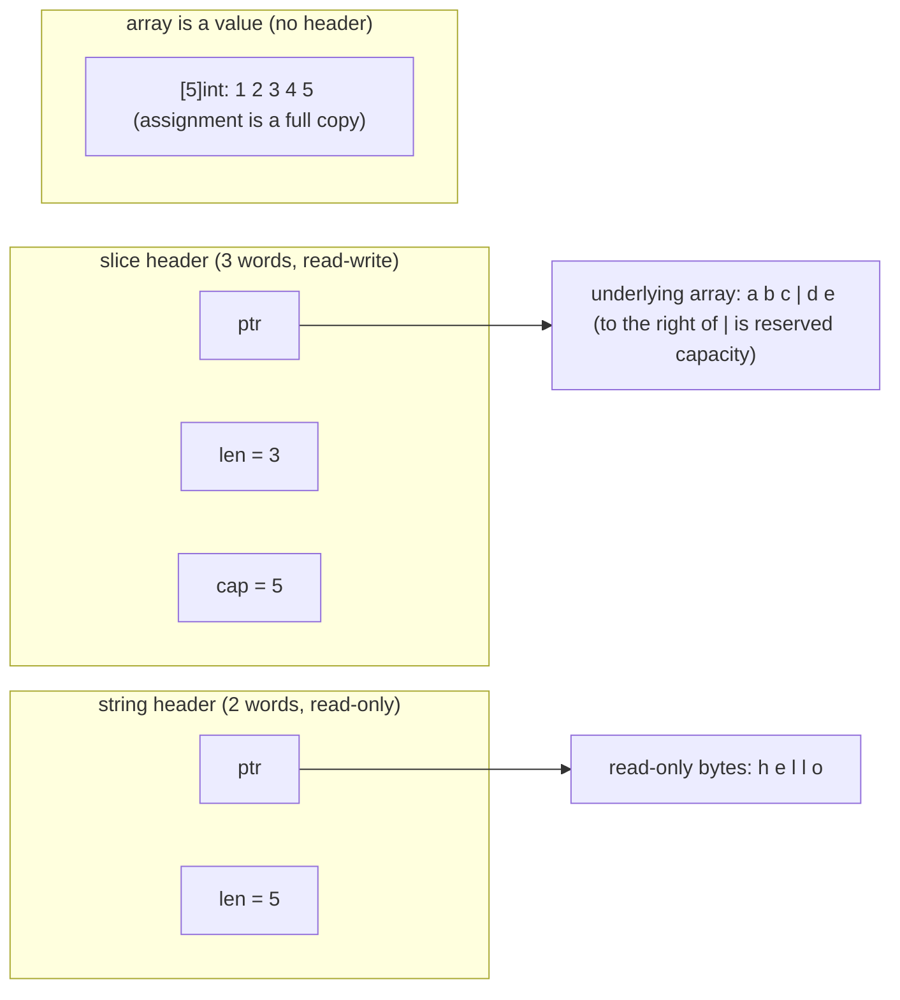

# 5.1 Arrays and Slices

Arrays and slices are the two most basic sequence types in Go. They look similar, yet their memory models differ, and grasping this one point explains in a single stroke all the "surprises" of append and the traps of slice aliasing. Both share a single theme: a small **header** describing a stretch of contiguous backing memory. The differences lie entirely in what the header holds and who owns that memory. This section first lays out the layout clearly, then starts from the classic abstraction of the "dynamic array" to see how Go's `append` achieves amortized $O(1)$, and finally lands on aliasing and cross-language comparison, the corners we run into day to day. Strings, though they share the same origin as slices, are immutable and form a category of their own; we leave them to [5.2](./string.md) for dedicated discussion.

## 5.1.1 Three Memory Layouts

**An array is a value.** A `[5]int` is just 5 `int`s laid out contiguously, and the length is part of the type: `[5]int` and `[6]int` are two different types. On assignment, passing as an argument, or as a struct field, an array is **copied in full**. For exactly this reason, large arrays are actually rarely used in Go; passing them around is too expensive, and when you really need to pass one you usually pass its slice or a pointer.

**A slice is a view onto some stretch of an underlying array.** In the runtime it is a three-word header, which you can check against `runtime/slice.go`:

```go
// runtime: the runtime representation of a slice (slice.go)
type slice struct {
    array unsafe.Pointer // points to the first element of this slice in the underlying array
    len   int            // length: number of visible elements
    cap   int            // capacity: number of elements from array to the end of the underlying array
}
```

`len` is the range you can index into, and `cap` is "how far it can still grow without reallocating." Separating the two is exactly the key to a slice being able to act as a "view": `s[1:3]` only changes the three fields in the header, without touching the underlying array.

**A string is a read-only byte sequence.** Its header is more frugal, only two words, with no `cap`:

```go
// runtime: the runtime representation of a string (string.go)
type stringStruct struct {
    str unsafe.Pointer // points to read-only bytes
    len int            // number of bytes (not number of runes)
}
```

The missing `cap` is not an oversight but a design: a string is **immutable**, its length never grows once fixed, and so it naturally needs no capacity. Immutability buys three good things: multiple strings can safely share the same stretch of underlying bytes, the substring `s[i:j]` needs no copy, and a string can serve directly as a map key without defensive copying. The cost is that any "modification" must produce a new string. For the details of string conversion and zero-copy, see [5.2](./string.md).

Drawing the three side by side, the differences are plain at a glance:



An array has no header; it **is** that stretch of memory. A slice and a string, by contrast, are "a header plus memory elsewhere." This one sentence is the root of all the behavior that follows.

## 5.1.2 Dynamic Arrays and Amortized Analysis

A slice is the Go incarnation of the **dynamic array**: a contiguous array that grows on demand. The core guarantee it gives is that, even though it occasionally has to reallocate and relocate all elements, the **amortized** cost of $n$ consecutive `append`s is still $O(1)$ per operation.

The intuition comes from "geometric growth." Suppose that every time the capacity fills up we multiply by a constant factor $g>1$ (the simplest is $g=2$, doubling). Viewing the $n$ appends as a whole, the only truly expensive ones are the few that trigger relocation, and the relocation sizes shrink as a geometric series. From empty to $n$, the number of elements moved by each relocation is roughly $\dots, n/4, n/2, n$, and summing in reverse:

$$
\sum_{i=0}^{\infty} \frac{n}{2^i} = n + \frac{n}{2} + \frac{n}{4} + \cdots < 2n
$$

The total relocation cost is bounded by $2n$, and adding the $O(n)$ of the $n$ "write the new element" operations themselves, the $n$ appends total $O(n)$, **which amortized over each one is a constant**. This is a textbook example of amortized analysis in *Introduction to Algorithms*, and both the aggregate method and the potential method give the same bound.

The key is that the factor must be **multiplicative**. If instead we "reserve only a fixed $c$ extra slots each time," the $k$-th expansion has to move about $kc$ elements, the total cost is $\sum kc = \Theta(n^2)$, and amortized each one degrades to $O(n)$. A single constant factor separates linear from quadratic. The amortized constant bought by multiplicative growth comes at the cost of about $g/2$ times the wasted space on average (when doubling, the worst-case idle space approaches half), and this is precisely the eternal space-versus-time dispute over the growth factor ([5.1.5](#515-cross-language-comparison) will show the different answers each gives).

## 5.1.3 append's Growth Strategy

In theory "multiply by a constant factor" is enough; in engineering Go does it more finely. The core is in `runtime.growslice`, which first uses `nextslicecap` to compute a target capacity, then hands it to the memory allocator for alignment. First look at the capacity computation (compare against go1.26's `runtime/slice.go`):

```go
// runtime: compute the new capacity (slice.go, comments abridged)
func nextslicecap(newLen, oldCap int) int {
    newcap := oldCap
    doublecap := newcap + newcap
    if newLen > doublecap {
        return newLen          // a single append asks for too much, give it the needed length directly
    }
    const threshold = 256
    if oldCap < threshold {
        return doublecap       // small slice: double
    }
    for {
        // transition smoothly from 2x to about 1.25x: large slices care more about saving memory
        newcap += (newcap + 3*threshold) >> 2
        if uint(newcap) >= uint(newLen) {
            break
        }
    }
    return newcap
}
```

The strategy uses **256** as the boundary. When the old capacity is below 256 it doubles, so small slices grow aggressively, aiming to relocate fewer times. On reaching or exceeding 256, it switches to `newcap += (newcap + 3*256) >> 2`, that is, each round adds about $\tfrac{1}{4}(\text{newcap} + 768)$. When `newcap` is still small, the constant term $\tfrac{3}{4}\cdot256$ is a large share and the multiplier is close to 2; when `newcap` is large the constant term is negligible and the multiplier tends to $1 + \tfrac14 = 1.25$. The result is a curve that **slides continuously from 2x toward 1.25x**, rounder than the pre-Go-1.18 "hard jump from 2x to 1.25x at 1024," avoiding the capacity waste near the critical point.

The computed `newcap` is not the end. `growslice` then hands "`newcap × element size`" to `roundupsize` to round up to the memory allocator's **size class** (see [12 The Memory Allocator](../../part4memory/ch12alloc)), then derives the number of elements back from the aligned byte count:

```go
// runtime: align by size class in growslice (slice.go, taking pointer-sized elements as the example)
capmem = roundupsize(uintptr(newcap)*goarch.PtrSize, noscan)
newcap = int(capmem / goarch.PtrSize) // cap is "stretched" to the size-class boundary
```

So a slice's actual `cap` is often slightly larger than what you compute in your head. It is the composite result of two steps, "multiplicative growth plus size-class alignment": the former guarantees amortized $O(1)$, and the latter incidentally hands back to you the bit of scrap the allocator was going to waste anyway. This explains that common puzzle, **why `cap` after append is precisely this number**: there is no need to memorize it, just understand these two steps.

## 5.1.4 Aliasing and Those "Surprises"

A slice is a view, and multiple slices can share the same stretch of underlying array. This is the source of performance, and also the source of bugs.

**`append` may or may not share the underlying array.** This is the trap most often stepped on. If append does not exceed `cap`, the returned slice **shares** the underlying array with the original, and a write to one side's element shows through to the other; once it exceeds `cap` and triggers a reallocation, the two **part ways** from then on:

```go
a := make([]int, 3, 5) // len=3, cap=5
b := append(a, 1)      // did not exceed cap: b shares the underlying array with a
b[0] = 99              // a[0] becomes 99 too
c := append(b, 2, 3, 4) // exceeds cap=5: c is reallocated, decoupled from a/b
c[0] = 7               // a/b are unaffected
```

"Sometimes shared, sometimes not" makes function boundaries dangerous: pass a slice into a function, have the function append to it, and whether the slice on the outside sees the change depends on the `cap` at that moment. The **full slice expression** `a[lo:hi:max]` is the tool that addresses the root cause; it explicitly caps the new slice's `cap` at `max`, so that the next append must overflow, must copy, and must sever the aliasing:

```go
// a library function returns a view of an internal buffer, but does not want the caller
// to tamper with subsequent memory by borrowing append:
view := buf[off : off+n : off+n] // cap == len, the caller's append triggers a copy
```

**Memory leaks caused by sub-slicing.** As long as a slice header stays alive, the **entire** underlying array it points to cannot be reclaimed, even if you only need the first ten elements:

```go
small := big[:10] // small's cap still covers the entire underlying array of big
// as long as small is reachable, that (possibly large) block of big stays pinned
```

When you need to hold a small segment for a long time, you should `copy` out an independent copy, or use the standard library's `slices.Clone` to sever the reference. The `slices` package since Go 1.21 makes these operations explicit and readable, and even takes care of details that are easy to miss, such as "after deleting elements, zero out the tail so the GC can reclaim it":

```go
// after slices.Delete removes [i,j), it zeroes the freed tail to avoid dangling references pinning objects
func Delete[S ~[]E, E any](s S, i, j int) S {
    // ...
    s = append(s[:i], s[j:]...)
    clear(s[len(s):oldlen]) // the key: zero/clear the discarded elements, helping the GC
    return s
}
```

Deleting an element by hand with `s = append(s[:i], s[i+1:]...)`, missing this one `clear`, leaves the "deleted" pointers still in the tail of the underlying array, still seen as alive by the GC, which is another hidden leak. When you can use `slices`, don't hand-write it.

## 5.1.5 Cross-Language Comparison

The dynamic array is a universal abstraction. C++'s `std::vector`, Rust's `Vec<T>`, Python's `list`, Java's `ArrayList` are all in essence amortized $O(1)$ geometrically growing arrays. The differences concentrate on two points: the **growth factor** and the **view**.

The growth factor is each language's different answer to that space-versus-time dispute. Most C++ standard library implementations use 2x (libstdc++) or 1.5x (MSVC; the benefit of 1.5x is that the sum of memory freed across past expansions has a chance to be reused for the next allocation); Python's `list` uses about 1.125x, growing conservatively and being more memory-frugal in steady state; Java's `ArrayList` is 1.5x. Go uses the curve from [5.1.3](#513-appends-growth-strategy) that slides from 2 toward 1.25. The smaller the factor, the more memory-frugal and the more frequent the relocations; the larger, the fewer relocations and the more memory-hungry. There is no universal optimum, only a trade-off for each one's typical workload.

On the view dimension, Go's slice and Rust's `&[T]` (slice) are the same kind of thing: a "fat pointer" pointing to a segment of someone else's array (ptr + len, and Go carries an extra cap), referencing a sub-segment with zero copy, owning no memory of its own. Whereas `std::vector`, `Vec`, `list`, and `ArrayList` are **owning** containers; they hold and are responsible for releasing the underlying memory. C++ did not split the view out into `std::span` until C++20, while Rust from the start drew the line at the type level between "the owned `Vec`" and "the borrowed `&[T]`," using the borrow checker to block aliasing writes at compile time. Go chose another path: unifying "the owned dynamic array" (the underlying array) and the "view" (the slice) into a single slice type, gaining the language's simplicity at the cost of exactly those aliasing traps in [5.1.4](#514-aliasing-and-those-surprises). Between simplicity and safety, Go this time placed the weight on the simplicity side, and handed the discipline of aliasing back to the programmer.

## Further Reading

1. Thomas H. Cormen, Charles E. Leiserson, Ronald L. Rivest, Clifford Stein.
   *Introduction to Algorithms*, 4th ed., MIT Press, 2022. Chapter 16 "Amortized Analysis" and
   table doubling of dynamic tables, the source of this section's amortized bound.
2. The Go Authors. *runtime/slice.go: `growslice` / `nextslicecap`* (go1.26 growth strategy).
   https://github.com/golang/go/blob/master/src/runtime/slice.go
3. Andrew Gerrand. *Go Slices: usage and internals.* The Go Blog, 2011.
   https://go.dev/blog/slices-intro
4. Rob Pike. *Arrays, slices (and strings): The mechanics of 'append'.* The Go Blog, 2013.
   https://go.dev/blog/slices
5. The Go Authors. *`slices` package documentation* (Go 1.21, `Clone` / `Delete` / `Insert` / `Grow`).
   https://pkg.go.dev/slices
6. The Go Authors. *Go specification: Slice expressions* (including the full slice expression `a[lo:hi:max]`).
   https://go.dev/ref/spec#Slice_expressions
