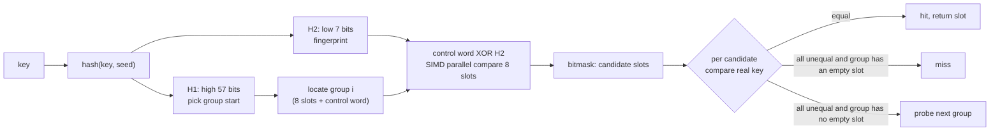
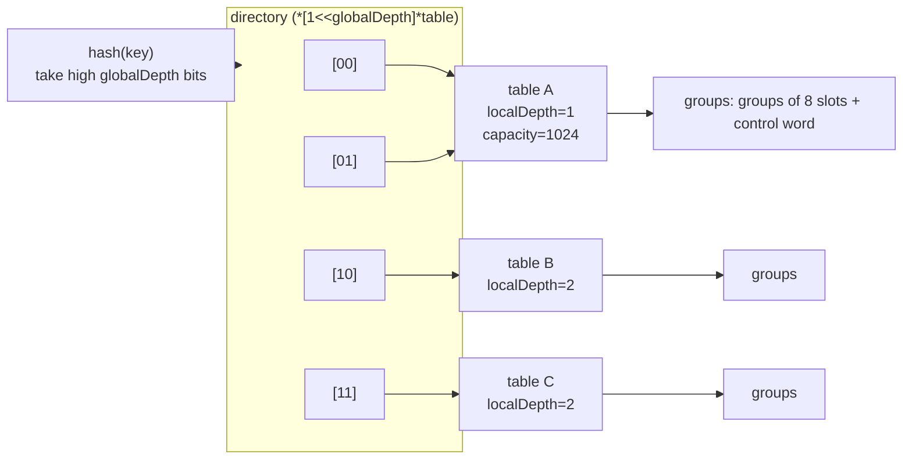

# 5.4 Swiss Table and the Go 1.24 Implementation

[5.3](./map.md) laid out the general principles of hash tables and the attack-and-defense around them: the two routes for handling collisions, and the defense against hash flooding. This section comes down to Go's own two generations of implementation. We first open up Swiss Table, a modern open-addressing design, then look at how Go 1.24 brought it to ground and what it replaced in the process, then derive from the implementation two language rules that follow from it, and finally place Go within the larger picture of the various hash tables out there.

## 5.4.1 The Swiss Table design (abseil)

Swiss Table was proposed by Google's abseil team and presented publicly by Kulukundis at CppCon 2017. It is a modern incarnation of open addressing, and its core innovation is to turn "which slot is empty, and which slot should be compared" from a slot-by-slot probe into a single parallel operation.

It splits the hash value into two parts: the high 57 bits **H1** decide which group to start probing from, and the low 7 bits **H2** serve as that key's "fingerprint." Slots are arranged in groups of 8, and each group is paired with an 8-byte **control word**, in which each control byte corresponds to one slot in the group:

```
empty      empty    1000 0000   (0x80)
tombstone  deleted  1111 1110   (0xfe)
occupied   full     0hhh hhhh   (top bit 0, low 7 bits are the key's H2 fingerprint)
```

The top bit distinguishes "empty/tombstone" from "occupied," and an occupied slot stores the fingerprint directly in its low 7 bits. To look up a key, we first compute H1 to locate the starting group, then compare H2 against all 8 control bytes of the group in parallel: on machines with SIMD support, this is a single `PCMPEQB` instruction (16 bytes can even compare 16 slots), completing in one step what would otherwise be 8 steps of probing. The comparison result is a bitmask that marks which slots have a matching fingerprint; we then check the real key in each candidate slot one by one. The fingerprint is only 7 bits, so there is roughly a $1/128 \approx 0.7\%$ chance of a false positive, but since a full key comparison always follows a match, a false positive just means an occasional extra comparison and does not affect correctness.



The control word also reduces two other high-frequency decisions to a single bit operation each: "does this group have an empty slot" (`matchEmpty`, which decides when probing stops), and "which slots are empty or deleted" (`matchEmptyOrDeleted`, used to find a landing spot on insertion). These are all SWAR (SIMD Within A Register) tricks over the 8-byte control word, so even on platforms without vector instructions they amount to just a few ordinary integer adds, subtracts, and bit operations.

## 5.4.2 The Go 1.24 Swiss Table rewrite

### The classic bucketed design (1.0 through 1.23)

To understand the rewrite, we first look at what it replaced. Since Go 1.0, Go used a form of bucketed chaining. At the top is `hmap`, which holds an array of $2^B$ buckets; each bucket `bmap` stores 8 key-value pairs plus 8 `tophash` values (the high 8 bits of the hash, acting as a fingerprint to speed past non-matching slots); once a bucket fills up, an overflow bucket is hung off it, and collisions are absorbed by the overflow chain.

```go
// runtime/map.go (go1.23): the top-level structure of the classic bucketed map (sketch)
type hmap struct {
	count     int            // number of elements, read directly by len()
	B         uint8          // number of buckets = 2^B
	hash0     uint32         // hash seed
	buckets    unsafe.Pointer // array of 2^B buckets
	oldbuckets unsafe.Pointer // old bucket array during growth, source of incremental migration
	nevacuate  uintptr        // migration progress: old buckets with index below it are migrated
	extra     *mapextra       // overflow bucket bookkeeping, etc.
}

type bmap struct {
	tophash [8]uint8 // high 8 bits of each slot's hash, also serves as migration-state marker
	// followed by 8 keys, 8 elems, then an *overflow pointer (laid out by the compiler per type)
}
```

Its load factor cap is $6.5/8 \approx 0.81$ (the source expresses it as `loadFactorNum/loadFactorDen`, that is $13/2$, which for an 8-slot bucket means "6.5 per bucket on average"). Once exceeded, it doubles in size, and uses **incremental migration**: instead of rearranging all elements at once, it leaves the old bucket array in `oldbuckets` and migrates one or two buckets as a side effect of each write operation, spreading the cost of growth over subsequent operations and avoiding a long pause on a single insertion. This design served robustly for fourteen years, and its pain points are clear too: keys/values and fingerprints are stored separately, so a comparison first scans `tophash` and then jumps to the key, with non-contiguous memory access; the overflow chain degrades under high load; and the linked-list overflow buckets are cache-unfriendly.

### Bringing Swiss Table to ground: from one table to a directory

Go 1.24's new implementation lives in `internal/runtime/maps`. It copies abseil's control word and parallel probing wholesale, then reworks it to meet two extra requirements specific to Go: first, it must support incremental growth like the old version did, to avoid long pauses when a large `map` grows; second, the `map` itself must be precisely scannable by the GC. The difficulty is that open addressing's probe sequence depends on the number of groups, and once the number of groups doubles, every element in the whole table has to be rearranged according to the new sequence, which is inherently in tension with "incremental." The original abseil grows the whole table, and Go cannot copy that directly.

Go's solution is **extendible hashing**: split a large `map` into multiple independent `table`s, each of which is a complete small Swiss Table serving only one subrange of the hash space; the top-level `Map` holds a **directory** pointing to these tables. The high `globalDepth` bits of the hash serve as the directory index, selecting the table the key belongs to.

```go
// internal/runtime/maps/map.go: the top-level Map (sketch)
type Map struct {
	used    uint64        // total number of elements, read directly by len()
	seed    uintptr       // this map's private hash seed (see 5.3.2)

	dirPtr  unsafe.Pointer // directory: array of *[1<<globalDepth]*table
	dirLen  int            // directory length; 0 under the small-map optimization, where dirPtr points straight at a single group

	globalDepth uint8      // how many high bits of the hash index the directory
	globalShift uint8      // = 64 - globalDepth, used to shift out the index

	writing uint8          // writing-in-progress flag, used for concurrent-write detection (see 5.4.3)
	tombstonePossible bool // whether tombstones might exist; if none, a fast path is taken
	clearSeq uint64        // Clear counter, detects clear during iteration
}
```

Each table carries its own capacity and load cap, and grows independently:

```go
// internal/runtime/maps/table.go: a single Swiss table (sketch)
type table struct {
	used       uint16 // number of elements in this table
	capacity   uint16 // total slots, always 2^N
	growthLeft uint16 // how many more slots can be filled before a rehash is needed (tombstones counted in)
	localDepth uint8  // number of high bits this table occupies in the directory, may be less than globalDepth
	index      int    // first index in the directory; -1 means invalidated

	groups groupsReference // a contiguous array of groups, each 8 slots + control word
}
```

Key constants: each group has `MapGroupSlots = 8` slots, and the load cap `maxAvgGroupLoad = 7` means each group of 8 slots holds at most 7, leaving one empty slot to guarantee that the probe sequence always terminates (the invariant of open addressing: the table is never 100% full). The capacity cap of a single table is `maxTableCapacity = 1024`, and this is exactly where the "incremental" knob sits:

- While a table's capacity is below 1024, growth means swapping this table for a new one of double the capacity and rehashing the whole table, but the table is small, so the cost is bounded.
- Once it reaches 1024 and still needs to grow, it no longer doubles; instead it **splits** this table into two, each taking half of the original hash subrange. On a split, `globalDepth` is incremented if needed and the directory doubles, so a single growth touches at most 1024 elements, and the growth cost of a large `map` is spread out naturally.

The directory allows multiple indices to point at the same table (when that table's `localDepth` is less than `globalDepth`), so doubling the directory does not force every table to split immediately, only a table that is truly full splits. This structure trades extendible hashing's elasticity for the incremental growth that open addressing lacks. Drawing the three layers makes the relationship between directory sharing and splitting clear:



Table A's `localDepth=1` is less than `globalDepth=2`, so the first two directory entries `[00]` and `[01]` share it, and only when A truly fills up and needs to split does it break into two tables and raise `localDepth` to 2.

### The probe sequence: triangular numbers and "exact coverage"

The new probe sequence is written extremely concisely, yet it conceals an important mathematical invariant:

```go
// internal/runtime/maps/table.go: the probe sequence (sketch)
func makeProbeSeq(hash uintptr, mask uint64) probeSeq {
	return probeSeq{mask: mask, offset: uint64(hash) & mask, index: 0}
}
func (s probeSeq) next() probeSeq {
	s.index++
	s.offset = (s.offset + s.index) & s.mask // offset += 1,2,3,...
}
```

Each step adds the increasing `index` to `offset`, so the offsets from the starting point are successively $0, 1, 3, 6, 10, 15, \dots$, that is the triangular numbers $T_k = \frac{k(k+1)}{2}$. Both the source and abseil call this "quadratic probing," because $T_k$ is a quadratic polynomial in $k$, and the two names refer to the same sequence. It works thanks to one number-theoretic fact: when the number of groups is $2^n$, $T_k \bmod 2^n$ for $k = 0, 1, \dots, 2^n - 1$ takes on exactly all the residues, that is, the probe sequence visits every group exactly once without repetition or omission. This is precisely the origin of the probing invariant that "the number of groups must be a power of 2," and without it the probe could start looping while empty slots still remain, and a lookup would wrongly report a miss.

### Parallel matching with the control word

The inner loop of a lookup is exactly the parallel matching described in [5.4.1](#541-the-swiss-table-design-abseil). `matchH2` is its core, replaced by SIMD intrinsics by the compiler on amd64, with other platforms using a SWAR software implementation:

```go
// internal/runtime/maps/group.go: the portable implementation of H2 parallel matching (sketch)
const (
	ctrlEmpty   ctrl = 0b10000000 // 0x80
	ctrlDeleted ctrl = 0b11111110 // 0xfe, tombstone
	bitsetLSB        = 0x0101010101010101
	bitsetMSB        = 0x8080808080808080
)

func ctrlGroupMatchH2(g ctrlGroup, h uintptr) bitset {
	// XOR H2 onto all 8 control bytes at once: equal bytes become all-zero
	v := uint64(g) ^ (bitsetLSB * uint64(h))
	// classic SWAR: for each byte that is zero, set its top bit to 1
	return bitset(((v - bitsetLSB) &^ v) & bitsetMSB)
}
```

The lookup loop unfolds from this: locate the starting group, get the candidate bitmask from `matchH2`, and check the real key bit by bit; if the group has an empty slot (`matchEmpty` is nonzero), probing terminates and returns a miss; otherwise `next()` advances to the following group. Deletion takes care: deleting a key from a group that is already full cannot simply mark it empty, otherwise the probe sequence would break off early here, turning subsequent keys that should be found into "not found." In that case the slot is marked `ctrlDeleted` as a tombstone, and probing steps over it and continues; only when the group still has an empty slot can the deletion mark it empty directly. Tombstones normally only accumulate and are cleared in bulk during a growth rearrangement, so that in-place cleanup does not disturb an in-progress iteration.

### The small-map optimization and one engineering reminder

When a `map` never exceeds 8 elements over its entire lifetime, its whole table is exactly one group, and the runtime simply skips the two layers of indirection of directory and table, letting `dirPtr` point straight at this single group (with `dirLen == 0` here). The vast majority of `map`s are small, and this optimization removes the directory overhead for small `map`s.

A reminder for the reader is in order: the Go 1.24 release notes phrase the performance gain as "across a set of representative benchmarks, several runtime improvements reduce CPU overhead by 2 to 3 percent on average," and this 2 to 3 percent is the **combined** result of three changes, Swiss Table, more efficient small-object allocation, and the new internal runtime mutex, not something `map` earns alone; and for `map` specifically it still varies with key type, load, and access pattern. In 1.24, `GOEXPERIMENT=noswissmap` can revert to the old implementation at build time (the switch is retired in a later version once the old implementation is removed). Understanding this rewrite as "an overall gain that floats with the workload" is closer to the truth than memorizing a specific percentage.

## 5.4.3 The origin of two language rules

The two language rules around `map` that come up most often are both direct consequences of the implementation above.

**`&m[k]` cannot be taken.** The Go spec forbids taking the address of a map element. The reason is plain in the implementation: whether it is the old version's migration or the new version's growth and split, elements get moved around in memory, and a previously obtained pointer immediately dangles. The language simply forbids taking the address at compile time, keeping out of the door an operation that would otherwise turn into a memory-safety accident at runtime. To modify a struct-typed element, the only way is to read it out as a whole, modify it, and write it back as a whole.

**A concurrent read-write is immediately fatal.** Concurrently reading and writing, or writing and writing, the same `map` is not "undefined result" like a data race; it is the runtime actively calling `fatal("concurrent map ...")` to terminate the process. Detection relies on the `Map.writing` flag: each write operation **XOR-flips** it on entry (`writing ^= 1`) and flips it back on completion.

```go
// internal/runtime/maps/map.go: concurrent detection in the write operation (sketch)
func (m *Map) PutSlot(...) unsafe.Pointer {
	if m.writing != 0 {
		fatal("concurrent map writes") // on entry, found a writer already present, terminate immediately
	}
	m.writing ^= 1 // flip, marking that we are writing
	// ... the actual insertion ...
	if m.writing == 0 {
		fatal("concurrent map writes") // on exit, found the flag changed by someone else
	}
	m.writing ^= 1 // flip back
}
```

A read operation only checks this flag without modifying it: on entry, if it finds `writing != 0`, a writer is present, so it terminates immediately. Using XOR rather than a plain set-to-1 is a deliberate probabilistic design: if two writers barge in at the same time, two flips may return the flag to 0, raising the chance that the side doing the "exit check" notices something is wrong. This is a **best-effort** detection: it takes no lock and does not guarantee catching every race, but at almost zero cost it surfaces the vast majority of misuses early as a clear crash, rather than burying them as a strange bug that is hard to track down later. To share a `map` across multiple goroutines, the user must still protect it with `sync.Mutex` or `sync.RWMutex`, or switch to `sync.Map` ([11](../../part3concurrency/ch11sync)).

## 5.4.4 Other hash tables

Placing Go's two generations of design into the larger picture makes clear which choices are consensus and which are trade-offs.

| Language / library | Design | Collision handling | Key points |
|---|---|---|---|
| Go ≥ 1.24 | Swiss Table + extendible-hashing directory | open addressing, quadratic probing | parallel probing via control word; directory split for incremental growth |
| Rust `HashMap` | hashbrown (Swiss Table port) | open addressing, SIMD group probing | the standard library adopts the abseil design directly, default SipHash for flood resistance |
| C++ `absl::flat_hash_map` | original Swiss Table | open addressing, SIMD group probing | keys/values stored inline and contiguously, cache-friendly |
| C++ `std::unordered_map` | chaining | bucket + linked list | the standard mandates node stability and a bucket interface, locking the implementation, so it cannot switch to open addressing |
| Java `HashMap` | chaining + tree-ification | linked list, converts to a tree past a threshold | once a single bucket's collisions exceed 8 it treeifies, pushing the worst case from $O(n)$ down to $O(\log n)$ (JEP 180) |
| Python `dict` | compact open addressing | perturbation probing + index table | a compact array preserves insertion order, with index and data separated to save memory |

Two contrasts are worth pointing out. First, `std::unordered_map` is the cautionary case of "the standard nailing down the implementation": the C++ standard requires the bucket interface and element references to stay stable across rehashes, which effectively mandates chaining and prevents it from enjoying Swiss Table's cache benefits, which is exactly why abseil started `flat_hash_map` separately. Go carries no such baggage, the memory layout of `map` never enters the language contract, so it could overhaul it entirely in 1.24 without breaking any user code. Second, Rust's standard library absorbed hashbrown directly, and Rust and Go independently converged on the same abseil design, strong corroborating evidence that Swiss Table has become the de facto standard for modern open addressing.

A performance gain never comes for free. Swiss Table trades the extra space of the control word, the implementation complexity of SIMD/SWAR, and the indirection of the extendible-hashing directory, in exchange for a lookup that stays contiguous and still probes in parallel even at high load factors. Go swallows that complexity together with incremental growth, GC scanning, and concurrency detection, all just to leave the upper layers a still-plain `m[k]`. This is exactly the reason a runtime exists: to hide complexity where the user cannot see it.

## Further reading

- [Kulukundis, M. "Designing a Fast, Efficient, Cache-friendly Hash Table, Step by Step." *CppCon*, 2017.](https://www.youtube.com/watch?v=ncHmEUmJZf4) A public walkthrough of the Swiss Table design; see also the [abseil swisstables design document](https://abseil.io/about/design/swisstables).
- [golang/go#54766: "runtime: use Swiss Tables for maps."](https://github.com/golang/go/issues/54766) The proposal and discussion for Go adopting Swiss Table; for the landing see the [Go 1.24 Release Notes](https://go.dev/doc/go1.24).
- [internal/runtime/maps top-level comment: the authoritative description of extendible hashing, the directory, and splitting. Go source tree, 2024.](https://github.com/golang/go/blob/master/src/internal/runtime/maps/map.go) The design document of the new implementation is written right in the source comments.
- [JEP 180: Handle Frequent HashMap Collisions with Balanced Trees. OpenJDK, 2014.](https://openjdk.org/jeps/180) Java `HashMap`'s linked-list tree-ification scheme, a contrast with another route of worst-case defense.
