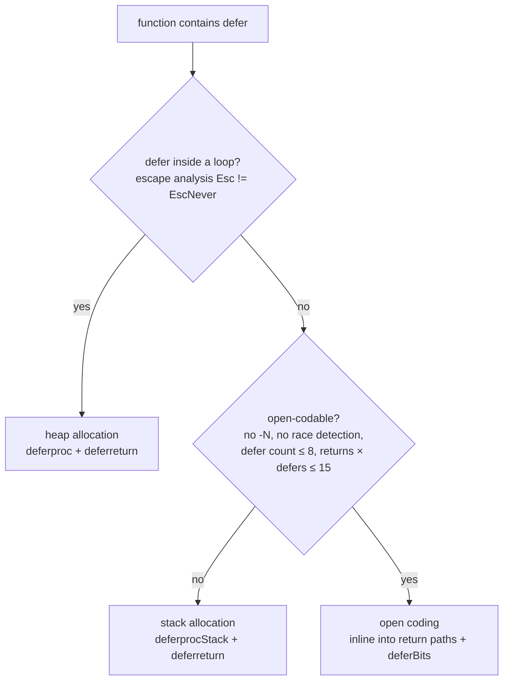

# 6.2 Deferred Statements

The deferred statement `defer` did not exist in the earliest Go designs; it was added later as a separate feature, with Robert Griesemer writing the language specification [Griesemer, 2009] and Ken Thompson producing the earliest implementation [Thompson, 2009]. Its semantics read very short: a `defer`-red call runs when the enclosing function returns, when a panic occurs, or when `runtime.Goexit` is called. Intuitively this looks like a purely compile-time feature, similar to C++'s RAII (automatic destruction when leaving a scope); the compiler would seem to only need to "move" the deferred call to the end of the function, with no runtime cost.

The truth is one layer more complicated. Go's `defer` is not bound to the scope of some resource, and it is allowed to appear inside conditionals and loops, so it stops being a static notion of scope. A piece of code whose execution count depends on a runtime loop can produce a number of deferred calls that cannot be determined at compile time:

```go
func randomDefers() {
	for rand.Intn(100) > 42 {
		defer println("golang-design/under-the-hood") // count determined only at runtime
	}
}
```

Precisely because of this uncertainty, `defer` is not a free lunch. This section first makes its semantics clear, then follows a performance-evolution storyline that spans more than a decade, watching how it went from "at its slowest, advised out of the hot path" all the way to "almost zero cost". The endpoint of this storyline is also the key to understanding [6.3 Panic and Recover](./panic.md): in today's runtime, running `defer` on a normal return and running `defer` during a panic unwind go through the same machinery.

## 6.2.1 Semantics: LIFO, Triggered by Both Return and panic, Arguments Evaluated at the defer Site

The observable semantics of `defer` come down to three rules; remembering them explains the vast majority of "why is this the result" puzzles.

First, **last in, first out**. Multiple `defer`s within the same function execute in reverse order. This makes "open A, open B" and "close B, close A" naturally symmetric, which is exactly the order resource cleanup wants.

Second, **both the return path and the exception path trigger it**. Whether the function returns normally with `return`, or panics midway and unwinds upward, a registered `defer` will be executed. This is the basis for using `defer` to do "release no matter what" cleanup, and for using `recover` in [6.3](./panic.md) to intercept a panic.

Third, **arguments are evaluated at the `defer` statement, and the call is deferred**. The deferred function and its actual arguments are fixed at the moment the `defer` is written, while the actual call is postponed to the end of the function. This is the easiest one to trip over:

```go
func trace() {
	i := 0
	defer fmt.Println(i) // at this moment i==0, prints 0, not the later 1
	i++
}
```

This is not an implementation compromise but a deliberate semantics. Imagine `f, _ := os.Open(...)` followed immediately by `defer f.Close()`; if the argument were evaluated only at the end, a reassignment of `f` along the way would make you close the wrong file. Being "in place" about the time of evaluation is what matches the reader's intent when writing that line.

Worth pointing out is that the **implementation mechanism** behind this rule changed in recent years, even though the semantics themselves never moved. The early implementation `memmove`d the arguments into a deferred record for safekeeping; since go1.18, the compiler packages the deferred call together with its arguments at the time into a parameterless closure `func()`, evaluation happening at the instant the closure is constructed, so the runtime only needs to call this closure at the end. The semantics did not move, but the record from then on no longer needs to store arguments, which lays the groundwork for the structural simplification later in this section.

## 6.2.2 Three Generations of Implementation: From Heap Allocation to Almost Zero Cost

Almost all of `defer`'s cost comes down to one question: that record of "which deferred calls are to be executed", where it lives, when it is allocated, and how it is found again to execute. Around this question, Go has given three generations of answers. They are not a simple new-replaces-old; **all three exist today simultaneously**, and the compiler picks the best for the shape of each call site. First look at the kernel data structure of a deferred function; today's `_defer` is already quite lean:

```go
// runtime/runtime2.go: the record of a deferred call (trimmed sketch)
type _defer struct {
	heap bool    // whether the record itself is on the heap or the stack
	sp   uintptr // the SP when defer was registered, used to tell "which frame's defer"
	pc   uintptr // the PC when defer was registered
	fn   func()  // the deferred call (already holds captured arguments); nil under open coding
	link *_defer // chained into the list hanging on the Goroutine, points to the next defer to run
}
// runtime/runtime2.go
type g struct {
	// ...
	_defer *_defer // head of this Goroutine's list of deferred calls
}
```

Comparing against the source at the start of this section, you can see that today's `_defer` has neither an argument size `siz` nor an argument buffer; the actual arguments all live inside the `fn` closure. The several `_defer`s a function registers are chained through `link` into a linked list hanging on the current Goroutine's `g._defer`, and the later a `defer` is registered the closer to the front it sits, naturally implementing LIFO.

### First Generation: Heap Allocation (`deferproc`)

The most naive approach: each time a `defer` is encountered, ask the runtime for a `_defer` block from the heap, fill in `fn`/`pc`/`sp`, and hang it at the head of the `g._defer` list. The compiler translates `defer expr` into a `deferproc` call and inserts `deferreturn` at the end of the function. This path needs the most runtime support; when registration happens inside a loop, or the number of defers is too large to be absorbed by a higher-order optimization, this is the only fallback.

```go
// runtime/panic.go: register a heap-allocated deferred call (sketch)
func deferproc(fn func()) {
	gp := getg()
	d := newdefer()       // take from the per-P resource pool, allocate from heap if the pool is empty
	d.link = gp._defer    // hang at the head of the Goroutine's deferred list
	gp._defer = d
	d.fn = fn             // arguments are already captured by the closure, no need to copy again
	d.pc = sys.GetCallerPC()
	d.sp = sys.GetCallerSP()
}
```

`newdefer` does not go through `mallocgc` every time; it first reuses from each P's local `deferpool`, and when the local one is empty wholesales half from the global pool, a line of thinking of the same lineage as the multi-level caching of the memory allocator ([12.2](../../part4memory/ch12alloc/component.md)). Even so, this heap-allocation generation is still the slowest of the three: registration must touch a resource pool, returning must recycle, and in the worst case it may trigger stack growth or even preemption. This is exactly the origin of the old advice "don't use defer on the hot path".

### Second Generation: Stack Allocation (`deferprocStack`, go1.13)

Since a `_defer`'s lifetime does not outlast the function frame it lives in, why not put the record directly on the stack? go1.13 landed this optimization [Randall, 2013]: when escape analysis judges that a `defer` will not escape (not inside a loop), the compiler reserves space for the `_defer` in the current function frame, and the runtime only needs to initialize it, hang it on the list, and release it together with the frame when the function returns, doing away with allocation and recycling.

```go
// runtime/panic.go: initialize a stack-allocated _defer (sketch)
func deferprocStack(d *_defer) {
	gp := getg()
	d.heap = false        // mark as on-stack, so deferreturn need not return memory at the end
	d.sp = sys.GetCallerSP()
	d.pc = sys.GetCallerPC()
	d.link = gp._defer    // still must hang on the list, so deferreturn can find it
	gp._defer = d
}
```

The space for the record is prepared by the compiler in the stack frame, and `deferprocStack` only takes on initialization. This generation cuts about 30% off the `defer` cost of the common simple cases, but it still has to maintain the list and still has to make a trip through `deferreturn` at the end of the function, so it is still some distance from "zero cost".

### Third Generation: Open-Coded defer (open-coded defer, go1.14)

The open-coded defer introduced in go1.14 [Scales, 2019] is what truly approaches zero cost. Its idea returns to the original intuition: since in most functions the number and positions of `defer`s can be seen clearly at compile time, then skip the runtime altogether; the compiler directly **inlines** the deferred calls in front of each return path, not even building a `_defer` record (here the `fn` field is `nil`). A common lock-and-unlock pattern:

```go
var mu sync.Mutex
func f() {
	mu.Lock()
	defer mu.Unlock()
}
```

After compilation there is neither `deferproc`/`deferprocStack` nor `deferreturn`; `mu.Unlock()` is laid down directly before `RET`, almost no different from hand-writing a line of `mu.Unlock()`. In the benchmarks the proposal gives, the extra cost of this kind of `defer` relative to a direct call drops to about 1 ns, less than one clock cycle, which can be regarded as almost no cost [Scales, 2019].

The hard part is conditional branches. If some `defer` hides inside an `if` that can only be determined at runtime, how does the cleanup code inlined at the end know whether or not to execute? Go's answer is an 8-bit **defer bits** (`deferBits`) bitmap, a plain and clever idea: each open-coded `defer` takes one bit, registration sets the corresponding bit to 1, and at the end the bits are checked in reverse order, calling only on a hit.

```go
// pseudocode: the expansion of an open-coded defer
deferBits := uint8(0)         // 00000000
deferBits |= 1 << 0           // first defer encountered, set the bit -> 00000001
_f0 := f0                     // save together with the arguments into a stack slot
if cond {
	deferBits |= 1 << 1       // second defer hit -> 00000011
	_f1 := f1
}
// ... function body ...
exit:                          // check in reverse order, call only on a hit
if deferBits & (1 << 1) != 0 { // 00000011 & 00000010 != 0 -> call f1
	deferBits &^= 1 << 1
	_f1()
}
if deferBits & (1 << 0) != 0 { // -> call f0
	deferBits &^= 1 << 0
	_f0()
}
```

You can see open coding is not absolutely zero cost: it still has to reserve stack slots for arguments and evaluate them in place, and a conditional `defer` still pays a little bit arithmetic. But compared with allocation and the linked list, this instruction cost is negligible. `deferBits` uses one byte, which also directly explains the upper limit of "at most 8 open-coded defers": a single byte has only 8 bits.

### How the Compiler Chooses Among the Three Generations

The three generations coexist, and the compiler picks for each function during the SSA build phase (`ssagen`). First a hard dividing line: as long as a `defer` appears inside a loop (escape analysis marks it `Esc != EscNever`), the number of records cannot be determined statically, so it can only be heap-allocated. Otherwise it defaults to trying open coding, and when any condition breaks the premise of "statically expandable at compile time", it falls back to stack allocation.



Several thresholds have concrete origins: `maxOpenDefers = 8` is pinned by the bit width of `deferBits`; `returns × defers > 15` is an empirical pruning rule, since open coding has to repeatedly lay out cleanup code at each return point, and when there are many return points and many defers the code bloats more than it is worth, while open coding is in the first place an optimization meant for "small functions" (so the source comments say). These two, along with `-N`, race detection, shared libraries, and similar scenarios, disable open coding, but as long as it is not inside a loop, the record can still go on the stack. The only thing that truly knocks `defer` back to heap allocation is "appearing inside a loop". Race detection, shared libraries, and other special scenarios have little to do with everyday production and are omitted here.

## 6.2.3 `deferreturn` and panic: One Unwinding Machine

The first two generations string `defer` onto the `g._defer` list; the third generation does not enter the list at all. This raises a question that must be answered: when a panic unwinds up the stack and is to execute, in each frame, the `defer`s that frame registered, the open-coded `defer`s have no record and are not on the list, so **how does panic find them?**

The answer is that the compiler attaches a piece of `FUNCDATA_OpenCodedDeferInfo` metadata to a function containing open-coded defers, recording the location of `deferBits` on the stack and the function and argument slot of each deferred call. When a panic unwinds to such a frame, it reads this funcdata and the runtime's `deferBits`, and can then precisely make up the deferred calls that "should have run on the normal return path but were interrupted by panic". In other words, open coding saves the `_defer` record but pays the price of "this frame must remain walkable by panic". This is the most hidden item on the bill of this generation's optimization.

Since go1.22, this mechanism has been further unified [Cox, 2023]. Today's `deferreturn` no longer uses the old `jmpdefer` trick that simulated tail recursion, but directly constructs a `_panic` marked as `deferreturn`, reusing exactly the same unwinding loop as a real panic:

```go
// runtime/panic.go: the normal return path, reusing panic's unwinding loop (sketch)
func deferreturn() {
	var p _panic
	p.deferreturn = true
	p.start(sys.GetCallerPC(), unsafe.Pointer(sys.GetCallerSP()))
	for {
		fn, ok := p.nextDefer() // both _defer on the list and open-coded defers are produced by it
		if !ok {
			break
		}
		fn() // if fn recovers internally, nextDefer will sense it next time and stop unwinding
	}
}
```

`nextDefer` is the core of this machine: it both walks the `g._defer` list to take out heap and stack deferred calls and uses funcdata to take out open-coded deferred calls, shielding the caller from the differences among the three generations. `runtime.Goexit` goes through this same loop too. So "running defer on a normal return", "running defer during a panic unwind", and "running defer on Goexit" converge after go1.22 into one piece of code. This is exactly the implementation foundation on which, in [6.3 Panic and Recover](./panic.md), `recover` can intercept a panic inside a `defer`, left for that section to expand.

## 6.2.4 Deterministic Cleanup Elsewhere: RAII, try-finally, with, Drop

Placing `defer` in a cross-language lineage, it solves the same universal problem: **how to guarantee that "no matter which path you leave by, cleanup will happen"**. The trade-offs differ from one design to another.

C++'s **RAII** binds cleanup to object lifetime; the destructor is called deterministically by the compiler when the object leaves scope, a purely compile-time scheme with zero runtime bookkeeping, at the cost that cleanup must attach to some type and cannot, like `defer`, register an arbitrary piece of logic in place. Rust's **`Drop`** follows the RAII line of thinking and, with the ownership system computing the release timing at compile time, is even more deterministic. Java's **try-finally** (and try-with-resources) and Python's **`with`** (context managers) instead wrap cleanup explicitly in syntactic blocks, with clear scope, but nesting multiple resources easily indents into a pyramid.

Go chose another path: `defer` is not bound to a type and needs no extra block indentation; any single line can register a piece of cleanup in place, and right next to where you write `open` you can write `defer close`, which reads beautifully. The cost is precisely the entire content of this section: because it breaks free of static scope and is allowed inside conditionals and loops, the compiler cannot always resolve it at compile time into a zero-cost call like RAII, so the runtime must take part, and so there are these three generations of effort to push the cost back to zero. Convenience never comes free; it just moves the cost over to the compiler and the runtime to repay.

And precisely because of these three generations of optimization, the long-circulated experience of "don't use defer on the hot path" is already out of date. It was correct in the heap-allocation era, but after open coding landed, a `defer` in a small function is almost no different from hand-written cleanup. Performance wisdom has a shelf life; before tuning for some version, first confirm that the cost model in your head still holds.

## 6.2.5 A Short Summary of the Evolution

`defer`'s decade-plus of optimization is one storyline of "gradually moving runtime bookkeeping back to compile time":

| Version | Content | Author |
|:----|:-----|:----|
| 1.0 and earlier | drafted the language spec, first implementation, heap allocation | Robert Griesemer, Ken Thompson |
| 1.1 | defer's allocation and release changed to per-G batch handling | Russ Cox |
| 1.3 | changed to per-P resource pool allocation, fitting work-stealing scheduling | Dmitry Vyukov |
| 1.8 | execution switched to the system stack, blocking preemption and stack-growth cost | Austin Clements |
| 1.13 | implemented stack allocation, eliminating heap allocation in common simple cases (about -30%) | Keith Randall |
| 1.14 | open-coded defer, inlined into return paths, almost zero cost | Dan Scales |
| 1.18 | arguments captured by closure, `_defer` no longer stores arguments, `deferproc` loses its parameters | Keith Randall et al. |
| 1.22 | unified `deferreturn` and panic unwinding, reusing the `nextDefer` loop | Russ Cox |

The trade-off of each of the three generations can be summed up in one line: open coding trades "a few stack slots + bit arithmetic" for near-zero cost, and is the first choice for small functions; stack allocation trades "initializing a record + maintaining the list" for avoiding heap allocation, and is the fallback when open coding is not possible; heap allocation trades "resource pool + list + return at the end" to backstop dynamic scenarios like loops and overflow counts, the most costly but the most general. Having understood this chain of choices, watching in [6.3](./panic.md) how panic unwinds along the same chain and the same funcdata then comes naturally.

## Further Reading

1. [Scales, 2019] Dan Scales, Keith Randall, Austin Clements. *Proposal: Low-cost defers through
   inline code, and extra funcdata to manage the panic case.* Sep 2019.
   https://go.googlesource.com/proposal/+/refs/heads/master/design/34481-opencoded-defers.md
2. The Go Authors. *Go 1.13 Release Notes (performance improvement of stack-allocated defer).*
   https://go.dev/doc/go1.13#performance
3. The Go Authors. *Go 1.14 Release Notes (performance improvement of open-coded defer).*
   https://go.dev/doc/go1.14#runtime
4. The Go Authors. *runtime/panic.go (`deferproc`/`deferprocStack`/`newdefer`/`deferreturn`/`_defer`).*
   https://github.com/golang/go/blob/master/src/runtime/panic.go
5. The Go Authors. *The Go Programming Language Specification: Defer statements.*
   https://go.dev/ref/spec#Defer_statements
6. [Randall, 2013] Keith Randall. *cmd/compile: allocate some defers in stack frames.* Dec 2013.
   https://github.com/golang/go/issues/6980 ; [Cox, 2011] Russ Cox. *runtime: aggregate defer.*
   Oct 2011. https://github.com/golang/go/issues/2364 ; [Vyukov, 2014] Dmitry Vyukov.
   *runtime: per-P defer pool.* Jan 2014.
   https://github.com/golang/go/commit/1ba04c171a3c3a1ea0e5157e8340b606ec9d8949 ;
   [Cox, 2023] Russ Cox. *runtime: rewrite panic/defer (unified `deferreturn` and panic unwinding since go1.22).*
   src/runtime/panic.go, 2023. https://github.com/golang/go/blob/master/src/runtime/panic.go
7. [Griesemer, 2009] Robert Griesemer. *defer statement.* Jan 2009.
   https://github.com/golang/go/commit/4a903e0b32be5a590880ceb7379e68790602c29d ;
   [Thompson, 2009] Ken Thompson. *defer.* Jan 2009.
   https://github.com/golang/go/commit/1e1cc4eb570aa6fec645ff4faf13431847b99db8
