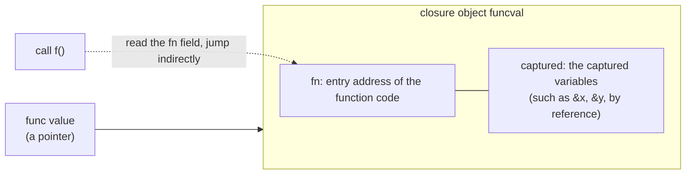
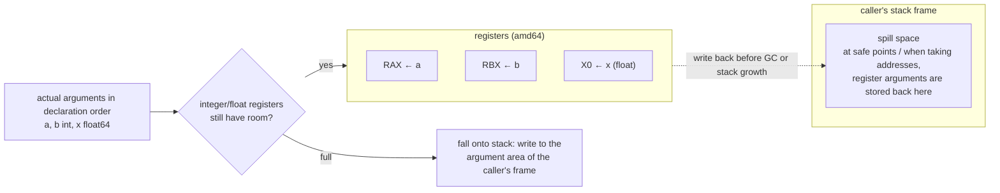

# 6.1 Function Calls

Functions are first-class citizens in Go: they can be assigned, passed, returned, and they can capture
outer variables to become closures. Behind this lie two implementation questions: how a function value
(a closure) is represented in memory, and how a single function call passes arguments and returns values
at the lowest level. The latter also hides a quiet but sweeping change introduced in Go 1.17: passing
arguments in registers instead of on the stack. This section explains both thoroughly, and at the seam
between them points out a key fact, the very fact that welds "what a closure is" and "how a call happens"
into one and the same thing.

## 6.1.1 Function Values and Closures

A value of a `func` type is, in essence, a pointer to a **closure object**. The runtime calls this object
a `funcval`, and its definition in `runtime/runtime2.go` is surprisingly short:

```go
// funcval: the runtime representation of a function value (from runtime2.go, annotated)
type funcval struct {
    fn uintptr
    // variable-size, fn-specific data follows here, that is, the captured environment
}
```

There is only one fixed field, `fn`, the entry address of the function code. The line in the comment,
"variable-size, fn-specific data here," is the soul of the closure: right after `fn`, the compiler lays
out the outer variables this closure captures. An ordinary function that captures nothing has a `funcval`
that is just the single word `fn`, globally unique and read-only; once it captures outer variables, the
compiler must construct, for each evaluation, a `funcval` on the heap that carries the captured data. We
can draw it like this:



Calling a function value means reading its `fn` field and jumping there indirectly, which works much like
method dispatch through an interface ([4.2](../ch04type/interface.md)). The key detail is that **capture is
by reference**: a closure captures the variable itself, not its value at that moment. In the code below, the
two closures returned by `counter` share the same `n`, because what they capture is the address of the
variable `n`, not some snapshot:

```go
func counter() (inc, get func() int) {
    n := 0
    inc = func() int { n++; return n } // captures &n
    get = func() int { return n }      // captures the same &n
    return
}
// inc(); inc(); get() == 2, the two closures see the same n
```

"By reference" is both the expressive power of closures and the root of a classic pitfall. In Go 1.21 and
earlier, the loop variable was **shared across the entire loop**, so:

```go
// Go 1.21 and earlier: all goroutines capture the same v
for _, v := range s {
    go func() { use(v) }() // all read the final value of v at loop end
}
```

All goroutines capture the same `v`, and by the time they start the loop has usually long since ended, so
they uniformly read the last element. For over a decade, seasoned Go programmers worked around this by
hand-writing `v := v` to create a new variable on each iteration. Go 1.22 promoted this idiom to a language
rule: **the loop variable of a `for` loop now gets a fresh instance per iteration**, applying both to the
three-clause `for` and to `for range`. The focus of the fix is worth savoring: it did not change the
**manner** of capture, which is still "by reference," but rather the **object** being captured. Since each
iteration now has a new variable, what is captured by reference is naturally an address that is independent
per iteration. A design flaw that had vexed Go users for over a decade was finally settled with the smallest
possible change in semantics.

This change also demonstrated a careful approach Go uses when it alters language semantics. It was, after
all, a backward-incompatible semantic change that could silently alter the results of code that depended on
the old behavior, so Go tied it to the language version declared in `go.mod`: the new semantics take effect
only when a module declares `go 1.22` or higher, and the behavior of older modules is preserved as is.
During the Go 1.21 transition period, it was first offered for preview in the form of
`GOEXPERIMENT=loopvar`. For code whose behavior might change as a result, the project also provided the
`bisect` tool, which can binary-search between the old and new semantics to pinpoint exactly which loop was
affected. Tying a semantic change to a version declaration, supplemented by a preview switch and a locating
tool, is the compromise Go found between "evolving forward" and "not breaking existing code." This mechanism
itself reaches further than the single fix to the loop variable.

## 6.1.2 The Evolution of the Calling Convention: From Stack to Registers

How a single function call passes arguments and return values is governed by the **calling convention**
(ABI). Go 1.16 and earlier used a **stack-based** convention (now called ABI0): all arguments and return
values were passed through stack memory. The caller wrote each actual argument to an agreed location on the
stack, and the callee read them back from the stack, with return values handled the same way. This approach
was simple, portable, and easy to interface between the compiler and hand-written assembly, at the cost of
one memory write plus one memory read per argument, which is considerable in call-heavy programs.

Go 1.17 introduced a **register-based** internal calling convention, ABIInternal. Its core rule is "prefer
registers, fall back to the stack when they do not fit": each architecture defines a set of integer
registers and a set of floating-point registers, and arguments and return values occupy them in declaration
order, with a single argument going either entirely into registers or entirely onto the stack. On amd64,
the 9 registers available for passing integer arguments and return values are:

```
RAX, RBX, RCX, RDI, RSI, R8, R9, R10, R11   // amd64: 9 integer argument/return registers
```

arm64 uses `R0`-`R15`, 16 in total. The allocation rule can be made clear with a small example: for the
function `func(a, b int, x float64)` on amd64, `a` takes `RAX`, `b` takes `RBX`, and `x` takes the first
floating-point register, so all three arguments are in registers with not a single memory access; whereas
if the arguments are numerous enough to fill the integer registers, the tenth integer argument falls onto
the stack. Aggregate types (structs, arrays) are expanded recursively by their fields to participate in
allocation, going into registers as a whole if they fit and falling onto the stack entirely otherwise. This
"all in or all out" rule avoids the complicated bookkeeping of a value split into a register half and a
stack half. Let us draw this allocation of "occupy registers in order, fall back to the stack when they do
not fit," together with the spill space for register arguments in the caller's stack frame:



With a large amount of stack memory reads and writes removed, this change brought roughly a 5% overall
performance gain and a smaller binary, and it was **completely transparent** to users: not a single line of
code changed, recompiling simply made it faster. It is worth tracing why the register convention only
landed in Go 1.17: early Go chose the stack-based ABI0 because it was simple to implement, consistent across
architectures, and naturally aligned with the GC's precise stack scanning, since arguments all have fixed
locations on the stack and the scanner can find the pointers among them as usual. For a register convention
to land, the prerequisite was that the compiler first have a mature SSA backend to perform register
allocation, and that it solve a problem that came with it: when GC or stack unwinding happens, how are the
pointer arguments living in registers to be found. Go's answer is not to scan the registers but to rely on
the spill space mentioned above: at safe points where GC or stack growth may be triggered, the arguments in
registers are stored back to the fixed spill space in the caller's stack frame, so the scanner still need
only scan the stack. The register convention is not entirely free of the stack either: the caller must still
reserve a block of **spill space** in its own frame for each register argument, so that on stack growth
([6.1.3](#613-stack-frames-and-growable-stacks)) or when the argument's address must be taken, the value in
the register can be stored back to memory. Placing the spill space in the caller's frame rather than the
callee's is meant to give the stack-growth code path a fixed location to write to, simplifying the
implementation.

Here we pick up the thread left dangling by [6.1.1](#611-function-values-and-closures). A closure object is
a pointer, and the callee must first obtain this pointer before it can find the variables it captured. The
ABI specifies a dedicated **closure context register** for this: before calling a closure, the caller places
the address of the `funcval` into this register, and the callee reads the captured environment from it. On
amd64 it is `RDX`, and on arm64 it is `R26`. The reader may already have noticed that `RDX` is precisely not
among the 9 integer argument registers above: it is reserved for context, exactly the slot set aside for
closures. In a word: the reason a closure can be "called together with its environment" is precisely this
one register that the ABI agrees upon beyond ordinary argument passing.

ABI0 has not disappeared. It is still used at the boundary between Go and assembly: hand-written assembly
([2.2](../../part1overview/ch02asm/callconv.md)) follows ABI0, because assembly authors need a stable,
explicit set of argument-passing rules that does not drift across versions. The two ABIs call into each
other through a compiler-generated "bridge wrapper" (ABI wrapper): for an ABIInternal function to call an
ABI0 assembly routine, a wrapper in between moves the arguments from registers to the stack, and vice versa.
Go separates the internal ABI from the external (assembly) ABI precisely so that it can freely evolve the
former without disturbing the latter. The reason the change from stack to registers could be made
transparent to users is rooted in this very dividing line.

## 6.1.3 Stack Frames and Growable Stacks

Each function call pushes a **stack frame** onto the goroutine's stack, holding local variables, arguments
spilled to the stack and the spill space, the return address, and so on. Go's stack is a **growable
contiguous stack**: the function prologue contains a stack check that compares the current stack pointer
against the stack boundary, and when it finds insufficient remaining space it jumps to `morestack`, which
allocates a larger stack, copies the old stack contents over as one block, and then adjusts all pointers
that point into the old stack. This stack check is also where preemption
([9.7](../../part3concurrency/ch09sched/preemption.md)) hitches a ride. For the concrete management of the
stack, see [14 Execution Stack Management](../../part4memory/ch14stack).

Growable stacks have a consequence for closures that cannot be avoided. Since the stack can **move**, and
since [6.1.1](#611-function-values-and-closures) said closures capture **by reference**, then once the
address of some local variable is captured by a closure and that closure may **outlive the stack frame that
created it** (for instance, because it is returned, stored into a global, or handed to a goroutine), this
variable can no longer live on a stack that may be reclaimed or relocated. The solution is **escape
analysis** ([15.5](../../part5toolchain/ch15compile/escape.md)): the compiler determines at compile time
whether a variable's address "escapes" the lifetime of the current function, and if so, moves it from the
stack to the heap so that the address captured by the closure remains valid after the stack is relocated.
The reason `n` in the earlier `counter` could continue to be read and written by `inc`/`get` after
`counter` returned is precisely that it escaped to the heap. In other words, the two designs of "capture by
reference" for closures and "growable, relocatable" for the stack coexist only thanks to the third-party
arbitration of escape analysis.

## 6.1.4 Method Values, Method Expressions, and Variadics

A few features derived from functions' first-class status are nothing mysterious once they land on
`funcval`.

A **method value** `t.M` binds the receiver `t` into a closure, yielding a `func` that can be passed around
on its own. It is in essence the closure of [6.1.1](#611-function-values-and-closures), with the captured
variable being the receiver `t`. A **method expression** `T.M`, by contrast, binds no receiver, yielding an
ordinary function that takes the receiver as its first explicit argument:

```go
type T struct{ x int }
func (t T) Add(d int) int { return t.x + d }

f := t.Add        // method value: func(int) int, t is captured into a closure
g := T.Add        // method expression: func(T, int) int, the receiver becomes the explicit first argument
f(1)  == t.x+1
g(t, 1) == t.x+1
```

The two have different shapes: `f` is a `funcval` carrying a captured environment (so writing `t.Add` like
this triggers a closure allocation, with the receiver copied into the closure object; if the receiver is a
pointer type, what is copied is the pointer), whereas `g` is an ordinary function value that captures
nothing and has one extra parameter in its signature. This explains a frequently asked phenomenon:
repeatedly taking a method value with `t.M` on a hot path brings hidden heap allocations, while `T.M` does
not. The compiler's handling of a method value can be seen as an "automatic closure conversion": it
synthesizes a `funcval` whose only captured variable is the receiver, in essence no different from the
hand-written closure in [6.1.1](#611-function-values-and-closures).

A **variadic** `f(args ...int)` is packed into a slice at the call site:

```go
func sum(xs ...int) (s int) { for _, x := range xs { s += x }; return }

sum(1, 2, 3)        // the compiler constructs []int{1,2,3} and passes it in
sum(s...)           // already a slice, passed directly, no further construction
```

A variadic is in essence "syntactic sugar plus a slice." Once you understand [5.1 Slices](../ch05data/slice.md),
you understand where the cost of variadics lies: calling a variadic function with scattered arguments
requires the caller to construct an underlying array and generate a slice header from it; if the argument is
already a slice and is passed in `s...` form, there is zero extra construction.

## 6.1.5 Cross-Language Comparison

Closures are by now almost standard equipment in modern languages (C++ lambdas, Java, Python, Rust's
`Fn`/`FnMut`/`FnOnce`), and the difference lies in **capture semantics**. Go captures by reference uniformly,
which is concise but hands the judgment of "when to copy" to escape analysis and the programmer's vigilance;
C++ lets you explicitly choose value capture `[=]` or reference capture `[&]` in the capture list, which is
powerful but easy to write into a dangling reference; Rust uses the `move` keyword together with the three
traits `Fn`/`FnMut`/`FnOnce` to distinguish both the manner of capture and the number of times it can be
called, moving ownership and mutability checks forward to compile time. Conciseness, control, safety: each
language stands at a different position in this triangle.

On the calling convention, C/C++ follow the platform's standard ABI (such as System V AMD64), so as to
interoperate directly with system libraries and others' object files; once this contract is public it is
hard to change. Go, by contrast, **defines its own** internal ABI, sacrificing direct interoperability with
external object files (a cgo call has to cross the ABI boundary, at a cost, see
[15 Compiler](../../part5toolchain/ch15compile)) in exchange for the freedom to evolve the calling
convention to its own needs. The smooth switch from stack to registers benefits precisely from this. Once
again, Go trades a bit of interoperability for control over its own implementation.

## Further Reading

1. The Go Authors. *Go internal ABI (ABIInternal) specification.*
   https://github.com/golang/go/blob/master/src/cmd/compile/abi-internal.md
   (the 9 integer registers on amd64, the closure context register RDX/R26, and the design and rationale of
   the spill space)
2. Austin Clements et al. *Proposal: Register-based Go calling convention* (Go 1.17).
   https://go.googlesource.com/proposal/+/master/design/40724-register-calling.md
3. The Go Authors. *Go 1.17 Release Notes (the new register calling convention, roughly 5% performance gain).*
   https://go.dev/doc/go1.17
4. Go 1.22 Release Notes (per-iteration scoping of the loop variable). https://go.dev/doc/go1.22 ;
   David Chase, Russ Cox. *Fixing for loops in Go 1.22.* https://go.dev/blog/loopvar-preview
5. Russ Cox et al. *Proposal: Less error-prone loop variable scoping* (discussion #56010).
   https://github.com/golang/go/discussions/56010
6. The Go Authors. *runtime/runtime2.go: funcval* (the runtime representation of a closure).
   https://github.com/golang/go/blob/master/src/runtime/runtime2.go
7. This book: [4.2 Interfaces](../ch04type/interface.md), [5.1 Slices](../ch05data/slice.md),
   [14 Execution Stack Management](../../part4memory/ch14stack), [15.5 Escape Analysis](../../part5toolchain/ch15compile/escape.md).
