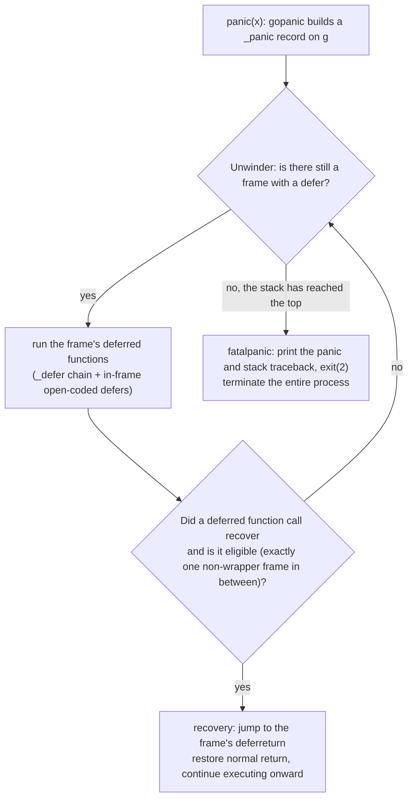

# 6.3 The panic and recover Builtins

`defer` ([6.2](./defer.md)) has already settled the question of "what to do when a function exits," leaving open the question of "what happens when a function is interrupted abnormally." The pair of builtins `panic` and `recover` answers exactly this: the former interrupts the current normal control flow and begins unwinding up the call stack, while the latter catches it mid-unwind. This section first makes their semantics clear, then comes down to the go1.26 runtime implementation of `gopanic` and `gorecover`, and finally returns to a more pressing question: what panic should really be taken to be, and why Go did not make it into an exception mechanism like the one in C++ or Java.

## 6.3.1 Semantics: Unwinding, Interception, and Process Termination

`panic` does three things, in a fixed order. It first stops the remaining statements of the current function and instead runs the `defer` chain already registered on the current goroutine, in last-in-first-out order; with each deferred function it executes, control briefly returns to user code, giving it one chance to intercept; if the entire chain runs through and no one intercepts, panic pops the call stack frame by frame, and once it reaches the top of the goroutine stack it terminates **the entire process**, printing the panic value and a stack traceback.

`recover` is the only means of interception, but the condition under which it takes effect is narrow: it is effective only when called **directly** by some deferred function. "Directly" means that the frame calling `recover` must be the very deferred function that the panicking frame registered with `defer`; one extra level of nesting or one level too few does not count. A successful `recover` makes the panic stop unwinding, returns the value that was passed to `panic` at the time, and then control flow continues onward as if that deferred function had returned normally.

This constraint, "on the same call chain, and located directly within the deferred function," is the root of every implementation detail that follows. Let us first pin it down with three pieces of code. First, `recover` written in the wrong place, which cannot catch the panic:

```go
func A() {
	B()
	C()
}
func B() {
	defer func() { recover() }() // cannot catch C's panic: B has already returned, not on the unwind path
	println("B")
}
func C() { panic("boom") }
```

`A` first calls `B`; `B` returns normally, and its `defer` has long since run; then `A` calls `C`, and when `C` panics, what unwinds is the path `C → A`, on which `B` does not lie at all. Second, putting `recover` upstream in the call chain, in `A`, does catch it:

```go
func A() {
	defer func() { recover() }() // catches it: A is on C's unwind path
	B()
}
func B() { C() }
func C() { panic("boom") }
```

The panic unwinds upward along `C → B → A`, and when it passes through the deferred function registered by `A`, `recover` is located directly within it and takes effect. The third piece shows the weight of the word "directly." Both of the following forms fail to catch it, even though both appear to "call `recover` inside a defer":

```go
defer func() { func() { recover() }() }() // one extra anonymous function: recover is not in the deferred function itself
defer recover()                            // one level too few: recover itself becomes the deferred function, and gopanic is its caller
```

The former has one extra closure, so the caller of `recover` is no longer the frame registered by `defer`; the latter registers `recover` itself as the deferred function, so it is called directly by the runtime's `gopanic`, which likewise fails to satisfy the condition. These two counterexamples are not an arbitrary rule of the language; the next subsection will show that they correspond exactly to the two boundaries of the criterion in the runtime check that "the number of intermediate frames is exactly one."

## 6.3.2 gopanic: Building a _panic Record on g

The compiler translates the keyword `panic(x)` directly into a call to `runtime.gopanic(x)`, and `recover()` into `runtime.gorecover()`. The implementation of the semantics therefore lives entirely in these two runtime functions.

After `gopanic` receives the panic value, it first rules out several situations that are "beyond recovery," such as a panic that occurs on the system stack, while `mallocing`, while preemption is disabled, or while a lock is held; these all `throw` directly, because at this moment it is no longer safe to run arbitrary user code. Past these checks, it builds a `_panic` record **on the current stack**, links it to the head of the goroutine's `_panic` list, and then starts driving a small state machine to unwind the stack. The go1.26 `_panic` is the following trimmed-down sketch:

```go
// _panic: a panic in progress (sketch, keeping only design-relevant fields)
type _panic struct {
	arg  any     // the value passed to panic, returned verbatim on a successful recover
	link *_panic // links to an earlier panic, supporting panicking again within a panic

	startPC uintptr        // gopanic's own PC/SP, serving as the identity marker of the "unwind starting point"
	startSP unsafe.Pointer // recover uses this to judge whether a given call is eligible

	pc uintptr        // the frame the unwind state machine is currently at
	sp unsafe.Pointer
	fp unsafe.Pointer

	retpc uintptr // the PC to jump back to if recovered (points at this frame's deferreturn)

	// replay state for open-coded defers: these defers are not on the _defer chain,
	// their registration bitmap and closure slots live in the function frame, and
	// gopanic walks them itself through these two pointers
	deferBitsPtr *uint8
	slotsPtr     unsafe.Pointer

	recovered bool // whether this panic has been caught by recover
}
```

Compared with the older version, the go1.26 `_panic` no longer records the argument pointer with `argp`, but instead marks the unwind starting point with `startPC`/`startSP`, and adds `pc`/`sp`/`fp` together with `deferBitsPtr`/`slotsPtr`; the latter bear directly on the walkability of open-coded defers ([6.2](./defer.md)), as the next subsection details. Once the record is built, the main loop is minimal, repeatedly asking the state machine for the next deferred function to execute and executing it:

```go
// the trunk of gopanic (pseudocode)
var p _panic
p.arg = e
p.start(callerPC, callerSP) // link onto the g._panic chain, find the first frame with a defer
for {
	fn, ok := p.nextDefer() // fetch the next deferred function; also check whether recover has happened
	if !ok {
		break // the defer chain is exhausted, no one intercepts
	}
	fn()
}
preprintpanics(&p) // call all the Error/String methods before freezing the world
fatalpanic(&p)     // unrecoverable, terminate the process
```

There is an important divergence here from the early implementation. Earlier the runtime walked the goroutine's `_defer` chain one by one with `reflectcall`; since go1.21, `nextDefer` advances frame by frame with the help of a **stack unwinder**, and at each frame that has a deferred call, it fetches and executes both that frame's open-coded defers (the closure slots taken out according to the in-frame bitmap `deferBitsPtr`) and the heap/stack defers hanging on the `_defer` chain. In other words, unwinding on the panic path no longer relies on the `_defer` chain alone to carry every deferred call; those open-coded defers that are executed inline by the function epilogue on a normal return are instead fished out of the frame and executed by `gopanic` itself on a panic. This is the origin of what [6.2.4](./defer.md) called "open-coded defers must still be walkable by the runtime at panic time": they leave no `_defer` record on the stack, and the runtime can replay them only by relying on the bitmap and closure slots inside the function frame.

## 6.3.3 gorecover: Deciding "Eligibility" from the Shape of the Stack

The whole difficulty of `recover` lies in deciding whether its caller is eligible. The go1.26 `gorecover` no longer takes any argument; it fetches the active `_panic` on the current goroutine, and if it does not exist, or has already been recovered, or comes from `Goexit`, it returns `nil` directly; otherwise it uses a stack unwinder to walk outward from `gorecover`, counting how many **non-wrapper frames** (wrapper frames are skipped) lie between `gopanic` and `gorecover`. The criterion is: exactly one non-wrapper frame in between, and that frame's `gopanic` stack pointer matches the `startSP` of the active `_panic`; only then does it set `p.recovered` and return `p.arg`. The source comments draw the three stack shapes very clearly:

```
normally recoverable:    one extra wrapper, still      defer recover() not recoverable:
                         recoverable:
  foo                     foo                        foo
  runtime.gopanic         runtime.gopanic            runtime.gopanic
  bar      ← 1 non-wrapper wrapper                    wrapper
  runtime.gorecover       bar    ← still 1            runtime.gorecover  ← 0 non-wrapper frames
                          runtime.gorecover
```

The criterion "exactly one non-wrapper frame" is the formalization of the two counterexamples in [6.3.1](#631-semantics-unwinding-interception-and-process-termination): `defer recover()` has zero frames in between, too few; `defer func(){ func(){recover()}() }()` has two frames in between, too many; only `defer func(){ recover() }()` has exactly one frame and is eligible. Encoding the semantic constraint into a check on the shape of the stack is the cleverness of this implementation.

Once `recover` sets `recovered`, the `nextDefer` in the main loop notices it and switches away via `mcall(recovery)`, never returning. What `recovery` does is rewrite the goroutine's execution context to look like "the frame holding that deferred function is returning normally": it pops the panic records already crossed off the `_panic` chain, then points the `pc` of `gp.sched` at **that frame's `deferreturn`** (rather than the ordinary return point), and `gogo`s back. Why `deferreturn` rather than an ordinary `RET`? Because that frame may still have unexecuted defers, and only jumping to `deferreturn` can finish them off. This also explains a detail from [6.2](./defer.md): every compiled function containing a defer closes its epilogue with `CALL deferreturn; RET`, precisely to leave the post-panic recovery an entry point it can jump into and continue running the remaining defers.

## 6.3.4 fatalpanic: The Curtain Call When No One Intercepts

If the defer chain runs to its end and still no one `recover`s, `gopanic` falls through to `fatalpanic`. Before printing, it first calls `preprintpanics`, taking advantage of the world not yet being frozen to call all the `Error` and `String` methods on the panic value, obtaining a printable string, so as to avoid running user code after the freeze. Then `fatalpanic` switches to the system stack, `startpanic_m` freezes the other threads, prints the panic and the stack traceback, and finally `exit(2)` terminates the process.

The whole path can be drawn as a state machine. At each frame, run the frame's deferred calls to completion; during this any single `recover` will jump out of the loop via `recovery` and restore normal control flow; only when the top of the stack is reached with no one intercepting does it fall into `fatalpanic`:



What deserves emphasis is the path at the bottom right: **an unintercepted panic kills the entire process, not a single goroutine**. A panic missed in a background goroutine takes down an entire service that has nothing to do with it. This fact determines the engineering posture discussed below.

## 6.3.5 panic Is Not Exception Handling

Having read this far, it is easy to liken `panic`/`recover` to the `try`/`catch` of C++, Java, or Python; syntactically they do all "throw, propagate upward, catch somewhere." But Go deliberately did not make it into an exception mechanism in its design, and this distinction runs through the language's character and directly determines when you should use it.

Go's proper path for handling "expected failures" is **errors as values**: a function returns the error as an ordinary return value `error` to the caller, who handles it explicitly with an ordinary `if err != nil` ([Chapter 7](./../ch07errors/readme.md)). A file that will not open, a network that drops, input that is invalid: these are situations a program will **expect** to meet during normal operation; they are values, not events. `panic` is left for another category of thing: situations that are **truly exceptional and should not have happened** at all, an out-of-bounds array index, dereferencing a nil pointer, the violation of some invariant. In other words, panic marks a bug, or an environment broken past the point of continuing, not an alternative style of error handling. Rob Pike wrote this principle as a single sentence in *Effective Go*: "Don't panic."

This trade-off is an extension of Go's "explicit over implicit" character. The cost of an exception mechanism is that it **hides control flow**: a seemingly unremarkable function call may throw control several levels out to some `catch` you cannot see, and the call site itself cannot reveal this possibility. Errors as values, by contrast, puts every place that may fail out in the open; the code is wordier for it, yet also harder to deceive the reader with. Go and Rust are of one mind on this point: Rust encodes recoverable errors into the type with `Result<T, E>`, and leaves `panic!` for unrecoverable bugs; both establish "errors are values, to be handled explicitly" as the default, and leave the matter of unwinding the stack to the truly exceptional path. C++, Java, and Python take the other road, where exceptions are the main trunk of error handling, at the cost of implicit control flow and the diffusion of `try` blocks. The two roads each have their trade-offs, and neither side is "correct"; but which one was chosen makes the language read differently from then on.

The one widely accepted engineering use of panic is **recovering at a boundary**. A long-running service should not crash entirely because of a single bug while handling one request. The standard library's `net/http` wraps a `recover` around the outer layer of each request's handling goroutine: if some handler panics, the server catches it, returns a 500 on that one connection, and the rest of the requests proceed as usual. This is recover's legitimate scenario: **at a clear boundary, isolating "the crash of one operation" into "the failure of one operation"**, rather than scattering recover through the business logic as a `catch`. The yardstick is simple: are you isolating a boundary, or covering up a failure that should have been returned as an `error`?

The last stroke lands on cost, which confirms from another angle that "panic belongs to the exceptional path." Panic's unwinding is not free: it has to walk the stack frame by frame and replay each frame's defers, and it also drags down optimization; a function that may panic and be recovered has a calling relationship that is hard to inline and to subject to aggressive escape analysis (this is also the cost behind why, in [6.2](./defer.md), open-coded defers must leave an extra bitmap on the stack so that they can still be walked at panic time). Precisely because this path is slow and complex, it deserves to be left only for truly rare exceptional situations. Treating it as a means of everyday error handling amounts to making every ordinary failure pay a bill that should belong to exceptions alone.

## Further Reading

1. Andrew Gerrand. *Defer, Panic, and Recover.* The Go Blog, 2010.
   https://go.dev/blog/defer-panic-and-recover (the authoritative introduction to panic/recover semantics)
2. The Go Authors. *Effective Go: Panic / Recover / "Don't panic".*
   https://go.dev/doc/effective_go#panic (the official advice on when and when not to use panic)
3. The Go Authors. *The Go Programming Language Specification: Handling panics.*
   https://go.dev/ref/spec#Handling_panics (the normative definition of panic/recover)
4. The Go Authors. *runtime/panic.go (gopanic / gorecover / recovery / fatalpanic) and
   runtime/runtime2.go (the _panic, _defer structures).*
   https://github.com/golang/go/tree/master/src/runtime
5. Russ Cox et al. *The refactoring in Go 1.21 to handle panic/defer frame by frame with a stack unwinder.*
   https://github.com/golang/go/issues/57261 (the design background of nextDefer / nextFrame)
6. The Rust Project. *Error Handling: `Result` vs `panic!`.*
   https://doc.rust-lang.org/book/ch09-00-error-handling.html (the isomorphic trade-off between errors as values and unrecoverable errors)
7. This book: [6.2 Deferred Calls](./defer.md), [Chapter 7 Error Handling](./../ch07errors/readme.md).
