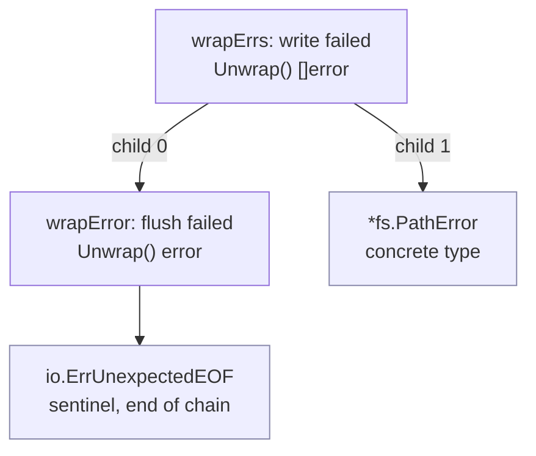

# 7.2 Inspecting Error Values

Once an error propagates up a call chain, the code that handles it and the code that produced it
are often separated by many layers. This raises a plain but thorny question: given an `error` that
has been passed up through layer after layer, how does the caller decide "is this actually some
particular error", and how does it retrieve the specific error value that originally carried the
context? This section answers exactly that, along with the conventions Go has set down for it in
the `errors` package.

The plainest error is just a sentence. `errors.New` wraps a string into an `error`, and internally
it is no more than the minimal `errorString` implementation:

```go
package errors

type errorString struct              { s string }
func (e *errorString) Error() string { return e.s }

func New(text string) error { return &errorString{text} }
```

In practice it is often combined with `fmt.Sprintf` to assemble an error message that carries a
variable. But once an error has been flattened into a string, its "handleability" drops to nearly
zero: the caller can only take this sentence and compare it against other strings, with no way to
know where it came from and no way to retrieve the original error value. The `Unwrap`, `Is`, and
`As` that Go 1.13 added to the `errors` package, along with the generic `AsType` introduced in
go1.26, exist to solve precisely this predicament where "an error becomes unanswerable once it
floats upward". Their common premise is to first string errors into a chain that can be traced back.

## 7.2.1 The Error Propagation Chain: From Single-Layer Wrapping to the Error Tree

For an upper layer to be able to interrogate a lower one, an error must not lose its provenance as
it propagates. `fmt.Errorf` achieves this with the `%w` verb: while generating the new error
message, it also stores the wrapped original error, so that the new error "remembers" who it came
from. A single `%w` produces a `wrapError` that implements `Unwrap() error`; multiple `%w` produce
a `wrapErrs` that implements `Unwrap() []error`:

```go
package fmt

// Trimmed Errorf: keeping only the design-relevant branch that "selects the wrapping type by the number of %w"
func Errorf(format string, a ...any) error {
	p := newPrinter()
	p.wrapErrs = true       // allow %w to record the corresponding argument into p.wrappedErrs
	p.doPrintf(format, a)   // format; %w degrades to %v for concatenation and records its position
	s := string(p.buf)
	switch len(p.wrappedErrs) {
	case 0:
		return errors.New(s)              // no %w, just an ordinary error
	case 1:
		return &wrapError{msg: s, err: …} // single %w: one node on the chain
	default:
		return &wrapErrs{msg: s, errs: …} // multiple %w: one node pointing to several child errors
	}
}

type wrapError struct{ msg string; err error }
func (e *wrapError) Error() string { return e.msg }
func (e *wrapError) Unwrap() error { return e.err }   // single chain

type wrapErrs struct{ msg string; errs []error }
func (e *wrapErrs) Error() string   { return e.msg }
func (e *wrapErrs) Unwrap() []error { return e.errs } // branching
```

The difference between `%w` and `%v` lies right here. `%v` only formats the error into a string and
splices it into the message, so the provenance is lost; `%w`, beyond splicing the string, additionally
retains a reference to the original error, attaching it to the chain. This reference is also a kind
of API promise: once you have exposed an inner error with `%w`, the caller may come to depend on
`errors.Is`/`As` to match it, and so the inner error becomes part of your outward contract. If you
only want to mention it in the message without exposing the internal error type, you should use `%v`.

`Unwrap() []error` is the second unwrapping form, introduced in Go 1.20 (see the further reading).
The standard library's `errors.Join` uses exactly this to combine several parallel errors into one:

```go
err := errors.Join(errClose, errFlush) // err.Unwrap() returns []error{errClose, errFlush}
```

So an error is no longer just a line, but may be a tree: a node with `Unwrap() error` has one child,
a node with `Unwrap() []error` has several children, and the leaves are original errors that no
longer implement any `Unwrap` (a sentinel or some concrete type). Inspecting an error means
performing a traversal over this tree.



In the figure above, `errors.Is(e3, io.ErrUnexpectedEOF)` will follow child 0 and Unwrap all the way
to the end of the chain to hit; `errors.As(e3, &pe)` (with `pe` of type `*fs.PathError`) matches by
type on the child 1 branch. Both walk the same tree, only the criterion for a "hit" differs.

## 7.2.2 Unwrap: Peeling Off One Layer

`Unwrap` is the foundation of this whole mechanism, and it does just one thing: if the error
implements `Unwrap() error`, it calls it to take out the inner layer; otherwise it returns `nil`.
It deliberately recognizes only the `Unwrap() error` form and does not handle `Unwrap() []error`,
leaving the duty of traversing the whole tree to `Is`/`As`:

```go
func Unwrap(err error) error {
	u, ok := err.(interface{ Unwrap() error })
	if !ok {
		return nil
	}
	return u.Unwrap()
}
```

## 7.2.3 Is: Chain-Aware Sentinel Comparison

To decide "is this a particular error", the traditional way is `err == io.ErrUnexpectedEOF`. Once an
error has been wrapped, `==` stops working, because the top layer is a `wrapError` and is not equal
to the sentinel at the end of the chain. `errors.Is` turns this comparison into a search over the
whole tree: starting from `err` itself, it descends layer by layer, and a hit is registered if any
node equals `target`.

In the implementation, the exported `Is` only does parameter validation; the real traversal lives in
the recursive `is`. At each node it tries two criteria in turn, then decides where to go next
according to the node's unwrapping form, recursing over each child when it encounters
`Unwrap() []error` (depth-first):

```go
func is(err, target error, targetComparable bool) bool {
	for {
		// criterion one: direct equality (when target is comparable)
		if targetComparable && err == target {
			return true
		}
		// criterion two: err defines its own Is method, hand the decision to it
		if x, ok := err.(interface{ Is(error) bool }); ok && x.Is(target) {
			return true
		}
		// decide how to keep descending according to the unwrapping form
		switch x := err.(type) {
		case interface{ Unwrap() error }:
			if err = x.Unwrap(); err == nil {
				return false
			}
		case interface{ Unwrap() []error }:
			for _, e := range x.Unwrap() { // multi-way: recurse over each subtree
				if is(e, target, targetComparable) {
					return true
				}
			}
			return false
		default:
			return false // reached a leaf without a hit
		}
	}
}
```

The second criterion is the clever part of `Is`: an error type can define its own `Is(error) bool`
to declare that it is "equivalent to" some sentinel. `syscall.Errno` uses this to let a system call
error code match an abstract sentinel like `fs.ErrExist`. So switching from

```go
if err == io.ErrUnexpectedEOF { /* ... */ }
```

to

```go
if errors.Is(err, io.ErrUnexpectedEOF) { /* ... */ }
```

the latter both pierces through the wrapping layers and gives the error type room to define its own
equivalence relation, whereas the former recognizes only strict equality.

## 7.2.4 As and the Generic AsType: Retrieving an Error Value by Type

`Is` answers "is it"; `As` answers "which concrete type is it, give it to me". It likewise traverses
the tree, but the hit criterion becomes "the current error's dynamic type is assignable to the
target type", and on a hit it writes that error into the pointer the caller provides, via reflection:

```go
func as(err error, target any, targetVal reflectlite.Value, targetType reflectlite.Type) bool {
	for {
		if reflectlite.TypeOf(err).AssignableTo(targetType) { // type matches
			targetVal.Elem().Set(reflectlite.ValueOf(err))    // write back to target
			return true
		}
		if x, ok := err.(interface{ As(any) bool }); ok && x.As(target) {
			return true // the error defines its own As and is responsible for the assignment
		}
		switch x := err.(type) {
		case interface{ Unwrap() error }:
			if err = x.Unwrap(); err == nil {
				return false
			}
		case interface{ Unwrap() []error }:
			for _, e := range x.Unwrap() {
				if e != nil && as(e, target, targetVal, targetType) {
					return true
				}
			}
			return false
		default:
			return false
		}
	}
}
```

By this means, rewriting from the fragile type assertion

```go
if e, ok := err.(*fs.PathError); ok { /* use e.Path */ }
```

to one that pierces through the wrapping layers

```go
var e *fs.PathError
if errors.As(err, &e) { /* use e.Path */ }
```

The signature of `As` has two long-criticized awkward points: `target` is `any`, so type safety is
backstopped by a runtime panic; and to get the value you must first declare a variable, then pass its
address, then read it back, a roundabout route. go1.26 straightens this path out with generics, adding
`AsType[E error]` (see the further reading, proposal #51945):

```go
func AsType[E error](err error) (E, bool) // returns the matched error value and whether there was a hit
```

So the example above can be written on one line, with the type pinned down at compile time, no longer
needing an intermediate variable, and no longer having the "passed the wrong pointer type" class of
error that can only blow up at runtime:

```go
if e, ok := errors.AsType[*fs.PathError](err); ok { /* use e.Path */ }
```

`AsType` and `As` share the same tree traversal, differing only at the exit: `As` writes the result
into a pointer and requires `target` to be a non-nil pointer, while `AsType` returns the value
directly and replaces the runtime type check with the type parameter `E`. The official documentation
therefore recommends that new code prefer `AsType`, leaving `As` for the few cases where the target
type is not known at compile time.

## 7.2.5 Why "Value + Type on a Chain" Rather Than an Exception Class Hierarchy

Placing `Is`/`As` in the history of programming languages makes it clearer what this design is
avoiding. Java, C++, and Python take another road: an error is an exception object, caught by `catch`
according to the class it belongs to, with subclass exceptions captured by a parent class's `catch`,
relying on an inheritance tree. This mechanism is elegant, but it ties "what an error is" together
with "the error's type hierarchy": to express "this error also counts as that kind", you often have
to open a new subclass; and cross-library errors are hard to classify against one another, because
their inheritance trees are mutually independent.

Go chooses to treat an error as an ordinary value and type, and to inspect it on a chain (tree)
explicitly strung together by `Unwrap`, gaining three things in return:

- **Sentinels and concrete types can coexist on one chain.** On the same chain, `Is` compares
  sentinels by value and `As`/`AsType` retrieves concrete errors by type, the two criteria not
  interfering with each other. In an exception system both of these have to be squeezed into the
  single dimension of "type".
- **The equivalence relation can be defined by the error itself.** `Is(error) bool` and `As(any) bool`
  let an error declare itself equivalent to some sentinel, or able to be treated as another type,
  without modifying any inheritance relationship. `syscall.Errno.Is` is exactly this.
- **Wrapping is composition rather than inheritance.** `%w` and `Join` stack errors like building
  blocks, and the shape of the chain is determined by data rather than by a class hierarchy fixed at
  compile time. The cost is that inspection turns from "a single `catch` dispatch" into "a tree
  traversal", a bit slower, and it requires the caller to actively write `Is`/`As` rather than relying
  on the language's capture mechanism as a backstop.

The gain in expressiveness has its cost too: Go moves the "dispatch by type" that an exception system
provides for free into libraries and calling conventions, getting in return error values that are
composable and interrogable.

## 7.2.6 Idioms and Pitfalls

A few rules of thumb, most of them direct corollaries of the mechanisms above:

- **Carry context when wrapping.** `fmt.Errorf("reading config %s: %w", path, err)` lets the root
  cause at the end of the chain be paired with the ins and outs of each layer, so that one error
  message lays out the whole path when debugging.
- **`%w` exposes API, `%v` hides it.** Using `%w` is a promise that the inner error can be matched by
  `Is`/`As`, and it becomes your outward contract; if the inner error is an implementation detail you
  do not want callers to depend on, use `%v` to demote it to a line of text.
- **Do not over-wrap.** Running `%w` at every layer makes the chain long-winded and the messages
  repetitive. Wrap only when "this layer really adds useful context".
- **Sentinel errors vs. type errors.** When you only need to decide "is it a particular fixed error",
  use a sentinel (`var ErrNotFound = errors.New(...)`, paired with `Is`); when you need to take a
  field out of the error (a path, a status code), use a concrete type (paired with `As`/`AsType`).
  Think through what the caller will ask first, then decide which kind to export.
- **Keep custom `Is`/`As` shallow.** These two methods should only compare `err` and `target`
  themselves; do not call `Unwrap` inside them. Traversing the whole tree is the `errors` package's
  duty, and repeated traversal would let the complexity spiral out of control.

## 7.2.7 Summary

The `errors` package supports error inspection with a very small set of conventions: `%w`/`Join`
string errors into a traceable chain and tree, `Unwrap` peels off one layer, `Is` performs a
chain-aware sentinel comparison over the tree to replace the fragile `==`, and `As` together with
go1.26's generic `AsType` retrieves a concrete error by type to replace the fragile type assertion.
Together they turn "an error becomes unanswerable once it floats upward" into "traceable along the
chain, comparable by value, retrievable by type", and all of this rests on the fundamental choice
that errors are ordinary values and types, stacked together by composition rather than inheritance.

## Further Reading

1. Damien Neil, Jonathan Amsterdam. *Working with Errors in Go 1.13.* The Go Blog, 2019.
   https://go.dev/blog/go1.13-errors (design motivation and usage of `%w`/`Unwrap`/`Is`/`As`)
2. The Go Authors. *Package errors.* https://pkg.go.dev/errors
   (the authoritative documentation for `New`/`Unwrap`/`Is`/`As`/`AsType`/`Join`)
3. Jonathan Amsterdam, et al. *Proposal: Error Values (#29934).* 2018-2019.
   https://go.googlesource.com/proposal/+/master/design/29934-error-values.md
   (the design proposal for `Is`/`As`/`Unwrap`, recording the rejected alternatives)
4. The Go Authors. *Go 1.20 Release Notes: Wrapping multiple errors.*
   https://go.dev/doc/go1.20#errors (`Unwrap() []error` and `errors.Join`)
5. The Go Authors. *proposal: errors: add AsType (#51945).*
   https://go.dev/issue/51945 (the proposal and discussion for go1.26's generic `AsType`)
6. The Go Authors. *src/errors/wrap.go, join.go, src/fmt/errors.go.*
   https://github.com/golang/go/tree/master/src/errors (the first-hand source of this section's implementation)
7. Jonathan Amsterdam, Bryan C. Mills. *Error Values: Frequently Asked Questions.* 2019.
   https://github.com/golang/go/wiki/ErrorValueFAQ
   (common questions and authoritative answers on the practical use of `Is`/`As`/`%w`)
8. This book, [7.1 Evolution of the Problem](./value.md), [7.5 The Future of Error Handling](./future.md).
