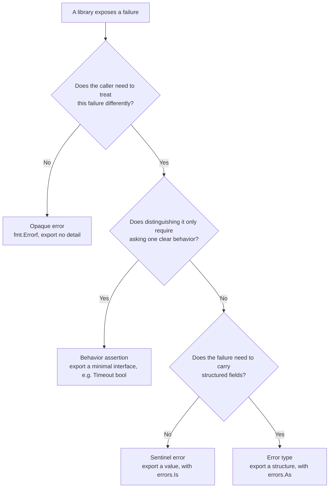

# 7.4 Error Semantics

[7.2](./inspect.md) and [7.3](./context.md) stood on the caller's side of an error and worked out how, once
you hold an `error`, to inspect it along the chain and how to layer context onto it. This section turns the
viewpoint to the other side, standing with the library author and asking a question that comes before
inspection: when a package wants to expose a failure to the outside world, what **form** should it give that
error? Should it export a comparable value, export a type with fields, or export nothing at all?

This is not purely a matter of style. Once an error's form is published, it becomes part of the package's
public contract, as hard to change as a function signature. Callers will write branch logic against that form,
and those branches in turn **couple** the caller to the library. Different forms promise different things to the
contract and therefore leave different degrees of freedom to change later. This section lays the community's
established practices side by side, weighs the cost of each along one thread, what it promises to the API
contract, and finally offers a workable order for the trade-off.

## 7.4.1 Sentinel Errors: Promising the Contract a Value

The most direct approach is to export a pre-created error value and let the caller compare against it for
equality. The standard library is full of such examples:

```go
package io

// EOF is the error returned by Read when no more input is available.
var EOF = errors.New("EOF")
```

```go
package sql

// ErrNoRows is returned by Row.Scan when QueryRow does not match any row.
var ErrNoRows = errors.New("sql: no rows in result set")
```

The caller branches on it:

```go
row := db.QueryRow("select ...")
if err := row.Scan(&x); errors.Is(err, sql.ErrNoRows) {
    // no such row, take the business "not found" branch
}
```

These pre-set error values are called **sentinel errors**. They are simple to the point of near-transparency,
the least effortful way to express "a definite outcome other than success." The reason `io.EOF` is not really
an "error" but more of a signal is precisely that what it expresses is "a normal read reached the end of the
stream."

The cost of simplicity is hidden in the phrase "promising the contract a value," and it promises more than it
first appears. The documentation of `io.EOF` puts it plainly:

> Read must return EOF itself, and may not return an error that wraps EOF, because callers will use `==` to
> detect it.

That single sentence reveals the sentinel's hidden cost. The value is welded so tightly to the contract that
the library itself can no longer wrap it with the `%w` of [7.3](./context.md), or else the `==` comparison
would fail. `errors.Is` ([7.2](./inspect.md)) softens this, making comparison along the chain possible, but it
requires both library and caller to upgrade to chain-aware code, and the sentinel, being an exported variable,
remains mutable state that anyone outside can reassign.

The deeper problem is the one Dave Cheney pins down in "Constant errors": a sentinel is "irreplaceable." Two
`errors.New("EOF")` with identical contents are not equal, so the sentinel, as the **one unique instance**,
itself becomes the contract. This binds two otherwise unrelated packages together: to write
`errors.Is(err, io.EOF)`, the caller must `import "io"` in its source. Sentinels suit cases where "the kinds of
outcome are few, the semantics are stable, and no context needs to be carried." Once a failure needs to carry
parameters (which file, which field), the sentinel is not up to the task.

## 7.4.2 Error Types: Promising the Contract a Structure

When a failure needs to carry data, the natural approach is to define a concrete type that implements the
`error` interface and put the data in fields:

```go
// PathError records a failed file operation, along with the path and underlying error that caused it.
type PathError struct {
    Op   string // operation name, such as "open"
    Path string // the path involved
    Err  error  // the underlying error
}

func (e *PathError) Error() string {
    return e.Op + " " + e.Path + ": " + e.Err.Error()
}
```

The caller uses `errors.As` ([7.2](./inspect.md)) to pull this type out of the chain and read its fields:

```go
var perr *fs.PathError
if errors.As(err, &perr) {
    log.Printf("operation %s failed on path %s", perr.Op, perr.Path)
}
```

An error type can carry far more information than a sentinel, and that is its value. The cost is one more layer
of coupling: a sentinel promises only a value, while a type promises the whole **structure** to the contract.
The target of `As` must be this concrete type, so the caller's code hard-codes `*fs.PathError`, field names and
all. Should the library later want to rename a field, change a field's semantics, or even swap in a different
implementation type, it will disturb every caller that made the assertion. The larger the exported type, the
more fields it has, the less room there is to change it without breaking compatibility.

There is a design discipline here that is often overlooked: a type exported for `As` assertions has, in its
exported fields, an API. Adding a field to an error type is safe; renaming or removing one is a breaking
change. It is therefore worth squeezing the exposed fields down to the minimum, keeping only the ones the
caller genuinely needs to branch on.

## 7.4.3 Opaque Errors: Promising Nothing

At the other end of the spectrum, one returns only the `error` interface itself, exporting no sentinel and no
type, so that beyond "success or failure" the caller has no way to make a structured judgment about the error:

```go
func (c *Config) Load(path string) error {
    f, err := os.Open(path)
    if err != nil {
        return fmt.Errorf("loading config %s: %w", path, err)
    }
    defer f.Close()
    // ...
    return nil
}
```

Cheney calls this an **opaque error** and lists it as the first choice in most situations. Its benefit is
exactly the inverse of the cost of sentinels and types: all the caller can do is "`if err != nil` and then pass
it up," so it promises nothing to the contract. How the library implements the failure internally, what type it
uses, what fields it carries, are all private matters that can be freely refactored later without disturbing
anyone. Coupling is driven to the minimum.

The cost is equally clear: the caller loses the ability to classify the error. This cost is not always worth
paying. Some failures the caller really does need to treat differently: a timeout should be retried, a missing
row should fall back to a default. Flattening all such cases into opaque errors amounts to pushing the
semantics that the library should have expressed onto the caller, who is left to guess by matching error
strings, which is a worse coupling. The question then becomes: can we let the caller branch without nailing
either a value or a type into the contract?

## 7.4.4 Assert Behavior, Not Type

The answer is to assert **behavior** rather than a concrete type. Have the error type implement an interface
small enough to describe only "it can answer a certain question," and have the caller assert that small
interface rather than a concrete type. The standard library's `net` package gives a model for this technique:

```go
package net

// Error is the generic interface for network errors.
type Error interface {
    error
    Timeout() bool // Is this error caused by a timeout?
}
```

The caller need not even `import "net"` to reference this named interface; it can declare an anonymous
interface of the same structure right where it is needed:

```go
// only care whether "this error can tell me it is a timeout"
if ne, ok := err.(interface{ Timeout() bool }); ok && ne.Timeout() {
    // it is a timeout, can retry
}
```

This assertion contains no concrete type and no package name. It asks "can you answer `Timeout()`?" rather
than "are you a `*net.OpError`?" Any error willing to implement `Timeout() bool` satisfies it, regardless of
which package it comes from or what it is called. What is promised to the contract shrinks from a value
(sentinel) or a structure (type) to a **minimal interface**.

It is worth watching how the library side makes this interface work along the error chain. `net.OpError` is a
type that wraps an underlying error, and its `Timeout()` does not decide on its own but forwards the question
to the wrapped error:

```go
// sketch: OpError forwards "is it a timeout" to the underlying error it wraps
func (e *OpError) Timeout() bool {
    if ne, ok := e.Err.(interface{ Timeout() bool }); ok {
        return ne.Timeout()
    }
    return false
}
```

So the behavior "is it a timeout" can pass through the `OpError` wrapping layer to the outside, and the caller
makes one assertion at the top of the chain. (The real `net.OpError.Timeout` also keeps an extra hop of special
handling for `*os.SyscallError`, omitted here to keep the trunk clear.) For behavior to pass through wrapping of
arbitrary depth, **every** wrapping error type on the chain must conscientiously forward this way, which is
exactly the "library authors take on the housekeeping" of the previous section: the convenience of decoupling
falls on the caller's side, while the work to maintain it falls on the library's. This is the same line of
thought as the chain-walking search of `errors.Is`/`As` in [7.2](./inspect.md), the difference being that the
traversal of `Is`/`As` is done uniformly by the standard library, whereas the forwarding of behavior relies on
each intermediate type implementing it for itself. Set side by side, one can also see why the standard library
eventually adopted `Unwrap` as a first-class convention: it turns "walking the chain" from each package's own
conscientiousness into a uniform mechanism at the language level.

This is where the "small interface" principle of [4.2.7](../ch04type/interface.md) lands in error handling. The
smaller the interface, the more types satisfy it, and the looser the coupling between the caller that asserts it
and the library that provides it. Cheney sums up the principle in one sentence: assert the behavior of an
error, not its type. The library keeps almost all of its implementation freedom, the caller gets the bit of
branching it needs, and the two ends meet on an extremely narrow interface.

Behavior assertion is not a free lunch; it has its own failure modes, and the `net` package itself keeps a live
counterexample. `net.Error` once had a second method `Temporary() bool`, intended to mean "is this error
temporary and worth retrying." It has been marked deprecated since Go 1.18, with the documentation giving the
reason "Temporary errors are not well-defined": what counts as a "temporary" error never had a definition that
all parties agreed on, so the retry logic callers wrote against it was unreliable. The lesson is: a behavior
worth asserting must be clearly defined and clearly agreed upon by all parties (like `Timeout()`), not a label
with murky semantics (like `Temporary()`). The power of a small interface comes from the question it asks being
sharp enough; ask a vague question, and the decoupling advantage of behavior assertion is lost.

## 7.4.5 Forms in Other Languages

Widening the view beyond Go, one sees that the "form of an error" is really a different choice each language
makes on the same tension, and that tension is the trade-off between expressiveness and coupling.

Exception-oriented languages (Java, Python, C++) make errors into a **type hierarchy**.
`catch (FileNotFoundException e)` is in essence the type assertion of [7.4.2](#742-error-types-promising-the-contract-a-structure),
only organized through inheritance: catching a base class catches every subclass under it. Expressiveness is
strong, rich fields can be carried, and capture can happen at varying granularities; the cost is that the whole
exception hierarchy enters the contract, and control flow is implicitly pulled out of the function signature, so
the caller can hardly tell from the signature what a function may throw. Go deliberately did not take this road;
[7.1](./value.md) has already described its "errors are values" trade-off.

Rust goes to the other extreme: `Result<T, E>` writes the error type `E` into the type signature, forcing the
caller to handle it at compile time. The community uses `thiserror` to define structured error enums for
libraries (equivalent to Go's error types) and `anyhow` to box errors into an opaque `Box<dyn Error>`
(equivalent to Go's opaque errors). So the "type" and "opaque" forms are not unique to Go but a choice any
language with "errors are values" will face, the difference being only that Go expresses it with interfaces and
runtime assertions while Rust expresses it with enums and compile-time exhaustiveness. Placing Go's four forms
on this larger picture, behavior assertion is the most distinctly Go of them: it relies on the "gather the
methods and you satisfy the interface" feature of a structural type system
([4.2.4](../ch04type/interface.md)), which is in fact hard to reproduce in languages with static nominal types.

## 7.4.6 How to Choose

Lay the four forms out by "what they promise to the contract," and the order of the trade-off becomes clear:

| Form | Promised to the contract | Coupling | What the caller can do |
| :-- | :-- | :-- | :-- |
| Opaque error | nothing | lowest | only `err != nil` |
| Behavior assertion | a minimal interface | low | assert `interface{ Timeout() bool }` |
| Sentinel error | a value | medium | `errors.Is(err, ErrX)` |
| Error type | a structure | high | `errors.As` to pull out and read fields |

A workable default order is: **make it opaque first**, with the library exposing no internal detail, and wait
until a caller genuinely needs to branch. When some failure really does need to be treated differently,
**prefer behavior assertion**, defining an interface as small as possible for the caller to ask. Only when
behavior is not enough to express it, for instance when the failure must carry structured fields for the caller
to read, do you fall back to exporting a **sentinel or a type**, and accept clear-eyed that from this moment on,
that value or that structure is your API, and its evolution will be bound by Go 1 compatibility.

Drawing this order as a decision flow, it comes down to the few questions a library author actually has to ask
themselves each time they design an error:



The inner logic of this order is to make what is promised to the contract as little as possible. Each unit less
the library promises is a unit more freedom to refactor later; the narrower the surface the caller depends on,
the less an internal change in the library is likely to ripple into it. This shares a root with a theme that
recurs throughout the book: a good boundary lies not in exposing much but in exposing just enough, one unit more
is a burden, one unit less is a disability. The form of an error is the concrete shape of that boundary on the
failure path.

A note on evolution, finally, lest the reader take the order above for an unchanging verdict. Go 1.13 (2019)
brought `Unwrap`, `Is`, and `As` into the standard library ([7.2](./inspect.md)), and the error chain became a
language-level convention, which quietly changed the relative cost of several forms. Before this, a sentinel,
once wrapped by an intermediate layer, would be lost and `==` comparison would fail, which was an important part
of the backdrop for Cheney's advocacy of opaque errors back then; after `errors.Is` appeared, both sentinels and
types could be recognized through wrapping, and their practicality recovered a notch. But what is promised to
the contract did not shrink because of it: a sentinel is still a value, a type is still a structure, and what
`errors.Is`/`As` improved is whether "carrying context" and "being inspectable" can be had at once, not coupling
itself. The order of this section therefore still holds: promise little first, promise more when needed, and for
each unit more be clear about what it buys. As for the various syntactic attempts to write `if err != nil`
shorter, that is a problem at another level, left for [7.5](./future.md) to discuss in detail.

## Further Reading

- [Cheney2016a] Dave Cheney. Don't just check errors, handle them gracefully. GopherCon India, 2016-02; blog post 2016-04-27. https://dave.cheney.net/2016/04/27/dont-just-check-errors-handle-them-gracefully
- [Cheney2016c] Dave Cheney. My philosophy for error handling. GoCon Spring, 2016-04. https://dave.cheney.net/paste/gocon-spring-2016.pdf (talk notes on the trade-off among the sentinel, type, and opaque forms)
- [Pike2017] Rob Pike. Error handling in Upspin. 2017-12-06. https://commandcenter.blogspot.com/2017/12/error-handling-in-upspin.html (a first-hand case of designing error types in a real system)
- [Cheney2014] Dave Cheney. Inspecting errors. 2014-12-24. https://dave.cheney.net/2014/12/24/inspecting-errors
- [Cheney2016b] Dave Cheney. Constant errors. 2016-04-07. https://dave.cheney.net/2016/04/07/constant-errors
- [NetError] The Go Authors. Package net: type Error. https://pkg.go.dev/net#Error
- [IoEOF] The Go Authors. Package io: variable EOF. https://pkg.go.dev/io#EOF
- [GoBlog2019] The Go Blog. Working with Errors in Go 1.13. 2019-10-17. https://go.dev/blog/go1.13-errors
- [Pike2015] Rob Pike. Errors are values. The Go Blog, 2015-01-12. https://go.dev/blog/errors-are-values
