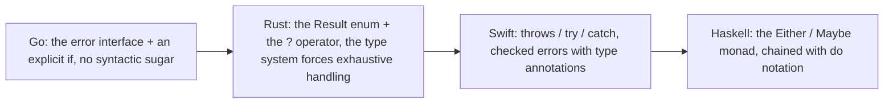

# 7.1 The Evolution of the Problem

In [6.3](../ch06func/panic.md) we already drew the dividing line: how to handle errors is one of the
fundamental choices in language design. The exception camp (C++, Java, Python) uses `try/catch` to
pull the error path out of the normal logic, keeping the main line clean, at the cost of making the
error path implicit, capable of being thrown from any call site. The value camp (Go, Rust, and C's
return-code tradition) passes errors explicitly as ordinary return values: verbose, but every error
path is spelled out in black and white with nowhere to hide. Go chose the value camp, reserving a
lightweight `panic`/`recover` only for "true exceptions." What this section is about is what happened
after that choice landed: how the proposition of "errors as values" itself evolved, from a string you
could only print into a tree that a program can interrogate layer by layer, asking "are you really
that error?"

## 7.1.1 Errors Are Values

Go defines an error as a built-in interface whose entire contract is a single method:

```go
// src/builtin/builtin.go
type error interface {
	Error() string
}
```

Any type that implements `Error() string` can be passed as an `error`. It is not a special language
construct, but an ordinary interface value, which can be assigned, compared, placed in a slice, used
as a field, and passed across a channel. This is exactly the point Rob Pike stresses again and again
in *Errors are values*: errors are values, and values can be programmed. The programmer does not
passively "catch" an exception that falls from the sky, but actively takes a value and decides what
to do with it: judge it, wrap it, propagate it, or swallow it.

This proposition has a fixed expression in function signatures: the error is always returned to the
caller explicitly as the last return value.

```go
f, err := os.Open(name)
if err != nil {
	return err
}
defer f.Close()
// use f
```

The screenful of `if err != nil` is often criticized as verbose, but it is precisely the two sides of
the same coin in the value camp, its cost and its benefit: since an error is a value, it must be caught
explicitly like any other value, and the compiler will not secretly route it elsewhere for you. This
follows the same overall temperament of Go as in [6.3](../ch06func/panic.md): explicit over implicit.
Demoting the error to a single-method interface buys maximal freedom: the standard library does not
need to prescribe an error-severity hierarchy in advance, and anyone can implement `error` with the
type best suited to their own scenario, from a string constant to a struct carrying a line number, a
file name, and the underlying syscall number. The cost is that this freedom hands the responsibility
back to the user as well: how to define an error, and how to let the caller reliably recognize it,
are all left for you to arrange. The rest of this section is about the answers the Go community and
the standard library worked out for that responsibility.

## 7.1.2 From String Errors to Inspectable Errors

The most naive error is a single sentence. `errors.New` and `fmt.Errorf` each build an error value
that carries only a string:

```go
err := errors.New("connection refused")
err := fmt.Errorf("read %s: %v", name, cause)
```

The `*errorString` returned by `errors.New` has only one field inside, and `Error()` spits it back
out verbatim. For the minimal need of "report a failure and print it for a human to read," this is
already enough. The trouble shows up at the next step: a program often wants not merely to print the
error, but to decide what to do based on what the error is. Create the file if it does not exist, retry
if the connection was refused, finish normally if the stream reached its end. This requires the caller
to be able to reliably ask: is this error a particular error?

The first answer the standard library gives is the sentinel error, using an exported variable as the
sole marker for a class of failure. The most famous is `io.EOF`:

```go
package io
var EOF = errors.New("EOF")

// the caller compares with ==
for {
	n, err := r.Read(buf)
	// ... process buf[:n]
	if err == io.EOF {
		break
	}
	if err != nil {
		return err
	}
}
```

The advantage of a sentinel is that the check is crisp: a single `==` will do. But it is fragile.
First, `io.EOF` is a variable, not a constant, and any code that gets hold of this package can rewrite
it:

```go
import "io"
func init() { io.EOF = nil } // legal, and enough to make the == check elsewhere always miss
```

In a large dependency graph, no one can guarantee that there is not some malicious or accidental
assignment that mutates such a sentinel away, which even constitutes a class of security hazard
(imagine `rsa.ErrVerification = nil`). The way around it is to make the sentinel an immutable constant
error by having a string type implement `Error()` itself:

```go
type ioError string
func (e ioError) Error() string { return string(e) }
const EOF = ioError("EOF") // a constant, cannot be rewritten
```

Second, and more deadly, `==` holds only when the error has not been wrapped at all. The moment some
intermediate layer reformats the original error into a new sentence to add context, `==` immediately
stops working:

```go
func readConfig(path string) error {
	if err := open(path); err != nil {
		return fmt.Errorf("read config %s: %v", path, err) // with %v, the original error is "flattened" into a string
	}
	// ...
	return nil
}
```

At this point, if an upper layer still wants to know "is the root cause `io.EOF`," `==` is already
powerless, because what was returned is a brand-new string error, and the original `io.EOF` identity
was lost at the moment of formatting. The next-best fallback is to do substring matching on the
`Error()` string, `strings.Contains(err.Error(), "not found")`, which builds the check on the
human-readable text of the error and breaks the moment the wording changes or the locale is switched.
It is the last thing one should ever depend on.

The second answer is the custom error type, checked with a type assertion:

```go
type PathError struct {
	Op   string
	Path string
	Err  error
}
func (e *PathError) Error() string {
	return e.Op + " " + e.Path + ": " + e.Err.Error()
}

// the caller checks with a type assertion
if pe, ok := err.(*PathError); ok {
	log.Printf("operation %s failed at %s", pe.Op, pe.Path)
}
```

A custom type can carry structured context, far richer than a single string. But it shares the same
fatal weakness as the sentinel: the type assertion `err.(*PathError)` likewise holds only for errors
that have not been wrapped. As soon as an intermediate layer uses `fmt.Errorf("...: %v", err)` to wrap
it inside a new sentence, the assertion can no longer hit.

So the first stage of "errors are values" left behind a clear tension: the caller wants both to add
context along the propagation path and to reliably recognize the root cause at the top level. Wrapping
with `%v` loses the identity, not wrapping loses the context, and you cannot have both. Go 1.13's
wrapping mechanism is precisely what came to resolve this tension.

## 7.1.3 Go 1.13: Wrapping, Unwrap, and Is / As

Go 1.13 (2019) added a verb `%w` to `fmt.Errorf` and established three companion functions in the
`errors` package. The core idea is: when wrapping, no longer "flatten" the inner error into a string,
but keep it intact as a chain that can be traced back.

```go
// wrap with %w, the inner error is preserved rather than formatted into a string
err := fmt.Errorf("read config %s: %w", path, io.EOF)
```

The only difference between `%w` and `%v` is this: the error returned by an `Errorf` that uses `%w`
additionally implements an `Unwrap() error` method, which spits out the inner error that was wrapped.
`%v` produces a piece of text that cannot be traced back, while `%w` produces a node still connected
to its root. With `Unwrap`, "is there some error on this chain" becomes a walk along the chain, and
the standard library wraps it into `errors.Is` and `errors.As`:

```go
// Is: is there an error on the chain equal to target (replacing bare ==)
if errors.Is(err, io.EOF) { ... }

// As: is there an error of some type on the chain, and if found, fill it into target (replacing bare type assertion)
var pe *PathError
if errors.As(err, &pe) {
	log.Printf("failed at %s", pe.Path)
}
```

`errors.Is` starts from `err`, repeatedly calls `Unwrap`, compares against `target` along the way, and
hits if any link is equal; it also lets an error type define an `Is(error) bool` method of its own to
declare "I am equivalent to a certain sentinel." `errors.As` likewise walks the chain, but compares
whether the type is assignable to the variable that `target` points to, filling in the value on a hit.
The two completely untie the knot from 7.1.2, "wrapping loses the identity": no matter how the
intermediate layers stack context with `%w`, the top level can still use `Is`/`As` to see through all
the wrapping and recognize the root cause. From then on, the correct posture for a caller to check an
error migrated wholesale from `==` and type assertions to `Is` and `As`. The details of this mechanism,
as well as the later-added generic version `errors.AsType[E error](err) (E, bool)` (which dispenses
with passing a pointer and returns the matched value directly), are left for [7.2](./inspect.md) to
discuss in full. Here it is enough to remember one turning point: an error is from now on a tree that
can be interrogated, no longer a single sentence.

## 7.1.4 Go 1.20: errors.Join and Multiple Wrapping

By Go 1.20 (2023), this tree grew from a single chain into a genuine multi-way one. In reality a single
operation may run into several errors at once: each `Close` may fail when closing a number of resources,
or several rules may be violated at once in a single validation. Previously the only option was to
splice them into one string, after which they could no longer be checked separately. `errors.Join`
aggregates multiple errors into one while preserving each one's identity:

```go
err := errors.Join(err1, err2, err3) // nil values are discarded; if all are nil, returns nil
```

The error returned by `Join` implements `Unwrap() []error`, spitting out a group rather than a single
one at once. Symmetrically, `fmt.Errorf` also allows multiple `%w` to appear in one sentence, likewise
yielding a multiply-wrapped error with `Unwrap() []error`. `errors.Is` and `errors.As` have long done
a depth-first traversal across both of these `Unwrap` shapes, so they apply equally to a multi-way tree:

```go
err := fmt.Errorf("both paths failed: %w; %w", io.EOF, os.ErrNotExist)
errors.Is(err, os.ErrNotExist) // true: the traversal reaches the second branch
```

At this point, "errors are values" has grown into its present complete form: a value, an `Unwrap` chain
or an `Unwrap` tree, and a pair of `Is`/`As` that walk the tree. Worth highlighting is that this whole
line of evolution never touched the single method of the `error` interface itself; all the new
capabilities are built on the optional convention that "an error value may additionally implement an
`Unwrap`." The interface stays fixed while the convention grows incrementally: this is exactly the room
for extension bought by making the error an ordinary value.

## 7.1.5 The Rejected Syntax: check / handle and the Withdrawn try

What the value camp is most often attacked for is, always, that screenful of `if err != nil`. The Go
team did consider slimming it down, but every attempt was eventually rejected, and those rejections
themselves say more about Go's orientation than any manifesto.

The 2018 Go 2 error-handling draft proposed a pair of keywords `check`/`handle`: `check` automatically
checks the error of the expression immediately following it and jumps on failure, while a `handle`
block provides a unified fallback. It introduced a new, implicit control-flow jump, which conflicts
with Go's temperament that "control flow should be plain to see at a glance," was hugely contentious,
and was not adopted.

In 2019, the team narrowed the proposal down to a built-in function `try` that required no new keyword
(proposal golang/go#32437). In the design, `x := try(f())` would make the current function return
directly with the error when `f()` returns a non-nil error:

```go
// the form envisioned by the try proposal (which ultimately did not enter the language)
func read(name string) ([]byte, error) {
	f := try(os.Open(name))   // on error, the current function directly returns ..., err
	defer f.Close()
	return io.ReadAll(f)
}
```

The proposal sparked one of the largest discussions in Go's history, with objections concentrated on
two points: first, `try` is a "function" that makes the function return early, hiding a control-flow
jump inside a seemingly ordinary expression, which breaks "return points are explicitly visible";
second, it works awkwardly with debugging and with the idiom of rewriting the returned error in a
`defer`. The proposal was officially withdrawn that same year, with a blunt rationale: the community
was too divided, and the problem it solved was not worth introducing this kind of implicitness.

Stringing these rejections together gives a clear design bottom line: Go would rather endure the
verbosity of `if err != nil` than trade an implicit control-flow jump for brevity. Brevity is not
unimportant, but in Go's ordering of values it comes after "explicit." The syntactic dispute over
error handling is not yet over (the community still puts forward new proposals from time to time), and
the background and latest developments of this part are continued in [7.5](./future.md).

## 7.1.6 Inside the Value Camp: Go Stands at the Most Minimal End

Pulling the lens back, the value camp actually has its own gradations of density. Even under the same
"errors are values," how much syntactic sugar and how strong a type constraint others gave it differs
considerably. Lined up together, Go's position becomes clear.



Rust uses the enum `Result<T, E>` to encode success and failure into the type, and if the caller does
not handle it, the compiler reports an error, so error handling is exhaustively forced; the `?`
operator is its syntactic sugar, and `let f = File::open(name)?;` makes the current function return the
error early on failure, an effect that is exactly the `try` Go rejected. Swift takes the checked-exception
route: a function uses `throws` in its signature to declare that it may throw, the call site must mark
it with `try` and catch it with `do`/`catch`, and errors are values (conforming to the `Error`
protocol), but propagation relies on a set of exception-like syntax. Haskell is purer, using algebraic
data types like `Either e a` or `Maybe a` to express a computation that may fail, then borrowing the
monad's `>>=` and `do` notation to string a series of possibly-failing steps together, where the
failure of any step short-circuits the whole chain.

All four treat errors as values; the divide is in "how much the language does for you." Rust uses the
type system to force you to handle and uses `?` to propagate for you; Swift annotates with `throws` and
propagates with `try`/`catch`; Haskell uses the monad to chain and short-circuit for you. Go is the end
with the fewest mechanisms: no `?`, no `throws`, no monad, the error is just a return value, the check
is just an `if`, and propagation is just `return err`. This deliberate restraint is of a piece with the
orientation in [11.9](../../part3concurrency/ch11sync/mem.md), where Go exposes only
sequentially-consistent atomics and gives no weakly-ordered tier: it would rather have the user write a
few more lines of explicit code than pile mechanism into the language. There is no absolute better or
worse in this set of trade-offs; what it buys is that anyone reading any piece of Go code can see at a
glance from `if err != nil` where the error is checked and where it flows. Carrying this main thread,
the next three sections land on the three questions posed at the start of this chapter: how error values
are checked ([7.2](./inspect.md)), how context is attached ([7.3](./context.md)), and how the handling
semantics are arranged ([7.4](./semantics.md)).

## Further Reading

1. Rob Pike. *Errors are values.* The Go Blog, 2015.
   https://go.dev/blog/errors-are-values
2. Andrew Gerrand. *Error handling and Go.* The Go Blog, 2011.
   https://go.dev/blog/error-handling-and-go
3. The Go Authors. *Working with Errors in Go 1.13.* The Go Blog, 2019.
   https://go.dev/blog/go1.13-errors (`%w`, `Unwrap`, `Is`, `As`)
4. The Go Authors. *Go 1.20 Release Notes: errors.* 2023.
   https://go.dev/doc/go1.20#errors (`errors.Join` and multiple `%w`)
5. Marcel van Lohuizen et al. *proposal: Go 2: error handling: try builtin (golang/go#32437).* 2019.
   https://github.com/golang/go/issues/32437 (the withdrawn `try` proposal);
   *Error Handling, Draft Design (check/handle).*
   https://go.googlesource.com/proposal/+/master/design/go2draft-error-handling.md
6. The Go Authors. *Go programming language specification: Errors* and *src/errors/*,
   *src/fmt/errors.go.* https://go.dev/ref/spec ;
   https://github.com/golang/go/tree/master/src/errors
7. Russ Cox. *Error Values, Problem Overview.* 2018.
   https://github.com/golang/proposal/blob/master/design/go2draft-error-values-overview.md
   (the go2 draft's overview of the evolution of the "errors are values" problem)
8. Damien Neil. *Go 1.13 lunch decision about error values.* 2019;
   Russ Cox. *Response regarding "proposal: Go 2 error values".* 2019.
   https://github.com/golang/go/issues/29934#issuecomment-489682919 ;
   https://github.com/golang/go/issues/29934#issuecomment-490087200
   (the key decision discussions before `%w`/`Is`/`As` converged into shape)
9. Andrew Gerrand. *Defer, Panic, and Recover.* The Go Blog, 2010.
   https://go.dev/blog/defer-panic-and-recover
   (background on the "true exceptions" branch beyond the value camp, echoing [6.3](../ch06func/panic.md))
10. This book: [6.3 Panic and Recover](../ch06func/panic.md), [7.2 Inspecting Error Values](./inspect.md),
   [7.5 The Future of Error Handling](./future.md).
