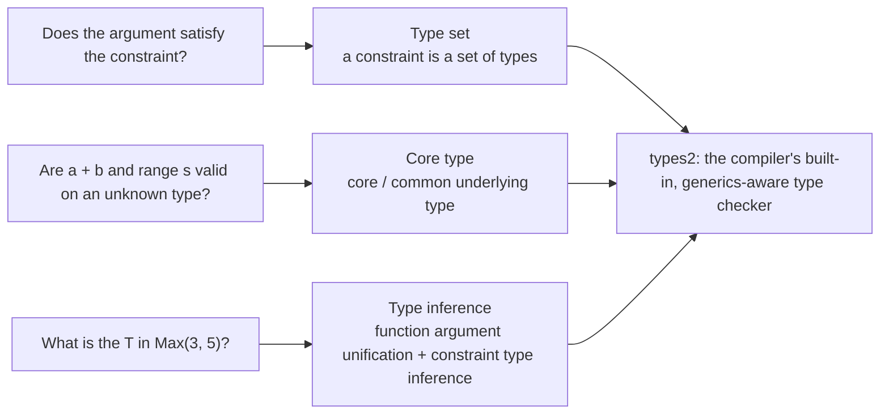

# 8.3 Type-Checking Techniques

Generics pose a far harder problem to the type checker than before. The old judgment had only one shape: "is this value of this type?" With type parameters, the checker now has to answer three new questions: whether a type argument satisfies a constraint, whether an operation like `a + b` is valid on an unknown type, and what that unwritten `T` actually is when you call `Max(3, 5)`. These three concerns correspond to the three topics of this section: type sets, core types, and type inference. They are where the design from [8.1](./history.md) lands as concrete compile-time technique, and they are also a prelude to the front end of [15 The Compiler](../../part5toolchain/ch15compile).

The yardstick that runs through this section is a single sentence: generics sharply raise the complexity of the type system, and Go works to keep that complexity shut inside the compiler rather than letting it spill out to the user. After reading, you should be able to say clearly which techniques achieve this "shutting in." The three new questions and three techniques correspond one to one, and form the skeleton of this section:



## 8.3.1 Type Sets: A Constraint Is a Set of Types

The core concept of a constraint is the **type set**. An ordinary interface describes "which methods exist"; a constraint interface goes further and describes "**which types belong to me**." Generalizing the interface from a method set to a type set ([8.1.2](./history.md)) is the key step that lets the existing interface syntax carry constraints directly.

A type set is built as a union of **type terms**. The spec defines the semantics of type terms very cleanly, and the `term` struct in the compiler's `cmd/compile/internal/types2` copies this set-theoretic notation verbatim:

```go
// types2/typeterm.go: a type term describes one most-basic type set (sketch)
//
//   ∅:  (*term)(nil)     == ∅                      // empty set
//   𝓤:  &term{}          == 𝓤                      // universe (all types)
//   T:  &term{false, T}  == {T}                    // exactly the single type T
//  ~t:  &term{true, t}   == {t' | under(t') == t}  // all types whose underlying type is t
type term struct {
    tilde bool // valid only when typ != nil
    typ   Type
}
```

So the three ways of writing a term in a constraint each correspond to one kind of type set: `int` is the singleton set $\{\texttt{int}\}$; `~int` is $\{t \mid \mathrm{under}(t) = \texttt{int}\}$, that is, all types whose underlying type is `int` (`~` takes the underlying type, so `type Celsius float64` falls within `~float64`); and `A | B` is the union $S_A \cup S_B$. The spec puts two hard constraints on `~T`: the underlying type of `T` must be `T` itself (`~MyInt` is illegal), and `T` may not be an interface (`~error` is illegal). The final type set of a constraint interface is the **intersection** of the union of its type terms with the sets implied by each of its methods:

```go
// types2/typeset.go: the type set of an interface (sketch)
type _TypeSet struct {
    methods    []*Func  // all methods of the interface, sorted by unique ID
    terms      termlist // list of type terms, whose union describes "which types are in the set"
    comparable bool     // whether comparability is additionally required
}
```

"Type $T$ satisfies constraint $C$" now has a precise definition: $T$ implements every method in `methods`, **and** $T$ falls within the set described by `terms` (and must be comparable as well if `comparable` is true). What the checker has to do is compute these sets and then decide membership.

`comparable` deserves a separate note. It cannot be written as a union of type terms, so it is represented inside `_TypeSet` by a standalone boolean, a special built-in element in the constraint machinery. In go1.18 it strictly meant "types for which `==` is guaranteed at compile time never to panic," excluding interfaces. go1.20 relaxed the rule: ordinary interfaces may now satisfy `comparable`, at the cost that comparing two interface values whose dynamic types are not comparable will panic at **run time**. This is one place where, for the sake of expressiveness, part of the check is deferred from compile time to run time.

## 8.3.2 Core Types: Giving Structure-Dependent Operations a Definition

Type sets solve "who may be passed in," but inside a generic function body there is a second difficulty. It splits into two categories whose rules differ, and we need to keep them apart here.

The first category is **operators**. Write `func Sum[T Float](a, b T) T` and then `a + b`; the spec's rule is direct: when an operand's type is a type parameter, **the operator must be valid for every type in the type set**, and the operation is carried out at the precision of the concrete type argument at instantiation. So `a + b` is entirely valid on `interface{ ~float32 | ~float64 }`, since `+` is defined for both underlying types; `a < b` is likewise valid on `constraints.Ordered` (a union of a dozen-odd distinct underlying types), and it is exactly this that makes `slices.Sort` possible. Operators take the "every individual type supports it" path; they do **not** require the type set to have a single shared underlying type.

The second category is what needs a **core type**: those operations that can only be defined by relying on a single underlying **structure**. `range`, `append`, the slice expression `s[i:j]`, `make`, and channel send/receive when the element types differ all fall here. The intuition is: if all types in a constraint's type set share the same underlying type, that underlying type is the core type; with it, the compiler knows by what structure `range s` should iterate and what type `s[i:j]` slices out to. The spec's wording for these cases is "all types in the type set must have the same underlying type." The constraint `~[]E` has core type `[]E`, so `append`, `range`, and slicing are all valid; whereas `interface{ ~[]int | ~[2]int }` has no core type (one underlying is a slice, the other an array), so `range` and slicing are undefined on it.

This line is drawn finer than intuition suggests. Although they are all "container" operations, `len`, `cap`, and **indexing** `s[0]` do not require a core type: it suffices that every type in the type set supports them individually, so all three are still valid on `~[]int | ~[2]int` (both arrays and slices have a length and can be indexed), even though it has no core type. In other words, Go sorts operations finely by "whether a shared underlying structure is needed": to iterate or slice, you need a core type; merely to take a length or an index, individual support per type is enough. Lumping the "per type" rules (operators, `len`) together with the "core type" rules (`range`, slicing) is the most common misunderstanding when first learning generics.

The channel exception in `commonUnder` is exactly what shows why a core type is not the literal "underlying types are identical." Two channels with different directions (`chan T` and `<-chan T`) do not have strictly identical underlying types, but they can be merged onto the more restricted direction, so `interface{ chan T | <-chan T }` still has a usable core type. Trivial exceptions of this kind are precisely why the dedicated term "core type" was coined back then.

These concepts were called "core type" in the spec from go1.18 through go1.24. Starting with go1.25, the spec dropped the term and adopted a plainer phrasing: **common underlying type**, that is, "the underlying types of all types in the type set, if they are identical to each other, that identical underlying type." The corresponding function inside the compiler is named `commonUnder`:

```go
// types2/under.go: compute the common underlying type of a group of types (sketch)
func commonUnder(t Type, cond func(t, u Type) *typeError) (Type, *typeError) {
    var cu Type // the common underlying type so far
    for t, u := range typeset(t) {
        if cu == nil {            // the first type seen; record its underlying type
            cu = u
            continue
        }
        // the underlying type of every subsequent type must match the previous one,
        // otherwise there is no common underlying type
        if !Identical(cu, u) {
            return nil, typeErrorf("...have different underlying types")
        }
    }
    return cu, nil
}
```

The sketch above leaves out the channel-merging logic in the real `commonUnder` (the direction exception mentioned in §8.3.2), which is exactly where the precise semantics of core types live. After go1.25 simplified the terminology, the spec describes the same thing with "common underlying type" plus a separate clause for channels. What is interesting is that the comment on the compiler's internal `coreTerm` still reads "if tpar has a core type" to this day: the specification renamed it first, and the implementation's old terminology often lags behind. This is a common phenomenon when reading compiler source.

## 8.3.3 Type Inference: Letting Callers Write Fewer Type Arguments

If every call to a generic function had to spell out all type arguments in full, `Max[int](3, 5)`, `Map[string, int](...)`, generics would degenerate into verbose syntax. Go's checker implements **type inference**, so the vast majority of calls can be written as just `Max(3, 5)`, with the missing `T` worked out by the compiler from context. Inference is the heaviest part of Go generics' "do not bother the user" promise.

Inference proceeds in stages in `types2/infer.go`, around two sources of information:

- **Function argument type inference**: it performs **unification** of the argument types against the corresponding parameter types, so from `Max(3, 5)`, where `3` and `5` are untyped constants whose default type is `int`, it derives `T = int`. Untyped constants are handled in a separate stage: first the type parameters that can be fixed are fixed using arguments with explicit types, then the constants fill in the rest, and for each type parameter still left open its "largest untyped type" is taken.
- **Constraint type inference**: when the function arguments are not enough to fix all type parameters, it instead extracts information from **the structure of the constraint itself**. If a type parameter `P`'s constraint has only a single type term, or has a core type, `coreTerm` can give a candidate type for `P` from that, propagating known type parameters along the constraint's structure to the unknown ones.

```go
// the entry point to inference (signature sketch). Given some targs, complete the rest via constraint structure
//   tparams: all type parameters      targs: arguments explicitly given or already inferred
//   params/args: parameters and arguments    returns: all completed type arguments, or nil on failure
func (check *Checker) infer(pos syntax.Pos, tparams []*TypeParam,
    targs []Type, params *Tuple, args []*operand, ...) (inferred []Type)
```

The power of constraint type inference is clearest with an example. Consider a function that scales a slice element by element:

```go
// E does not appear in any parameter, so function argument inference alone cannot fix it
func Scale[S ~[]E, E Number](s S, c E) S {
    r := make(S, len(s))
    for i, v := range s {
        r[i] = v * c
    }
    return r
}

var v []int
Scale(v, 2) // the caller writes neither S nor E
```

In the first stage, function argument inference fixes `S = []int` from the argument `v []int`. But `E` does not appear in any parameter type, so the function arguments can do nothing about it. In the second stage, constraint type inference steps in: `S`'s constraint is `~[]E`, and unifying the already-fixed `S = []int` against the constraint structure `~[]E` immediately gives `E = int`. A type parameter that never shows up in the parameter list is thus solved back out from the structure of the constraint itself. Many "container plus element" signatures in the `constraints` package depend on this step.

Starting with go1.21, inference also supports **reverse type inference**: when an uninstantiated generic function is assigned to a variable of a named function type, the type arguments can be inferred back from that function type. Inference grows stronger with each release, but its direction stays restrained.

This restraint is a deliberate Go trade-off. The inference algorithm has to balance two goals: "strong enough" (write fewer annotations) and "predictable" (no surprising results inferred, with good error messages when inference fails). Go chooses to make inference a **local, call-site, staged** process, preferring to occasionally require explicit annotation over letting inference behavior become hard to anticipate. This contrasts with more aggressive neighbors: Haskell's Hindley-Milner does global inference within a binding group, often letting function signatures be omitted entirely; Rust does bidirectional inference within a block, able to back-fill types across a fairly long distance. Go's inference does not cross call boundaries and does no global solving, and in return its error messages can point precisely at "which type parameter could not be fixed, and why," which for a language that stakes its identity on readability is the more important property. The concession in expressiveness is made for clarity in diagnostics.

## 8.3.4 types2: The Compiler's Own, Generics-Aware Type Checker

Underpinning all of the above is a package inside the compiler named **`types2`** (`cmd/compile/internal/types2`). It is the sibling implementation of the standard library's `go/types`: the two share an algorithm and align in behavior, but `types2` is written specifically for the compiler front end, consumes the syntax tree from `cmd/compile/internal/syntax` directly, and supports type parameters natively. When generics landed, the team chose to implement this complex machinery of type sets, core types, and unification-based inference in `types2`, then have `go/types` follow the same logic.

Why maintain two nearly parallel type checkers? Because they serve two very different kinds of customers. `types2` serves compilation itself; it needs to mesh tightly with the compilation pipeline and is sensitive to compilation performance. `go/types`, by contrast, is a publicly available library on which `gopls`, all sorts of linters, and code generators are built ([16 Tools and Observability](../../part5toolchain/ch16tools)). Making type checking a reusable library means that go-to-definition, completion, and renaming in the editor share the same understanding of a given piece of generic code as the compiler. This design of "the compiler and the tools sharing one set of type semantics" is a cornerstone of the stability of Go's tooling ecosystem. The cost is that the two implementations have to stay in sync over the long term, a maintenance burden carried by the Go team and invisible to the user.

## 8.3.5 The Boundaries Still Unsolved

The restraint of inference is a design choice, and it also means inference deliberately stops short of certain boundaries, boundaries that remain to this day. First, inference is **incomplete**: there are cases that are in principle solvable on the type level but that Go's local staged algorithm does not solve, where you still have to write out the type arguments explicitly. The team accepts this occasional verbosity in exchange for a predictable algorithm. Second, **methods may not carry their own type parameters**: `func (r Recv) M[T any]()` is illegal; generics can only be attached to type or function declarations. This restriction keeps the semantics of interfaces and method sets simple, but it also blocks a class of expression (for example, putting a generic method inside a non-generic interface). Third, inference mainly serves **function calls**; for the instantiation of generic **types**, the type arguments must in most cases still be given explicitly. These boundaries are not bugs but to-do items left by the strategy of "first make the conservative, predictable core solid, then relax it cautiously version by version." go1.21's reverse inference was one such piece filled in this way, and later versions continue at the same pace.

## 8.3.6 Trade-off: Relocating Complexity

Type checking for generics is a marked jump in the complexity of Go's type system. The union and intersection arithmetic of type sets, the solving of core types, the unification-driven multi-stage inference, each is far more involved than the checks before generics. The Go team accepted this complexity, but shut it almost entirely inside the **compiler**:

- For the user, a constraint **is just an interface**; there is no new contract syntax to learn ([8.1.2](./history.md));
- Calling a generic function **mostly does not require writing type arguments**; inference fills them in for the user;
- When inference and constraint checking fail, the error messages **strive to point at a specific type parameter** rather than dumping a pile of solver intermediate state.

This is the other face of [8.1](./history.md)'s "cracking the generics dilemma." There the topic was run time: GC-shape stenciling plus dictionaries, striking a compromise between code bloat and run-time performance. Here the topic is compile time: type sets plus conservative inference, striking a compromise between expressiveness and cognitive load. Only the two faces together make up Go's complete answer to that thirteen-year problem. The complexity did not disappear; it was moved into the compiler, the place that bothers the user least. Good language design is often exactly this: relocating complexity time and again, rather than eliminating it.

## Further Reading

1. Ian Lance Taylor, Robert Griesemer. *Type Parameters Proposal.* (The design rationale for type sets, core types, function argument inference, and constraint type inference.)
   https://go.googlesource.com/proposal/+/refs/heads/master/design/43651-type-parameters.md
2. Robert Griesemer. *Everything You Always Wanted to Know About Type Inference, And a Little
   Bit More.* The Go Blog, 2023-10-09. https://go.dev/blog/type-inference
3. The Go Programming Language Specification: *Interface types / Type sets / Type constraints.*
   https://go.dev/ref/spec#Interface_types
4. The Go Programming Language Specification: *Type inference.* (Including go1.21 reverse inference.)
   https://go.dev/ref/spec#Type_inference
5. The Go Authors. go1.25 spec change: "common underlying type" replaces "core type."
   https://go.dev/doc/go1.25 ; specification definition at https://go.dev/ref/spec#Underlying_types
6. The Go Authors. *cmd/compile/internal/types2* (the generics type checker of the compiler front end:
   `typeset.go`, `typeterm.go`, `under.go`, `infer.go`).
   https://github.com/golang/go/tree/master/src/cmd/compile/internal/types2
7. The Go Authors. *go/types* package documentation (the sibling implementation that drives gopls and linters).
   https://pkg.go.dev/go/types
