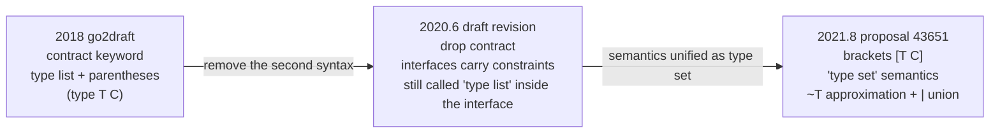

# 8.2 Contract-Based Generics

> This section has a companion online talk: [on YouTube](https://www.youtube.com/watch?v=E16Y6bI2S08),
> [Google Slides deck](https://changkun.de/s/go2generics/). The deck was recorded in 2019, while the contracts
> proposal was still under discussion, and it corroborates this section.

[8.1](./history.md) glossed over the evolution "contracts came first, then a turn toward interfaces as constraints"
in a single sentence. This section unfolds that sentence: what contracts actually looked like, how much expressive
power they had, and why they were ultimately abandoned. This rejected design is not historical waste; it explains
where today's `[T Ordered]` syntax came from, and it illustrates a move that recurs throughout Go's design: first
produce a highly expressive but somewhat complex scheme, then turn back and ask "can this be expressed with concepts
we already have", forcing complexity to earn its right to exist.

All of the `contract` syntax shown in this section is obsolete. It appears only in the go2draft drafts from 2018 to
2020, and **no Go compiler ever accepted it**. Wherever contract notation appears below, it is presented as it
originally stood in the drafts and is explicitly marked "obsolete", to avoid confusion with the syntax usable today.

## 8.2.1 What Constraints Are Meant to Solve

A generic function sooner or later has to answer one question: which operations can the type parameter `T` perform?
Write a `Max` that computes the larger value, and the function body needs the comparison operator `<`; yet if `T`
is instantiated to a type that does not support comparison (a struct or a slice, say), the code falls apart. So a
generic mechanism must provide a way for the author to **declare** which operations `T` must support, and let the
compiler check this at the instantiation site. This is the "constraint".

A constraint is not an optional ornament. Without it, generics are left with only two fallbacks: either leave the
type **entirely unconstrained**, as early C++ templates did, where type errors are deferred to instantiation time
and surface as a long, hard-to-read error message; or **give up static information** like `interface{}` does,
relying on runtime assertions to paper over the gap and throwing away type safety and performance together (the
dilemma in [8.1](./history.md)). The value of a constraint is to state up front, at the declaration, what "T must
be able to do", so that errors are caught at the call site and the compiler has a basis for generating correct code.
Only one question remains: what syntax should express this set of requirements.

## 8.2.2 Contracts: a Piece of Code That Never Runs

The first answer, given by the 2018 go2draft, was to introduce a new keyword `contract`. A contract takes the shape
of a function: it carries a set of type parameters, and the function body **lists** the conditions those types must
satisfy. Take `Max`: the most naive idea is to write the operators to be used directly in the body (this is an earlier
form the draft explored):

```go
// Obsolete: an early 2018 draft idea, operators written directly into the contract body
contract Ordered(t T) {
    t < t
}
func Max(type T Ordered)(a, b T) T {
    if a < b {
        return b
    }
    return a
}
```

The `t < t` in the contract body is not a statement to be executed; it means "every type `T` that satisfies
`Ordered` must support `<`". Note how the type parameters are declared: the draft uses **parentheses**:
`func Max(type T Ordered)(a, b T) T`, with a `type` keyword prefixing the type parameter list. This is a different
syntax from today's brackets `[T Ordered]`, and the switch of brackets from round to square is itself part of the
evolution the rest of this section will recount.

Writing operators into the function body looks natural, but it quickly runs into trouble: an operator requirement
written as `+(T, T) T` is both repetitive and ambiguous, and it gets tangled up with the automatic semicolon
insertion rules. The draft therefore turned to a clearer form, the **type list**: directly enumerate which concrete
types belong to the contract. This is the canonical form of contracts in go2draft:

```go
// Obsolete: the canonical 2018 draft form, a type list enumerating the allowed underlying types
contract Ordered(T) {
    T int, int8, int16, int32, int64,
        uint, uint8, uint16, uint32, uint64, uintptr,
        float32, float64,
        string
}
func Max(type T Ordered)(a, b T) T {
    if a < b {
        return b
    }
    return a
}
```

The types `Ordered` lists all happen to support `<`, so the compiler need only confirm that `T` is instantiated to
one of the types in the list, and it knows `a < b` is legal. A method requirement is written on a separate line,
the type name followed by the method signature:

```go
// Obsolete: requires T to implement String() string
contract Stringer(T) {
    T String() string
}
```

Contracts can also be **composed**: embedding the name of another contract in the body is equivalent to expanding
the embedded contract's conditions in place.

```go
// Obsolete: embeds Stringer, then adds a Print method requirement
contract PrintStringer(X) {
    Stringer(X)
    X Print()
}
```

What best demonstrates a contract's expressive power is its ability to constrain **the relationship between several
type parameters**. A contract can carry two type parameters `(P1, P2)` and write cross-parameter method signatures
in the body, requiring `P1` to have a method that takes a `P1` and returns a `P2`, while also bounding the
underlying type of `P2`:

```go
// Obsolete: constrains the two type parameters P1, P2 and their mutual relationship
contract C(P1, P2) {
    P1 m1(x P1)
    P2 m2(x P1) P2
    P2 int, float64
}
func F(type P1, P2 C)(x P1, y P2) P2 { /* ... */ }
```

The line `m2(x P1) P2` engages two type parameters at once: it requires `P2` to have a method whose parameter type
is `P1` and whose return type is `P2`. This kind of cross-parameter relationship constraint is something an ordinary
interface (which describes a single type) cannot naturally express; it is precisely the source of the contract's
"like a second language" expressiveness, and it is the hard part that the later interface-based replacement had to
work out how to carry over. At this point the contract's full repertoire is laid out: enumerate underlying types,
require methods, compose existing contracts, constrain multi-parameter relationships. It is indeed powerful, able to
describe nearly any imaginable inter-type constraint; and this "almost omnipotent" quality is exactly where its
hazard lies.

## 8.2.3 Why It Was Abandoned

The problem lies precisely in being "powerful". A contract writes a constraint as a piece of code that resembles a
function body yet never executes, and this "seeming-but-not" imposes two layers of cognitive burden. First, what one
can write inside a contract body follows its own set of rules: which statements are legal, that `t < t` denotes an
operator requirement rather than an evaluation, that the type list is comma-separated, that method requirements take
yet another form. These rules hold only inside a contract body, and they look like real Go code without being it.
The reader has to keep a switch in mind: "this is a contract context, not an ordinary function." Second, it erects a
**second declaration mechanism** in the language: to describe "which methods a value has" you use `interface`, but to
describe "which conditions a type parameter must satisfy" you have to use `contract`, two facilities with heavily
overlapping responsibilities yet each with its own syntax.

"The Next Step for Generics" of June 2020 stated this concern plainly: "The biggest change is that we are dropping
the idea of contracts. The difference between contracts and interface types was confusing, so we're eliminating that
difference." This is Go's consistent taste: it is extremely wary of "adding a small language to the language", and it
would rather generalize an existing abstraction than lightly introduce a new mechanism that has to be learned
separately. The contract was rejected not because it could not do the job, but because it asked users to learn a new
thing, and what that new thing did, another concept everyone already understood could carry just as well.

## 8.2.4 The Simplifying Insight: From Method Set to Type Set

The old concept that could carry the constraint's job is the interface. An interface originally describes "which
**methods** a type must have", its **method set** semantics. The "which operations a type must support" that a
constraint wants to express overlaps heavily with this: a method is an operation, and an operator is an operation too.
The only gap is that an interface originally could not say a requirement like "the underlying type of `T` must be
`int`".

The key to simplification is to generalize the interface's semantics from "method set" to **type set**: an interface
no longer describes only "the types that implement this set of methods", but directly describes "**which types**
satisfy it". A method set is a special case of a type set (all the types implementing a given set of methods form a
set), and a type set can be delineated in other ways too: enumerating underlying types, taking unions, the built-in
`comparable`. A constraint therefore need not invent `contract`; reusing the interface suffices. `Ordered` turns
from a piece of contract code into an ordinary (constraint) interface:

```go
// Final design: a constraint is just an interface described by a type set
type Ordered interface {
    ~int | ~int8 | ~int16 | ~int32 | ~int64 |
        ~uint | ~uint8 | ~uint16 | ~uint32 | ~uint64 | ~uintptr |
        ~float32 | ~float64 |
        ~string
}
func Max[T Ordered](a, b T) T {
    if a < b {
        return b
    }
    return a
}
```

The same `Max`, read side by side, makes the gains of this trade-off clearest. Two notations serving the type set
appear in the new form: `|` is **union**, merging several types into the same set; `~T` denotes "all types whose
underlying type is `T`". With `~`, a custom type like `type Celsius float64`, whose underlying type is `float64`,
also falls within `Ordered`, without having to be listed one by one. Method requirements directly reuse the
interface's existing notation (`String() string`), with no separate rules. A contract that embeds another contract
also reverts to interface embedding. A small language is dismantled and lands back on `interface`, a concept that
already existed.

As for the hard part at the end of 8.2.2, the "ordinary interfaces cannot express it" of a contract constraining the
relationship among several type parameters, the interface approach picks it up via **parameterized interfaces**. The
cross-parameter requirement that the old contract `C(P1, P2)` described can be split into two interfaces each carrying
type parameters, and then `F`'s type parameter list aligns their parameters:

```go
// Final design: parameterized interfaces carry the old contract's multi-parameter relationship constraint
type I1[P1 any] interface {
    m1(x P1)
}
type I2[P1, P2 any] interface {
    m2(x P1) P2
    ~int | ~float64
}
func F[P1 I1[P1], P2 I2[P1, P2]](x P1, y P2) P2 { /* ... */ }
```

The line `F[P1 I1[P1], P2 I2[P1, P2]]` binds the `P1` inside `I2` to the `P1` of `I1` as the same type at
instantiation; the relationship the contract once expressed with dedicated syntax thus falls into the existing
combination rules of interfaces and type parameters, without inventing one more concept. For a common kind of
constraint that the contract had to express awkwardly through enumeration, "this type must support `==`", the type
set approach also has a built-in `comparable`, taking "comparable" directly into the language as a type set and
sparing the clumsiness of listing every comparable type the way `Ordered` does. In other words, the simplification
did not lose the contract's core expressive power; it gave a more convenient notation at exactly the tightest spots.

## 8.2.5 The Timeline of the Evolution

Going from contracts to type sets did not happen in one step; it shed weight in two successive stages, each one
throwing off some mechanism. Straightened out, the timeline is:



The first step was in June 2020: the contract was removed wholesale, the constraint's job handed to the interface,
while the interface still used the term "type list" internally (there was as yet no `~` or "type set" terminology).
The second step landed in the final proposal 43651 of August 2021: the syntax settled on the brackets
`[T Constraint]`, and the interface's semantics were formally stated as "type set", introducing the `~T` approximation
element and the `|` union operator. It was in this revision that "type set" became the canonical term, and `Ordered`
took the form it has today. Worth mentioning is that the type parameter brackets also went from round to square along
this line: round parentheses `(type T C)` were hard to tell apart from an ordinary parameter list mixed in together,
while square brackets `[T C]` are recognizable at a glance, the same drive to "lower the reader's burden" carried into
a syntactic detail.

Each step does subtraction: first remove the `contract` keyword, then fold "type list" into the single unified
semantics of "type set". Complexity does not vanish out of thin air; it is repeatedly asked "can this be expressed
with existing concepts", squeezed down until only one thing remains, the natural extension of the single old
abstraction that is the interface.

## 8.2.6 What This Trade-off Tells Us

The rise and fall of contracts is a specimen of Go's design process. What it confirms is not an empty slogan like
"simple is always better than complex", but a more concrete working method: **first allow a highly expressive but
somewhat complex scheme to exist, then repeatedly ask whether an existing concept can replace it, and let complexity
prove that it is indispensable**. The contract did not pass this test: it asked users to learn a small language used
only for constraints, and everything it did, the generalized interface could do. The complexity did not earn its
place, so it was cut.

Widen the view beyond Go, and this arc is not alone. C++'s **Concepts** is almost the same story: it was a mechanism
for describing constraints on template parameters, was deemed too complex and **removed** from the C++0x draft in 2009,
then went through years of rework and only landed officially, in a streamlined form, in C++20 (it is exactly Concepts
that Stroustrup discusses in this chapter's epigraph). A constraint mechanism shelved for being complex, then
returning after simplification: Go's contract walked the same path, except it completed this self-streamlining before
landing, without pushing the complexity onto users to bear one round and then recover. The comparison shows that "how
to express constraints" is a recognized thorny problem in generics design, one that every camp has paid tuition on.

Once this abandoned history is understood, the "just-right plainness" of today's `[T Constraint]` is no longer to be
taken for granted; it is the result of a powerful scheme being rejected and then simplified. Next, [8.3](./checker.md)
will enter type checking, to see how the compiler uses the type set semantics to genuinely verify, at the instantiation
site, whether `T` satisfies the constraint.

## Further Reading

1. Russ Cox. *The Generic Dilemma.* 2009. https://research.swtch.com/generic
   (The dilemma of generics; the constraint problem contracts set out to solve springs from the trade-off pressure here)
2. Ian Lance Taylor, Robert Griesemer. *Contracts — Draft Design* (2018, superseded).
   https://go.googlesource.com/proposal/+/master/design/go2draft-contracts.md
3. The Go Authors. *The Next Step for Generics.* 2020-06.
   https://go.dev/blog/generics-next-step (the turning point announcing the abandonment of contracts in favor of interfaces carrying constraints)
4. Ian Lance Taylor, Robert Griesemer. *Type Parameters — Draft Design* (2020, interfaces-as-constraints,
   type-list stage).
   https://go.googlesource.com/proposal/+/master/design/go2draft-type-parameters.md
5. Ian Lance Taylor, Robert Griesemer. *Type Parameters Proposal* (final design, 2021-08,
   type sets / `~T` / `|`).
   https://go.googlesource.com/proposal/+/refs/heads/master/design/43651-type-parameters.md
6. The Go Authors. *Why Generics?* Go blog, 2019. https://go.dev/blog/why-generics
7. Bjarne Stroustrup. *Concepts: The Future of Generic Programming.* 2017.
   (The rise and fall of C++ Concepts, another history of constraint-mechanism simplification isomorphic to Go's contracts)
