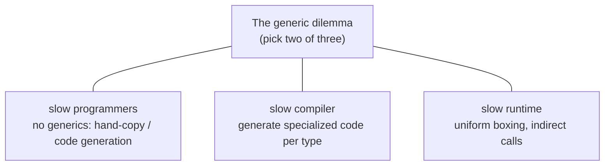
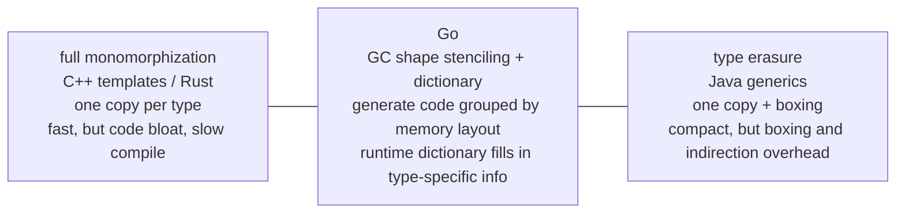

# 8.1 The Evolution of Generics Design

Generics is the feature Go waited longest for, argued about most fiercely, and that best embodies its design philosophy. From the open-source release in 2009 to its arrival in Go 1.18 in 2022, the thirteen years of hesitation and the eventual choices are themselves a lesson in language design. This section answers three questions: why Go held off on generics for so long, how it finally added them, and how they are implemented underneath. The last question matters most, because Go's implementation copies no existing precedent and instead takes a distinctive middle road, and it is that road that is Go's real answer to the thirteen-year problem. How the design itself evolved along the way (contracts, type sets, several rounds of syntax proposals) is left to [8.4](./future.md); this section takes only the skeleton.

## 8.1.1 The Long Stalemate: The Generic Dilemma

Without generics, what does a piece of code that behaves the same across several types look like? The most direct approach is to copy one version per type:

```go
func MaxInt(a, b int) int         { if a > b { return a }; return b }
func MaxFloat64(a, b float64) float64 { if a > b { return a }; return b }
func MaxUintptr(a, b uintptr) uintptr { if a > b { return a }; return b }
// ...each additional type means another copy of the same logic
```

The logic is identical to the letter, only the type differs. The second road is to use `interface{}` to erase the type differences and let one piece of code serve all types:

```go
func Max(a, b interface{}) interface{} {
    // the compiler does not know whether a and b can be compared,
    // so it can only assert at run time
    if a.(int) > b.(int) { // int is hardcoded, switching types breaks it;
                           // and every call boxes and asserts
        return a
    }
    return b
}
```

This road throws away static type safety (whether the comparison is valid is only known at run time) and carries the overhead of boxing and type assertion as well. The third road is code generation: write a template and use a tool to produce concrete versions in bulk by type. In the community, `genny` was the representative of the day:

```go
import "github.com/cheekybits/genny/generic"

// generate concrete-typed versions with genny:
//   cat max.go | genny gen "T=int,float64,uintptr" > max_gen.go
type T generic.Type

func MaxT(a, b T) T { if a > b { return a }; return b }
```

Code generation restores static typing and performance, at the cost of an extra generation step in the build pipeline, regeneration whenever you change one place, and a tool that takes no part in type checking. Each of the three roads has its trade-offs, and none is satisfying. This was the real situation Go programmers lived in for a long time.

The root of the stalemate was identified by Russ Cox as early as 2009: the generic dilemma. Among "slow programmers, slow compilers, slow runtimes", any generics implementation seems forced to pick two of the three.



Not adding generics spares the compiler and runtime cost but pushes the burden onto the programmer (the three roads above all mean exactly this). C++ templates chose a fast runtime at the expense of compile speed and code size; Java chose fast compilation and small size at the expense of runtime boxing overhead. Go cares intensely about compile speed and runtime simplicity, and for a long time found no scheme where none of the three was too bad, so it preferred to do nothing rather than hastily introduce a design that would erode these values. This "think it through before doing it" restraint is Go's consistent character.

## 8.1.2 The Syntax That Landed: Constraints Are Interfaces

The syntax that finally landed in Go 1.18 adds only one thing on top of existing concepts: declare type parameters in square brackets, and write the constraint as an interface:

```go
func Max[T cmp.Ordered](a, b T) T { // T is a type parameter, cmp.Ordered is its constraint
    if a > b {
        return a
    }
    return b
}

_ = Max[int](3, 5)   // explicit instantiation
_ = Max(3.0, 5.0)    // type inference, equivalent to Max[float64]
```

The key conceptual innovation is to generalize the interface from a "method set" to a "type set": a constraint interface no longer describes only "which methods are implemented" but "which types satisfy it". This is how `comparable` (comparable types), `~int` (types whose underlying type is int), and `int | string` (a union of types) can all be written into an interface as constraints. Carrying generic constraints on the existing interface concept avoids introducing a "second language", and this is the essence of the scheme after all its twists and turns. Constraints, type sets, and the several rounds of evolution from the 2018 contracts proposal to this syntax are covered in [8.4](./future.md).

## 8.1.3 Implementation: GC Shape Stenciling Plus Dictionaries

The implementation is where Go cracks the dilemma. The two extremes each have a cost. One end is full monomorphization, the road taken by C++ templates and Rust: the compiler generates a specialized copy of code for each concrete type argument, so `Max[int]` and `Max[float64]` are two independent pieces of machine code. The benefit is zero runtime overhead and deep specialization; the cost is code bloat, slower compilation, and (most notoriously with C++ templates) famously hard-to-read error messages. The other end is full type erasure, the way Java generics work: all instances share one piece of code, and values are uniformly boxed into `Object`. The benefit is compact code and fast compilation; the cost is the runtime overhead of boxing and indirect access. Go is unwilling to pay either full price, so it lands in the middle:



Go's approach is called "GC shape stenciling plus dictionary". The name is a mouthful, but split open it has only two halves: stencil is "a code template deduplicated by shape", and dictionary is "a runtime crib sheet that fills back the type differences". Take the first half first. It does not generate a copy of code for every concrete type, but groups by "GC shape": a set of types with the same memory layout and the same pointer positions shares one piece of generated code (one stencil, a printing plate). The reason it is called "GC shape" rather than simply "memory layout" is that garbage collection needs it to decide which words in a block of memory are pointers ([13](../../part4memory/ch13gc)); identical pointer positions are a hard condition for the same shape, which also shows that Go's implementation was entangled with its garbage collector from the start. The compiler takes a type's underlying type to represent its shape. This means `Max[int]` and `Max[float64]` have different shapes (an 8-byte integer versus an 8-byte float, scalar types do not merge), each getting its own stencil; while all calls "instantiated with a pointer argument whose constraint is just an ordinary interface" collapse into the same shape. In the compiler this step is called `Shapify`, which for a pointer argument directly takes a uniform `*byte` as the shape:

```go
// the core rule of shape merging (from cmd/compile/internal/noder's Shapify, trimmed)
//   pointer argument + constraint is an ordinary interface
//     => the element type does not affect generated code, use *byte as the shape
//   otherwise
//     => use the type's underlying type as the shape
func Shapify(targ *types.Type, basic bool) *types.Type {
    under := targ.Underlying()
    if basic && targ.IsPtr() && !targ.Elem().NotInHeap() {
        under = types.NewPtr(types.Types[types.TUINT8]) // all pointers collapse to *byte
    }
    // ...with under as the key, look up (or create) the unique shape type in the shape package
}
```

So any generic function "instantiated with a pointer whose constraint is just an ordinary interface like `any`" shares the same machine code whether the pointer points to `Node` or to `os.File`. This is the crux of how the hybrid scheme saves code size: pointers are the most common argument in generic containers, and catching them all in one net suppresses most of the monomorphization bloat. It should be noted that the current implementation collapses only pointers, scalars of the same size (such as `int` and `int64`) are not yet merged, and a `TODO` in the source still lists more aggressive shape merging as future work. The coarser the shape, the more code saved, but the heavier the dictionary and indirection overhead discussed below, and this is a knob still being tuned.

If one stencil must serve several concrete types, where does the missing "type-specific information" come from? The answer is that it is passed in at call time as a hidden argument: a "runtime dictionary". Each instantiated generic function corresponds to a compile-time-generated dictionary that carries, on demand, exactly what this instance actually uses:

```go
// what a generic instance's runtime dictionary carries (a conceptual sketch, not the source struct)
type dictionary struct {
    // type descriptors of type parameters and derived types:
    // used for new, type assertion, putting a value into interface{}
    typ_T      *_type   // the descriptor of T's type argument, such as *Node
    derived    []*_type // descriptors of derived types appearing in the body, such as []T, map[T]V

    // subdictionaries: if the body calls other generic functions,
    // the callee's dictionary is prepared here in advance
    subdicts   []unsafe.Pointer

    // itab: the interface table needed when converting a type argument to a constraint interface (see 4.2)
    itabs      []*itab

    // method expressions of type parameters: if the constraint declares methods,
    // the concrete implementations resolved by argument type
    methods    []unsafe.Pointer
}
```

These categories of entries are not listed out of thin air; they correspond to the several groups of data the compiler's internal `readerDict` actually holds (type descriptors, subdictionaries, itabs, method expressions). The logic is: anything "that cannot be determined from the shape alone and requires knowing the concrete type" is not computed by the shape code itself but fetched from the dictionary. To `new(T)`, look up `typ_T`; to put `T` into `interface{}`, look up its descriptor; to call a method in the constraint, look up `methods`; to call another generic function, pass down the corresponding `subdicts`.

This idea of "passing type-related things explicitly as hidden arguments" descends from the same line as Haskell's "dictionary passing for type classes" discussed in [4.2](../ch04type/interface.md). When Haskell compiles a function constrained by `Ord a`, it packages the method implementations of `Ord` into a dictionary and passes it as an extra argument; Go's runtime dictionary is exactly the echo of this mechanism in an imperative language. The cost on both ends is the same too: one indirect access through the dictionary. A hand-written function constrained by a concrete interface that calls its methods directly does a method call as an ordinary interface dispatch; the shaped version, if it needs to call a constraint method or construct a value of `T`, must first read the dictionary and then jump indirectly, so generic code is sometimes not necessarily faster than hand-written concrete-type code. This is a direction the Go team keeps polishing in later versions, and it is the interest the hybrid scheme pays for saving code.

Run this mechanism through `Max` once and the whole picture connects. `Max`'s constraint is `cmp.Ordered`, which can only accept scalars that can be ordered (integers, floats, strings), so in this `Max` example there is no pointer collapse to speak of: each concrete type gets its own stencil, and `>` is compiled directly into the machine instruction for that shape, without going through the dictionary:

```go
_ = Max[int]    // shape int    => stencil_A, > compiled to an integer-compare instruction, dictionary carries only the int descriptor
_ = Max[int64]  // shape int64  => stencil_B (scalars do not merge), dictionary carries the int64 descriptor
_ = Max[string] // shape string => stencil_C, > compiled to a string compare, dictionary carries the string descriptor
```

The benefit of pointer collapse only shows up with a different constraint. Consider an `any`-constrained utility function that only moves elements around and does not compare them:

```go
func Last[T any](s []T) T { return s[len(s)-1] }

_ = Last[*Node] // shape *byte => stencil_P, dictionary carries the descriptor of *Node
_ = Last[*File] // shape *byte => reuse stencil_P! only swap the dictionary to carry *File's descriptor
```

`Last`'s constraint is the ordinary interface `any`, and what type the element concretely points to does not affect the "take the last one" logic, so `Shapify` collapses all pointer arguments to `*byte`, and `Last[*Node]` and `Last[*File]` share the same machine code. You can picture this shape code as below, where everywhere that once needed to know `T` is changed to "ask the dictionary":

```go
// stencil_P serves all pointer arguments (conceptual illustration, not real generated code)
func Last_ptr(dict *dictionary, s sliceHeader) unsafe.Pointer {
    // taking the last one is just pointer arithmetic, independent of T's concrete type,
    // so the shape code can do it on its own;
    // only when the result must be put into interface{}, or for new(T),
    // does it fetch the descriptor from dict.typ_T
    return elemAt(s, s.len-1)
}
```

`Last[*Node]` and `Last[*File]` differ only in the dictionary passed in. That is the whole trick of the hybrid scheme: code is deduplicated by shape, and type differences are gathered into the dictionary. `Max` shows the side where scalars each take a copy and `>` is inlined without consulting the dictionary; `Last` shows the side where pointers collapse to share one copy and rely on the dictionary to fill in the type descriptor. Put the two sides together and you have the complete picture of GC shape stenciling.

Formally, let there be $n$ distinct concrete type arguments in the program, and after merging let there be $s$ shapes ($s \le n$, the more pointers the smaller $s$ is relative to $n$). The code volume of full monomorphization is proportional to $n$, type erasure is proportional to $1$, and Go sits between them, proportional to $s$. The cost side is the reverse: every call in monomorphization is direct, with no extra indirection; both erasure and Go must pay an indirect access, but Go's indirection happens only on operations that "must know the concrete type" (constructing `T`, boxing, calling constraint methods), which is more economical than erasure's "box everything". In other words, with a tunable $s$, Go trades a compromise point between code volume $O(s)$ and indirection overhead, and leaves the knob (how aggressive shape merging is) to the future.

## 8.1.4 A Cross-Language Comparison

Lay out the implementation strategies side by side and the landscape of generics becomes clear. **C++ templates** and **Rust** take full monomorphization: zero runtime overhead and high specialization, at the cost of code bloat, slow compilation, and hard-to-read error messages (worst in C++ templates; Rust, putting constraints up front with trait bounds, has far friendlier messages). **Java** takes type erasure: generics exist only at compile time and are erased to `Object` plus boxing at run time, so Java has no runtime generic type information (you cannot write `List<int>`, only `List<Integer>`). **C#** does reified generics: type parameters are retained at run time, value types are not boxed and reference types share code, with the CLR specializing on demand at load time, a step beyond Java. **Haskell** uses type classes with dictionary passing, and Go's dictionary method is exactly the echo of this line in an imperative language.

Go's position on this map is "middle, leaning pragmatic": it neither pays the bloat that templates pay for zero overhead and specialization, nor gives up type information entirely as erasure does, but instead shares code grouped by GC shape and fills in the differences with dictionaries, seeking a compromise that is decent on all of code volume, compile speed, and runtime performance. Its closest kindred spirit is actually C# (both retain type information, both share code for references/pointers), but Go hands the granularity of "sharing" to GC shape, a concept closer to the runtime and to garbage collection.

## 8.1.5 Trade-offs and the Future

Go generics deliberately omit many things other languages have: no template metaprogramming, no specialization, no higher-kinded types, no operator overloading, and methods cannot carry extra type parameters. These omissions are intentional, and the team repeatedly stressed "add the minimal usable generics first, then see what practice needs", avoiding repeating the mistake of "adding a pile of complex features all at once and ending up unable to move".

Later evolution continues this rhythm. Go 1.21 added generic utility packages such as `slices`, `maps`, and `cmp` to the standard library, turning generics from a language feature into a library usable day to day; Go 1.24 completed generic type aliases ([4.3](../ch04type/alias.md)); and the performance overhead from dictionary indirection, along with more aggressive shape merging, is still being polished step by step.

At the implementation level there are still unfinished pieces worth watching. The first is the granularity of shape merging, whose direction the earlier `Shapify` `TODO` already lists: collapse scalars of the same size and same alignment into one shape, recursively shapify the members of composite types, and drop the field names and tags of structs. These optimizations can push $s$ further toward $1$ and save more code, but they require first tracking precisely "how the type parameter is actually used", otherwise over-collapsing degrades operations that could have been inlined into dictionary lookups. The second is devirtualization and inlining: when the compiler can see through to the concrete instance at the call site, it ought to restore the indirect call through the dictionary to a direct one, paying back that interest. Both point to the same goal: let shaped code, while keeping its small size, approach the speed of hand-written concrete-type code. The thirteen-year story of generics is a microcosm of Go's design philosophy: extreme wariness of complexity, willing to be a step slower in order to think it through, finally landing a scheme that does not show off but holds up on every front. The origins of constraints, type sets, and the successive syntax proposals are the other half of this story, taken up next in [8.4](./future.md).

## Further Reading

1. Russ Cox. *The Generic Dilemma.* 2009.
   https://research.swtch.com/generic (the original formulation of "pick two of three")
2. Ian Lance Taylor, Robert Griesemer. *Type Parameters Proposal* (Go 1.18 generics,
   the evolution from contracts to type sets and the final syntax).
   https://go.googlesource.com/proposal/+/refs/heads/master/design/43651-type-parameters.md
3. The Go Authors. *Generics implementation: GC shape stenciling with dictionaries*
   (the go1.18 implementation design document, the main basis for this section's implementation part).
   https://go.googlesource.com/proposal/+/refs/heads/master/design/generics-implementation-dictionaries-go1.18.md
4. The Go Authors. *cmd/compile/internal/noder/reader.go* (`readerDict` and `Shapify`,
   the actual implementation of dictionary entries and shape merging).
   https://github.com/golang/go/blob/master/src/cmd/compile/internal/noder/reader.go
5. The Go Authors. *Go 1.18 Release Notes (Generics).* https://go.dev/doc/go1.18
6. Robert Griesemer, Ian Lance Taylor. *An Introduction To Generics.* 2022.
   https://go.dev/blog/intro-generics
7. Philip Wadler, Stephen Blott. *How to make ad-hoc polymorphism less ad hoc.* POPL 1989.
   (the original paper on type classes and dictionary passing, the theoretical source of Go's dictionary method)
8. The Go Authors. *Proposal: Generics (the design/15292 series).* golang/proposal.
   https://github.com/golang/proposal/tree/master/design/15292 (the archive of the successive
   generics drafts from 2010 to 2018, including Taylor's Type Functions, Generalized Types, and Type Parameters
   in Go, Mills's Compile-time Functions, and Cox's Generics: Problem Overview;
   the firsthand thread of this section's "thirteen-year evolution" originates here)
