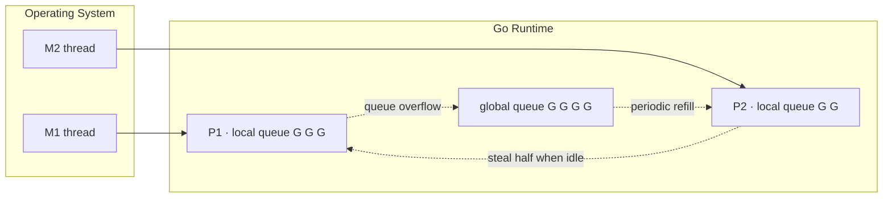
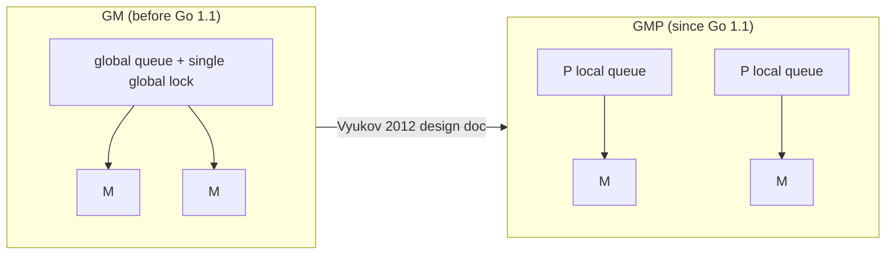

# 9.1 The Scheduling Problem and the GMP Model

Write `go f()` and a goroutine starts running. Behind that one line sits the most intricate
machine in the Go runtime: the scheduler. It has to answer a question that is not at all
simple: how can tens of thousands of goroutines take turns on a small handful of CPU cores,
running fast while letting the user barely notice it is there. This section first lays out the
problem the scheduler must solve, its overall skeleton, and its place in the larger family of
concurrent runtimes. Later sections then go deep into each component.

## 9.1.1 Three Thread Models, and a Bit of History

Mapping "concurrent tasks" onto "CPU execution resources" has historically taken three forms,
and the trade-offs they make decide everything.

- **1:1 (kernel threads)**: each user thread corresponds to one operating-system thread. You
  get true parallelism, blocking system calls are handled transparently by the kernel, and the
  implementation is simple; the cost is that every creation and switch traps into the kernel,
  and each thread must reserve a stack measured in megabytes. Linux's NPTL, modern Windows, and
  Java's platform threads all take this route.
- **N:1 (pure user threads, the early "green threads")**: many user threads are crammed onto a
  single operating-system thread. Switching is extremely cheap and stacks are tiny; but you
  **cannot use multiple cores**, and **a single blocking system call stalls every thread**,
  which is its fatal flaw.
- **M:N (hybrid / two-level)**: $M$ user threads are multiplexed onto $N$ kernel threads. This
  is both cheap and parallel, at the cost of requiring **two cooperating schedulers, one in
  user space and one in the kernel**, which is the root of its complexity.

History takes an interesting turn here. In the 1990s, M:N was held in high hopes, and the most
influential proposal was Anderson and colleagues' **scheduler activations** (SOSP 1991): let
the kernel "notify" the user-space scheduler at moments such as blocking and becoming ready, so
that the two schedulers cooperate. But industry mostly retreated to 1:1 in the end. When
Drepper and Molnar designed NPTL for Linux (2005), they stated the reason bluntly: M:N needs
two schedulers, and without cooperation performance suffers, while the cost of introducing the
kernel infrastructure needed to make them cooperate, plus the maintenance burden, was too high,
"not in line with the philosophy of the Linux kernel." So Linux chose 1:1.

Go, of all things, went back to M:N. The reason it could dodge the pitfalls of the old days
comes down to three things, and all three are in the runtime's own hands: a goroutine's stack
is small and growable (starting at a few KB), so creating and switching are both cheap; the
runtime knows every point that can block, so it can yield execution before blocking; and
network I/O is taken over by the built-in network poller ([9.9](./poller.md)), where a blocked
goroutine is suspended without holding a thread. The "blocking system call" problem that killed
N:1 back then, Go solves inside the runtime rather than by asking the kernel to provide an
activation mechanism.

## 9.1.2 The GMP Model at a Glance

The interactive diagram below puts GMP into motion: each P holds a local run queue, an M binds
to a P and runs the G at the head of the queue, and when some P's local queue and the global
queue are both empty, it steals half the work from another P. You can pause, single-step, or
manually `go func()` to watch the queues and the stealing change.

The Go scheduler is built around three abstractions, together called GMP.

- **G (goroutine)**: a piece of concurrently executing user code, together with its stack and
  execution context.
- **M (machine)**: an operating-system thread, the entity that actually executes instructions
  on the CPU.
- **P (processor)**: a logical processor, representing "the resources and permit needed to run
  Go code." The number of Ps is set by `GOMAXPROCS`, defaulting to the number of available CPU
  cores.

The relationship among the three, in one sentence: **an M must first obtain a P before it can
run a G**. The number of Ps therefore sets the upper bound on the parallelism of executing Go
code at the same time. Each P carries its own **local run queue** holding ready Gs, plus a
shared **global run queue** across all Ps as a fallback (the diagram above). A single
scheduling step, simplified, is an M bound to a P taking a G from a queue to run; when that G
yields or is preempted, the M takes the next one; when the local queue is empty, it goes
elsewhere to find work, which leads to work stealing ([9.2](./steal.md)).

A goroutine is a **stackful coroutine**: it has its own stack, can suspend from arbitrarily
nested function calls, and can be preempted. This is a fundamental dividing line against the
"stackless" route we will compare below. Go's stacks were first implemented as segmented
stacks; since Go 1.3 they switched to growable **contiguous stacks**
([14 Execution Stack Management](../../part4memory/ch14stack)).

## 9.1.3 Different Answers to the Same Problem

"How to run a vast number of concurrent units cheaply" is the problem this generation of
runtimes all faces, and Go's GMP is only one answer. Looking sideways at what others chose
makes GMP's position clearer.

- **Erlang / BEAM**: lightweight processes each have their own heap and share no mutable state;
  the scheduler preempts by **reduction count** (a reduction is roughly one function call),
  with one scheduler per core, each with its own run queue, complemented by process migration
  for load balancing. It takes "isolation" to the extreme.
- **Java virtual threads / Project Loom** (JEP 444, Java 21, finalized 2023): a virtual thread
  is a continuation plus a scheduler, mounted on a platform "carrier thread" to run and
  unmounted when it blocks; the scheduler is a FIFO work-stealing `ForkJoinPool`, with
  parallelism defaulting to the number of available cores. This is essentially M:N, exactly the
  model Drepper rejected for Linux back then and that now makes a comeback in the JVM.
- **GHC Haskell**: lightweight threads are multiplexed onto a small number of "capabilities"
  (HECs) roughly equal to the core count, paired with work stealing and `par` sparks (Marlow
  and colleagues, ICFP 2009).
- **Rust async / .NET async**: take the **stackless** route. An `async fn` is compiled into a
  state machine (`Future`), with the suspended state stored in an enum rather than a separate
  stack, driven by a runtime such as Tokio.

This points out a key design axis: **stackful vs stackless**. Go's goroutines are stackful, at
the cost of one (growable) stack each, with the benefit that they can suspend from any depth
and **can be preempted**. Rust/.NET async is stackless, saving the separate stack and fixing
the suspension points at compile time, but for that reason **it can only be scheduled
cooperatively**: a loop with no `.await` cannot be interrupted by the runtime. Go chose
stackful, and what it buys in return is exactly the "can preempt even an infinite loop"
capability of [9.7](./preemption.md).

## 9.1.4 Where P Came From: From GM to GMP

P was not there from the start. The scheduler before Go 1.1 had only G and M, all ready Gs hung
on a single global queue protected by one global lock. In 2012, Dmitry Vyukov, in the *Scalable
Go Scheduler Design Doc*, identified four ailments of this GM scheduler:

1. a single global lock and centralized state, so every goroutine-related operation has to
   contend for that lock;
2. frequent handoff of Gs between Ms, breaking locality and adding switching overhead;
3. each M carries resources such as a memory cache (mcache), holding them even when blocked in a
   system call and not running Go code, which both wastes memory and hurts locality;
4. system calls cause threads to block and wake frequently.

Introducing P treats exactly these ailments: local queues mean most enqueue and dequeue
operations no longer contend for the global lock; moving resources such as mcache onto P fixes
their count at `GOMAXPROCS` and improves locality; unbinding and rebinding M and P lets a thread
that enters a system call hand its P to another M to keep working. This GMP scheduler landed in
Go 1.1 (May 2013). A detail worth mentioning: the Go 1.1 release notes actually **do not**
describe this scheduler rewrite head-on, mentioning only in the performance section that
"tighter coupling of the runtime and network libraries reduces context switches on network
operations," which is in fact circumstantial evidence for the built-in network poller landing.
Major internal upheavals sometimes happen this quietly.

`GOMAXPROCS` is the number of Ps. Since Go 1.5 it defaults to `runtime.NumCPU()` (before that
the default was 1); since Go 1.25 the runtime, inside a container with a CPU limit, takes the
default to be $\min(\text{CPU limit}, \text{core count})$ (rounding up when the limit is
fractional), and periodically adjusts it dynamically, to avoid over-parallelizing in a
limited container because it rounded to the machine's core count. Note that "1.25" here is the
Go version number, not some multiplier.

## 9.1.5 A Bit of Scheduling Theory

> This subsection is for the interested reader; skipping it does not affect understanding the
> implementation that follows.

Why is there no "perfect" scheduler? Because a real scheduler is **online**: it decides on the
spot without knowing when future goroutines will arrive or when they will block. An **offline**
scheduler with all future information can always do better, and the gap between the two is
characterized by the **competitive ratio** (the worst-case ratio of online cost to offline
optimal cost). This gives us a clean statement: a runtime can be "provably not bad," but cannot
be "optimal."

So how "not bad" is an online choice like work stealing? Blumofe and Leiserson (JACM 1999)
proved that for a computation with total work $T_1$ and critical-path length $T_\infty$,
randomized work stealing on $P$ processors takes expected time $T_1/P + O(T_\infty)$. $T_1/P$ is
the ideal linear speedup, and $O(T_\infty)$ is the serial tail that cannot be parallelized any
further. This bound is the theoretical confidence behind Go, GHC, Erlang, and Loom all
independently choosing "one queue per core + randomized work stealing." Its full statement,
proof idea, and limits of applicability (it targets fork-join computations, and for Go's
arbitrary goroutines it is only "motivation," not a strict guarantee) are left to
[9.2](./steal.md) for a detailed discussion.

## Further Reading

1. Thomas E. Anderson, Brian N. Bershad, Edward D. Lazowska, Henry M. Levy. "Scheduler
   Activations: Effective Kernel Support for the User-Level Management of Parallelism."
   *SOSP 1991 / ACM TOCS* 10(1), 1992. https://doi.org/10.1145/146941.146944
2. Ulrich Drepper, Ingo Molnar. *The Native POSIX Thread Library for Linux.* 2005.
   https://www.akkadia.org/drepper/nptl-design.pdf (the argument for why 1:1 won)
3. Dmitry Vyukov. *Scalable Go Scheduler Design Doc.* 2012. https://go.dev/s/go11sched
4. Simon Marlow, Simon Peyton Jones, Satnam Singh. "Runtime Support for Multicore
   Haskell." *ICFP 2009*. https://doi.org/10.1145/1596550.1596563
5. OpenJDK. *JEP 444: Virtual Threads.* Java 21, 2023. https://openjdk.org/jeps/444
6. Robert D. Blumofe, Charles E. Leiserson. "Scheduling Multithreaded Computations by
   Work Stealing." *JACM* 46(5), 1999. https://doi.org/10.1145/324133.324234
7. The Go Authors. *Container-aware GOMAXPROCS.* 2025.
   https://go.dev/blog/container-aware-gomaxprocs
8. Erik Stenman. *The BEAM Book (The Erlang Runtime System).*
   https://github.com/happi/theBeamBook
9. Russ Cox. *runtime: clean up scheduler*, 2008; *things are much better now*, 2009.
   https://github.com/golang/go/commit/96824000ed89d13665f6f24ddc10b3bf812e7f47 ,
   https://github.com/golang/go/commit/fe1e49241c04c748d0e3f4762925241adcb8d7da
   (the early form of the single-global-lock single-queue scheduler, the starting point of the
   evolution described in this section)
10. Dmitry Vyukov. *runtime: improved scheduler*, 2013.
    https://github.com/golang/go/commit/779c45a50700bda0f6ec98429720802e6c1624e8
    (the key commit that turned the go11sched design into the GMP implementation)
