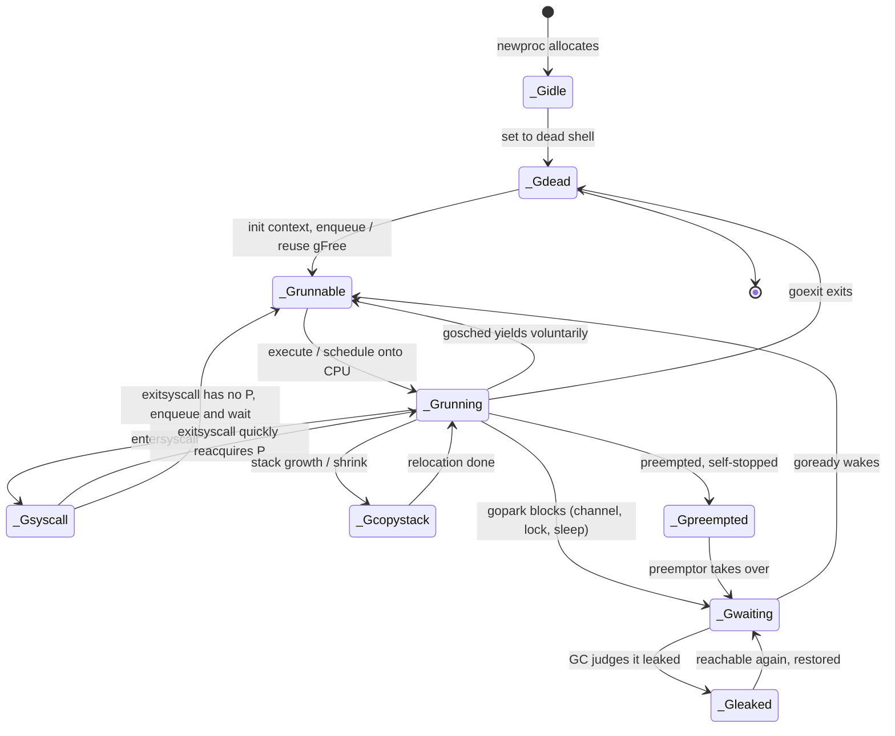

# 9.3 The MPG Model and the Units of Concurrent Scheduling

The first question a scheduler must answer is not "how to schedule" but "what to schedule." Go calls the thing being scheduled a goroutine, and carries it on a triple of M, P, and G. Before we get our hands on the scheduling algorithm (from [9.4](./schedule.md) onward), this section settles these three scheduling units: what a goroutine really is within the lineage of computer science, how its running context is encoded, why scheduling itself has to happen on a special g0, what states a goroutine passes through over its life, and how the worker thread M that carries it is parked and unparked. Once these few things are clear, the scheduling algorithms that follow are just "moving G around among these units."

To avoid sliding back into a field-by-field transliteration of the source, the structures below are trimmed sketches: we keep only the fields relevant to the design, and the comments explain why each one exists. The full definitions can be cross-checked against `runtime/runtime2.go` and `runtime/proc.go` (this section tracks go1.26).

## 9.3.1 What a goroutine is: a stackful coroutine

A goroutine is often dispatched with the single phrase "lightweight thread." That is not wrong, but it hides its real ancestry. Placed back in the lineage of computer science, a goroutine is a **stackful coroutine**.

The concept of a coroutine goes back to Conway's 1963 coinage of the term, where two subroutines act as each other's caller: each can hand over control partway through and later resume from exactly where it left off, rather than having to run to completion before returning the way an ordinary function does. Moura and Ierusalimschy gave coroutines a clear taxonomy in 2009, and its two orthogonal axes remain the basic coordinates for discussing coroutines today:

- **Symmetric versus asymmetric**: symmetric coroutines are peers, jumping between one another through a single uniform transfer primitive; asymmetric coroutines have an explicit "caller" and "callee," and the callee can only yield back to its caller. Go's user never sees a yield, but inside the runtime the relationship between a goroutine and the scheduling loop is exactly this asymmetric yield.
- **Stackful versus stackless**: a stackful coroutine owns its own independent call stack, so it can suspend **inside a nested call at any depth**, and the suspension point need not be the coroutine's entry function itself; a stackless coroutine has no independent stack and can only suspend at the top-level function, so suspending from deep within a call requires rewriting the entire call chain into a state machine.

A goroutine sits in the "asymmetric, stackful" cell. Being stackful is especially important: it means a goroutine can be suspended at any function and any call depth (whether it blocks voluntarily on `<-ch` or is preempted by the scheduler), and at suspension the entire Go call stack, together with the local variables on it, is preserved untouched; on resumption it continues from the breakpoint. Put more theoretically, one suspension is the capture of a **one-shot delimited continuation** of the current execution, and the physical form of that continuation is the `gobuf` we will cover in the next section: a set of saved registers (SP, PC, and so on) sufficient to resume execution from the breakpoint.

The price of being stackful is that every goroutine must keep a slice of stack memory resident. Go defuses this with "start small, grow on demand": a new goroutine's stack is only 2 KB (`stackMin = 2048` in `runtime/stack.go`), and when that runs short, the contiguous-stack mechanism ([14.3 Stack Growth](../../part4memory/ch14stack/grow.md)) relocates and grows it as a whole. This compresses the fixed cost of "stackful" down to a level comparable with stackless coroutines.

What being stackful buys is a way around what Nystrom in 2015 called the **function-coloring problem**. In languages with stackless coroutines (typically `async`/`await`-based implementations), a function that wants to suspend internally must itself be declared `async`, so "can suspend" becomes a color of the function, and it spreads up the call chain: a function that calls an `async` function usually must be `async` too, ordinary functions and `async` functions cannot be freely interchanged, and the standard library often has to keep one copy for each color. Stackful coroutines have no such rift: any ordinary function can suspend at any depth, with no special annotation, and the caller need not know about it. Go has no `async` keyword and no division between "asynchronous functions" and "synchronous functions," and that is a direct dividend of the stackful design.

## 9.3.2 The three scheduling units: G, M, P

To understand the scheduler, there is no getting around three concepts:

- **G**: goroutine, the execution body we create with the `go` keyword, the basic object of scheduling;
- **M**: machine, an OS worker thread, the entity that actually occupies a CPU and executes instructions;
- **P**: processor, an artificially abstracted bundle of local resources needed to execute Go code. An M can execute Go code only after it has associated with some P.

The existence of P seems puzzling at first: since M is already a thread, why insert a layer of P between M and G? The full answer waits until work stealing ([9.5](./steal.md)); for now, remember one sentence: P is "a permit to execute Go code plus a batch of local resources." Its count (`GOMAXPROCS`) sets the upper bound on how many user-code executions can run in parallel, and hanging resources such as the local run queue and memory caches off P rather than off M lets these resources change hands between threads along with the "permit," which both supports work stealing and keeps locks off the fast path.

### G: the execution body and its running context

G is the goroutine, so naturally it carries its own execution stack along with a "breakpoint snapshot" used to resume after suspension:

```go
// g: the execution body of a goroutine (sketch)
type g struct {
	stack        stack   // stack memory range [stack.lo, stack.hi)
	stackguard0  uintptr // the guard line for stack-overflow checks; setting it to stackPreempt turns it into a preemption signal
	sched        gobuf   // running context: the register snapshot saved on suspend, restored on resume
	atomicstatus uint32  // the goroutine's status (see 9.3.4), must be read and written atomically
	goid         uint64  // goroutine number
	m            *m      // the M currently running this g (nil when not running)
	param        unsafe.Pointer // a parameter passed in by the waker when this g is woken
	preempt      bool    // preemption signal, a copy of stackguard0 = stackPreempt
	waitreason   waitReason // when in _Gwaiting, records why it blocked (for diagnostics)
}
```

The `sched` field, a `gobuf`, is the physical form of the continuation discussed in 9.3.1:

```go
// gobuf: the running context of a goroutine, enough to resume execution from the breakpoint (sketch)
type gobuf struct {
	sp   uintptr        // stack pointer
	pc   uintptr        // program counter: the next instruction to execute
	g    guintptr       // the goroutine it belongs to
	ctxt unsafe.Pointer // closure context (handled specially as a GC root)
	bp   uintptr        // frame pointer (on architectures with framepointer enabled)
}
```

There is no black magic to a goroutine: at creation, the entry of the function to run is stored into `gobuf.pc` and the arguments are copied onto the execution stack; at suspension, the current SP/PC and other registers are saved back into `gobuf`; at resumption, they are poured back into the real registers and execution continues from the breakpoint. `atomicstatus` must be accessed atomically because it is read and written concurrently by other Ms (and even by the GC and the system monitor), and it is precisely the storage carrier for the [9.3.4](#934-the-goroutine-lifecycle-state-machine) state machine.

### M: the entity of an OS thread

M corresponds to a real OS thread. Its most important fields all revolve around "what a thread needs to carry with it to execute Go code":

```go
// m: an OS worker thread (sketch; the original struct has more than fifty fields)
type m struct {
	g0       *g       // the goroutine dedicated to executing scheduling and runtime code (see 9.3.3)
	curg     *g       // the user goroutine currently running
	p        puintptr // the currently associated P (without P, it cannot execute Go code)
	mcache   *mcache  // this thread's memory allocation cache (actually changes hands with P, see 12.2)
	gsignal  *g       // the goroutine dedicated to handling signals (see 9.7)
	tls      [tlsSlots]uintptr // thread-local storage, holding the current g and so on
	spinning bool     // whether it is spinning in search of work (see 9.3.6)
	alllink  *m       // links into the global allm list
}
```

Each M holds two special goroutines, `g0` and `gsignal`, which do not execute user code but take on scheduling and signal handling respectively. `curg` is the user goroutine actually running. `p` is that "execution permit": an M that loses its P (for example by entering a long-running system call) can no longer execute Go code.

### P: the local resources for executing Go code

P is the abstraction of a processor, not the processor itself. The entire point of its existence is to put the local resources needed to execute Go code close together in one place, so that the fast path is lock-free and work stealing is supported:

```go
// p: the local resources needed to execute Go code (sketch)
type p struct {
	id     int32
	status uint32   // _Pidle / _Prunning / _Psyscall / _Pgcstop ...
	m      muintptr // the associated M (nil means idle)
	mcache *mcache  // one memory allocation cache per P (lock-free fast path, see 12.2)

	// local runnable queue: a lock-free ring buffer plus a priority slot
	runqhead uint32
	runqtail uint32
	runq     [256]guintptr // ring queue of local runnable G, accessible lock-free
	runnext  guintptr      // the "run this one next" priority G: protects the locality of a just-woken goroutine
	gFree struct {         // dead G cached by this P, already exited and reusable (stack included)
		gList
		n int32
	}
}
```

The core of P is that local run queue. `runq` is a ring buffer of capacity 256; the M that holds P takes from the head and puts back at the tail, and because no one contends for it, access can be **lock-free**; stealing ([9.5](./steal.md)) happens when another P comes to take half of it. `runnext` is a single-slot priority position: when one goroutine wakes another (for example a channel send or receive), the woken one is placed into `runnext` rather than queued at the tail, so it "runs next," preserving cache locality between producer and consumer. `gFree` caches exited Gs together with their stacks, so the next `go` can reuse one and avoid a fresh allocation; this is exactly the destination of the `_Gdead` state in [9.3.4](#934-the-goroutine-lifecycle-state-machine). Hanging these resources off P and letting them change hands among Ms along with P is how the "per-P lock-free cache" move shows up in the scheduler, and it shares a lineage with the allocator's mcache ([12.2](../../part4memory/ch12alloc/component.md)) and the per-P sharding of `sync.Pool` ([11.6](../ch11sync/pool.md)).

## 9.3.3 Why scheduling runs on g0

Scheduling is itself code, and it too has to execute on some stack. If we let it run directly on a user goroutine's stack, there would be trouble: a user stack is small (2 KB initially) and may be on the verge of being relocated and grown, and runtime operations such as scheduling and stack copying simply cannot be performed safely on a stack that "could be moved at any moment." Go's solution is to give each M a dedicated `g0`: its stack is larger and fixed in place, and the runtime's scheduling loop, stack management, and other critical operations all execute on g0.

So the M switches stacks back and forth between "running user code" and "running scheduling code." Two runtime primitives carry out this switch:

- `mcall(fn)`: switches from the current user goroutine to g0, executes `fn` on the g0 stack, and `fn` never returns to the original g. Operations like `gopark` and `goschedImpl` that "yield and let the scheduler take over" all enter g0 through it.
- `systemstack(fn)`: temporarily switches to the g0 stack to execute `fn`, then switches back to the original goroutine to continue. Runtime fragments that need a larger stack or must not be preempted (such as stack growth and parts of GC work) go through it.

This way, "executing user code" and "deciding who runs next" are cleanly split across two stacks: a user goroutine only minds its business, and the moment it must yield or be scheduled, control falls to g0 through `mcall`, where `schedule()` on g0 picks the next G and jumps back into it through `execute` → `gogo`. Most of the state transitions mentioned later in this section happen right after this "switch to g0."

## 9.3.4 The goroutine lifecycle state machine

A goroutine's life is the migration of the `atomicstatus` field among a handful of states. These states are defined in `runtime/runtime2.go`, and state transitions go uniformly through `casgstatus` (compare-and-swap g status) to guarantee concurrency safety. The main states are these:

- `_Gidle`: just allocated, not yet initialized;
- `_Grunnable`: in some run queue, waiting to be scheduled, not yet executing;
- `_Grunning`: executing user code on some M, already bound to an M and a P;
- `_Gsyscall`: executing a system call, not executing user code;
- `_Gwaiting`: blocked within the runtime (for example a channel send or receive, `time.Sleep`, or acquiring a lock), not on any run queue, and needs to be woken explicitly from somewhere;
- `_Gdead`: not in use, possibly just exited or possibly an empty shell awaiting reuse, cached in `p.gFree` / `sched.gFree`;
- `_Gcopystack`: the stack is being relocated (contiguous-stack growth or shrink), and at this moment no code runs;
- `_Gpreempted`: stopped on its own because of preemption, resembling `_Gwaiting`, but waiting for the preemptor to be responsible for turning it back to `_Gwaiting`.

On top of these, go1.26 adds a diagnostic state `_Gleaked` (value 10). It is not a regular link in the lifecycle but a mark the GC puts on a blocked goroutine **suspected of leaking**: if the GC, during scanning, finds that some `_Gwaiting` goroutine can no longer be woken (it is unreachable), it marks it as leaked through `casgstatus(gp, _Gwaiting, _Gleaked)` (`runtime/mgc.go`); if it later becomes reachable again, it is restored through `casgstatus(gp0, _Gleaked, _Gwaiting)`. It is a layer of diagnostic view overlaid on "blocked," and the runtime does not reclaim that goroutine on this basis.

What drives these migrations is a set of runtime functions we will meet again and again: `newproc` creates a new G, `execute` puts it on the CPU, `gopark` blocks voluntarily, `goready` wakes, `entersyscall`/`exitsyscall` enter and leave system calls, and `goexit` exits. Marking them on the edges, a goroutine's life looks like this:



Creating a goroutine is exactly the first few steps of this diagram: `newproc` first sets the G from `_Gidle` to `_Gdead` and links it into `allg` (so the GC knows about it but does not scan its uninitialized stack), then initializes the execution stack and `gobuf` from the function entry and arguments, then `casgstatus` to `_Grunnable` and enqueues it, waiting for `execute` to push it onto the CPU. The states also include a `_Gscan` bit family that cooperates with the GC (such as `_Gscanrunning`), used to scan a goroutine's stack without interrupting it; to keep the diagram readable we omit it, and the details are in [13 Garbage Collection](../../part4memory/ch13gc).

## 9.3.5 A lateral comparison: concurrent execution bodies elsewhere

Placing the goroutine among its peers, the "stackful / stackless" taxonomy from 9.3.1 immediately shows its weight. The table below compares the concurrent execution bodies of several languages, with the key being whether they have an independent stack and the resulting "presence or absence of the function-coloring problem":

| System | Stackful? | Representation | Startup cost |
| --- | --- | --- | --- |
| Go goroutine | Yes | independent stack + `gobuf` continuation, contiguous stack grows on demand | initial stack 2 KB |
| Erlang/BEAM process | Yes | independent lightweight process, private heap, scheduled atop BEAM | on the order of hundreds of bytes |
| Java virtual thread (Loom, JEP 444) | Yes | continuation mounted onto a carrier thread for execution | stack grows on demand, far smaller than a platform thread |
| Lua coroutine | Yes (asymmetric) | independent stack, explicit yield via `coroutine.resume`/`yield` | lightweight, managed by the interpreter |
| Kotlin coroutine | No | `suspend` compiled into a CPS state machine, no independent stack | tiny (only a state object), but has function coloring |

The taxonomy column is what deserves pointing out. Go, Erlang, Java virtual threads, and Lua coroutines are all stackful, so none of them has the function-coloring problem: a call at any depth can suspend. Kotlin coroutines are stackless, with the compiler translating `suspend` functions into a continuation-passing-style (CPS) state machine, at the cost that the "color" `suspend` spreads up the call chain, which is exactly the rift that 9.3.1 says Go avoids with its stackful design. Lua coroutines deserve a special mention: the 2009 paper by Moura and Ierusalimschy that founded the coroutine taxonomy itself grew out of Lua's coroutine design, and the goroutine's "asymmetric stackful" pedigree descends from the same line, except that Go hides the explicit `resume`/`yield` inside the runtime, leaving the user with only `go` and channels.

## 9.3.6 Parking and unparking the worker thread

Finally we return to the worker thread M that carries G. The scheduler must balance two pulling demands: keep enough running threads to saturate the hardware parallelism, yet park the surplus threads to save CPU energy. The pigeonhole principle makes this tension clear: suppose the process has $n$ Ms and the user has created $p$ Gs; then when $p > n$, there must be $p - n$ Gs with no M to run them for the moment (we need more threads, that is **unpark**); when $p < n$, there must be $n - p$ Ms with no G to run (they should sleep, that is **park**).

Finding the optimal trade-off is hard, and it is hard in two places. First, multiple Ms each hold a local queue and cannot see each other's state, which is essentially a distributed system: there is no global clock that synchronizes all threads, and computing a global predicate like "is there any idle work left globally" on a barrier-free fast path is, by consensus theory, impossible. Second, the optimal park decision needs information about the future: ideally, if we knew a new G would become ready in the next instant, we should not park an M now. But when a G becomes ready is random (imagine a web service where a request arriving creates a G), and cannot be foreseen.

Several naive designs are unworkable: managing all state centrally needs a global lock, which becomes a bottleneck once there are many concurrent entities; unparking one M the moment each G becomes ready falls into thread thrashing, because "right after unparking there is again no work in the next instant"; and unconditionally unparking one extra thread every time manufactures many useless park/unpark cycles where the thread "wakes, finds no work, and immediately sleeps again."

Go's solution is to introduce a **spinning state** for worker threads: an M that finds no work in any local queue, the global queue, or the network poller does not sleep at once, but first spins briefly in search of work. The key points are:

1. when waking a G, first check whether a spinning thread already exists (`sched.nmspinning`); if so, do not unpark an additional new thread, and let the one already looking for work catch it;
2. only when an idle P exists and there is no spinning thread at all does a ready G unpark a new thread;
3. when the last spinning thread finds work and turns non-spinning, unpark a new spinning thread to take its place.

This set of rules eliminates unreasonable spikes in thread unparking while preserving the upper bound on CPU parallelism. Picture it as a bank service desk: nimble customers (the spinning Ms) stand ready to pounce on any window that opens up (a G waiting to run), and only when everyone is already in position yet a window is still empty do we invite a new customer in.

The subtlety of the implementation is entirely in the requirement that the transitions between spinning and non-spinning mesh seamlessly, or a race breaks out between "submitting a new G" and "a thread turning non-spinning," where each side ends up thinking the other will handle it, so neither does, leaving a tail of underused CPU. To this end both sides insert a `StoreLoad`-style barrier: when a G becomes ready, first enqueue the G into the local queue, then barrier, then check `nmspinning`; when a thread turns non-spinning, first decrement `nmspinning`, then barrier, then rescan all local queues to confirm there is indeed no work left behind. The two barriered checks cross each other, guaranteeing there is no window where "a just-submitted G goes unclaimed." Worth pointing out is that this unparking logic applies only to per-P local queues; submitting work to the **global queue** does not trigger thread unparking.

With that, the three scheduling units and the threads that carry them are all in place: G is the stackful coroutine being scheduled, M is the thread doing the work, and P is the permit that connects the two and carries the local resources. How they cooperate in each scheduling loop is the subject of [9.4 The Scheduling Loop](./schedule.md) and [9.5 Work Stealing](./steal.md).

## Further reading

1. Melvin E. Conway. "Design of a Separable Transition-Diagram Compiler."
   *Communications of the ACM*, 6(7), 1963. https://doi.org/10.1145/366663.366704
   (the origin of the term and concept of the coroutine)
2. Ana Lúcia de Moura and Roberto Ierusalimschy. "Revisiting Coroutines."
   *ACM TOPLAS*, 31(2), 2009. https://doi.org/10.1145/1462166.1462167
   (the symmetric/asymmetric, stackful/stackless taxonomy, rooted in Lua's coroutine design)
3. Bob Nystrom. "What Color is Your Function." 2015.
   https://journal.stuffwithstuff.com/2015/02/01/what-color-is-your-function/
   (the function-coloring problem, which stackful coroutines sidestep)
4. Keith Randall. *Contiguous Stacks* (Go design doc), 2013.
   https://docs.google.com/document/d/1wAaf1rYoM4S4gtnPh0zOlGzWtrZFQ5suE8qr2sD8uWQ
   (contiguous stacks: the implementation that drives the fixed cost of "stackful" down)
5. Dmitry Vyukov. *Scalable Go Scheduler Design Doc*, 2012.
   https://golang.org/s/go11sched (the design prototype for spinning threads, `nmspinning`, and park/unpark)
6. Ron Pressler et al. *JEP 444: Virtual Threads.* OpenJDK, 2023.
   https://openjdk.org/jeps/444 (Java Loom's stackful virtual threads)
7. Kotlin. *KEEP: Coroutines.*
   https://github.com/Kotlin/KEEP/blob/master/proposals/coroutines.md
   (stackless coroutines: `suspend` compiled into a CPS state machine)
8. The Go Authors. *runtime/runtime2.go, proc.go, stack.go.*
   https://github.com/golang/go/tree/master/src/runtime
   (the `g`/`m`/`p`/`gobuf` structures, the `_G*` state constants, `casgstatus`)
