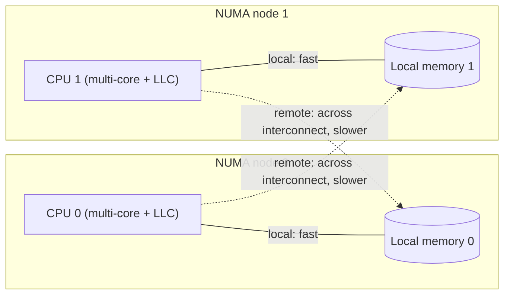

# 9.11 NUMA Awareness and the Future of the Scheduler

The scheduler described in the preceding sections rests on an assumption that was never spelled out: every M reaches memory equally fast, and moving a G between any two Ps costs the same. On a laptop or a single-socket server, that assumption is nearly true. But once you put the program on a large multi-socket server it begins to break, and the more cores there are, the wider the gap. This section is about that crack: where it comes from, why the Go scheduler has looked past it for so long, a NUMA-aware design that was carefully thought through yet never shipped, and how users today work around it.

## 9.11.1 NUMA: Memory Is No Longer a Flat Plain

On the early symmetric multiprocessing (SMP) machines, every CPU reached the same block of memory over one shared bus, and the access latency was the same regardless of which core issued the request. This "flat plain" memory model is simple, but it falls apart as core counts grow: the shared bus becomes a bottleneck, and every additional core adds another share of contention. **NUMA (non-uniform memory access)** is the answer industry settled on. The machine is split into several **nodes**, each node being a socket plus a slice of local memory wired directly to it, and the nodes are stitched into a mesh by an inter-die interconnect (Intel's UPI, AMD's Infinity Fabric). A CPU reaching memory on its own node takes the shortest path; reaching memory on another node has to cross the interconnect, one extra hop or even several.



The cost is real. Local and remote access latency typically differ by a factor of one to two, and cross-node bandwidth is also lower than local bandwidth; the exact numbers vary by platform, and on Linux you can read out the node topology and the relative distance matrix between nodes with `numactl --hardware`. More subtle than latency is the **cost of cache coherence**: when a core wants to write a line that another node has cached, the coherence protocol (the MESI family) must first invalidate that remote copy, and this "invalidation message" also has to make a round trip across the interconnect. So false sharing on NUMA ([12.2](../../part4memory/ch12alloc/component.md)) hurts more than on SMP: the same cache line is fought over repeatedly by cores on two nodes, and every write pays for a cross-node coherence round trip.

Writing this out as a rough cost model makes its meaning for scheduling clearer. Suppose a G issues $n$ memory accesses over its lifetime, of which a fraction $r \in [0,1]$ land on a remote node, with single-access local and remote latencies $t_l$ and $t_r$ respectively (typically $t_r \approx 1.5 t_l \sim 2 t_l$). Then its total access cost is roughly

$$
T(r) = n\big[(1-r)\,t_l + r\,t_r\big] = n\,t_l\Big[1 + r\big(\tfrac{t_r}{t_l} - 1\big)\Big].
$$

Ideal NUMA locality is $r \to 0$, with cost approaching $n\,t_l$; the worst case is data and executing core sitting on opposite ends, $r \to 1$, with cost doubling to $n\,t_r$. Every cross-node migration the scheduler performs is precisely the act of pushing some G's $r$ from near 0 toward a larger value. For memory-intensive workloads (large $n$) the bill is sizable; for I/O-intensive workloads where $n$ is already small, it is nearly negligible. This simple expression already foreshadows the conclusion of the NUMA design below: its payoff depends heavily on the workload.

In a word, a NUMA machine is more like a small distributed system that carries distance inside it. For the runtime running on top, "which node the data is on, which node the executing core is on" is no longer an irrelevant detail but a line item written straight into the latency bill.

## 9.11.2 Locality: the Go Runtime Has It, but Got It by Accident

The reader may ask at this point: if NUMA matters this much, how has the Go runtime survived? The answer is that it does enjoy a fair amount of locality, only this locality comes "for free" from other parts of the design rather than being aimed at NUMA.

The most important source is the **per-P mcache** ([9.3](./mpg.md), [12.2](../../part4memory/ch12alloc/component.md)). The small objects a G allocates on some P come from that P's local cache; as long as that G keeps running on the same P afterward (most likely the same core) and keeps touching the objects it just allocated, the accesses most likely land on the local node. Work stealing ([9.2](./steal.md)), with its "run the local run queue first, only go stealing when the local one is empty" policy, likewise implicitly favors letting a G make progress on the same P over time. Add the CPU affinity that the Linux kernel's CFS scheduler carries by default, which will not bounce a thread from one core to another for no reason, and the chain "G stays on its P, the P stays on its core, the core guards its local memory" holds naturally most of the time.

But "most likely" is not "guaranteed." This locality breaks in three places:

- **Work stealing is topology-oblivious.** When stealing a G, the scheduler tries every P in a pseudo-random order and steals from whoever it hits, without any regard for which node the target P is on. Once a G is stolen from a core on the node where its data lives to a core on another node, the G pays the remote cost on every subsequent access to its old data, while its newly allocated objects land on the new node, and locality tears apart.
- **Memory allocation is not node-bound.** When the mcache runs dry and restocks from mcentral and mheap ([12.2](../../part4memory/ch12alloc/component.md)), the pages it gets come from the global heap, with no guarantee of landing on the node where the current P sits. The heap arena is not partitioned by node either.
- **M, P, and node have no binding.** A P is only a logical processor; which OS thread an M is, which core it runs on, which node it belongs to, the runtime records none of it.

Put these three together and the conclusion is direct: **the Go scheduler is NUMA-oblivious.** Nowhere in the runtime source is there a notion of node, socket, or interconnect distance, and the target selection in work stealing is a topology-oblivious pseudo-random enumeration:

```go
// The target order in work stealing: entirely independent of NUMA topology (runtime/proc.go, sketch)
//
// randomOrder uses a "stride coprime with GOMAXPROCS" to do a non-repeating pseudo-random
// enumeration over all Ps: if X is coprime with count, then (i + X) % count visits 0..count-1 exactly once.
func stealWork(now int64) (gp *g, ...) {
	pp := getg().m.p.ptr()
	const stealTries = 4
	for i := 0; i < stealTries; i++ {
		// Starting from a random position, enumerate all Ps with a coprime stride. Two adjacent
		// Ps in allp may belong to different NUMA nodes; here we neither know nor care.
		for enum := stealOrder.start(cheaprand()); !enum.done(); enum.next() {
			p2 := allp[enum.position()]
			if pp == p2 || idlepMask.read(enum.position()) {
				continue
			}
			if gp := runqsteal(pp, p2, /*stealRunNextG=*/...); gp != nil {
				return gp // take it and go, whether p2 is on a near or far node
			}
		}
	}
	// ...
}
```

This is a clear-eyed trade-off, not an oversight. The next section shows that someone did design the more "correct" path in full.

## 9.11.3 A Design Complete on Paper That Never Landed

For NUMA, Dmitry Vyukov submitted a design for a NUMA-aware scheduler in 2014 (the precursor proposal to golang/go#14406). It did not tear down the MPG skeleton ([9.3](./mpg.md)) that survives to this day; instead it layered a node topology on top of it:

- **Group Ps by NUMA node.** The runtime probes the topology at startup and assigns Ps to nodes, making "the Ps on the same node" an explicit set.
- **Steal and wake near first.** When an idle P looks for work, it first steals from its sibling Ps on the same node; only when the local node truly has nothing to steal does it escalate to cross-node stealing. When waking a sleeping M/P, it likewise prefers to wake one on the same node, so related Gs stay gathered on a single node to run.
- **Localize the heap by node.** Memory allocation tries to hand out pages from the local memory of the node the current P sits on, aligning the arena with the node, so that "allocated on a node, accessed on that node" becomes the norm rather than a coincidence.

The idea is not mysterious; what is truly hard is landing it. It introduces node as a new dimension on the **fast path** of scheduling, touching the organization of the run queues, the policies for stealing and waking, and even the page-handout logic of the memory allocator ([12](../../part4memory/ch12alloc)). The rise in global complexity is significant and permanent: from then on, every change that touches scheduling or allocation has to reason about one more layer, topology. And the payoff depends heavily on the workload. Programs that are memory-intensive and have clear node affinity for their data benefit clearly, but a great many Go services are I/O-intensive, with short-lived Gs and data that already flows between nodes; for them this layer of machinery adds cost almost without return. Weighing the two, the official judgment was that the investment was not worth it at the time; the design was never put on the schedule and was never merged.

This is worth setting next to the **ROC (Request Oriented Collector, [13](../../part4memory/ch13gc))** from garbage collection. Both are theoretically superior, with fairly mature designs, yet both were ultimately chosen to be "not done." Together they sketch a consistent engineering disposition in the Go team: a superior design that costs a significant, lasting rise in global complexity, with a payoff that is not broadly shared, makes "not adopting for now" itself a responsible decision. This principle recurs throughout this book; it is not conservatism but treating simplicity as an asset to be managed and repaid over the long term.

## 9.11.4 What Go Relies On Today, and What Users Do Today

Since the runtime does not handle NUMA, the matter is pushed to the two layers around it: the operating system and the user.

What the runtime actually leans on is a handful of mechanisms it "need not worry about." The first is the **CPU affinity of the OS scheduler**: Linux CFS does not migrate threads arbitrarily by default, so an M can mostly stay near its original core, and the implicit locality described above is thereby maintained. The second is **transparent huge pages (THP)**: on Linux the runtime calls `madvise(MADV_HUGEPAGE)` on heap memory (`runtime/mem_linux.go`), letting the kernel back the heap with huge pages as much as possible to reduce TLB misses; this is not aimed at NUMA, but it incidentally lowers the fixed overhead of memory access. The third is the **implicit locality of the per-P structures** discussed in the previous section. The three together let Go still turn out usable performance on multi-socket machines without any NUMA code at all.

Users who need stronger NUMA locality solve it **outside the process** today, rather than waiting on the runtime:

- **Pin the whole process.** Use `numactl --cpunodebind=0 --membind=0 ./server` to nail the entire process onto one node, with neither CPU nor memory leaving the node. The cost is that you use only part of the machine, which suits scenarios where a single process cannot saturate the whole box.
- **One process per node + sharding.** Start one process on each NUMA node, each bound to its own node, set `GOMAXPROCS` to that node's core count, and shard the data and requests by node at the application layer. This amounts to implementing "group Ps by node" by hand at the process level, and is a common architecture for saturating a large machine while preserving locality.
- **Thread-level pinning.** Tools like `taskset` can confine a process to a set of cores. But note: Go exposes no stable interface to "pin a goroutine to a particular OS thread"; `runtime.LockOSThread` only binds G to M, not M to core, so fine-grained pinning at the pure-goroutine level is not convenient in Go, and you often fall back to the coarse-grained "one process per node."

In other words, Go hands the responsibility for NUMA squarely to the deployer: the runtime gives you a machine that "pretends to be uniform," and you use `numactl` and sharding to redraw the node boundaries outside of it.

## 9.11.5 Unfinished Questions

After the scheduler evolved from GM to GMP ([9.3](./mpg.md)), the skeleton stayed stable for a long time, which speaks to the strength of the original design. But core counts keep growing, hundreds of cores and multiple nodes on a single box are no longer rare, and a few pressure points under massively parallel workloads remain active concerns: contention on the global structures (the global queue, `sched.lock`), the scalability of work stealing, and this section's NUMA locality.

Will NUMA awareness return to the core? There is no settled answer. The case for its return is that core and node counts are still climbing, and the share of workloads that implicit locality can cover is shrinking; the case for continued deferral is that the cloud's "one container per node" deployment already solves the problem at the orchestration layer, and container-aware `GOMAXPROCS` (Go 1.25) makes "run by cgroup quota" smoother, which in turn weakens the urgency of the runtime managing topology itself. The more likely evolution is still a series of incremental refinements that leave the skeleton intact, just as `runnext` (1.5), asynchronous preemption (1.14), and container-aware `GOMAXPROCS` (1.25) did: continuous improvement within the MPG framework rather than another "qualitative leap." If NUMA awareness really is to come back, it will most likely come back in a restrained form, "optional, near-first, not breaking the fast path," rather than as that large and comprehensive design of years past.

## Further Reading

1. Dmitry Vyukov. *NUMA-aware scheduler for Go.* Go design proposal, 2014.
   https://github.com/golang/go/issues/14406 (the full design of grouping Ps by node, near-first stealing, and heap localization)
2. Dmitry Vyukov. *Scalable Go Scheduler Design Doc.* 2012.
   https://golang.org/s/go11sched (the original design of MPG and work stealing, the starting point for this section's discussion of locality)
3. Ulrich Drepper. *What Every Programmer Should Know About Memory.* Red Hat, 2007.
   https://www.akkadia.org/drepper/cpumemory.pdf (the authoritative long treatment of NUMA, cache coherence, and access latency; section 5 is devoted to NUMA)
4. Christoph Lameter. *NUMA (Non-Uniform Memory Access): An Overview.* ACM Queue, 2013.
   https://queue.acm.org/detail.cfm?id=2513149 (node topology, the distance matrix, and the Linux NUMA interfaces)
5. The Go Authors. *runtime/proc.go (`stealWork`, `randomOrder`), runtime/mem_linux.go (`MADV_HUGEPAGE`).*
   https://github.com/golang/go/tree/master/src/runtime (the current implementation state of topology-oblivious work stealing and transparent huge pages)
6. Linux man-pages project. *numactl(8), numa(7), set_mempolicy(2).*
   https://man7.org/linux/man-pages/man8/numactl.8.html (the tools and system calls for doing NUMA binding outside the process)
7. This book: [9.2 Work-Stealing Scheduling](./steal.md), [9.3 The MPG Model](./mpg.md),
   [12.2 Allocator Components](../../part4memory/ch12alloc/component.md), [13 Garbage Collection (the ROC trade-off)](../../part4memory/ch13gc).
