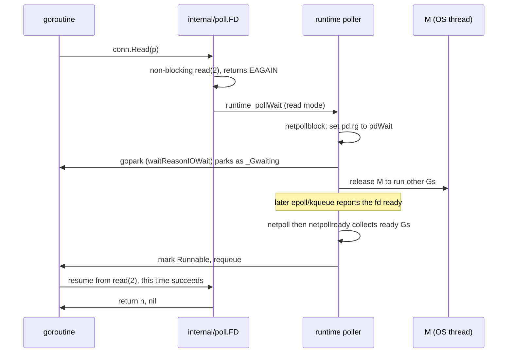
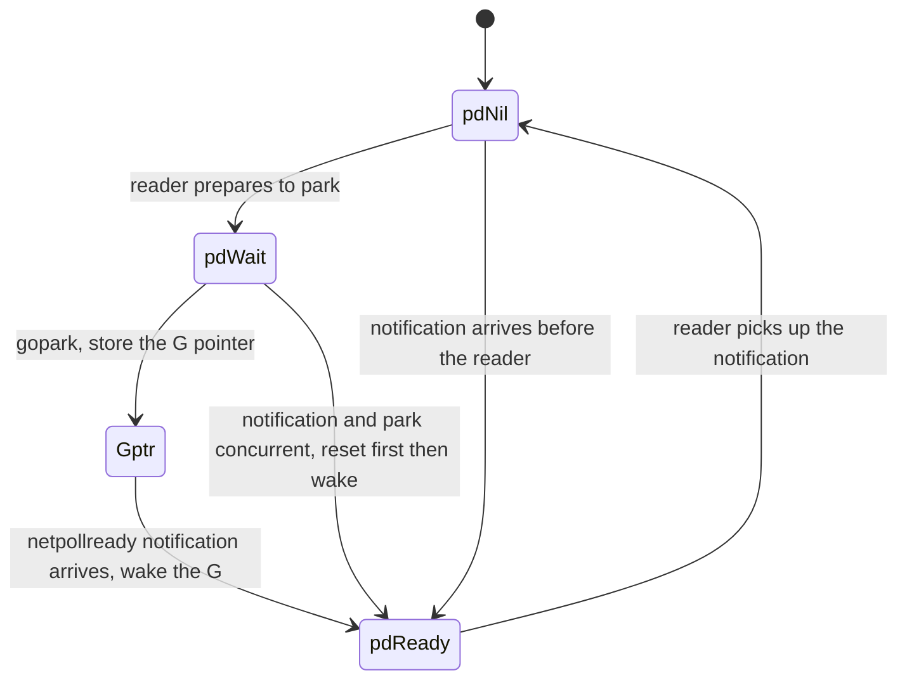

# 9.9 The Network Poller

> Source facts verified against `src/runtime/netpoll.go` and its per-platform
> implementations (`netpoll_epoll.go`, `netpoll_kqueue.go`, and so on) and
> `src/internal/poll/fd_unix.go`.

Go's network code looks blocking: `conn.Read` simply "sits" there waiting for data.
But if it truly blocked the operating system thread it runs on, then ten thousand
goroutines waiting on the network would tie up ten thousand threads, and the M:N model
that [9.1](./model.md) worked so hard to build would collapse in an instant. What lets
the blocking style still scale is the network poller (netpoller). Behind it lies a long
history about "how to tend a vast number of connections with a handful of threads." This
section first lays out that history and the design axes behind it, then looks at how Go
hides a mature event mechanism inside the runtime so that you write synchronous code and
run event-driven I/O.

## 9.9.1 C10k and the Evolution of Readiness Notification

Around the year 2000, Dan Kegel posed the famous **C10k problem**: can a single server
handle ten thousand concurrent connections at once? His argument was that the hardware of
the time was actually adequate, and the bottleneck lay in the software's I/O strategy. The
most naive "one connection, one thread" model could not hold up: each thread reserves a
stack measured in megabytes, so ten thousand threads is several gigabytes; add to that the
kernel's overhead in switching among thousands of threads, and the scheduler quickly buckles
under the load. The way out is **readiness-based multiplexing**: let a few threads tend a
large number of fds, and touch a given fd only when it becomes ready.

The readiness notification mechanism itself went through an evolution too. Writing the cost
in big-O notation makes the main thread clearest. Let the number of concurrent connections
be $n$, and the number of connections ready at a given moment be $k$ (usually $k \ll n$):

- `select` / `poll`: **$O(n)$ per call**. The caller must hand the entire fd set to the
  kernel every time; the kernel scans it linearly to mark the ready ones, and after it
  returns the caller scans again to find them. The set itself is copied back and forth
  between user space and kernel space, and once connections grow numerous, this full scan
  and copy becomes the bottleneck.
- `epoll` (Linux, Libenzi, development kernel 2.5.44 / 2002, stable 2.6.0 / 2003): the
  interest set is **registered once** in the kernel via `epoll_ctl` and stays resident, while
  `epoll_wait` returns only **the ready** fds, so the cost of a single call is $O(k)$.

> A common imprecise claim is that "epoll is $O(1)$." A more accurate statement is: the cost
> of registration is amortized by `epoll_ctl`, and the cost of `epoll_wait` is proportional
> to the **number of ready events $k$**, not to the total fd count $n$. This is exactly what
> improves the "$O(n)$ per call" of `select`/`poll` into "$O(k)$ per call," which in the
> long-connection scenario where $k \ll n$ is a difference of orders of magnitude.

FreeBSD's **kqueue** (Lemon, USENIX FREENIX 2001) is another branch of the same generation,
and a more general one: it manages not only sockets but can also watch files, processes,
signals, and timers, unifying many kinds of event source under the single `kevent` interface.
Windows took yet another route, IOCP. There is also one important distinction here:

- **Level-triggered**: as long as an fd "still has data to read" it reports **continuously**,
  and the application may read as much or as little as it likes.
- **Edge-triggered**: it reports **once** only at the transition from not-ready to ready, and
  the application must read the data straight through to `EAGAIN`, or else the next readiness
  notification will not come and the leftover data will be missed.

Edge triggering reduces redundant wakeups, at the cost of pushing the responsibility of
"reading clean" onto the application. Remember this distinction; below we will see one of Go's
counterintuitive choices land right here.

## 9.9.2 Readiness or Completion: Reactor and Proactor

Lining up all of the above reveals a fundamental design axis:

- **Readiness model** (`select`/`poll`, epoll, kqueue): the kernel says "this fd is ready,"
  and **you** perform the non-blocking I/O.
- **Completion model** (Windows IOCP, Linux io_uring): you say "do this piece of I/O and notify
  me when it is done," the kernel takes over the whole operation, you hand over the buffer
  beforehand and reap the completion event afterward.

This corresponds exactly to the two patterns **Reactor** (Schmidt, PLoPD 1995) and **Proactor**
in software design: the former dispatches readiness events on top of a synchronous event
demultiplexer (such as epoll), with the application doing the I/O; the latter dispatches the
result only when the operation **completes**. Linux's **io_uring** (Axboe, kernel 5.1 / 2019)
is the modern representative of the completion model, using a pair of shared-memory ring queues
(the submission queue SQ and the completion queue CQ) to submit in batches and reap in batches,
pushing the number of system calls down to a minimum.

| Dimension | Readiness model (Reactor) | Completion model (Proactor) |
| --- | --- | --- |
| What the kernel tells you | "You can do I/O now" | "The I/O is already done" |
| Buffer | handed over only after ready, can be temporary | handed over at submission, must be pinned |
| Representatives | epoll, kqueue | IOCP, io_uring |
| Who does the copy | the application (one non-blocking read/write) | the kernel |

**Go does not currently use io_uring**: its Linux poller still goes through epoll
(see [9.9.5](#995-platform-implementations-edge-triggering-and-the-scheduler-seam)), for
reasons left to the frontier section in [9.9.7](#997-why-files-do-not-go-through-the-poller-and-the-frontier).

## 9.9.3 Go's Approach: Translating "Blocking" into "Parking"

The trick is this: present blocking semantics to the user, while underneath using
non-blocking I/O plus event notification. When a goroutine reads on a socket and the data has
not yet arrived, the runtime does not let the thread wait idly. Instead it sets the fd to
non-blocking, registers it with the event mechanism, and then **parks this goroutine**, freeing
the M to run other Gs. When the event mechanism reports that fd as ready, it wakes this
goroutine again and lets it continue reading from where it left off.



Down in the runtime, `internal/poll.FD` is the bridge between `net`/`os` and the runtime
poller. The core of `FD.Read` is a loop: first issue a non-blocking system call, on `EAGAIN`
go wait for readiness, and on waking up `continue` to retry:

```go
// internal/poll/fd_unix.go: the design skeleton of FD.Read (trimmed)
func (fd *FD) Read(p []byte) (int, error) {
    // ...take the read lock, prepare pollDesc...
    for {
        n, err := ignoringEINTRIO(syscall.Read, fd.Sysfd, p)
        if err != nil {
            n = 0
            // non-blocking read has no data, and the fd is managed by the poller: wait for readiness, then retry
            if err == syscall.EAGAIN && fd.pd.pollable() {
                if err = fd.pd.waitRead(fd.isFile); err == nil {
                    continue
                }
            }
        }
        return n, fd.eofError(n, err)
    }
}
```

`waitRead` enters the runtime's `netpollblock` through a layer of `runtime_pollWait`. There is
a design point here worth seeing clearly: before parking, it first grabs the semaphore `pd.rg`
from `pdNil` to `pdWait`, and only after rechecking the error state under the lock does it truly
`gopark`, recording the wait reason as `waitReasonIOWait`. This sequence of reserve-first,
recheck, then park exists so as not to lose a readiness notification that arrives **concurrently**
with the park:

```go
// runtime/netpoll.go: the design skeleton of netpollblock (trimmed)
func netpollblock(pd *pollDesc, mode int32, waitio bool) bool {
    gpp := &pd.rg
    if mode == 'w' {
        gpp = &pd.wg
    }
    for {
        if gpp.CompareAndSwap(pdReady, pdNil) {
            return true // the notification arrived first, no need to park
        }
        if gpp.CompareAndSwap(pdNil, pdWait) {
            break       // reservation succeeded, ready to park
        }
        // otherwise the state was changed concurrently, retry
    }
    // recheck the error before truly yielding, turn the G into _Gwaiting, the M is then released
    if waitio || netpollcheckerr(pd, mode) == pollNoError {
        gopark(netpollblockcommit, unsafe.Pointer(gpp), waitReasonIOWait, traceBlockNet, 5)
    }
    // ...after waking, clean up the semaphore and return whether it was truly ready...
}
```

When the fd becomes ready, the platform `netpoll` translates the kernel event into read/write
mode and calls `netpollready` to pluck out the corresponding waiter, threading it into a `gList`
returned to the scheduler to be reinjected into the run queue ([9.3](./mpg.md),
[9.4](./schedule.md)). Thus, thousands upon thousands of goroutines "blocked" on the network
actually consume very few threads, and the cost of waiting falls onto the kernel's event table.
You write synchronous code, and you run event-driven I/O.

## 9.9.4 pollDesc: The Readiness State Machine of Each fd

What carries the waiting state of both the read and write ends is `pollDesc`: there is one per
polled fd, allocated from a dedicated `pollcache` (a free list in the `fixalloc` style), not on
the GC heap. Its design-relevant fields are two symmetric groups of read / write state:

```go
// runtime/netpoll.go: the design-relevant fields of pollDesc (trimmed)
type pollDesc struct {
    fd  uintptr        // the associated file descriptor, constant over its lifetime

    // rg and wg are two binary semaphores that park reader and writer goroutines respectively.
    // values: pdReady (a readiness notification awaiting pickup) / pdWait (preparing to park) / G pointer (parked) / pdNil
    rg  atomic.Uintptr
    wg  atomic.Uintptr

    lock mutex          // protects the following fields
    rt   timer          // read deadline timer
    rd   int64          // read deadline (some future nanotime, -1 once expired)
    wt   timer          // write deadline timer
    wd   int64          // write deadline
}
```

`rg`/`wg` are the hub of the whole mechanism. They are at once the record of "who is waiting"
(storing the G pointer), the flag of "whether it is already ready" (`pdReady`), and the
reservation made before parking (`pdWait`). The four states flow among the four parties of
reader, I/O notification, timeout, and close by way of atomic operations:



The `rt`/`wt` pair of timers serves the deadlines. `SetReadDeadline` sets `rd` to some future
moment and arms `rt`; when the time comes, the timer callback goes through `netpollunblock` to
wake the waiter with a "timeout" error. This is precisely the seam between `SetDeadline`
([9.10](./timer.md)) and the poller: a timeout is not a separate mechanism but a reuse of the
read and write timers embedded in the same `pollDesc`.

## 9.9.5 Platform Implementations, Edge Triggering, and the Scheduler Seam

The poller adopts each operating system's native mechanism, wrapped behind a set of uniform
functions implemented by the per-platform files:

```go
// runtime/netpoll.go: the interface each platform must implement (comment summary)
//   netpollinit()                              // initialize the poller
//   netpollopen(fd uintptr, pd *pollDesc) int32 // register an fd, arm edge-triggered notification for it
//   netpoll(delta int64) (gList, int32)        // fetch ready events, collect Gs via netpollready
//   netpollclose(fd uintptr) int32             // deregister an fd
```

Linux is `netpoll_epoll.go` (epoll), BSD and macOS are `netpoll_kqueue.go` (kqueue), Windows is
`netpoll_windows.go` (IOCP), with solaris, aix, wasip1, and others besides.

A source fact worth clarifying: **Go's epoll and kqueue both use edge triggering**. When
registering, `netpoll_epoll.go` carries `EPOLLET` in its event mask, `netpoll_kqueue.go` carries
`EV_CLEAR`, and the platform-independent interface comment also states plainly "Arm edge-triggered
notifications for fd":

```go
// runtime/netpoll_epoll.go: register an fd (trimmed)
ev.Events = linux.EPOLLIN | linux.EPOLLOUT | linux.EPOLLRDHUP | linux.EPOLLET
//                                                              ^^^^^^^^^ edge-triggered

// runtime/netpoll_kqueue.go: arm both read and write filters with EV_CLEAR (trimmed)
ev[0].flags = _EV_ADD | _EV_CLEAR // EV_CLEAR is kqueue's edge-triggered semantics
```

This runs counter to the common conjecture that "Go uses level-triggered epoll." Edge triggering
is chosen to reduce redundant wakeups: a single readiness is notified only once, avoiding waking
the G again and again while the fd stays readable. The cost is that the data must be read through
to `EAGAIN`, and this error-prone burden happens to be borne naturally by the loop in
[9.9.3](#993-gos-approach-translating-blocking-into-parking) that "parks only on `EAGAIN` and
`continue`s to retry on waking," transparent to the user.

A ready goroutine returns to the run queue through three routes:

- **The scheduling loop polls actively**: when `findRunnable` ([9.4](./schedule.md)) finds no
  local or global work, it calls `netpoll`, sometimes a non-blocking quick check made along the
  way, and sometimes, when there really is no work, a **blocking** `netpoll(delay)` until an
  event arrives or a timer expires, letting it stand in for an M spinning idly.
- **System monitor backstop check**: when `sysmon` ([9.8](./sysmon.md)) finds the network has
  gone roughly **10ms** (the source is literally `lastpoll+10*1000*1000 < now`) without being
  polled, it does a non-blocking `netpoll(0)` to make up one round, injecting the ready Gs and
  covering the window where all the Ps are busy and no one is polling.
- **Timer expiry**: reads and writes with a deadline rely on the `rt`/`wt` of the `pollDesc` to
  wake the waiter when the time comes ([9.10](./timer.md)).

## 9.9.6 How Others Do It

Placing Go in the lineage of asynchronous I/O makes what is special about it clear.

- **Node.js / libuv**: a single-threaded Reactor event loop, where network I/O is multiplexed
  with epoll/kqueue/IOCP; files, having no portable readiness primitive, are handled by libuv
  throwing blocking file operations onto a thread pool (4 by default). This is strikingly similar
  to Go's "sockets go through the poller, files go through threads" structure.
- **Java NIO / Netty**: `Selector` is a Reactor, choosing an epoll/kqueue/IOCP provider by
  platform; Netty layers another explicit-handler Reactor (`NioEventLoop`) on top, and its native
  Linux transport `EpollEventLoop` is edge-triggered, consistent with Go's choice.
- **Rust tokio**: the I/O driver is built on `mio` (a cross-platform abstraction over
  epoll/kqueue/IOCP), translating OS events into wakeups of `Future` tasks, with `async/await`
  threading the call stack together.
- **Erlang/BEAM**: it likewise fuses I/O polling into the runtime, but a clarification is in
  order: since OTP 21 (2018) BEAM defaults to **dedicated I/O polling threads** rather than having
  the scheduler threads deliver events themselves, so "scheduler-integrated polling like Go's" is
  its historical form rather than today's default.

What they share is **exposing the Reactor to the user**: callbacks (Node), Futures (Rust),
handlers (Netty). What sets Go apart is hiding the Reactor beneath the runtime and presenting the
user only synchronous, blocking code: you write neither callbacks nor `async/await`. This trades a
little of the raw efficiency of an event loop for the ergonomic ease of "one connection, one
goroutine."

## 9.9.7 Why Files Do Not Go Through the Poller, and the Frontier

Not all I/O can go through the poller. An ordinary disk file **cannot** be watched by epoll on
most platforms: for an ordinary file `epoll_ctl` fails, and besides it is almost "always ready,"
so a readiness notification is meaningless for it (note the `fd.pd.pollable()` check in that
`FD.Read` passage in [9.9.3](#993-gos-approach-translating-blocking-into-parking), which is
exactly the branch point here). So Go's "blocking" reads and writes on files still use blocking
system calls, with a backstop provided by separate threads: when such a call ties up an M for a
long time, `sysmon` detaches the P and hands it to another M ([9.5](./thread.md)). This also
explains a common observation: a large number of concurrent network connections barely increases
the thread count, while a large number of concurrent blocking file I/Os can make the thread count
climb.

Tension remains at the frontier. epoll itself has old problems such as the thundering herd
(multiple waiters contending for the same fd), which need mitigations like `EPOLLEXCLUSIVE` and
`SO_REUSEPORT`; the subtleties of its interface semantics and of edge versus level triggering have
also long drawn criticism. io_uring's completion model is tempting in throughput and latency, but
it requires the application to hand over and pin buffers in advance and to manage ownership of
in-flight operations, which does not fit Go's "buffers casually on the stack or heap, one operation
at a time per goroutine" synchronous model, and this is the fundamental reason it is not easy to
slot io_uring directly into Go's poller. The community has long had a proposal (golang/go#31908,
"transparently support io_uring," still open / under investigation), and third-party libraries
exist too, but the standard library has no plan to replace epoll to this day.

A gain in performance never comes for free. In the end, Go chose the ergonomics of "one
connection, one goroutine," willing to give up a little raw performance so that network code reads
like a sequential program, consistent with the orientation this chapter has held throughout.

## Further Reading

1. Dan Kegel. *The C10K problem.* 1999-2014. http://www.kegel.com/c10k.html
2. Jonathan Lemon. "Kqueue: A Generic and Scalable Event Notification Facility."
   *USENIX ATC (FREENIX track) 2001*, pp. 141-153.
   https://people.freebsd.org/~jlemon/papers/kqueue.pdf
3. Davide Libenzi. *Improving (network) I/O performance ... (epoll).* 2002.
   http://www.xmailserver.org/linux-patches/nio-improve.html
4. Douglas C. Schmidt. "Reactor: An Object Behavioral Pattern for Concurrent Event
   Demultiplexing and Event Handler Dispatching." *PLoPD vol. 1*, 1995.
   https://www.dre.vanderbilt.edu/~schmidt/PDF/Reactor.pdf
5. Jens Axboe. *Efficient IO with io_uring* (Linux 5.1), 2019. https://kernel.dk/io_uring.pdf
6. libuv. *Design overview / Thread pool.* https://docs.libuv.org/en/v1.x/design.html
7. Erlang/OTP. *I/O Polling options in OTP 21*, 2018. https://blog.erlang.org/IO-Polling/
8. golang/go#31908. *internal/poll: transparently support new linux io_uring interface.*
   https://github.com/golang/go/issues/31908
9. The Go Authors. *runtime/netpoll.go, netpoll_epoll.go, netpoll_kqueue.go,
   internal/poll/fd_unix.go.* https://github.com/golang/go/tree/master/src/runtime
