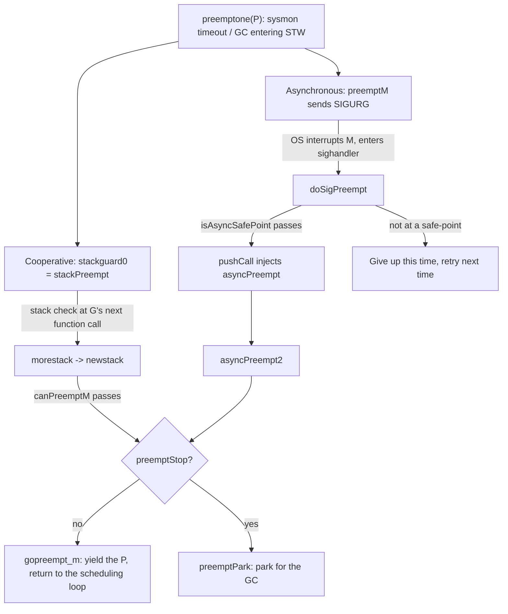

# 9.7 Cooperation and Preemption

In [9.5 The Scheduling Loop](./schedule.md) we left an open question: if some G runs for too long,
how can other G's still get scheduled? The answer cannot avoid an old pair of concepts from
scheduling theory, cooperative versus preemptive. Cooperative scheduling relies on the scheduled
party voluntarily yielding; preemptive scheduling relies on the scheduler interrupting the
scheduled party from the outside.

The Go runtime has nothing like the hardware interrupt capability of an operating system kernel.
The work-stealing scheduler ([9.2](./steal.md)) is essentially first-come-first-served cooperative
scheduling. How it can still forcibly interrupt a G that refuses to yield, without sacrificing this
premise, is the design this section sets out to make clear. The thread starts from a theoretical
question: by what right can the runtime not stop a goroutine at an arbitrary instruction?

## 9.7.1 Safe-points: Why You Cannot Stop Wherever You Like

The difficulty of preemption lies not in "interrupting" but in "still being able to resume
correctly afterward, and letting garbage collection make sense of this G's stack". Go is a precise
garbage collection language, and the GC must know, for a stopped G, whether each stack slot and
register holds a pointer or an ordinary integer
([13.4](../../part4memory/ch13gc/mark.md)). This information about "which locations are pointers right
now" is called the **stack map** and the register map, and the compiler generates it only at
determined locations. In other words, the program does not carry complete pointer information at
every machine instruction; the positions where the GC can safely scan are discrete.

Such a position is a **safe-point**: when a thread reaches it, the runtime can fully recognize all
of its object references. Recklessly stopping a G outside a safe-point, for instance stopping right
in the middle of a write barrier sequence, or between instructions that temporarily decompose a
pointer into integer arithmetic, would make the scan miss or misjudge a pointer and break the
correctness of the GC. Safe-points confine "the places where it is safe to park" to a discrete set
of points, and this is the foundation of every preemption mechanism.

There are two routes to implementing safe-points. One is **polling**: the compiler inserts a small
piece of check code at safe-points, and the G repeatedly asks itself "does anyone want me to stop",
and once it sees a request it cooperatively stops. It is simple and portable, at the cost of the
resident overhead of the check instructions, and one fundamental blind spot: if a stretch of code
goes a long time without passing through any safe-point (such as a tight loop containing no function
call), the poll is never executed and the request sinks like a stone. The other route is
**preemptive**: an external thread forcibly interrupts the target, then finds a way to "move" it onto
a safe-point, at the cost of an uncontrollable interruption moment, so when it lands right on an
unsafe instruction there must be a way to recognize this and give up.

Why does a thread that takes too long to reach a safe-point drag down the whole system? Because many
runtime operations require a **global pause** (stop-the-world, STW), typically some phases of the GC.
STW cannot begin until **all** G's have stopped at a safe-point, so the total cost is determined by
the slowest thread. This quantity has a name, the **time-to-safepoint** (TTSP). A thread whose TTSP
runs out of control, for example one trapped in an infinite loop, drags the latency of an entire STW
to an unacceptable level. Reducing the tail of TTSP is exactly the engineering goal the preemption
mechanism must solve.

## 9.7.2 Cooperative Preemption: Hitching a Ride on the Stack-growth Check

Go's earliest preemption was purely cooperative, and it reused a ready-made safe-point: the
stack-growth check in the function prologue
([14 Execution Stack Management](../../part4memory/ch14stack/readme.md)). Every non-`nosplit` function, at
its entry, compares the stack pointer SP against `g.stackguard0`, and if SP is out of bounds it
triggers `morestack`, which turns into `newstack` to grow the stack. This check happens to be a
synchronous safe-point: at this moment the G's stack is complete and scannable.

Preemption hitched a ride on it. By setting `stackguard0` to a sentinel value `stackPreempt` larger
than any real SP, the stack check on the next function call is guaranteed to "fail", so it falls into
`newstack`, which distinguishes that this is not really a request to grow the stack but a preemption
request:

```go
// Preemption sentinel: placed into g.stackguard0, it makes the next stack check
// necessarily fail and enter newstack.
// It is larger than any real SP (0xfffffade).
const stackPreempt = (1<<(8*goarch.PtrSize) - 1) & -1314

func newstack() {
    gp := getg().m.curg
    // This is a preemption request, not a real request to grow the stack.
    preempt := gp.stackguard0 == stackPreempt
    if preempt {
        if !canPreemptM(gp.m) {
            // The runtime is in a non-preemptible state: cancel the request, keep running.
            gp.stackguard0 = gp.stack.lo + stackGuard
            gogo(&gp.sched)
        }
        if gp.preemptStop {
            preemptPark(gp) // Turn into the GC's parking, does not return.
        }
        gopreempt_m(gp) // Behaves the same as voluntarily calling Gosched, yielding the P.
    }
    // ... otherwise it is a real stack growth.
}
```

`canPreemptM` confines preemption to safe runtime states. It requires that the M holds no locks, is
not allocating memory, has not disabled preemption, and that its P is running:

```go
//go:nosplit
func canPreemptM(mp *m) bool {
    return mp.locks == 0 && mp.mallocing == 0 && mp.preemptoff == "" &&
        mp.p.ptr().status == _Prunning && mp.curg != nil &&
        readgstatus(mp.curg)&^_Gscan != _Gsyscall
}
```

The elegance of this design lies in its zero extra cost: it adds no instruction at all, the
preemption check is the stack-overflow check itself, and the runtime gains a free breakpoint.
`gopreempt_m` ultimately goes through the same `goschedImpl` as `runtime.Gosched` (the user yielding
voluntarily), putting the G back into the global queue and re-entering the scheduling loop. From the
angle of "recording the live state", this cooperative preemption that happens in the function
prologue is also the least troublesome: here the stack frame is tidy and the pointer information is
complete, so saving PC and SP is enough to leave cleanly.

The cost is that it inherits the fundamental blind spot of polling. Consider this classic program:

```go
func main() {
    runtime.GOMAXPROCS(1)
    go func() {
        for {
        } // Contains no function call, never passes through the stack check.
    }()
    time.Sleep(time.Millisecond)
    println("OK") // Before Go 1.14, never printed.
}
```

The only P is occupied by this empty loop, and the loop body contains no function call, so the
safe-point of the stack check is never executed, and setting `stackPreempt` is in vain. The main
goroutine cannot get the P back, and the program hangs. This is exactly the blind spot of polling
mentioned in 9.7.1, landing on Go.

## 9.7.3 Asynchronous Preemption: Signals, Injection, and Conservative Scanning

The Go team knew about this blind spot very early. After Go 1.2 added prologue preemption marking,
the problem was shelved until user reports accumulated (#10958). Around 1.5, Austin Clements tried
having the compiler insert preemption checks at **loop back-edges**, and David Chase then optimized
it down to a single `TESTB` instruction, with no branch and no register pressure. Even so, dense
loops still suffered a geometric mean of about 7.8% overhead. Carrying a resident instruction in a
hot loop for something that almost never happens is, in the end, not worth the cost.

The turning point was the **asynchronous preemption** landed in 1.14 (proposal #24543). The idea is
exactly the same as the operating system's: an external thread sends a signal to forcibly interrupt
the target M, and in the signal handler "moves" it to a safe-point. The difficulty is precisely the
one foreshadowed in 9.7.1: the signal can land on any instruction, not necessarily a safe-point.

There is a detail here that is often misreported and worth making clear. Although #24543 is titled
"non-cooperative preemption", the **scheme finally adopted does not generate a precise register map at
every instruction**, since that metadata would balloon to an unacceptable size. What actually landed
is a compromise: the signal injects an `asyncPreempt` call, and **when the GC stack scan encounters
an `asyncPreempt` stack frame, it applies conservative scanning to that frame and its parent frame**,
that is, it treats every word inside the frame that looks like a heap pointer as a live pointer,
preferring to over-retain rather than miss a mark. The cost is a small amount of floating garbage at
the preempted point, and in return there is no need to prepare a precise map for every instruction.
Understanding this correction of the "conservative inner frame" is the key to understanding Go's
asynchronous preemption.

Since conservative scanning is required, the parking point cannot be an arbitrary instruction.
`isAsyncSafePoint` is the gate: when the signal arrives it judges whether the current PC is safe, and
rejects any position that would make conservative scanning go wrong:

```go
// Judge whether gp, stopped at pc, can be asynchronously preempted
// (sketch: keep the decision logic, omit the corners).
func isAsyncSafePoint(gp *g, pc, sp, lr uintptr) (bool, uintptr) {
    mp := gp.m
    if mp.curg != gp { return false, 0 }       // Only preempt user G.
    if mp.p == 0 || !canPreemptM(mp) { return false, 0 } // Same safety condition as the cooperative path.
    if sp-gp.stack.lo < asyncPreemptStack { return false, 0 } // The stack must be large enough for injection.

    f := findfunc(pc)
    if !f.valid() { return false, 0 }          // Not Go code.
    up, _ := pcdatavalue2(f, abi.PCDATA_UnsafePoint, pc)
    if up == abi.UnsafePointUnsafe {
        return false, 0  // Non-safe-point marked by the compiler: write barrier, atomic sequence, nosplit.
    }
    // If the innermost (including inlined) function name belongs to the runtime itself, never preempt.
    name := /* innermost srcFunc name */ ""
    if hasPrefix(name, "runtime.") || hasPrefix(name, "internal/runtime/") ||
        hasPrefix(name, "reflect.") {
        return false, 0
    }
    return true, pc
}
```

The rejected cases cover every place where "stopping would go wrong": the middle of a write barrier
or atomic sequence, the interior of a `nosplit` function, assembly code, and the runtime's own code
(the scheduler, defer, internal atomic operations, and so on, whose stacks often carry untyped data).
In other words, asynchronous preemption only dares to hit the tidy portion of user code.

The signal chosen for sending is `SIGURG`. This choice is deliberate: it is normally used only for
the debugger to pass signals, and it tolerates being triggered "spuriously" without causing harm
(unlike `SIGALRM`, which must be taken seriously once received), it does not collide with the
`SIGUSR1/2` that users commonly use, and it also accommodates platforms without real-time signals
(such as macOS). The whole injection chain is connected like this, with the key being that the signal
handler can **rewrite the execution context of the interrupted thread**:

```go
const sigPreempt = _SIGURG

// Signal arrives: if the G wants to be preempted and the current point is a safe-point,
// rewrite its resume PC, injecting one asyncPreempt call.
func doSigPreempt(gp *g, ctxt *sigctxt) {
    if wantAsyncPreempt(gp) {
        if ok, newpc := isAsyncSafePoint(gp, ctxt.sigpc(), ctxt.sigsp(), ctxt.siglr()); ok {
            ctxt.pushCall(abi.FuncPCABI0(asyncPreempt), newpc) // Set the resume address to asyncPreempt.
        }
    }
    gp.m.preemptGen.Add(1) // Acknowledge that this preemption has been handled.
}
```

`pushCall` pushes the original PC onto the stack and then points the resume PC at `asyncPreempt`, so
once the signal handler returns, the interrupted G does not return to its original spot but "out of
nowhere" executes one `asyncPreempt` call. `asyncPreempt` is written in assembly, and its job is to
spill all user registers onto the stack and save them (this is also the origin of conservatively
scanning the parent frame), call `asyncPreempt2`, and restore everything as it was before returning,
leaving the preempted G entirely unaware:

```go
//go:nosplit
//go:nowritebarrierrec
func asyncPreempt2() {
    mcall(func(gp *g) {
        gp.asyncSafePoint = true
        if gp.preemptStop {
            preemptPark(gp)  // Park for the GC.
        } else {
            gopreempt_m(gp)  // Yield, return to the scheduling loop.
        }
    })
    getg().asyncSafePoint = false
}
```

The endpoint converges with the cooperative path: either `gopreempt_m` yields the P, or
`preemptPark` parks for the GC.

## 9.7.4 Arming Both Routes Together: preemptone and sysmon

Cooperative and asynchronous are not an either-or choice; a single preemption request **arms both
routes together**. `preemptone` is the unified entry point for requesting the preemption of a G on
some P, and it both sets the cooperative sentinel and sends the asynchronous signal, taking whichever
the G touches first:

```go
func preemptone(pp *p) bool {
    mp := pp.m.ptr()
    gp := mp.curg
    // ... validate that mp, gp are valid and not in a syscall.
    gp.preempt = true
    gp.stackguard0 = stackPreempt // Cooperative: the next stack check triggers it.
    if preemptMSupported && debug.asyncpreemptoff == 0 {
        pp.preempt = true
        preemptM(mp)              // Asynchronous: send SIGURG.
    }
    return true
}
```

Who calls `preemptone`? Mainly `retake` inside the system monitor `sysmon` ([9.6](./sysmon.md)). It
periodically patrols all P's and does two different kinds of "preemption":

- **Taking the P**: when a G is blocked on a system call, unbind the P from the M (`handoffp`) and
  hand it to another M to run other G's. This requires interrupting no one, the G is already stopped,
  and when it resumes it finds a P to bind to on its own. The criterion is that the system call has
  exceeded about one sysmon tick (20µs).
- **Taking the M**: when a G runs too long in user code (exceeding the time slice `forcePreemptNS`,
  that is 10ms), call `preemptone` to interrupt it. This is where the two routes above come into play.

This 10ms time slice, together with the 20µs syscall threshold, is the upper bound Go sets on TTSP:
no matter how stubborn the loop, it will be pulled down by `SIGURG` at the latest after one time
slice. Garbage collection, when it needs to enter STW, also goes through the same `preemptone`, only
it sets `gp.preemptStop`, steering the landing point toward `preemptPark` rather than yielding.

Merging the two routes into one diagram makes the structure of "one request, two trip wires" clear:



A tight loop is only tripped by the asynchronous wire, while code containing calls usually hits the
cooperative wire first, at lower cost. With the two running in parallel, the coverage is complete.

## 9.7.5 How Others Do It: The Polling-versus-Asynchronous Design Axis

Placing Go in a lineage reveals that the blind spot it ran into is common to this class of languages.
The HotSpot JVM has long used **polling safe-points**: a thread polls a guard page at method returns,
loop back-edges, and so on, and when a pause is needed the page is made unreadable, triggering a trap
to gather all threads. It has the same blind spot as Go, only it shows up on **counted loops**: for
optimization the JIT removes the safe-point poll inside the loop, and a long counted loop can let
TTSP run out of control. The JVM's repair path differs from Go's orientation but shares the same
root: JDK 10 introduced **loop strip mining**, splitting a large loop into two layers, an outer one
that polls and an inner one that does not, preserving the optimization while bounding TTSP; JEP 312
went further with **thread-local handshakes**, letting the VM initiate a callback to a single thread
on its own, without an overall STW.

.NET takes another route, **hijacking**: the runtime suspends the target thread and temporarily
rewrites its return address to a piece of runtime stub code, so that as soon as the thread returns it
falls into the runtime's hands. This works on the same principle as Go using a signal to rewrite the
resume PC and inject `asyncPreempt`, both "tampering with control flow to lead the thread to a
safe-point".

Laying out these schemes gives a clear design axis: **polling vs asynchronous**. Polling (early Go
prologue checks, JVM safe-points) is simple to implement and portable, but is constrained by the
blind spot of "the poll point must be executed"; asynchronous (Go 1.14 signals, .NET hijacking, JEP
312 handshakes) can interrupt any point, at the cost of strictly screening the parking moment and
handling the complexity of conservative scanning or context saving. Go 1.14's choice is to use both:
cooperative as the cheap regular path, and asynchronous to cover the blind spot. The mechanism of
scheduler activations, the kind of "kernel and user space cooperatively notifying about blocking", is
orthogonal to this; it solves the parallelism when an M blocks, not the TTSP of a single G.

## 9.7.6 Evolution and Frontier: Shrinking STW Ever Shorter

Looking back at this thread: from being unable to preempt at all before Go 1.0, to the prologue
marking of 1.2 (with #10958 revealing its blind spot), to the experiment with loop back-edge
preemption in 1.5 (which was not adopted across the board because of the performance hit), and
finally to the closure in 1.14 by proposal #24543, using signals plus conservative inner-frame
scanning. The driving force was never "scheduling fairness" in itself, but the hard need of runtime
mechanisms (especially the GC) for a controllable TTSP. Preemption exists so that the GC can stop
every G in time.

The frontier is still pushing in the same direction: compressing STW even shorter, or even removing
it. HotSpot's ZGC (JEP 376) implemented **concurrent stack processing**, letting thread stacks be
scanned and corrected during the GC's concurrent phase rather than in STW, pushing the pause down to
sub-millisecond and making it nearly independent of heap size. This shares the goal of Go's continual
effort to cut STW ([13 Garbage Collection](../../part4memory/ch13gc/readme.md)): safe-points and
preemption are the mechanism for "when can we stop", and what the frontier seeks to answer is "can we
avoid stopping at all".

When debugging, if you want to rule out the interference of asynchronous preemption (for example the
small amount of floating garbage it produces, or to investigate signal-related issues), you can use
`GODEBUG=asyncpreemptoff=1` to turn off asynchronous preemption and fall back to purely cooperative
behavior. The classic infinite-loop program above will then hang again, which can serve as a test of
whether the mechanism is in effect.

## Further Reading

1. Austin Clements. *Proposal: Non-cooperative goroutine preemption.* Go issue #24543, 2018.
   https://github.com/golang/go/issues/24543 (the overall design of asynchronous preemption; includes
   the key compromise of "conservatively scanning the asyncPreempt frame and its parent frame" rather
   than a precise map throughout)
2. The Go Authors. *runtime: tight loops should be preemptible.* Go issue #10958, 2015.
   https://github.com/golang/go/issues/10958 (the initial report of the prologue preemption blind spot)
3. Austin Clements, David Chase. *Non-cooperative goroutine preemption (design doc).* 2019.
   https://github.com/golang/proposal/blob/master/design/24543-non-cooperative-preemption.md
   (loop back-edge preemption, the `TESTB` optimization, and the story behind its 7.8% performance hit)
4. The Go Authors. *Go 1.14 Release Notes: Goroutine preemption.* 2020.
   https://go.dev/doc/go1.14#runtime (asynchronous preemption officially available and `asyncpreemptoff`)
5. Nitsan Wakart. *Safepoints: Meaning, Side Effects and Overheads.* 2015.
   https://psy-lob-saw.blogspot.com/2015/12/safepoints.html (a systematic discussion of safe-points and TTSP)
6. Aleksey Shipilëv. *JVM Anatomy Quark #22: Safepoint Polls.* 2019.
   https://shipilev.net/jvm/anatomy-quarks/22-safepoint-polls/ (an analysis of the cost of polling safe-points)
7. *JEP 312: Thread-Local Handshakes.* OpenJDK, 2018.
   https://openjdk.org/jeps/312 (from global STW to per-thread handshakes)
8. *JEP 376: ZGC Concurrent Thread-Stack Processing.* OpenJDK, 2020.
   https://openjdk.org/jeps/376 (concurrent stack processing, the frontier approaching no STW)
9. Dmitry Vyukov. *Go Preemptive Scheduler Design Doc.* 2013.
   https://docs.google.com/document/d/1ETuA2IOmnaQ4j81AtTGT40Y4_Jr6_IDASEKg0t0dBR8/edit
   (the earliest design draft of preemptive scheduling, predating the cooperative scheme that came before asynchronous preemption)
10. David Chase. *cmd/compile: loop preemption with fault branch on amd64.* CL 43050, 2019.
    https://golang.org/cl/43050 (the fault-branch implementation of back-edge preemption, not adopted across the board because of the performance hit)
11. The Go Authors. *runtime/preempt.go, signal_unix.go, proc.go (retake/preemptone).*
   https://github.com/golang/go/tree/master/src/runtime
12. This book, [9.5 The Scheduling Loop](./schedule.md), [9.6 System Monitoring](./sysmon.md),
    [14 Execution Stack Management](../../part4memory/ch14stack/readme.md),
    [13.4 Scan Marking and Mark Assist](../../part4memory/ch13gc/mark.md).
