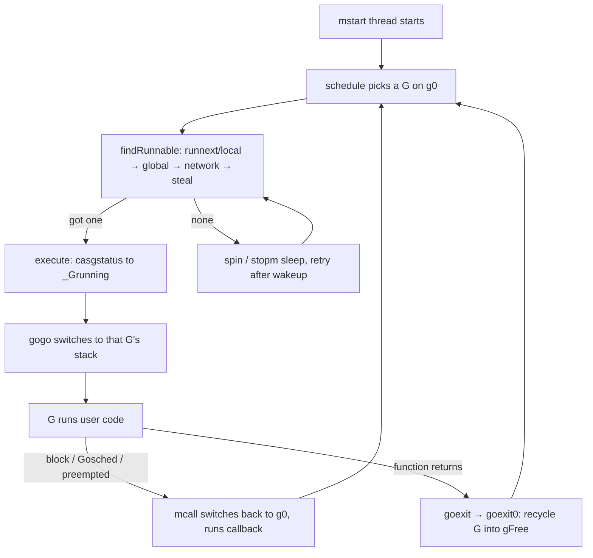
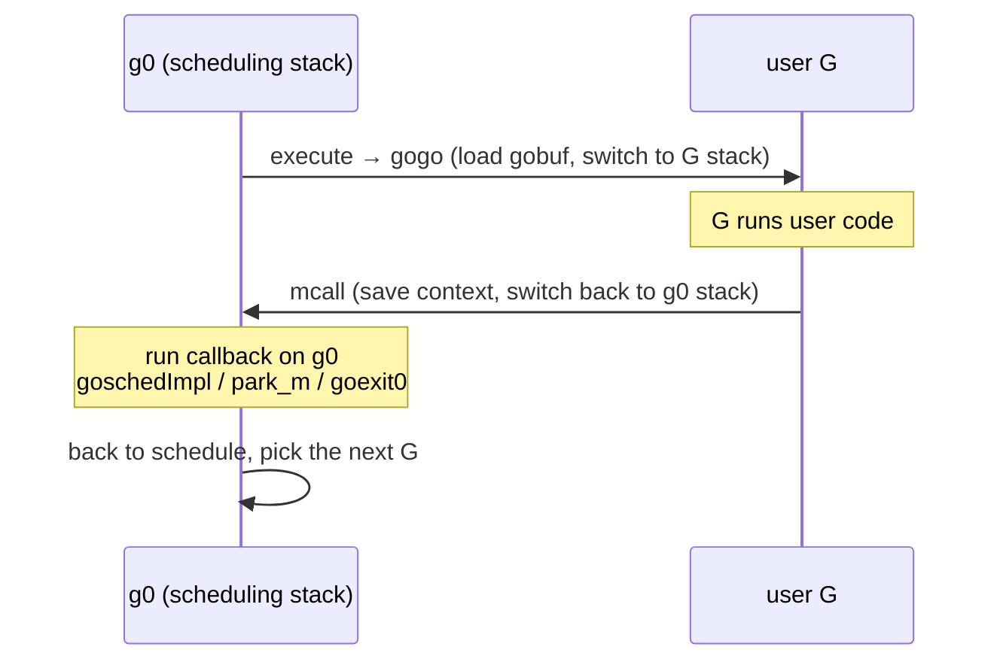
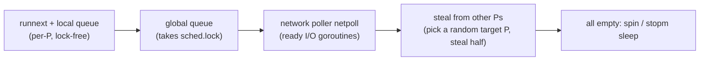

# 9.4 The Scheduling Loop

The previous sections laid out the materials: we know what G, M, and P are ([9.3](./mpg.md)), and we know how an M finds work ([9.2](./steal.md)). This section actually sets them spinning, watching how the scheduling loop ceaselessly picks and runs goroutines on a single thread, and how it strikes a balance between "letting a single goroutine run a little longer" (throughput and locality) and "not letting any goroutine starve" (fairness).

The code below is uniformly a **trimmed sketch**, keeping only the skeleton relevant to the design and dropping side branches such as GC, tracing, profiling, and thread locking. The full definitions can be cross-checked against `runtime/proc.go`; every version referenced below is go1.26.

## 9.4.1 A Loop That Never Returns

Go's scheduling is **cooperative and run-to-yield**: once a goroutine is selected, it runs until it voluntarily yields, blocks, or is preempted ([9.7](./preemption.md)), rather than being switched out on a fixed time slice by a clock interrupt the way the kernel does. After each worker thread starts from `mstart`, it eventually enters the scheduling loop `schedule`, and from then on cycles within it until the thread exits. Stripped to the bare minimum, the skeleton is a two-step loop:

```go
// Each M's scheduling loop (sketch): runs on the system stack g0, never returns
func schedule() {
    // Find a runnable G (see the full order in 9.2); if none is found, block inside findRunnable until there is work
    gp, inheritTime, _ := findRunnable()

    // Switch to gp's stack and start running. Control returns here through the mcall below, not through a function return
    execute(gp, inheritTime)
}
```

`findRunnable` never returns `nil`: if it cannot get work, it turns the M into spinning or sleeping, blocking internally until it is woken, so `schedule` need not handle a "nothing to do" branch. And `execute` also never returns; it jumps into the user G's stack, after which the stack space of this `schedule` frame is reused. For control to return to the scheduling logic, it relies on the stack switch of 9.4.2.



The scheduling logic such as `schedule` and `findRunnable` runs on the M's dedicated system stack `g0` ([9.3](./mpg.md)), not on the user G's stack. This yields a clean division of labor: `g0` handles scheduling, the user G does the work. For the same reason, `schedule` never truly returns; it selects a G, jumps over to run it, and for control to return to the scheduling logic, it relies on the stack switch of the next section rather than a function return.

## 9.4.2 Two Switches: execute and mcall

The scheduling loop holds two stack switches running in opposite directions. Together they form the **physical implementation** of the goroutine state machine from [9.3](./mpg.md): the state machine says "which transitions can occur," and these two routines say "how a transition happens."

**Jumping from `g0` to the user G**: after `schedule` selects a G, it calls `execute`. It first switches the G to `_Grunning`, binds it to the current M, then calls the assembly routine `gogo`, which loads the G's saved context (the `gobuf` of [9.3](./mpg.md): `sp`, `pc`, `bp`, and so on) back into registers. Control then lands on the user G's stack, continuing from where it was last switched out.

```go
// Start running gp on the current M (sketch)
func execute(gp *g, inheritTime bool) {
    mp := getg().m

    mp.curg = gp                          // M and G reference each other
    gp.m = mp
    casgstatus(gp, _Grunnable, _Grunning) // state machine transition: runnable → running
    gp.preempt = false
    gp.stackguard0 = gp.stack.lo + stackGuard
    if !inheritTime {
        mp.p.ptr().schedtick++            // count only when starting a new time slice; inherited slices don't count (see 9.4.3)
    }

    gogo(&gp.sched)                       // load gobuf back, jump to gp's stack, never returns
}
```

The cleverness of `gogo` lies in its being a "one-way trip": after loading the registers it directly `JMP`s to the G's `pc`, with no code to return to the scheduler. The first time a new G runs, its `pc` points at the user function `fn`, and `fn`'s "return address" was preset to `goexit` when `newproc1` built the stack (see 9.4.4). So once `fn` does `return`, it naturally lands on `goexit`, which is exactly the entry point through which control returns to the runtime.

**Jumping from the user G back to `g0`**: when a G is to yield (`Gosched`, blocking on a channel, being preempted, or the function finishing), it ultimately calls `mcall`. It saves the current context into the G's `gobuf`, switches to the `g0` stack, and runs a callback on `g0`:

```go
// mcall(fn) (semantic sketch): save the current G's context, switch to g0, run fn(gp) on g0
//   1. save the caller's pc/sp into gp.sched
//   2. switch SP to m.g0's stack
//   3. call fn(gp); fn must never return (it eventually goes back to schedule)
```

The callback differs by the reason for yielding: a voluntary yield goes through `goschedImpl`, which re-enqueues the G and continues into `schedule`; a blocking wait goes through `park_m`, which sets the G to `_Gwaiting` and then enters `schedule`; finishing execution goes through `goexit0`. Whichever it is, once the callback is done it returns to `schedule`, and the loop closes. This round trip is precisely the physical implementation of the goroutine transitioning between "running" and its other states.



## 9.4.3 Fairness: Letting No One Starve

Cooperative scheduling carries an inherent risk: if the "most convenient" G in the local queue always runs first, some G may never get its turn. For this `schedule` installs several fairness valves, and together they keep cooperative scheduling from starving anyone in practice.

**Periodic check of the global queue.** Before drawing on the local queue, every **61** scheduling rounds `findRunnable` first takes a G from the global queue:

```go
// the fairness valve inside findRunnable (sketch)
if pp.schedtick%61 == 0 && !sched.runq.empty() {
    lock(&sched.lock)
    gp := globrunqget()   // take one from the global queue, bypassing the local queue
    unlock(&sched.lock)
    // ... if one is obtained, return it directly
}
```

It addresses a concrete starvation scenario: two Gs that wake each other up will pass the baton back and forth in the local queue, filling it up and leaving the Gs in the global queue waiting indefinitely to run. Forcing a glance at the global queue at a fixed interval breaks this monopoly. Note that the counter used is `schedtick`, which increments only when a **new** time slice is started (see `execute` in 9.4.2); an inherited time slice through `runnext` is not counted, so "every 61" measures the schedules that actually start a new slice, not every G switch. The source comment only explains "to ensure fairness," and does not say why it is 61 in particular; the widely circulated claim that "61 is prime and avoids resonance" is folk speculation, and this book takes only the fact of "61."

**The anti-starvation constraint on `runnext`.** A G that has just been woken, or just been spawned by `go`, is placed in the P's `runnext` slot to run first, and **inherits the remaining time of the current time slice** (`inheritTime`, the second value returned by `runqget` in 9.4.2). This lets a pair of "communicate-then-run" goroutines be scheduled compactly as a unit, which helps cache locality. But `runnext` can also be abused into two Gs `runnext`-ing each other and hogging the CPU. The runtime relies on `sysmon` ([9.8](./sysmon.md)) preempting by time slice as a backstop. There is an intriguing detail in the source: when the target platform has no `sysmon` (such as `wasm`), the runtime **disables `runnext` entirely**:

```go
// runqput (sketch): put gp into the local queue; if next is true, put it in the runnext slot
func runqput(pp *p, gp *g, next bool) {
    if !haveSysmon && next {
        // runnext shares the same time slice with the current G (inheritTime).
        // Without sysmon preemption as a backstop, a pair of mutually runnext-ing Gs
        // would starve everyone else, so runnext must be abandoned here.
        next = false
    }
    // ... if next is true, CAS into pp.runnext; otherwise enqueue at the tail; if the queue is full, overflow to the global queue
}
```

This is a telling piece of design: fairness is not a single mechanism but the result of several working in concert. `runnext` brings throughput and locality at the cost of a potential ping-pong starvation; that cost is offset by `sysmon`'s preemption; and once that preemption leg is gone, the leg that brings throughput must be withdrawn too.

The full selection order is still the one given in [9.2](./steal.md), arranged from highest hit frequency to lowest and from lowest synchronization cost to highest:



Only when all of these come up empty does the thread turn to spinning (a brief busy wait, betting work will arrive soon) or sleep via `stopm`. This "local first, then global, finally steal" order is itself a compromise between throughput and fairness: the earlier steps are cheap and favor locality, while the later steps guarantee that work will eventually be picked up by some idle M.

## 9.4.4 The Birth and Death of a goroutine

There are two ends beyond the loop.

**Birth.** `go f()` is translated by the compiler into a call to `newproc`, which does the work of building the G on the system stack:

```go
// newproc (sketch): the landing of go f()
func newproc(fn *funcval) {
    gp := getg()
    pc := sys.GetCallerPC()
    systemstack(func() {
        newg := newproc1(fn, gp, pc, false, waitReasonZero) // see below

        pp := getg().m.p.ptr()
        runqput(pp, newg, true) // next=true: put into runnext so the new G runs first and nearby

        if mainStarted {
            wakep() // if there is an idle P and a sleeping M, wake one to add parallelism
        }
    })
}
```

`newproc1` is where the G is actually built, and it embodies a **reuse-first** mindset: first take a used G (along with its stack) from the P's free list `gFree`, and only allocate a new one from the heap if none is available; then zero out its context, point `sched.pc` at the user function, and preset `fn`'s return address to `goexit` (this is exactly why in 9.4.2 the G can "naturally land on goexit" after `gogo` jumps in), and finally set the G to `_Grunnable`. `runqput(pp, newg, true)` puts the just-spawned G into `runnext`, making the common "spawn-then-run" pattern run compactly; `wakep` then wakes an M when there is spare parallelism, turning the new G into real parallelism as soon as possible.

**Death.** When a G's function returns, it does not go directly back to the caller, but lands on the runtime-preset `goexit`, which through `goexit1 → mcall(goexit0)` switches back to `g0`, where `goexit0` does the cleanup:

```go
// goexit0 (sketch): recycle a finished G on g0
func goexit0(gp *g) {
    casgstatus(gp, _Grunning, _Gdead) // state machine transition: running → dead
    // ... clean up gp's fields: defer, panic, label, the binding with M, and so on
    dropg()                            // unbind M and G
    gfput(pp, gp)                      // hang the G (along with its stack) back into the P's gFree for reuse
    schedule()                         // back to the scheduling loop, never returns
}
```

The G is not freed but recycled into `gFree`, avoiding repeated allocation of the G struct and the initial stack. This is one reason high-frequency goroutine creation remains cheap: from the second `go f()` on, it mostly plucks an old G from `gFree` and tweaks the entry point, rather than constructing one from scratch. Birth takes from `gFree`, death returns to `gFree`; the two ends symmetrically share the same per-P free pool, the same "layered contention reduction" move as the allocator's per-P cache ([12.2](../../part4memory/ch12alloc/component.md)).

## 9.4.5 The Evolution of the Design

This loop did not grow into its present shape from the start; each of its valves corresponds to a lesson from history. Laying out the thread of the evolution gives a provenance to the constants and constraints that earlier looked arbitrary.


The earliest scheduler (Go 1.0 and before) had only one global run queue paired with one global lock. Every M taking or putting a G had to contend for this lock, which became a bottleneck once the core count grew. In his 2012 design document, Vyukov started precisely from this pain point, proposing a per-P local queue assisted by work stealing and spinning Ms, a scheme that landed with Go 1.1. This step laid the entire foundation for 9.2 and this section: the local queue makes the vast majority of takes and puts lock-free, stealing ensures work is not stuck on some P, and a spinning M busy-waits a short while before the expensive operation of waking a new thread, betting that work will arrive soon.

The local queue solved contention but introduced the fairness problem, which led to the two patches of 9.4.3: the `runnext` slot wins locality for a "communicate-then-run" pair of Gs, while the 61-round check of the global queue plugs the hole of a mutually waking pair of Gs monopolizing the local queue. They were applied incrementally to address the side effects after the local-queue scheme had taken hold.

The last piece of the puzzle is preemption. Early preemption was cooperative, occurring only at the stack check in the function prologue, and a tight loop without function calls (such as `for {}`) would hold a P forever without yielding, stalling even STW indefinitely. Go 1.14 introduced signal-based **asynchronous preemption** (proposal 24543): the runtime sends a signal to the target thread and forcibly seizes control at a safe point. This filled the last hole in cooperative scheduling, and is exactly the backstop leg that `runnext` in 9.4.3 dares to rely on.

## 9.4.6 Viewed Through Scheduling Theory

Pulling together the several valves of `schedule`, Go's scheduling is a **hybrid** of "run-to-yield + cooperative yielding + signal preemption as a backstop." It falls in the middle ground of the spectrum of scheduling designs.

Pure **cooperative** scheduling (early userspace threads, Node's event loop within a single task) has high throughput and cheap switching, because the yield point is held by the program itself, with no need to save a full interrupt context; the cost is that a task that does not yield can drag down everything, and fairness rests entirely on the program's conscience. Pure **time-slice preemption** (kernel threads) is fair and does not depend on task cooperation, at the cost of expensive switching and uncontrollable preemption points, which is unfavorable to locality.

Go takes a place between the two: by default it obtains throughput and locality through cooperative yielding (channels, `Gosched`, the preemption check in the function prologue) and work stealing ([9.2](./steal.md)), and then uses `sysmon`-driven asynchronous preemption about once every 10ms ([9.7](./preemption.md)) as a fairness backstop, ensuring that even a pure-compute G with no yield point will eventually be switched out. The detail in 9.4.3 of "no sysmon means turn off runnext" is exactly the internal logic of this hybrid laid bare: once the preemption leg is absent, the cooperative optimizations that depend on it as a backstop must withdraw too.

This rhymes with the **reduction-counting** preemption of Erlang/BEAM. BEAM gives each process a fixed reduction budget, deducting one on each operation such as a function call, and swaps the process out once the budget is exhausted. Both balance "the cheapness of cooperation" against "the fairness of preemption," differing only in where the preemption point sits: Go places it at the stack check of a function call and on asynchronous signals, while BEAM places it on reduction counting. BEAM's counting is deterministic and time-independent, with a more uniform fairness granularity; Go's signal preemption fires by real time, with a lighter implementation and a more natural fit with GC safe points. There is no "perfect" scheduling ([9.1](./model.md) discussed the competitive-ratio lower bound of online scheduling); the several valves of `schedule` are Go's concrete and restrained answer to the trade-off among throughput, latency, and implementation complexity.

## Further Reading

1. Dmitry Vyukov. *Scalable Go Scheduler Design Doc*, 2012.
   https://go.dev/s/go11sched (the origin of the work-stealing + spinning M design)
2. The Go Authors. *runtime/proc.go* (`schedule`, `findRunnable`, `execute`, `mcall`,
   `goschedImpl`, `newproc`, `goexit0`, `runqput`). go1.26.
   https://github.com/golang/go/blob/master/src/runtime/proc.go
3. The Go Authors. *runtime/asm_amd64.s* (the assembly implementations of `gogo` and `mcall`).
   https://github.com/golang/go/blob/master/src/runtime/asm_amd64.s
4. Robert D. Blumofe, Charles E. Leiserson. *Scheduling Multithreaded Computations by Work
   Stealing.* JACM 46(5), 1999. https://doi.org/10.1145/324133.324234 (the theoretical foundation of work stealing)
5. Erik Stenman. *The BEAM Book: Scheduling.*
   https://blog.stenmans.org/theBeamBook/#CH-Scheduling (the comparison with reduction-counting preemption)
6. Nimrod Aviram et al. / The Go Authors. *Goroutine preemption* (the asynchronous preemption design), Go 1.14.
   https://github.com/golang/proposal/blob/master/design/24543-non-cooperative-preemption.md
7. Phil Hofer et al. *runtime: scheduler is slow when goroutines are frequently woken*. Go
   issue #18237, 2016. https://github.com/golang/go/issues/18237 (an empirical measurement of spinning-M wakeup latency)
8. This book: [9.2 Scheduling Strategy](./steal.md), [9.3 G, M, P and the State Machine](./mpg.md),
   [9.7 Preemption](./preemption.md), [9.8 System Monitoring](./sysmon.md).
