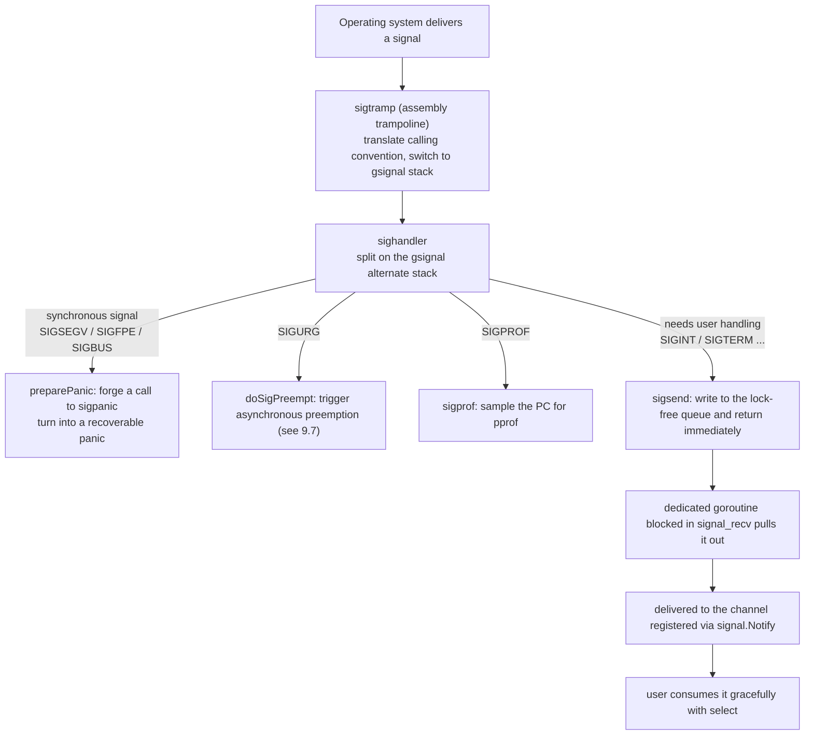

# 9.6 Signal Handling

Operating system signals are asynchronous and low-level: a signal may interrupt any thread at any
moment, and what the signal handler is allowed to do is severely constrained. What Go users want,
on the other hand, is usually to wire a channel to `SIGINT` with `signal.Notify` and shut down
gracefully when it arrives. What the runtime has to do is build a bridge between these two: turn a
treacherous asynchronous signal into an event a goroutine can consume in peace. Every design choice
on this bridge is governed by one hard constraint: what can be done inside a signal context. Once
you understand this constraint, the rest of this section's mechanics are merely its corollaries.

## 9.6.1 Async-signal safety: almost nothing can be done in a handler

A signal handler runs in an interrupted, indeterminate context. The interrupted thread might at
this very moment be holding `malloc`'s lock, sitting in the middle of some data structure's
half-updated state, or even rewriting allocator metadata. The moment the handler calls `malloc`
again or acquires the same lock, it deadlocks itself, or reads a half-finished state and crashes.
POSIX therefore mandates that a signal handler may only call **async-signal-safe** functions, a
very short whitelist (see `signal-safety(7)`): system calls like `write`, `_exit`, and `sigaction`,
which touch neither locks nor the allocator, are on it, while `malloc`, `printf`, most `pthread`
locking, and indeed most of the C standard library are **not**.

This constraint forces out an iron rule shared by every runtime that supports signals:

> Do only the minimum that absolutely must be done in the handler, and defer the real processing to
> somewhere safe.

This is the origin of the classic technique, the **self-pipe trick** (the paradigm W. R. Stevens
gives in APUE): the handler does nothing but write a single byte to a pre-built pipe; the main
event loop (`select`/`poll`) watches the other end of the pipe, so "a signal arrived" is demoted to
an ordinary "the pipe is readable" event, and the subsequent processing returns to the unconstrained
normal context. Linux later folded this technique into the kernel with `signalfd(2)`, letting
signals be consumed directly by `epoll` in the form of a file descriptor.

Go takes a variant of the same idea, only it replaces that "pipe" with a **lock-free queue** inside
the runtime ([9.6.4](#964-sigsend-a-lock-free-queue-and-a-dedicated-receiver-goroutine)). The
reasoning is also very Go: each delivery through a self-pipe costs a `write` system call, while Go's
signal handling is deeply coupled with the scheduler and garbage collector, so using an in-process
atomic state machine to "write a bit and wake a waiter" is cheaper than repeatedly entering and
leaving the kernel, and more controllable too. The remaining subsections follow this iron rule and
see how Go implements it across the handler, the alternate stack, the queue, and the dedicated
goroutine.

## 9.6.2 gsignal: a safe stack the handler carries with it

The first place the iron rule lands is giving the handler a **dedicated stack**. A signal may arrive
just as a user goroutine's stack is about to run out; if the handler still ran on this tight stack,
it could easily trigger a stack overflow. Worse, Go's stacks are growable
([14.6](../../part4memory/ch14stack)), and stack growth itself has to allocate and to lock, exactly
the operations a handler must not touch. The solution is POSIX's `sigaltstack(2)`: register an
**alternate signal stack** for the thread in advance, and the kernel automatically switches to this
stack when dispatching a signal to run the handler.

Go gives **each M** a special goroutine named `gsignal`, whose stack is this M's alternate signal
stack. `gsignal` is created during the `mcommoninit` phase via `mpreinit`, and apart from `g0`
([9.3](./mpg.md)) it is the first g each M owns. It does not participate in scheduling, has no goid
in the sense of user code, and exists for the sole purpose of "carrying signal handling":

```go
// Create gsignal for each M at initialization (sketch, see mpreinit in os_*.go)
func mpreinit(mp *m) {
	mp.gsignal = malg(32 * 1024) // alternate signal stack; Darwin/AIX require >= 8K
	mp.gsignal.m = mp            // gsignal is always bound to the M it belongs to
}
```

After the M enters `mstart`, `minit` calls `minitSignalStack`, which uses `sigaltstack` to register
`gsignal.stack` as this thread's alternate signal stack. There is a careful touch here prepared for
cgo: if the thread already had an alternate signal stack set by non-Go C code (the case where a
non-Go thread calls back into Go), the runtime does not crudely overwrite it but instead adopts the
existing stack as `gsignal`'s stack, and restores it as-is in `unminit`. Letting each M manage its
own copy of "which stack signals are handled on" is exactly the precondition for keeping signal
handling and goroutine scheduling out of each other's way.

## 9.6.3 The handler only enqueues; a goroutine dispatches

With the stack ready, the next step is to install the handler and split the flow when a signal
arrives. Go installs a unified entry point for each signal it cares about during the `initsig`
phase. Note that the kernel does not call back into `sighandler` itself, but into an assembly
trampoline `sigtramp`: when a signal arrives, the kernel jumps into `sigtramp` using the C calling
convention, which saves the context, switches into the Go runtime world, and then calls
`sigtrampgo`, which switches the current g to this M's `gsignal` and finally enters the real
`sighandler`. This layer of trampoline exists because the kernel knows nothing of Go's g/m/p
abstraction, so someone has to "translate" the execution environment first.

```go
// Entry translation after a signal arrives (sketch, see signal_unix.go)
func sigtrampgo(sig uint32, info *siginfo, ctx unsafe.Pointer) {
	if sigfwdgo(sig, info, ctx) {
		return // this signal is not Go's: forward it to a handler that existed before Go (cgo case)
	}
	gp := sigFetchG(&sigctxt{info, ctx})
	setg(gp.m.gsignal)            // switch to the g corresponding to this M's alternate signal stack
	// ...correct stack bounds against sigaltstack's actual value when needed (non-Go code changed it)
	sighandler(sig, info, ctx, gp)
	setg(gp)                      // restore the interrupted g after handling
}
```

`sigfwdgo` is the key to coexisting with native libraries: not every signal should be handled by Go.
If some signal was originally registered with a handler by the user's C library, Go forwards it back
rather than claiming it for itself. We will return to this in
[9.6.5](#965-trade-offs-against-other-runtimes-and-a-practical-side-effect).

The real splitting happens inside `sighandler`. Once it quickly determines the kind of signal, it
handles it along **three destinations**:



**First, synchronous signals.** `SIGSEGV` (null pointer dereference), `SIGFPE` (division by zero),
and `SIGBUS` are raised right on the spot by the current thread's own illegal operation, with a
direct causal relation to the interrupted code. The runtime does not let the process crash silently
but turns them into Go panics: `preparePanic` rewrites the stack and PC at the interruption point to
make it look as if "the point that errored called `sigpanic`", and once the handler returns and
control flow returns to the user g, it throws from `sigpanic` a runtime error that `recover` can
catch. The decision relies on the `_SigPanic` flag in `sigtable`, and is taken only when the signal
really comes from the kernel (rather than a user `kill`) and the interrupted thing really is a user
g; otherwise it can only throw:

```go
// The three-way split in sighandler (trimmed from signal_unix.go)
func sighandler(sig uint32, info *siginfo, ctxt unsafe.Pointer, gp *g) {
	c := &sigctxt{info, ctxt}

	if sig == _SIGPROF {          // runtime's own use: performance sampling
		sigprof(c.sigpc(), c.sigsp(), c.siglr(), gp, getg().m)
		return
	}
	if sig == sigPreempt && debug.asyncpreemptoff == 0 {
		doSigPreempt(gp, c)       // runtime's own use: asynchronous preemption (see 9.7), then continue
	}

	flags := sigtable[sig].flags
	if !c.sigFromUser() && flags&_SigPanic != 0 {
		// synchronous signal: forge the scene as a call to sigpanic, turn into a recoverable panic
		gp.sig, gp.sigpc, gp.sigcode1 = sig, c.sigpc(), c.fault()
		c.preparePanic(sig, gp)
		return
	}
	if c.sigFromUser() || flags&_SigNotify != 0 {
		if sigsend(sig) {         // user signal: put into the lock-free queue, return immediately
			return
		}
	}
	// what remains is _SigKill / _SigThrow: kill, or crash with a stack trace
	if flags&_SigKill != 0 {
		dieFromSignal(sig)
	}
	// ... throw, print the stack and exit
}
```

**Second, signals for the runtime's own use, handled on the spot.** `SIGPROF` is the source of
pprof's timer sampling ([16 Tooling and Observability](../../part5toolchain/ch16tools)): the handler
grabs a PC at the interruption point, hands it to `sigprof` to record, and returns. `SIGURG` is the
carrier of asynchronous preemption ([9.7](./preemption.md)): the handler calls `doSigPreempt` to
"inject a preemption request" onto the interrupted g and returns. Note that even when the preemption
signal hits, the handler does not hog it but continues down through the rest of the split, because a
single `SIGURG` may arrive merged with another signal.

**Third, signals that need to be handed to the user, the ones that take that bridge.** `SIGINT`,
`SIGTERM`, `SIGHUP`, and the like, which carry the `_SigNotify` flag or were indeed sent by a user
`kill`, are handled by the handler only calling `sigsend` to stuff them into the lock-free queue and
returning immediately, never touching a channel, a lock, or allocation inside the handler. The
actual delivery is left to the dedicated goroutine at the other end of the queue.

The decision among these three is entirely encoded in `sigtable`'s flag bits, one row per signal:

```go
const (
	_SigNotify   = 1 << iota // allow signal.Notify to receive it (even from the kernel)
	_SigKill                 // if Notify does not take it, exit silently
	_SigThrow                // if Notify does not take it, crash with a stack trace
	_SigPanic                // turn into a panic when from the kernel (SIGSEGV/SIGFPE/SIGBUS)
	_SigDefault              // do not monitor unless explicitly requested
	// _SigGoExit / _SigSetStack / _SigUnblock / _SigIgn ...
)
// e.g.: SIGSEGV is marked _SigPanic, SIGINT is _SigNotify+_SigKill, SIGQUIT is _SigNotify+_SigThrow
```

## 9.6.4 sigsend: a lock-free queue and a dedicated receiver goroutine

The two ends of the bridge are `sigsend` (the producer, running inside the handler) and
`signal_recv` (the consumer, running inside a dedicated goroutine), with a process-global `sig`
struct in between. Because the producer end lives in the cage of async-signal safety, this queue
must be **lock-free** and **non-allocating**: the whole table is a fixed-size bitmap, and the state
machine is driven by atomic CAS:

```go
// The signal queue: a lock-free channel between the handler and the receiver goroutine (sketch, see sigqueue.go)
var sig struct {
	note       note                          // for the receiver to sleep/wake on
	mask       [(_NSIG + 31) / 32]uint32      // bitmap of signals enqueued, awaiting the receiver
	wanted     [(_NSIG + 31) / 32]uint32      // signals the user declared interest in via Notify
	ignored    [(_NSIG + 31) / 32]uint32      // signals that were Ignore'd
	recv       [(_NSIG + 31) / 32]uint32      // the receiver's local copy
	state      atomic.Uint32                  // sigIdle / sigSending / sigReceiving
	delivering atomic.Uint32                  // count of handlers currently in sigsend
	inuse      bool
}
```

What `sigsend` does is restrained: it sets the signal's corresponding bit into `sig.mask` with CAS,
then uses a three-state state machine to decide whether to wake the receiver. These three states of
`state` are the core of the whole synchronization; they let "write a bit" and "wake a sleeper" work
together correctly without each having to take a lock:

```go
func sigsend(s uint32) bool {
	bit := uint32(1) << (s & 31)
	if w := atomic.Load(&sig.wanted[s/32]); w&bit == 0 {
		return false                          // nobody cares about this signal, let it pass
	}
	// set the bit into the queue; if already in the queue, skip the redundant wakeup
	for {
		mask := sig.mask[s/32]
		if mask&bit != 0 {
			return true
		}
		if atomic.Cas(&sig.mask[s/32], mask, mask|bit) {
			break
		}
	}
	// notewakeup only when the receiver is sleeping (sigReceiving), to avoid a pointless system call
	for {
		switch sig.state.Load() {
		case sigIdle:
			if sig.state.CompareAndSwap(sigIdle, sigSending) {
				return true                   // the receiver is awake; it will come look later on its own
			}
		case sigSending:
			return true                       // there is already a pending notification
		case sigReceiving:
			if sig.state.CompareAndSwap(sigReceiving, sigIdle) {
				notewakeup(&sig.note)         // wake the sleeping receiver
				return true
			}
		}
	}
}
```

At the other end of the queue, `signal_recv` runs in an ordinary goroutine free of the
async-signal-safety constraint, free to sleep and be woken. It first swaps `sig.mask` as a whole
into its own local copy `recv`, returns them bit by bit; when the local copy empties, it switches
the state to `sigReceiving` and sleeps on `sig.note`, waiting for the next `sigsend` to wake it.
This in-and-out is exactly symmetric:

```go
func signal_recv() uint32 {
	for {
		for i := uint32(0); i < _NSIG; i++ {  // first hand out the signals in the local copy one by one
			if sig.recv[i/32]&(1<<(i&31)) != 0 {
				sig.recv[i/32] &^= 1 << (i & 31)
				return i
			}
		}
		for {                                  // local copy empty: sleep waiting for sigsend to wake us
			switch sig.state.Load() {
			case sigIdle:
				if sig.state.CompareAndSwap(sigIdle, sigReceiving) {
					notetsleepg(&sig.note, -1) // sleep safely in an ordinary goroutine context
					noteclear(&sig.note)
				}
			case sigSending:
				if sig.state.CompareAndSwap(sigSending, sigIdle) {
				}
			}
			break
		}
		for i := range sig.mask {              // move the queue as a whole into the local copy
			sig.recv[i] = atomic.Xchg(&sig.mask[i], 0)
		}
	}
}
```

The last stage is in user space, taken over by the `os/signal` package. On the first `Notify` it
lazily starts a goroutine running `loop`, which repeatedly calls `signal_recv` to pull signals and
then `process` to dispatch them to the user's registered channels:

```go
// os/signal: deliver the signals the runtime pulled out to user channels (sketch)
func loop() {
	for {
		process(syscall.Signal(signal_recv()))
	}
}
func process(sig os.Signal) {
	handlers.Lock()
	defer handlers.Unlock()
	for c, h := range handlers.m {            // iterate over all channels registered via Notify
		if h.want(signum(sig)) {
			select {
			case c <- sig:                    // non-blocking delivery; drop when full to avoid stalling loop
			default:
			}
		}
	}
}
```

At this point, the signal that was born in an asynchronous, constrained context has become an
ordinary channel receive. The user only needs `signal.Notify(ch, os.Interrupt)` and then `<-ch` to
handle it gracefully with the most familiar `select`. Note that `process`'s delivery is
**non-blocking**: when the channel is full, the signal is dropped. This is a deliberate trade-off:
better to miss a signal than to let the dispatch loop be dragged to death by a sluggish consumer.
This is also why the channel for `signal.Notify` should usually be buffered.

## 9.6.5 Trade-offs against other runtimes, and a practical side effect

The relationship between signals and managed runtimes has always been delicate, and the root is
this: the runtime wants to use signals, and so do the user and native libraries, yet within a
process there is only one handler for any given signal. The JVM likewise has to take over `SIGSEGV`
(for null checks and the page-protection trap of safepoint polling), `SIGBUS`, and so on, and for
this it provides **signal chaining** (`libjsig`): it records the handler that existed before it took
over, and chains-forwards back to it when it encounters a case that is not its own. Go's `sigfwdgo`
([9.6.3](#963-the-handler-only-enqueues-a-goroutine-dispatches)) solves the same problem, only in
the opposite direction: before Go installs its own handler it stores the old one in `fwdSig`, and
forwards when needed. The two mechanisms arrive at the same place by different routes, both so that
the runtime and native libraries can coexist peacefully on the same signal.

Precisely because signals are a scarce shared resource, Go is especially careful when picking "which
signal" for asynchronous preemption. The runtime source lists a string of heuristic conditions: it
must be passed through by debuggers by default, not be used internally by libc in mixed binaries, be
able to fire spuriously without harm, and be available on platforms without real-time signals (such
as macOS). `SIGUSR1`/`SIGUSR2` are out because applications often give them real meaning; `SIGALRM`
is out because it is impossible to tell whether a real timer fired. The final choice is `SIGURG`: it
nominally reports out-of-band data on a socket, and out-of-band data is used by almost no one, and it
does not even tell you "which socket"; it is nearly obsolete to begin with, and even an application
that does use it must tolerate it arriving spuriously. Choosing a signal "harmless enough to send at
will" is the finishing touch of this design.

This set of choices brings a **practical side effect** that is often overlooked. Since Go 1.14
introduced asynchronous preemption ([9.7](./preemption.md)), a busy program receives `SIGURG`
frequently, and a signal interrupts a slow system call that is in progress, making it return with
`EINTR`. POSIX's `SA_RESTART` flag can make some interrupted system calls restart automatically, and
Go does set it when installing the handler, but not all system calls are restartable (such as
`poll`, certain `read`). Therefore correct Go code, and the `syscall` wrappers it depends on, must
be able to recognize and retry `EINTR`. This is a visible cost paid "for the sake of
preemptibility", and it reminds us that every choice in the signal mechanism ripples all the way
along the system call to user-observable behavior. Gains in performance and capability never come
for free; they always leave a corner elsewhere that needs tending.

## 9.6.6 Summary

To string this section together: the hard constraint of async-signal safety
([9.6.1](#961-async-signal-safety-almost-nothing-can-be-done-in-a-handler)) forces out the iron rule
of "do only the minimum in the handler"; the rule landing on the parts gives each M's own `gsignal`
alternate stack ([9.6.2](#962-gsignal-a-safe-stack-the-handler-carries-with-it)), `sighandler`'s
three-way split ([9.6.3](#963-the-handler-only-enqueues-a-goroutine-dispatches)), and the lock-free
queue with a dedicated goroutine that "demotes" user signals into channel events
([9.6.4](#964-sigsend-a-lock-free-queue-and-a-dedicated-receiver-goroutine)). This two-stage pattern
is exactly the same as the asynchronous preemption of [9.7](./preemption.md): inject only the
minimal step in the constrained signal context, and push the real work back to safe ground to
finish. Once you understand this, the next section's asynchronous preemption is just the same
technique applied once more, to scheduling.

## Further Reading

1. W. Richard Stevens, Stephen A. Rago. *Advanced Programming in the UNIX Environment*,
   3rd ed. Addison-Wesley, 2013. (Async-signal safety, the self-pipe trick, the authoritative
   treatment of signal handling.)
2. The Linux man-pages project. *signal-safety(7)* (the whitelist of async-signal-safe functions);
   *sigaltstack(2)*; *signalfd(2)*.
   https://man7.org/linux/man-pages/man7/signal-safety.7.html
3. The Go Authors. *runtime/signal_unix.go, runtime/sigqueue.go* (`sighandler`, `sigtramp`/
   `sigtrampgo`, `sigsend`/`signal_recv`, the selection comment for `sigPreempt = _SIGURG`).
   https://github.com/golang/go/blob/master/src/runtime/signal_unix.go
4. The Go Authors. *os/signal package documentation and src/os/signal/signal_unix.go* (`Notify`/`loop`/`process`).
   https://pkg.go.dev/os/signal
5. The Go Authors. *Proposal: Non-cooperative goroutine preemption* (#24543, the design motivation
   for `SIGURG` and asynchronous preemption). https://go.googlesource.com/proposal/+/master/design/24543-non-cooperative-preemption.md
6. Oracle / OpenJDK. *Signal Chaining (libjsig)* (industrial practice for a managed runtime sharing
   signals with native libraries). https://docs.oracle.com/en/java/javase/21/docs/specs/man/java.html
7. This book: [9.3 Scheduler Components](./mpg.md), [9.7 Cooperation and Preemption](./preemption.md),
   [14.6 Stack Management](../../part4memory/ch14stack).
