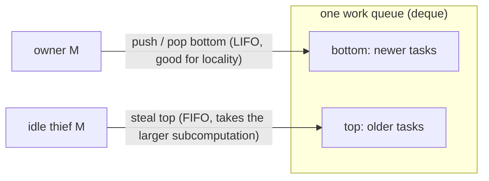

# 9.2 Work-Stealing Scheduling

[9.1](./model.md) left us a question: each P has its own local queue, so work is bound to be distributed unevenly. Some Ps are overwhelmed while others sit idle. How to spread the load without introducing a central bottleneck is the core difficulty of concurrent scheduling. Go's answer is a design with thirty years of theory behind it, one that recurs throughout the industry: work stealing.

This section goes a bit deeper than the rest. We first make clear what Go does, then trace back to the scheduling theory behind it (why it is "provably good"), then look across its different incarnations in systems such as Cilk, Java, and Rust, and finally stop at the questions that remain open.

## 9.2.1 Sharing or Stealing

Moving tasks between processors has historically followed two paradigms. Work sharing: whoever produces a new task actively pushes part of it to an idle processor. Work stealing: the idle processor takes the initiative and steals tasks from others. The difference lies in the frequency of migration. Work sharing may trigger migration whenever there is a new task; work stealing migrates only when some processor genuinely has nothing to do. When all processors are busy, a stealer finds no opportunity to act, and migration naturally stops. The heavier the load, the quieter work stealing becomes. This is its fundamental advantage over work sharing, and it is backed by strict bounds on communication volume (see 9.2.4).

## 9.2.2 Go's Order of Looking for Work

An M bound to a P, having finished running the G in hand, does not steal directly. Instead it searches in an order that runs from near to far and from cheap to expensive (the runtime's `findRunnable`):

```go
// findRunnable: an M looks for the next runnable G (pseudo-code)
func findRunnable() *g {
    if pp.schedtick%61 == 0 && !sched.runq.empty() { // 1. every 61 ticks, check the global queue first for fairness
        if gp := globrunqget(); gp != nil { return gp }
    }
    if gp := runqget(pp); gp != nil { return gp }     // 2. local queue (including runnext)
    if gp := globrunqget(); gp != nil { return gp }    // 3. global queue
    if gp := netpoll(); gp != nil { return gp }        // 4. network poller
    if gp := stealWork(); gp != nil { return gp }      // 5. steal half from another P
    stopm()                                            // 6. nothing at all: spin or sleep
}
```

Three details make stealing efficient. Bounded local queue: each P is a fixed-length ring buffer of 256 entries, and most enqueues and dequeues are lock-free; when full, half the queue is moved to the global queue (`runqputslow`) as a fallback. Random, scattered steal targets: if every idle P stole from the same starting point in a fixed order, they would all crowd toward the same target at once. Go has each stealer use a random start plus a random step that is coprime with the total number of Ps, walking a pseudo-random permutation that covers all Ps. Coprimality guarantees no repeats and no omissions, and randomization avoids the herd effect. Spinning threads: a small number of Ms are allowed to be in a spinning state (capped at `GOMAXPROCS`, counted in `sched.nmspinning`), actively looking for work rather than sleeping immediately, so a newly ready G can be picked up quickly, saving the frequent sleep and wakeup of threads.

## 9.2.3 A Necessary Bit of Model

To make clear what work stealing is "good at," we first need a yardstick. Abstract a parallel computation as a directed acyclic graph (DAG): each node is one unit-time instruction, and each edge is a dependency. Two quantities characterize it:

- Total work $T_1$: the total number of nodes, that is, the running time on a single processor;
- Span (critical path length) $T_\infty$: the length of the longest dependency chain, that is, the running time on infinitely many processors.

Their ratio $T_1/T_\infty$ is called the parallelism, the upper bound on the speedup that can possibly be obtained. No scheduler's running time $T_P$ on $P$ processors can be lower than $\max(T_1/P,\ T_\infty)$. A good scheduler should make $T_P$ as close to this lower bound as possible.

## 9.2.4 Why Work Stealing Is "Provably Good"

The upper bound of greedy scheduling. Graham (1969) proved that any greedy schedule that "never leaves a processor idle without reason" cannot be too far off:

$$T_P \le \frac{T_1 - T_\infty}{P} + T_\infty \le \frac{T_1}{P} + T_\infty.$$

This also means a greedy schedule is at most $2 - 1/P$ times the optimum. Brent (1974) gave the same $t + (q-t)/p$ form for evaluating arithmetic expressions. This bound is often loosely called "Brent's theorem," but the more general and earlier result is Graham's list scheduling, which deserves to be credited.

The bound of randomized work stealing. The greedy upper bound only says "don't leave processors idle and you won't be too bad," without saying how to achieve it in a distributed way. Blumofe and Leiserson (FOCS 1994; JACM 1999) proved that for fully-strict computations (fork-join computations whose join edges point only to the parent thread), randomized work stealing achieves, in expectation,

$$\mathbb{E}[T_P] = \frac{T_1}{P} + O(T_\infty),$$

requires space no more than $S_1 \cdot P$ ($S_1$ being the space of serial execution), and incurs expected interprocessor communication no more than $O(P \cdot T_\infty \cdot S_{\max})$. The three bounds together show that as long as the computation itself has enough parallelism ($T_\infty \ll T_1$), work stealing can approach linear speedup, with bounded space and communication cost.

> The essence of the proof (for the interested reader): assign each ready node a geometrically decreasing potential according to its depth in the DAG, and the total potential drops as the computation advances. A "balls into bins" style lemma shows that when $P$ processors each make one random steal attempt, a constant fraction always hits the top of a non-empty queue, so $\Theta(P)$ attempts suffice to drop the potential by a constant factor. The potential can drop only $O(T_\infty)$ times along the critical path, so the expected number of successful steals is $O(P \cdot T_\infty)$. Amortizing these steals and idle time over $P$ processors gives exactly $O(T_\infty)$, which added to the working term $T_1/P$ yields the upper bound. The space and communication bounds rely on the "busy-leaves" property that full strictness brings, where each steal migrates only one activation frame.

The deque used for stealing. To make these bounds concrete, one relies on a carefully designed data structure. In the classic approach, each processor maintains a double-ended queue (deque): the owner pushes and pops from the bottom (LIFO, the freshly produced subtask is most likely still in cache, giving good locality), while a thief steals from the top (FIFO, taking an earlier, usually larger subcomputation, getting enough in one steal).



Arora, Blumofe, and Plaxton (SPAA 1998) gave a non-blocking steal deque and extended the analysis to a "multiprogrammed" environment (where the operating system does not necessarily keep all $P$ processors filled). Chase and Lev (SPAA 2005) further gave a growable circular-array version, the design most commonly adopted in practice today. One common misattribution needs clearing up: the so-called THE protocol and the work-first principle come from Cilk-5 (Frigo, Leiserson, Randall, PLDI 1998), not from ABP; ABP's contribution is that lock-free deque.

Worth emphasizing: Go's implementation is not this classic LIFO deque. Go's local queue is a FIFO ring buffer, plus a LIFO `runnext` slot to care for the locality of a freshly spawned G ([9.3](./mpg.md)); stealing is still "steal half." This is engineering rewriting the theory.

## 9.2.5 The Many Incarnations of One Idea

Work stealing is not Go's invention. Its idea traces back to Burton and Sleep's (1981) study of parallel execution of functional programs and Halstead's (1984) Multilisp, and the one that developed it into something with strict guarantees and amenable to engineering was MIT's Cilk project. It then became almost a standard part of parallel runtimes, though each system's trade-offs differ:

- Cilk / Cilk-5: the progenitor of fork-join, which established the work-first principle, the THE protocol, and two-clone compilation.
- Intel TBB, Java `ForkJoinPool` (Doug Lea, 2000, self-described as "a variant of the Cilk work-stealing framework"), .NET TPL: all built on Cilk-style work stealing; among them, TPL deliberately uses a "duplicating queue" rather than THE.
- Rust Rayon: fork-join data parallelism centered on `join(a, b)`; Tokio's multi-threaded async runtime explicitly borrows Go's fixed-length local queue algorithm (a LIFO slot plus a global queue).

Go differs fundamentally from the Cilk lineage above in one respect that must be made clear: the Cilk family is a fork-join task-DAG scheduler, while Go is a general-purpose M:N goroutine scheduler. Goroutines are arbitrary execution units that block on channels, system calls, or network I/O, and can be asynchronously preempted ([9.7](./preemption.md)); they do not form a fully-strict fork-join DAG. So the beautiful $T_1/P + O(T_\infty)$ guarantee of 9.2.4 does not hold for Go. Go's work stealing is a load-balancing heuristic that borrows this theory, not a provably optimal scheduler. Understanding this keeps one from misapplying the theory's conclusions to goroutines.

## 9.2.6 Evolution and Open Problems

Go's own work stealing is also evolving: Go 1.1 introduced work stealing along with GMP (Vyukov's 2012 design doc), Go 1.5 added a `runnext` slot per P to care for the locality and latency of a newly spawned G, and the management of spinning threads has been refined several times.

This mechanism is far from "finished," and there are still plenty of open problems at the frontier. NUMA awareness: random stealing is blind to memory locality, and stealing a task onto another NUMA node pays the cost of remote memory access ([9.11](./numa.md)). How to introduce a locality preference while preserving the load-balancing optimality of random stealing is still an active topic. The tension between latency and throughput: LIFO local plus FIFO stealing is throughput- and cache-friendly, but may starve latency-sensitive tasks, and everyone is patching it with FIFO slots, fairness counters, preemption, and the like. High-core-count scalability: a global queue and uncoordinated random stealing produce contention and futile steals at very high core counts, and the mitigations (parking idle threads, spin thresholds, hierarchical queues) are mostly heuristic. The gulf between theory and practice: the clean $T_1/P+O(T_\infty)$ holds only for fork-join DAGs, and how to give provable bounds for general scheduling that "blocks, has I/O, and can be preempted" remains largely open.

## Further Reading

1. R. L. Graham. "Bounds on Multiprocessing Timing Anomalies." *SIAM J. Applied Math.*,
   17(2), 1969. https://doi.org/10.1137/0117039 (the 2-approximation bound of greedy/list scheduling)
2. Richard P. Brent. "The Parallel Evaluation of General Arithmetic Expressions."
   *Journal of the ACM*, 21(2), 1974. https://doi.org/10.1145/321812.321815
3. Robert D. Blumofe and Charles E. Leiserson. "Scheduling Multithreaded Computations
   by Work Stealing." *FOCS 1994*; *Journal of the ACM*, 46(5), 1999.
   https://doi.org/10.1145/324133.324234 (the three bounds: time/space/communication)
4. Nimar S. Arora, Robert D. Blumofe, C. Greg Plaxton. "Thread Scheduling for
   Multiprogrammed Multiprocessors." *SPAA 1998*. https://doi.org/10.1145/277651.277678
   (the lock-free steal deque)
5. David Chase and Yossi Lev. "Dynamic Circular Work-Stealing Deque." *SPAA 2005*.
   https://doi.org/10.1145/1073970.1073974
6. Matteo Frigo, Charles E. Leiserson, Keith H. Randall. "The Implementation of the
   Cilk-5 Multithreaded Language." *PLDI 1998*. https://doi.org/10.1145/277650.277725
   (the work-first principle, the THE protocol, two-clone compilation)
7. Doug Lea. "A Java Fork/Join Framework." *ACM Java Grande 2000*.
   https://doi.org/10.1145/337449.337465
8. Daan Leijen, Wolfram Schulte, Sebastian Burckhardt. "The Design of a Task Parallel
   Library." *OOPSLA 2009*. https://doi.org/10.1145/1640089.1640106
9. F. Warren Burton and M. Ronan Sleep. "Executing Functional Programs on a Virtual
   Tree of Processors." *FPCA 1981*. (an early source of the work-stealing idea)
10. Carl Lerche. *Making the Tokio scheduler 10x faster*, 2019.
    https://tokio.rs/blog/2019-10-scheduler (Tokio borrowing Go's local queue algorithm)
11. Dmitry Vyukov. *Scalable Go Scheduler Design Doc*, 2012. https://go.dev/s/go11sched
12. Chris Hines et al. *runtime: scheduler work stealing slow for high GOMAXPROCS*. Go issue
    #28808, 2018. https://github.com/golang/go/issues/28808 (the cost of steal scanning under high parallelism)
