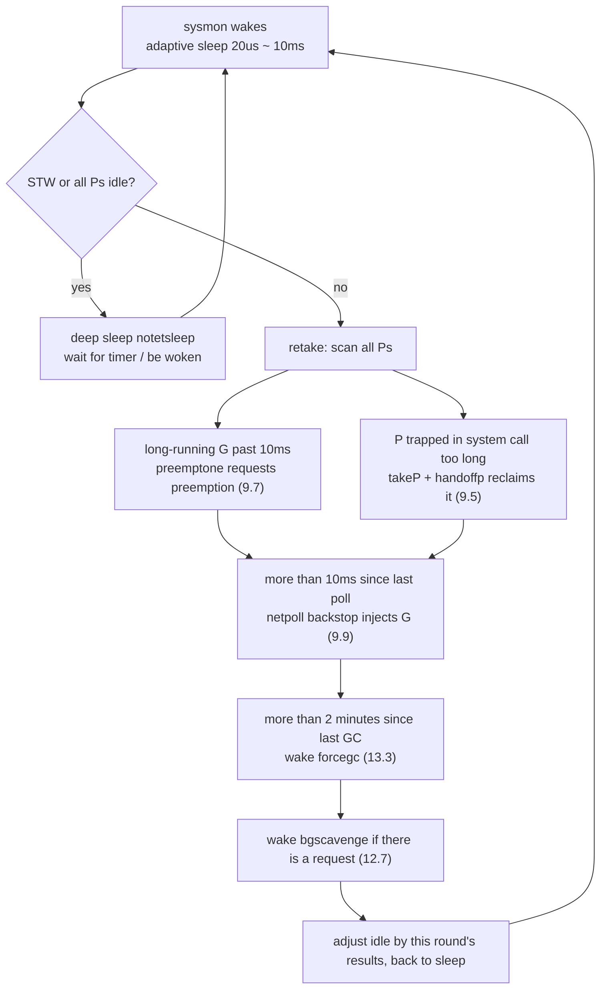

# 9.8 System Monitoring

The scheduler's ordinary path was laid out in [9.4 The Scheduling Loop](./schedule.md): one M binds to one P,
takes a Goroutine off the queue, runs it, then takes the next. This path rests on one premise, that it gets a chance to run at all.
Yet once all the Ps are mired in long system calls, or some Goroutine spins forever and holds a P hostage, ordinary scheduling
seizes up. No one takes the P back, and no one polls the network. Put differently, cooperative logic that runs on a P
cannot deal with the situation where "the P itself cannot move."

Go's answer is to set up a second lifeline outside the scheduling loop. At runtime startup, `main` uses `newm` to bring up a special M
dedicated to running `sysmon`:

```go
func main() {
	// ...
	if haveSysmon {
		systemstack(func() {
			newm(sysmon, nil, -1) // a special M that does not bind a P
		})
	}
	// ...
}
```

What makes this M special is that it **holds no P and never enters ordinary scheduling**. It sleeps and wakes via the runtime's own notification mechanism
(futex on Linux), independent of the scheduler, so even if every P is stuck, it still wakes up and makes its rounds.
This is exactly the watchdog design: place the supervisor outside the supervised system, and only then can it see the system stall.

## 9.8.1 Heartbeat: An Adaptive Sleep Rhythm

sysmon is a loop that never exits. Each round it wakes, inspects its various duties, and goes back to sleep once done. Its difficulty lies in how long to sleep.
Sleep too long and preemption and network polling become sluggish; sleep too often and it burns CPU for nothing while the system is idle. sysmon reconciles this tension with a set of
**adaptive backoff**: diligent when busy, lazy when idle.

```go
//go:nowritebarrierrec
func sysmon() {
	lock(&sched.lock)
	sched.nmsys++ // count as a system M that "does not participate in deadlock judgment"
	checkdead()   // do one deadlock check at startup, see 9.8.5
	unlock(&sched.lock)

	idle := 0       // how many consecutive rounds failed to "wake someone" (both preemption and G injection came up empty)
	delay := uint32(0)
	for {
		if idle == 0 {        // start by sleeping 20us
			delay = 20
		} else if idle > 50 { // after spinning idle past 1ms, double the sleep time
			delay *= 2
		}
		if delay > 10*1000 {  // cap at 10ms
			delay = 10 * 1000
		}
		usleep(delay)
		// ... inspect the various duties (see below) ...
	}
}
```

Sleep starts at $20\,\mu s$. As long as every round has work to do (a successful preemption, or a G injected into a queue), `idle` resets to zero,
and sysmon stays at the minimum interval, keeping its sensitivity. If more than 50 consecutive rounds turn up nothing to do, it judges the system to have gone idle,
and lets the sleep time grow by doubling, up to a $10\,ms$ cap. The two ends of the range $[20\,\mu s, 10\,ms]$ each have their reasons:
the lower bound must be small enough to preempt in time (the preemption threshold is exactly $10\,ms$, see [9.8.2](#982-retake-preemption-and-reclamation)),
and the upper bound must be large enough to draw almost no power when idle.

Above the backoff there is one more layer of deep sleep. When a STW is in progress, or all Ps are idle (`sched.npidle == gomaxprocs`),
there is nothing to supervise, so sysmon simply `notetsleep`s until the next timer fires or it is explicitly woken,
fully yielding the CPU. If the wake comes from a system call returning, that means the application has started working again, so it resets `idle` and `delay`
back to the most sensitive state, betting that "we just reclaimed a P from a system call, so very likely we will need to reclaim again soon."

## 9.8.2 retake: Preemption and Reclamation

The first order of business after waking is `retake`. It sweeps every P and acts on two kinds of "won't-leave" situations. This is the core of sysmon
serving as the backstop for preemptive scheduling, covering the dead corners that the cooperative preemption of [9.7](./preemption.md) cannot reach.

The first kind is a **Goroutine that monopolizes a P for a long time**. If some P stays on the same `schedtick` for longer than
`forcePreemptNS` ($10\,ms$), that means the Goroutine it runs has never yielded, so sysmon issues a preemption request against it:

```go
const forcePreemptNS = 10 * 1000 * 1000 // 10ms, the time slice a G may monopolize before being preempted

func retake(now int64) uint32 {
	// ... iterate over allp ...
	if int64(pd.schedtick) != schedt {
		pd.schedtick = uint32(schedt) // schedtick changed: scheduling happened, restart the clock
		pd.schedwhen = now
	} else if pd.schedwhen+forcePreemptNS <= now {
		preemptone(pp) // stayed on the same schedtick past 10ms: request preemption
		sysretake = true
	}
	// ...
}
```

`preemptone` (see [9.7](./preemption.md)) only "requests"; the actual yield depends on the target Goroutine's own
cooperation, and since Go 1.14 it can also be triggered by a signal for asynchronous preemption. But if that P is stuck in a system call, `preemptone`
is powerless, because the execution flow is not in Go code at all, and no one responds to the preemption. This leads to the second kind.

The second kind is a **P trapped in a system call**. Once an M enters a system call, the P it holds is in a running state but no one advances it,
and if this lasts long, the Goroutines queued on that P and the tasks available to steal are frozen for nothing. sysmon takes this P back
and hands it to another M to run:

```go
	// handling a P trapped in a system call within retake (trimmed)
	thread, ok := setBlockOnExitSyscall(pp) // hold the thread back so it cannot leave the system call for now
	if !ok {
		goto done // already out of the system call, or the state changed
	}
	// when the queue is empty and there are still spinning or idle Ms in the system to back it up, hold off on taking it
	if runqempty(pp) && sched.nmspinning.Load()+sched.npidle.Load() > 0 &&
		pd.syscallwhen+10*1000*1000 > now {
		thread.resume()
		goto done
	}
	thread.takeP() // pluck away the P
	thread.resume()
	handoffp(pp)   // hand the P off to another M (see 9.5)
```

`handoffp` (see [9.5 Thread Management](./thread.md)) finds a new M for this P, or, when there is truly no work to do,
lets it go idle. There is a subtle concurrency concern here: before acting, it must first `incidlelocked(-1)`, pretending there is one extra
running M, otherwise the M that was just stripped, once it returns from the system call and finds nothing to do and no other running M,
would falsely report a deadlock. Reclamation is not unconditional: if the P's local queue is empty and there are still spinning or idle Ms in the system to back it up,
sysmon would rather let it off, avoiding a pointless thread switch.

When `retake` accomplishes something in a round, it resets `idle` to zero so sysmon stays sensitive; when it comes up empty, it does `idle++`,
edging toward deep sleep. This count is exactly the input to the backoff of [9.8.1](#981-heartbeat-an-adaptive-sleep-rhythm).

## 9.8.3 The Backstop for Network Polling

Under ordinary circumstances, network-ready events are collected by the scheduling loop with a casual `netpoll` while it looks for work (see [9.9 The Network Poller](./poller.md)).
But if every P is busy computing and no one polls for a long time, the network Goroutines that are already ready will starve. sysmon is
the backstop on this path:

```go
	// if the network has not been polled for more than 10ms, sysmon does one backstop poll
	lastpoll := sched.lastpoll.Load()
	if netpollinited() && lastpoll != 0 && lastpoll+10*1000*1000 < now {
		sched.lastpoll.CompareAndSwap(lastpoll, now)
		list, delta := netpoll(0) // non-blocking, returns the list of ready Gs
		if !list.empty() {
			incidlelocked(-1)
			injectglist(&list) // inject the ready Gs into the global queue
			incidlelocked(1)
			netpollAdjustWaiters(delta)
		}
	}
```

The threshold is again $10\,ms$: if more than this interval has passed since the last poll, sysmon does one non-blocking poll and injects the ready
Goroutines into the queue. This guarantees that even if the whole program is stuck in a compute-intensive loop, the response latency of network I/O has
an upper bound and will not be delayed indefinitely.

## 9.8.4 Forced GC and Returning Memory

Two memory-related duties also ride along on this sysmon trip. The first is **forced GC**. Even if the program allocates slowly and is slow
to reach the heap-growth threshold that triggers GC, the runtime is unwilling to let the garbage left after the previous GC linger indefinitely. Each round sysmon
checks whether the time since the last GC has exceeded `forcegcperiod` (default $2$ minutes), and if so, wakes the resident
`forcegc` Goroutine to start a round of collection (the trigger logic is in [13.3](../../part4memory/ch13gc/pacing.md)):

```go
	if t := (gcTrigger{kind: gcTriggerTime, now: now}); t.test() && forcegc.idle.Load() {
		lock(&forcegc.lock)
		forcegc.idle.Store(false)
		var list gList
		list.push(forcegc.g)
		injectglist(&list) // wake the forcegc goroutine, which starts the GC
		unlock(&forcegc.lock)
	}
```

Note that sysmon itself **does not execute** GC; it only injects `forcegc.g` into the queue and lets ordinary scheduling run it. The reason is exactly
the iron rule from the start of this section: sysmon holds no P and may have no write barrier (`//go:nowritebarrierrec`), so it cannot run
GC code that requires write barriers to cooperate. The role it plays is only that of a timed alarm clock.

The second is **returning idle memory to the operating system** (scavenge, see [12.7 The Page Allocator](../../part4memory/ch12alloc/pagealloc.md)).
There is an evolution here worth telling. In early versions, sysmon would **directly** clean up heap pages unused for some time inside the loop.
Later the runtime split this work off to a dedicated background Goroutine, `bgscavenge`, which paces itself according to memory pressure, and sysmon
retreated to merely **waking** it when a request comes in:

```go
	if scavenger.sysmonWake.Load() != 0 {
		scavenger.wake() // only wake the dedicated bgscavenge goroutine
	}
```

This migration "from inline execution to merely waking" is a pattern that recurs in the Go runtime: peel off time-consuming work that needs careful
pacing from sysmon, this shared lifeline, and hand it to an independent Goroutine, while sysmon keeps only the lightweight duty of "giving it a nudge."
It keeps the sysmon trip always running fast, never slowed by any single task. Around the same time another duty appeared,
`sysmonUpdateGOMAXPROCS`, at most once per second, dynamically adjusting `GOMAXPROCS` according to the container's CPU quota, likewise
just light work of "probe a bit, adjust a bit."

## 9.8.5 Deadlock Detection

`checkdead` answers a sharp question: if every Goroutine is blocked and no one can make progress, the program should report
`fatal error: all goroutines are asleep - deadlock!` rather than hang silently. It counts the running and
blocked Ms in the system, along with the pending timers and network waiters, and if it finds that no one can be woken again, it declares a deadlock.

A common misunderstanding is worth clearing up: deadlock detection is not a duty that sysmon polls each round. `checkdead` is mainly called at state-transition
points such as an M **parking into idle**, where the "last one to go to sleep" counts the room on its way out. sysmon only calls `checkdead` once,
at **startup**, taking part in the whole mechanism as one piece of it (see [16.1 Runtime Deadlock Check](../../part5toolchain/ch16tools/deadlock.md)).
The reason it is listed in this sysmon section is that sysmon, this "system M," happens to need to register itself in `nmsys`,
declaring "I do not count as a live thread for deadlock judgment," because otherwise its own existence would make `checkdead` never able to detect a deadlock.

## 9.8.6 A Duty Map and a Design Summing-Up

Bringing the above duties onto one diagram, the full picture of one sysmon inspection round is as follows:



Seen within the industrial lineage, "setting up a separate supervisory thread outside the system" is not a Go invention. The HotSpot JVM has a
**WatcherThread** that periodically drives various timed tasks (sampling, statistics, timeout callbacks), most akin to sysmon's heartbeat;
while its **VMThread** is dedicated to safepoints and STW coordination, closer to the part of Go that initiates STW
rather than to sysmon. The Linux kernel also has two watchdogs: soft-lockup (`watchdog/N`, using high-precision timers to detect whether some
CPU has long stopped responding to scheduling) and hung-task (`khungtaskd`, detecting tasks stuck in D state for a long time).

sysmon differs from these kernel watchdogs on one key point: the kernel's lockup and hung-task watchdogs **only detect and only alert**
(print stacks, panic according to configuration); they diagnose problems but do not fix them. sysmon, by contrast, **both detects and acts**: it preempts
the long-running G it finds, reclaims and reassigns the frozen P it finds, and polls the starving network it finds. This makes it not just a passive
health probe but an active backstop scheduler, a more comprehensive variant than a typical supervisory thread.

This is sysmon's place in the whole scheduling design. Ordinary scheduling takes the cooperative, low-overhead fast path: it lets the Goroutine
hand back the P at natural yield points such as function calls and channel operations, at almost no extra cost. But pure cooperation has dead corners it cannot reach:
infinite loops, blocked system calls, an ignored network, a heap that no longer grows. With a single, independent lifeline that no P
can hijack, sysmon covers these dead corners one by one, adding a layer of preemptive backstop beneath the cheapness of cooperation. The performance benefit never comes free:
the fast path can be made this light precisely because sysmon holds the floor for it on the slow path.

## Further Reading

1. The Go Authors. *runtime/proc.go* (`sysmon`, `retake`, `handoffp`, `preemptone`,
   `checkdead`, `forcePreemptNS`, `forcegcperiod`).
   https://github.com/golang/go/blob/master/src/runtime/proc.go
2. The Go Authors. *runtime/mgcscavenge.go* (`bgscavenge`, `scavenger.wake`, `sysmonWake`,
   the dedicated goroutine that returns idle memory).
   https://github.com/golang/go/blob/master/src/runtime/mgcscavenge.go
3. Dmitry Vyukov, Austin Clements et al. *Non-cooperative goroutine preemption* (proposal #24543,
   the cooperation between sysmon preemption and signal preemption).
   https://go.googlesource.com/proposal/+/master/design/24543-non-cooperative-preemption.md
4. The Linux Kernel. *Software and Hardware Lockup Detector* (soft-lockup / hard-lockup
   watchdogs). https://www.kernel.org/doc/html/latest/admin-guide/lockup-watchdogs.html
5. The Linux Kernel. *Detecting Hung Tasks* (`khungtaskd`, `hung_task_panic`).
   https://www.kernel.org/doc/html/latest/admin-guide/sysctl/kernel.html
6. OpenJDK / HotSpot. *WatcherThread and VMThread* source (`src/hotspot/share/runtime/`,
   `watcherThread.cpp`, `vmThread.cpp`).
   https://github.com/openjdk/jdk/tree/master/src/hotspot/share/runtime
7. This book: [9.7 Cooperation and Preemption](./preemption.md), [9.5 Thread Management](./thread.md),
   [9.9 The Network Poller](./poller.md), [16.1 Runtime Deadlock Check](../../part5toolchain/ch16tools/deadlock.md).
