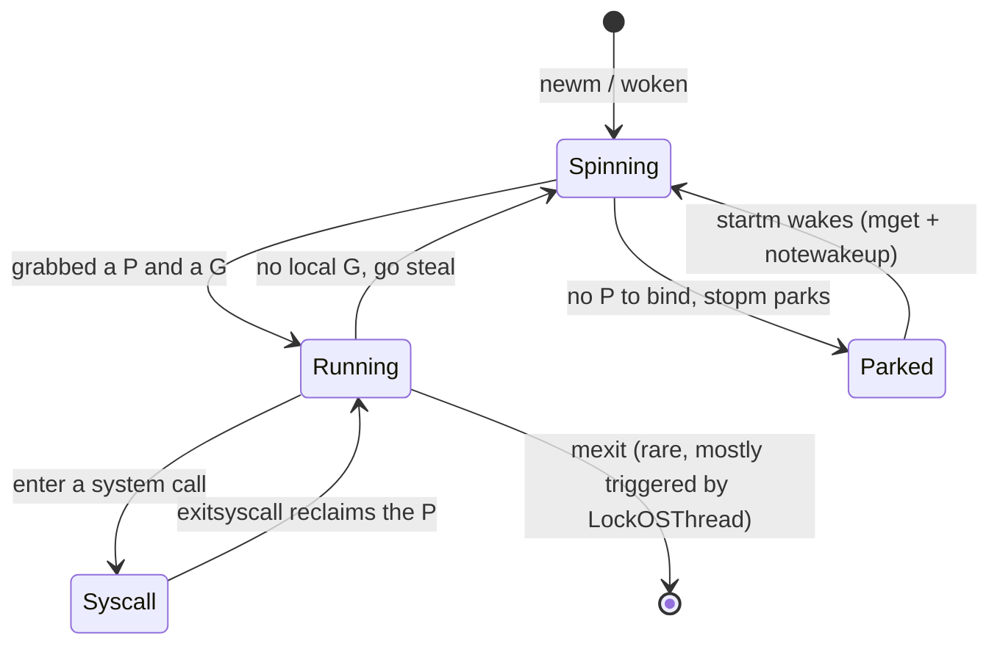
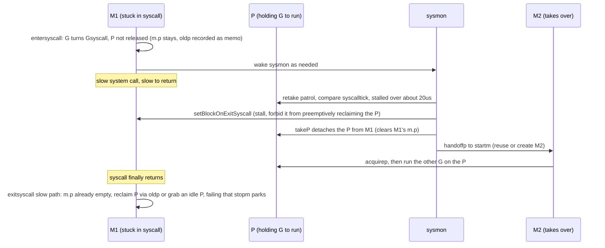

# 9.5 Thread Management

[9.1](./model.md) laid down the three-layer GMP structure: G is the user-level unit of execution, P is the scheduling permit and the carrier of local resources, and M is the leg actually borrowed from the operating system. The previous sections dwelt mostly on G and P; this section turns its attention to M, and answers several questions we have kept deferring: what M actually is, where it comes from, why GOMAXPROCS caps P while the thread count is often larger, why a single blocking system call does not drag down the other G alongside it, and what price the runtime pays when a user wants to pin a goroutine to a specific thread (`LockOSThread`).

One judgment runs through the whole section: **a thread is an expensive resource**. Creating one means trapping into the kernel, allocating a stack, and registering a signal mask; destroying one is no cheaper. Many of the Go scheduler's designs, from reusing idle M, to handing off the P during a system call, to placing a ten-thousand fuse on the thread count, are all organized around one main line: create as few as possible, reuse as many as possible.

## 9.5.1 M Is the Operating System Thread

M (machine) is the abstraction of a single operating system thread. When the process starts, the bootstrap thread is wrapped into `m0`, a global variable that exists for the life of the process and is not heap-allocated; from then on, every M corresponds to a kernel thread explicitly created by the runtime. The relationship between M and G is "the thread runs goroutines": once an M holds a P, it takes G from the P's local queue and executes them. The trimmed sketch below keeps only the fields related to thread management:

```go
// m: the runtime abstraction of one operating system thread (sketch)
type m struct {
    g0   *g       // system-stack goroutine for scheduling: runs scheduler code, handles signals
    curg *g       // the user goroutine currently executing on this M
    p    puintptr // the P currently held; may be stripped away on entering a syscall
    nextp puintptr // the P to be bound after being woken (used when stopm wakes up)
    oldp  puintptr // the P held before entering the syscall, kept for exitsyscall to reclaim quickly

    park     note  // the thread sleeps/wakes on this "semaphore"; the core mechanism for reusing M
    schedlink muintptr // links into the idle-M list / newmHandoff list

    lockedg  guintptr // mutually locked with some G (LockOSThread), see 9.5.6
    lockedExt int32   // external (user) lock count
    lockedInt int32   // internal (runtime) lock count
    incgo    bool     // whether a cgo call is currently executing
    isextra  bool     // whether this is an extra-M born for a cgo callback, see 9.5.5
}
```

A new thread is created through `newm` -> `newm1` -> `newosproc`. On Linux, `newosproc` ultimately lands on a single `clone(2)` system call, whose flags spell out the dividing line between "thread" and "process":

```go
// the clone flags used to create a new kernel thread on Linux (runtime/os_linux.go)
cloneFlags = _CLONE_VM |     // share the address space
    _CLONE_FS |              // share filesystem information (cwd, etc.)
    _CLONE_FILES |           // share the file descriptor table
    _CLONE_SIGHAND |         // share the signal handler table
    _CLONE_SYSVSEM |         // share the SysV semaphore undo list
    _CLONE_THREAD            // belong to the same thread group (share the PID)
```

These shared items are exactly what distinguishes a thread from a process: the address space, the file descriptors, and the signal handling are all held in common, only the registers and the stack stay separate. Even so, creating a thread is not cheap: it must trap into the kernel for a round of `clone`, prepare a system stack for `g0`, and set the signal mask (`newosproc` disables signals with `sigprocmask` before the clone and restores them after, so the new thread starts from a clean state). After entering `mstart`, the new thread still has to run a round of `minit` initialization. This string of costs is the root of the later principle, "reuse rather than create lightly". The retry on `EAGAIN` in `newosproc`, with its "may need to increase max user processes" hint, also confirms that a thread is a scarce resource that the operating system places quotas on.

## 9.5.2 Reuse: Idle M Parked on a Semaphore

Since creation is expensive, the runtime does not discard an M once it is done. When an M finishes the work at hand and momentarily has no P to bind, it does not exit but **parks**, waiting to be dispatched again. This park-and-resume pair is performed by the two functions `stopm` and `startm`.

`stopm` puts the current M back on the global idle list, then lets it sleep on its own `park`:

```go
func stopm() {
    gp := getg()
    // precondition: at this moment M holds no lock, holds no P, and is not spinning
    lock(&sched.lock)
    mput(gp.m)        // put into the sched.midle idle-M list
    unlock(&sched.lock)
    mPark()           // sleep on the m.park note, waiting to be woken
    acquirep(gp.m.nextp.ptr()) // on waking, the waker has already placed the P to bind into nextp
    gp.m.nextp = 0
}
```

The core of `mPark` is `notesleep(&gp.m.park)`. A `note` is the runtime's internal one-shot event primitive, which on each platform lands on a kernel sleep mechanism such as a futex or a semaphore. In other words, a parked M does not occupy the CPU; it sleeps inside the kernel, waiting for a `notewakeup` to call it back.

The wake path goes through `startm`: when a P needs a thread to drive it (a new G becomes ready, a system call hands off its P, and so on), `startm` first uses `mget` to fish a parked M out of the idle list, records the target P into its `nextp`, and then `notewakeup`s its `park`; only when the idle list is empty does it fall back to `newm` and actually create a new thread. This order, "reuse first, create only when nothing can be fished out", is the key to keeping thread creation off the hot path.



Worth pointing out is that on the normal path an M almost never exits. `mexit` is triggered only in a few situations, the most typical being the case [9.5.6](#956-lockosthread) will discuss, "the G that locked the thread exits without unlocking". The normal state of an M is the loop "park, wake, park again", like a standing force always on call, rather than a temp worker hired once and dismissed once.

## 9.5.3 GOMAXPROCS Caps P, Not M

Readers often hold a misconception: set `GOMAXPROCS` to 8 and there are only 8 threads. What it actually caps is the **number of P**, that is, the upper bound on the parallelism of executing Go code, not the number of M. The number of M is determined dynamically by "how many threads currently have something to do", and may well exceed GOMAXPROCS.

The most common overshoot comes from system calls. When an M is stuck in a blocking system call ([9.5.4](#954-system-calls-and-handing-off-the-p)), the P in its name is handed off to another M to run other G, so at the same instant there coexist "the M stuck in the syscall" and "the M that took over the P", and the thread count exceeds the P count. `LockOSThread` and the extra-M for cgo callbacks also make M outnumber P. Seen from another angle, P is "the permit to execute Go code", whose total is capped throughout; M is merely a leg borrowed to run code, and when one leg is tripped up by a syscall, another is borrowed to use the P, while the tripped one holds no permit.

Leaving the thread count uncapped is dangerous: a runaway system call or cgo callback could make the runtime create threads without limit and eventually crush the entire process. Go therefore sets a fuse, `sched.maxmcount`, defaulting to **10000**:

```go
// verify that the total number of M does not exceed the limit; fatal if it does (runtime/proc.go)
func checkmcount() {
    // extra-M are not counted toward this limit (they serve cgo callbacks and are tallied separately)
    count := mcount() - int32(extraMInUse.Load()) - int32(extraMLength.Load())
    if count > sched.maxmcount {
        print("runtime: program exceeds ", sched.maxmcount, "-thread limit\n")
        throw("thread exhaustion")
    }
}
```

Once the thread count hits this line, the program crashes outright with `thread exhaustion`. It is not set for normal programs but is a guard rail that "blows early when something goes wrong, rather than dragging the machine to a halt". A user can adjust it through `debug.SetMaxThreads` (backed by `setmaxthreads`; passing -1 queries the current value). Note that `checkmcount` excludes extra-M: whether they exist depends on how many external threads want to call back into Go, which is a separate account from "how many threads Go code created itself".

## 9.5.4 System Calls and Handing Off the P

This is the crux of the section. [9.1](./model.md) made a promise: a goroutine stuck in a blocking system call will not starve the other goroutines on the same P. The mechanism that delivers on it is exactly "hand off the P during the system call".

The intuition runs like this: an M is about to enter a system call that may not return for a long time, during which it cannot run Go code, so the P in its name sits idle. Rather than letting the P wait along with it, better to detach the P and hand it to another M to drive the other G queued on it. After the system call returns, the original M tries to get a P back and continue. Around this intuition, the runtime distinguishes a fast path and a slow path.

Entering a system call goes through `entersyscall` (built on `reentersyscall`). It sets the G to `_Gsyscall`, records the stack and PC for GC backtracing, records the current P's pointer into `m.oldp`, and copies `p.syscalltick` to later judge "whether the P was taken away". The key point is this: **entersyscall neither releases the P nor changes the P's state**. `m.p` still points at the original P, the P is still `_Prunning`, and the only change is that the G has entered `_Gsyscall`. The runtime optimistically assumes this system call will return quickly, so it leaves the P intact on the M, expecting to most likely use it right away on return. `oldp` is only a memo of "which P I was using before entering the system call", available to the slow path to try to reclaim it in case the P is taken.

```go
func reentersyscall(pc, sp, bp uintptr) {
    gp := getg()
    gp.m.locks++              // forbid preemption during this window: g is in Gsyscall but sched info may be inconsistent
    gp.throwsplit = true      // forbid stack splitting during this window
    gp.m.syscalltick = gp.m.p.ptr().syscalltick // record the tick, to later judge whether the P was taken
    pp := gp.m.p.ptr()
    gp.m.oldp.set(pp)         // only a memo of the P used before the syscall; m.p is not cleared, P state not changed
    save(pc, sp, bp)          // leave stack info for GC and backtracing
    casgstatus(gp, _Grunning, _Gsyscall) // "from here the P may be lost at any time, do not touch it again"
    // ... only wake sysmon as needed (entersyscallWakeSysmon), do not release P
}
```

On return it goes through `exitsyscall`, which first optimistically switches the G back to `_Grunning`, then checks whether the P is still there (`pp := gp.m.p.ptr()`):

- **Fast path**: if `m.p` is still non-nil (this system call was so quick that sysmon had no chance to take the P away), use it right away, without touching even a single lock. The P never left, so naturally there is no rebinding cost.
- **Slow path**: if the P was already taken by sysmon (`m.p == nil`), call `exitsyscallTryGetP(oldp)` to try to reclaim the original `oldp`; failing that, grab an idle P; failing even that, hang the G back on the global queue and `stopm` to park.

So who exactly takes the P, and when? The answer is the **monitor thread sysmon** ([9.8](./sysmon.md)). sysmon periodically patrols all P, and in `retake` it compares the `syscalltick` of each `_Prunning` P: if it finds that the M in a P's name has been stuck in a system call for more than about one sysmon tick (at least 20us), it acts to take it away. Here a relatively new mechanism comes into play, `setBlockOnExitSyscall`: it first stalls that thread to ensure it cannot preemptively reclaim the P inside exitsyscall, then `takeP` detaches the P from that M, and finally `handoffp` hands this P to another M. This threshold spends the handoff cost only on system calls that "really did block for a while"; a short system call returns on the fast path well before sysmon ever acts.

> This design, "P keeps its state, sysmon forcibly takes it", is a recent evolution. In the earlier implementation, when a P entered a system call it was set to a dedicated `_Psyscall` state, and the returning M or sysmon contended for ownership by doing a CAS on that state. Go 1.26 removed `_Psyscall` (it is demoted to `_Psyscall_unused` in the source) and instead has sysmon take the P actively and explicitly through `setBlockOnExitSyscall`/`takeP`, no longer relying on the M to "discover" by itself that the P no longer belongs to it. The semantics are unchanged, but the state machine is simpler and the contention window clearer.

```go
// handoffp: hand a P to (or create) an M to run (runtime/proc.go, excerpted logic)
func handoffp(pp *p) {
    // the P still has local or global runnable G, so immediately start an M to take over
    if !runqempty(pp) || !sched.runq.empty() {
        startm(pp, false, false)
        return
    }
    // there is GC / trace work, likewise start an M immediately
    // ...
    // a spinning or idle M is already on call, no need to add another; otherwise start a spinning M
    if sched.nmspinning.Load()+sched.npidle.Load() == 0 &&
        sched.nmspinning.CompareAndSwap(0, 1) {
        startm(pp, true, false)
        return
    }
    // truly nothing to do, put the P back into the idle pool
    pidleput(pp, 0)
}
```

Drawing the whole chain as a timeline makes "one syscall blocks while the other G keep running" immediately clear:



If the timeline is changed to a "short system call", those sysmon steps never happen at all, M1's `m.p` is never cleared, and exitsyscall sees the P still there and continues to use it directly, with the whole fast path touching no lock. The two paths, one fast and one slow, make the common case nearly zero-cost while guaranteeing that the rare long block does not drag down parallelism. This is the mechanism that delivers on the promise in [9.1](./model.md).

> A different kind of blocking should be distinguished. Network I/O and timers do not go down the "block while holding the M" path above; they are handed to the network poller netpoll ([9.9](./poller.md)): the G is suspended, the M and the P immediately go run other G, and when the I/O is ready netpoll sets the G back to runnable. What truly trips up an M are synchronous system calls that cannot be made asynchronous, such as file I/O and `fork`/`exec`, and cgo calls; these are the ones that need the P handoff as a backstop.

## 9.5.5 cgo Callbacks and extra-M

All the M created so far were `clone`d on the runtime's own initiative, and the runtime knows their origin and state. But there is another kind of thread that Go did not create: when C code calls back into Go on a thread that **Go did not create** (a cgo callback), this thread has no `g0`, no P, and the runtime knows nothing about it, yet Go code must run on it.

The runtime's response is to prepare a batch of **extra-M**. They are pre-allocated by `oneNewExtraM`, hung on a dedicated extra list, each extra-M carrying its own placeholder G in `_Gdeadextra` state and mutually locked through `lockedg`/`lockedm`. When an external thread calls back in, `needm` borrows an extra-M from this list and fits it onto itself, thereby obtaining the `g0` and context needed to run Go code; when the callback ends, `dropm` returns the extra-M. `mstartm0` calls `newextram` early in runtime startup to ready at least one, so that when a callback arrives the list is not empty and deadlocking.

```go
// oneNewExtraM: prepare one extra-M for a cgo callback (excerpt)
func oneNewExtraM() {
    mp := allocm(nil, nil, -1) // allocate an M without binding a P
    gp := malg(4096)           // set up a placeholder goroutine
    casgstatus(gp, _Gidle, _Gdeadextra) // invisible to backtracing and stack scanning
    mp.isextra = true
    mp.lockedInt++             // an extra-M is naturally mutually locked with its g
    mp.lockedg.set(gp)
    gp.lockedm.set(mp)
    allgadd(gp)
    sched.ngsys.Add(1)         // counted as a system goroutine, not into gcount
    addExtraM(mp)              // hang onto the extra list
}
```

extra-M are not counted toward the `maxmcount` of [9.5.3](#953-gomaxprocs-caps-p-not-m), because their number is decided by the concurrency of external callbacks and does not belong to "threads Go code created itself". When the host process reuses the same C thread through a pthread key to call back repeatedly, `cgoBindM` also binds the extra-M to that C thread, saving the cost of borrowing and returning on every callback. This mechanism is the necessary glue layer between the Go and C worlds, and another source of the thread count exceeding GOMAXPROCS.

## 9.5.6 LockOSThread

Up to here, M are freely interchangeable: it does not matter which M runs which G. But some scenarios require a goroutine to always execute on the **same** OS thread, and `runtime.LockOSThread` is set for this. The need comes from two classes: first, certain C libraries (typically graphics libraries such as OpenGL and GLib) store state in thread-local storage (TLS) and must be called on a fixed thread; second, a program has modified the thread's kernel state through a system call (for example using `unshare` with `CLONE_NEWNS` to place the thread into an isolated Linux namespace), after which this thread has been "privatized" and is no longer fit for other goroutines to borrow.

The runtime-private `lockOSThread` is simple: increment a count, then call `dolockOSThread` to make g and m point at each other:

```go
//go:nosplit
func lockOSThread() {
    getg().m.lockedInt++
    dolockOSThread()
}

//go:nosplit
func dolockOSThread() {
    gp := getg()
    gp.m.lockedg.set(gp) // m remembers the g it locked
    gp.lockedm.set(gp.m) // g remembers the m it locked
}
```

The user-facing public `LockOSThread` has one more step: it lazily starts a **template thread** on demand. This is the countermeasure to the hidden trouble that locking a thread brings. Once a thread is privatized by the user (namespace, signal mask, and so on are changed), its kernel state becomes "odd", and `clone`ing a new thread off it would copy that oddness along. The template thread is a backup thread always in a "known good state", which does not run user G and is responsible only for safely creating new threads. `newm` therefore has a check: if it finds itself on a locked M or a cgo thread, it does not clone by itself but hangs the thread-creation request onto the `newmHandoff` list, leaving it to the template thread to do on its behalf.

So how do merely setting the two fields `lockedg`/`lockedm` guarantee that g runs only on this m? The answer hides in the scheduling loop ([9.4](./schedule.md)). `schedule` checks at the very start whether the current M has a locked g:

```go
func schedule() {
    gp := getg()
    // m.lockedg becomes non-zero after LockOSThread
    if gp.m.lockedg != 0 {
        stoplockedm()                 // hand off the P, park itself
        execute(gp.m.lockedg.ptr(), false) // on waking, directly execute that locked g, never returns
    }
    // ... otherwise find a G normally
}
```

Conversely, when the locked g cannot run right away for some reason (say it is blocked), `stoplockedm` hands this M's P to someone else through `handoffp`, parks itself and waits, until that g becomes runnable again and is then woken, with `acquirep` taking back a P to serve it exclusively. The cost thus shows itself: this M is monopolized by one g and cannot serve any other g; the P has to be handed back and forth while the g is blocked; and if the locked g forgets `UnlockOSThread` when it exits, the runtime simply lets this M exit along with the g (`mexit`), which is one of the few situations where an M exits on the normal path. `UnlockOSThread` merely decrements the count and, when it reaches zero, clears those two fields, with no special handling.

Precisely because of these side effects, `LockOSThread` can hardly be called an excellent feature. It adds quite a bit of management trouble for the scheduler, and the only reason it exists is to provide support for the many legacy libraries written in C last century that depend on thread-local state. Were the ecosystem rich enough that those libraries no longer needed calling, this feature could well do without existing.

## 9.5.7 Who Manages the Threads: A Lineage

Placing Go's approach within a lineage makes its trade-offs easier to see. "How user code maps to kernel threads" has historically had several typical arrangements:

- **1:1 (each user thread corresponds to one kernel thread)**: POSIX threads and Java's early threading model belong here. Simple and direct, but the creation, switching, and memory (a fairly large stack per thread) of threads are all priced per kernel thread, and it cannot cope once concurrency rises.
- **N:1 (many user threads crammed onto one kernel thread)**: early green threads were like this. Switching is extremely cheap, but it has a fatal flaw: any one user thread issuing a blocking system call stalls the entire kernel thread along with all user threads on it, and it cannot use multiple cores.
- **Thread pool**: it does not solve the mapping model, only amortizes the creation cost by accumulating threads for reuse. It cannot answer "what if a task blocks"; a blocked task keeps occupying a thread in the pool.
- **M:N dynamic management (Go's approach)**: M goroutines are multiplexed onto N kernel threads, with the runtime scheduler mediating between the two. It gains both the cheap switching of N:1 and the multicore use and blocking resistance of 1:1: user-level switching does not enter the kernel, saving the cost of 1:1; and relying on the P handoff of this section and the M reuse of [9.5.2](#952-reuse-idle-m-parked-on-a-semaphore), it dodges N:1's fatal flaw of "one block stalls all". The cost is a significant rise in runtime complexity, and the sections of this chapter, front and back, are the unfolding of that complexity.

This line of thinking is not unique to Go. Erlang/BEAM long had a scheduler mapping lightweight processes onto a small number of OS threads; Google's internal fiber practice shares the same origin. Most worth mentioning is Java: it was long a 1:1 model, and the **virtual threads** officially delivered with JDK 21 in 2023 (Project Loom, JEP 444) are in essence a move toward Go's side, multiplexing a large number of virtual threads onto a small number of carrier threads, and unmounting a virtual thread from its carrier thread when it issues a blocking call so that the carrier thread can go run other virtual threads. This is the same engineering intuition as this section's P handoff and the goroutine yielding the M during a syscall. Two independently evolving lines converging on a similar design itself shows that, under the constraints of "wanting massive concurrency, cheap switching, and resistance to blocking all at once", M:N dynamic management is almost an unavoidable answer.

The benefits of performance never come for free. Go gathers all the complexity of thread management into the runtime: parking and waking, the P handoff, sysmon's patrol, and the various special cases of extra-M and the template thread. The user is thereby able to remain almost unaware of threads, writing tens of thousands of goroutines without worrying about which thread they land on. Behind this convenience of "making threads invisible to the user" is the stack of mechanisms the runtime shoulders for you.

## Further Reading

1. The Go Authors. *runtime/proc.go* (`newm`/`newm1`/`mstart`, `stopm`/`startm`/`mPark`,
   `entersyscall`/`exitsyscall`/`reentersyscall`, `handoffp`/`retake`, `acquirep`/`releasep`,
   `checkmcount`, and the extra-M related `newextram`/`oneNewExtraM`/`needm`/`dropm`).
   https://github.com/golang/go/blob/master/src/runtime/proc.go
2. The Go Authors. *runtime/os_linux.go* (`newosproc` and `cloneFlags`, thread creation landing on `clone`).
   https://github.com/golang/go/blob/master/src/runtime/os_linux.go
3. Linux man-pages. *clone(2)*. https://man7.org/linux/man-pages/man2/clone.2.html
   (the semantics of flags such as `CLONE_VM`/`CLONE_THREAD`, the dividing line between thread and process)
4. The Go Authors. *runtime.LockOSThread / UnlockOSThread documentation*.
   https://pkg.go.dev/runtime#LockOSThread
5. Go issue tracker: #20458 (clarifying `LockOSThread` semantics), #20395 (terminating its
   locked thread when a goroutine exits), #21827 (the origin of the template thread), #22227 (disabling newmHandoff on plan9),
   #18023 (the abnormal slowdown caused by `LockOSThread`), #14592 (letting idle OS threads exit).
   https://github.com/golang/go/issues
6. Ulrich Drepper. *Futexes Are Tricky.* Red Hat, 2011.
   https://www.akkadia.org/drepper/futex.pdf (the futex semantics and pitfalls that M suspend/resume depends on)
7. Sape Mullender, Russ Cox. *Semaphores in Plan 9.* 2008. https://swtch.com/semaphore.pdf
   (the design origin of the runtime's `note` and `semaphore` primitives)
8. Ron Pressler, Alan Bateman. *JEP 444: Virtual Threads.* OpenJDK, 2023.
   https://openjdk.org/jeps/444 (Project Loom: Java's convergence toward the M:N model)
9. This book: [9.1 The Scheduling Problem and the GMP Model](./model.md), [9.4 The Scheduling Loop](./schedule.md),
   [9.8 System Monitoring](./sysmon.md), [9.9 The Network Poller](./poller.md).
