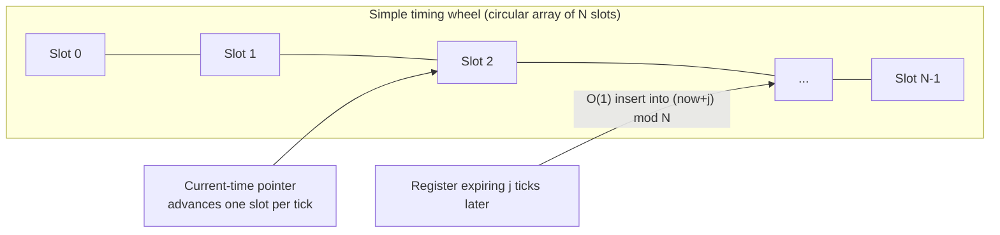
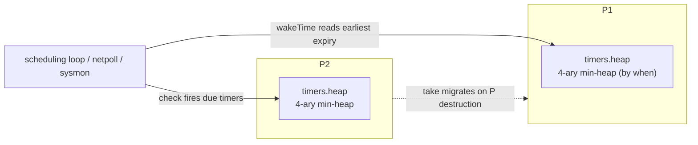
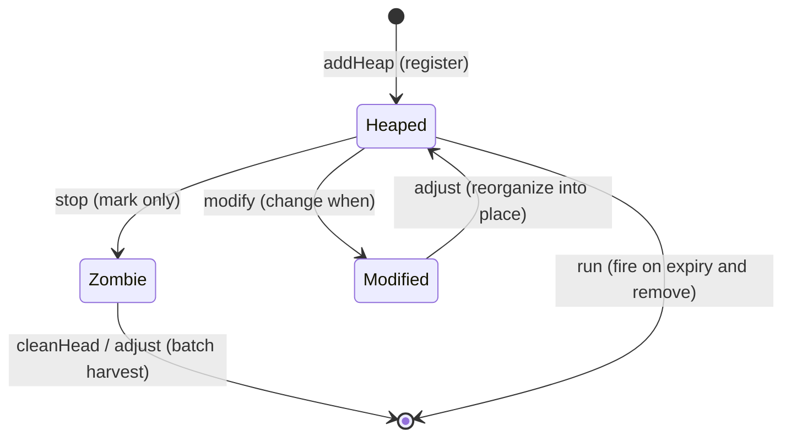
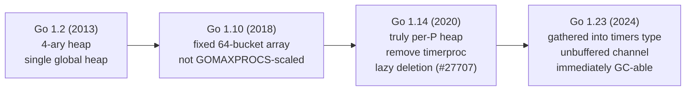

# 9.10 Timers

`time.Sleep`, `time.After`, `time.Timer`, `time.Ticker`, and even `SetDeadline` on network reads and writes
all rest on the same timer machinery. It has to answer a question that looks simple but is in fact subtle, a
question about data structures: when thousands of timers exist at once, how do we efficiently know "who should
be woken next, and when," without burning a thread to do it. This section starts from that abstract problem,
makes the trade-offs of the various solutions clear, and then lands on Go's choice and how it evolved.

## 9.10.1 The Data-Structure Problem of Timers

A timer facility must support three operations: START (register a timeout), STOP (cancel before expiry), and
expiry checking / EXPIRY (the clock advances and everything that is due fires). The difficulty is that the
clock may be checked thousands of times per second, whether or not any timer is actually due, so the cost
"per tick" must be low, while START / STOP must also be fast. The complexity comparison of a few naive schemes
is exactly the starting point of the classic 1987 paper by Varghese and Lauck:

| Scheme | START | STOP | Per-tick check | Extract due |
| --- | --- | --- | --- | --- |
| Unsorted list | $O(1)$ | $O(1)$ | $O(n)$ scan | $O(n)$ |
| Sorted list | $O(n)$ | $O(1)$ | $O(1)$ look at head | $O(1)$ |
| Min-heap | $O(\log n)$ | $O(\log n)$ | $O(1)$ look at top | $O(\log n)$ each |

There is one precise point that often gets muddled here: "find the minimum" of a heap is $O(1)$, but firing
each due timer costs $O(\log n)$ for the deletion and sift-down. So "cheap per tick" only means the check is
cheap; actually draining $k$ due timers is $O(k \log n)$. The three naive schemes each have a strength, yet
none wins on START, STOP, and expiry checking all at once. The timing wheel was born precisely to break this
deadlock.

## 9.10.2 Timing Wheels: Trading Space for Time

The answer Varghese and Lauck gave is the timing wheel, and the idea is like the hands of a clock.

- Simple timing wheel: a circular array of $N$ slots, one time unit per slot, plus a "current time" pointer.
  Registering a timer that expires $j$ ticks later ($j < N$) inserts it in $O(1)$ into slot $(now+j) \bmod N$;
  each tick the pointer advances one slot and fires that slot. START, STOP, and per-tick maintenance are all
  $O(1)$, but only for timeouts no larger than the wheel length $N$. This bounded-range restriction is exactly
  the reason the other two variants exist.
- Hashed timing wheel: when the timeout range is large, hash timeouts into a smaller wheel (entries within a
  slot are sorted by "how many more rounds to go"), reaching $O(1)$ average complexity under a uniform
  distribution.
- Hierarchical timing wheel: several wheels of different granularity, like the hour, minute, and second hands
  of a clock; long timeouts are recorded on the coarsest wheel, and on expiry they cascade down into finer
  wheels to fire precisely. It covers an enormous range with bounded memory, at the cost of the cascade
  overhead when crossing levels.



The timing wheel shifts the cost from "every operation" onto "the size of the wheel and the cascade," a
classic trade of space for time, and it pays off handsomely for the scenario of "bounded timeout range, where
most timers are cancelled before they fire." Go did not take this road, and the reason will only become clear
in 9.10.8.

## 9.10.3 Go's Choice: One 4-ary Heap per P

Go gives each P a min-heap, and it is a 4-ary heap (`timerHeapN = 4`). A 4-ary heap has fewer levels than a
binary heap ($\log_4 n$); sifting down one level means comparing 4 children instead of 2, but the
cache-friendliness from fewer levels is usually the better deal. This is not intuition but a 2013 optimization
backed by a benchmark ("better performance when a lot of timers present"). The heap is carried in an array;
the parent of index $i$ is at $\lfloor (i-1)/4 \rfloor$, and its children are at $4i+1$ through $4i+4$.



The timer set of each P is gathered into a `timers` type, hung off `pp.timers`. Trimming away the locking and
race-detection details, looking only at the fields relevant to the design:

```go
// timers: the per-P set of timers (sketch)
type timers struct {
    heap []timerWhen   // 4-ary min-heap sorted by when; timerWhen caches when, saving a dereference

    len     atomic.Uint32 // atomic copy of len(heap), for the scheduler to test emptiness lock-free
    zombies atomic.Int32  // count of timers marked deleted but not yet cleaned out of the heap (lazy deletion)

    // wakeTime uses these two lower bounds to compute "when should we wake next," without locking and walking the heap
    minWhenHeap     atomic.Int64 // heap[0].when, the earliest expiry time in the heap
    minWhenModified atomic.Int64 // lower bound on the when of timers moved earlier (timerModified) but not yet repositioned in the heap
}
```

The `heap`'s element `timerWhen` stores `when` together with `*timer`, so a comparison need not dereference the
timer each time, a small optimization for cache locality. The pair of atomics `minWhenHeap` and
`minWhenModified` is the key: they let the scheduler read off "the nearest expiry time" at a glance without
grabbing the timer lock (see 9.10.5); `zombies` serves lazy deletion (see 9.10.4).

A single timer itself is a `timer`, with its state packed into a few bits:

```go
// timer: a single timer (sketch)
type timer struct {
    when   int64  // expiry time (absolute nanotime)
    period int64  // > 0 means periodic firing (Ticker), rings again every when+period
    f      func(arg any, seq uintptr, delay int64) // expiry callback, must not block
    arg    any    // callback argument: a channel or function in the time package; a different meaning in netpoll

    ts    *timers // the timers of the P it currently lives on
    state uint8   // state bits: timerHeaped / timerModified / timerZombie
}
```

`state` has only three bits, yet it encodes the entire relationship between a timer and the heap: `timerHeaped`
means it is in some P's heap; `timerModified` means its `when` changed but its position in the heap has not been
fixed up yet, deferred to the next reorganization; `timerZombie` means it was stopped but still lingers in the
heap without being removed. Before Go 1.14 a state machine with ten possible values was used to coordinate
concurrency; after 1.23 it was simplified to these three bits plus a single lock `t.mu`, with a snapshot of the
state `astate` published atomically so the fast path can decide lock-free (see 9.10.7).

## 9.10.4 Registration, Stopping, and Lazy Deletion

Registering a timer (START) is simply adding it to the current P's heap. `time.NewTimer` goes through
`startTimer` down to the runtime's `t.maybeAdd`, and finally calls `ts.addHeap`: append to the tail of the
array, then `siftUp` to float it to its correct position, and update `minWhenHeap` when it becomes the new heap
top:

```go
// add the timer to the current P's 4-ary heap (sketch)
func (ts *timers) addHeap(t *timer) {
    if netpollInited.Load() == 0 {
        netpollGenericInit() // timers rely on the network poller to wake; make sure it has started
    }
    t.ts = ts
    ts.heap = append(ts.heap, timerWhen{t, t.when})
    ts.siftUp(len(ts.heap) - 1)        // O(log n) sift up
    if t == ts.heap[0].timer {
        ts.updateMinWhenHeap()         // became the new earliest, update the lower bound
    }
}
```

The difficulty of stopping (STOP) is that the timer may be in another P's heap while the current goroutine does
not own that P. Going to grab the lock and delete an element from someone else's heap one by one is costly and
contention-prone. Go's approach is lazy deletion: `t.stop` only sets a `timerZombie` mark on the timer and adds
one to the `zombies` count of the `timers` it lives on, leaving the real removal for that P to finish later
when it next reorganizes its heap:

```go
// stop the timer: only set a mark, do not delete immediately (sketch)
func (t *timer) stop() bool {
    t.lock()
    if t.state&timerHeaped != 0 {
        t.state |= timerModified
        if t.state&timerZombie == 0 {
            t.state |= timerZombie
            t.ts.zombies.Add(1)   // zombie +1, leave it for cleanHead / adjust to clean
        }
    }
    pending := t.when > 0
    t.when = 0
    t.unlock()
    return pending
}
```

Zombies do not pile up without bound. The timer heap is harvested in two places: `cleanHead` pops a zombie off
when it is the heap top, and `adjust` clears zombies it passes along the way while reorganizing the heap. When
to trigger the harvest is deliberate: only when it is the current P's own heap, and the zombie count exceeds a
quarter of the heap length (`zombies > len/4`), does `check` force a cleanup. This threshold has a history: in
early versions, code like `context.WithTimeout` that frequently sets up and cancels timers would leave a large
number of stopped timers lingering in the heap, wasting memory, and the 1/4 threshold was added precisely to
pin down this leak (see the evolution in 9.10.6). Confining the cleanup to the local P, in turn, is to avoid
grabbing another P's lock and to reduce contention.



## 9.10.5 Inlined Expiry Checking: No Dedicated Thread

The most intriguing point is that expiry checking needs no thread dedicated to polling; it is done along the
way. Two functions string this together. `wakeTime` takes no lock and reads only that pair of atomic lower
bounds, computing "the nearest expiry time," used to bound how long the scheduler and the network poller
([9.9](./poller.md)) should block:

```go
// when should we wake next; no lock, only reads the atomic lower bounds (sketch)
func (ts *timers) wakeTime() int64 {
    nextWhen := ts.minWhenModified.Load()
    when := ts.minWhenHeap.Load()
    if when == 0 || (nextWhen != 0 && nextWhen < when) {
        when = nextWhen
    }
    return when   // 0 means there is no timer
}
```

`check` is called in the scheduling loop (`schedule` -> `findRunnable`), during work stealing, in `sysmon`
([9.8](./sysmon.md)), and elsewhere. It first glances at the nearest expiry time via `wakeTime`, and if nothing
is due and no zombies need clearing it returns immediately (this is the fate of the vast majority of calls,
nearly zero cost); only when something is due does it take the lock, `adjust` to reorganize the heap, then loop
`run` to fire all the timers that are due:

```go
// fire all timers that are due (sketch)
func (ts *timers) check(now int64, ...) (rnow, pollUntil int64, ran bool) {
    next := ts.wakeTime()
    if next == 0 {
        return now, 0, false   // no timers
    }
    if now == 0 {
        now = nanotime()
    }
    // force a cleanup only when zombies exceed 1/4 of the heap length and it is the local P
    force := ts == &getg().m.p.ptr().timers && int(ts.zombies.Load()) > int(ts.len.Load())/4
    if now < next && !force {
        return now, next, false   // not due and no cleanup needed: fast-path return
    }
    ts.lock()
    if len(ts.heap) > 0 {
        ts.adjust(now, false)             // reorganize the heap, clearing zombies along the way
        for len(ts.heap) > 0 {
            if tw := ts.run(now, ...); tw != 0 {  // fire the due heap top
                pollUntil = tw
                break
            }
            ran = true
        }
    }
    ts.unlock()
    return now, pollUntil, ran
}
```

Expiry firing is thus scattered across the scheduler's existing wake points, rather than monopolizing a
goroutine. One especially elegant detail is in work stealing: when a P has nothing to do and enters the
`stealWork` of `findRunnable` to steal goroutines from another P, it conveniently calls `p2.timers.check` once
on the P being stolen from, firing its due timers on its behalf. In other words, an idle P helps clean up
another's timer heap, spreading out the expiry overhead that the busy P would otherwise bear. When there is not
even a single runnable P, `checkTimersNoP` will, in the no-P state, scan the `wakeTime` of all the Ps and
decide from that how long the network poller should block.

```go
// the work-stealing phase of findRunnable (minimal)
func stealWork(now int64) (gp *g, ..., pollUntil int64, ...) {
    for i := 0; i < stealTries; i++ {
        stealTimersOrRunNextG := i == stealTries-1   // only the last round also checks timers
        for enum := ...; !enum.done(); enum.next() {
            p2 := allp[enum.position()]
            if stealTimersOrRunNextG && timerpMask.read(enum.position()) {
                tnow, w, ran := p2.timers.check(now, nil)  // fire the due ones on p2's behalf
                now = tnow
                if w != 0 && (pollUntil == 0 || w < pollUntil) {
                    pollUntil = w
                }
                _ = ran
            }
            // ... then try runqsteal to steal goroutines
        }
    }
    return
}
```

The deadlines of network reads and writes reuse the same machinery instead of building a separate one.
`pollDesc` ([9.9](./poller.md)) embeds two `timer`s, for read and write, plus their respective deadlines and a
`seq` sequence number:

```go
// pollDesc: one per network fd (deadline-related fields, sketch)
type pollDesc struct {
    rseq uintptr // prevents a stale read timer from firing by mistake
    rt   timer   // read-deadline timer
    rd   int64   // read deadline (a future nanotime, -1 means already expired)
    wseq uintptr // prevents a stale write timer
    wt   timer   // write-deadline timer
    wd   int64   // write deadline
}
```

`conn.SetDeadline` is essentially rewriting `rd` / `wd` and `modify`ing those two embedded timers accordingly;
`seq` is used to identify and suppress stale firings that have been invalidated because the deadline was reset.
When the deadline arrives, the timer's callback goes and wakes the goroutine blocked on that fd. One heap
serves both the `time` package and all network I/O timeouts.

## 9.10.6 An Evolution Line Rewritten Many Times

The timer is one of the most-rewritten parts of the Go runtime, and the main thread is "ever more integrated
into the scheduler, ever more distributed." This history is also a good chance to clear up a few widely
circulated mistakes.

- The 4-ary heap itself was introduced as early as Go 1.2 (2013), as a standalone performance optimization; it
  preceded the later sharding and did not arrive together with it (a common misunderstanding).
- Go 1.10 changed the single global heap into an array of a fixed 64 buckets (`timersLen = 64`), assigned by
  P number modulo. Note: it does not scale with `GOMAXPROCS`, nor is it truly one heap per P (another common
  misreport). The commit message of the time stated plainly that scaling with GOMAXPROCS would require dynamic
  reallocation, and 64 was a compromise between memory and performance.
- Only Go 1.14 split timers into truly per-P heaps, integrated them into the scheduler and the network poller,
  and removed the dedicated `timerproc` goroutine (a series of changes led by Ian Lance Taylor). The motivation
  was a concrete performance bug: a 1ms `Ticker`, due to `timerproc` wakeups and global lock contention,
  actually consumed 20%-25% of CPU (issue #27707). This version also introduced the lazy deletion of "clean up
  once zombies exceed 1/4," to plug the memory leak left by frequently set-and-stopped timers of the
  `context.WithTimeout` kind.
- Go 1.23 did another round of internal tidying (Russ Cox), gathering the per-P timer state into the `timers`
  type above, and fixed a long-standing semantic pitfall: the timer channel became unbuffered (capacity 0),
  guaranteeing that no stale value is received after `Stop` / `Reset` returns; an unreferenced `Timer` /
  `Ticker` can now also be garbage collected immediately. The old asynchronous behavior is retained behind
  `GODEBUG=asynctimerchan=1`.



When a P is destroyed, the timers in its heap are not lost; they are migrated by `take` onto the P that takes
over. The migration carries the heap's timers one by one, skipping those that have become zombies or are
already invalid:

```go
// on P destruction, merge src's timers into this P (sketch)
func (ts *timers) take(src *timers) {
    if len(src.heap) > 0 {
        for _, tw := range src.heap {
            t := tw.timer
            t.ts = nil
            if t.updateHeap() {   // skip zombies / invalid ones, otherwise reposition
                t.ts = ts
                ts.heap = append(ts.heap, timerWhen{t, t.when})
            }
        }
        src.heap = nil
        src.zombies.Store(0)
        src.len.Store(0)
        ts.siftUpAll()           // rebuild the heap in one pass
    }
}
```

## 9.10.7 How Others Do It

The implementation of timers is a good window onto "how data-structure choice shifts with the scenario."

- The Linux kernel uses two sets at once. The coarse-grained one, used mostly for I/O timeouts that are "likely
  to be cancelled," goes with a timing wheel (`kernel/time/timer.c`); Gleixner's major rework in 2016 (4.8)
  simply did away with cascading, using 8 levels and a bitmap to find the next due timer in $O(1)$, at the cost
  of accepting a worst-case accuracy loss of about 12.5%, the rationale being precisely that "most timeouts are
  cancelled before they fire." High-resolution timers take a separate `hrtimer` path, sorting by time with a
  red-black tree (`kernel/time/hrtimer.c`).
- Netty's `HashedWheelTimer` is named directly after Varghese-Lauck and is an engineering implementation of the
  hashed timing wheel.
- libevent uses a binary min-heap, nginx uses a red-black tree, and Java's `ScheduledThreadPoolExecutor` uses
  an array-backed binary min-heap (`DelayedWorkQueue`). Erlang/BEAM uses a timing wheel.

A pattern is visible: systems dominated by "timeouts that will be cancelled" and able to accept accuracy
quantization (the kernel's base wheel, Netty) favor the timing wheel's $O(1)$; scenarios that demand precision
over an unbounded range (libevent, nginx, Java, Go) favor a heap or tree.

## 9.10.8 Why Go Chose the Heap, and the Tensions That Remain

Go chose the per-P heap over the timing wheel as an engineering trade-off, not as a theorem. The heap sorts by
absolute `int64` time over an unbounded range, treating a microsecond-scale `Sleep` and an hour-scale `context`
deadline alike, with neither the wheel's bounded range nor its cascade burden; it is simple, and its accuracy
is limited only by "how often we check"; it can live close to the scheduler, reusing existing wake points
without a dedicated thread; and sharding by P removes the lock bottleneck of a single global wheel / heap,
which is exactly what the 1.10 -> 1.14 evolution and the #27707 benchmark proved.

The tensions remain. The heap's soft spot is that STOP is $O(\log n)$, and naive deletion fragments the array,
which Go mitigates with "zombie marking + periodic cleanup"; while the timing wheel's $O(1)$ cancellation is in
theory better in high-churn scenarios like a connection pool frequently setting / clearing deadlines. Beyond
that, the trade-off between accuracy and overhead (the kernel wheel's quantization vs. the heap's precision),
timer coalescing / slack for power saving, and the pressure that high-frequency tickers put on the wake path
are all ongoing topics in this area. A gain in performance never comes for free; it always comes with a
rearrangement of complexity, and that is exactly what this chapter has shown again and again.

## Further Reading

1. George Varghese, Anthony Lauck. "Hashed and Hierarchical Timing Wheels: Data
   Structures for the Efficient Implementation of a Timer Facility." *SOSP 1987*;
   *IEEE/ACM Trans. Networking* 5(6), 1997. https://doi.org/10.1145/41457.37504
2. Sokolov Yura. *time: make timers heap 4-ary* (Go 1.2), 2013.
   https://golang.org/cl/13094043
3. Dmitry Vyukov. *runtime: make timers faster*. Go issue #6239, 2013.
   https://golang.org/issue/6239 (the scalability bottleneck of a single global timer heap, the motivation for the later per-P move)
4. Aliaksandr Valialkin. *runtime: improve timers scalability on multi-CPU systems*
   (Go 1.10, 64 buckets), 2017. https://go-review.googlesource.com/34784
5. golang/go#27707. *time: excessive CPU usage when using Ticker and Sleep* (drove the 1.14
   per-P timer). https://github.com/golang/go/issues/27707
6. Ian Lance Taylor. *runtime: add timers to P* (the Go 1.14 per-P timer series of changes), 2019.
   https://go-review.googlesource.com/c/go/+/171828
7. Go 1.23 Release Notes (timer unbuffered channel, immediately GC-able). https://go.dev/doc/go1.23 ;
   for the implementation see The Go Authors. *runtime/time.go* (`type timers`, `addHeap`, `check`, `take`).
   https://github.com/golang/go/blob/master/src/runtime/time.go
8. Thomas Gleixner. *timers: Switch to a non-cascading wheel* (Linux 4.8), 2016.
   https://git.kernel.org/torvalds/c/500462a9de65 ; LWN: https://lwn.net/Articles/646950/
9. The Linux Kernel. *hrtimers - high-resolution kernel timers.*
   https://www.kernel.org/doc/html/latest/timers/hrtimers.html
10. Netty. *HashedWheelTimer* (based on Varghese-Lauck).
   https://netty.io/4.1/api/io/netty/util/HashedWheelTimer.html
