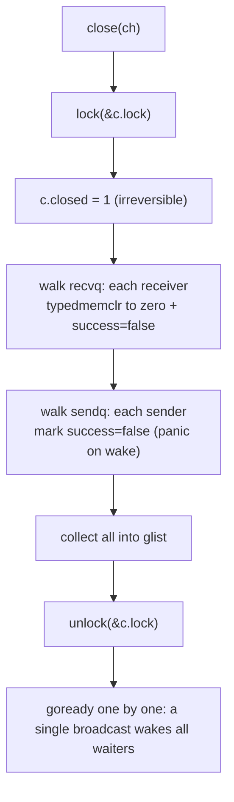
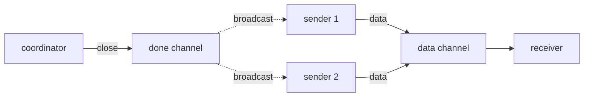

# 10.4 The Semantics of Closing

In the previous sections, both sending and receiving were "one-to-one" rendezvous: one send pairs with one receive, and the surplus side blocks and waits. Closing is the only "one-to-many" operation on a channel. `close(ch)` is issued by a single Goroutine, yet in an instant it wakes every receiver currently blocked on the channel and makes every blocked sender panic on the spot. This ability to "broadcast once and wake everyone" turns closing from a seemingly minor cleanup action into the most commonly used cancellation and wind-down mechanism in Go concurrency. The done channel pattern and `context` cancellation ([11.8](../../part3concurrency/ch11sync/context.md)) both trace their roots back here.

This section answers three questions: what `close` actually does at runtime and why it can serve as a broadcast primitive; what you read when you receive from an already-closed channel and why `for range` terminates; and the three panic red lines the language draws around closing, and why they would rather crash the program on the spot than quietly tolerate the misuse.

## 10.4.1 What close Does: A Single Locked Broadcast

The implementation of closing is concentrated in one function, `runtime.closechan`. Its skeleton can be trimmed to three parts: first set the `closed` bit under the lock, then detach all waiters on `recvq` and `sendq` in one pass and collect them into a local list, and finally unlock and wake them all together. Here is a sketch that keeps only the design highlights:

```go
// closechan: closes a channel (sketch, with the race detector and synctest branches removed)
func closechan(c *hchan) {
    if c == nil {
        panic(plainError("close of nil channel"))   // red line one: close(nil)
    }

    lock(&c.lock)
    if c.closed != 0 {
        unlock(&c.lock)
        panic(plainError("close of closed channel")) // red line two: double close
    }
    c.closed = 1                                      // set the bit, and it is irreversible

    var glist gList // collect first, wake later: waking must happen outside the lock

    // wake all receivers: each will get the zero value, ok == false
    for {
        sg := c.recvq.dequeue()
        if sg == nil {
            break
        }
        if sg.elem != nil {
            typedmemclr(c.elemtype, sg.elem) // clear the receiver's target memory, i.e. the "zero value"
            sg.elem = nil
        }
        gp := sg.g
        gp.param = unsafe.Pointer(sg)
        sg.success = false                    // key flag: this receive did not come from a real send
        glist.push(gp)
    }

    // wake all senders: they will panic once awake
    for {
        sg := c.sendq.dequeue()
        if sg == nil {
            break
        }
        sg.elem = nil
        gp := sg.g
        gp.param = unsafe.Pointer(sg)
        sg.success = false
        glist.push(gp)
    }
    unlock(&c.lock)

    // the lock is released, now hand the whole list back to the scheduler one by one
    for !glist.empty() {
        gp := glist.pop()
        goready(gp, 3)
    }
}
```

Three design points are worth calling out.

First, `closed` is a **one-shot, irreversible** state: once set to 1, no path ever changes it back to 0. The fast path for receiving from a closed channel ([10.3](./sendrecv.md)) is built precisely on this invariant: observing "closed" is a permanently true fact, with no worry that it might revert to open midway.

Second, the waiters on `recvq` and `sendq` are taken off **in full**, rather than waking only the head of the queue as send and receive do. This is exactly where the broadcast nature of closing lies: a single channel may have hundreds or thousands of receivers blocked on it at once, and `close` wakes them all in one go. Each receiver's target memory is cleared by `typedmemclr`, which is the "zero value" they will read, and `sg.success = false` marks that this wakeup did not stem from a paired send, on which basis the receiver sets the second return value `ok` to `false`.

Third, **collect into `glist`, unlock, then `goready` together**. Waking a Goroutine touches the scheduler. If you `goready` while still holding the channel lock, the woken Goroutine might immediately start running on another P, turn around to contend for the same lock, and needlessly increase contention and the time the lock is held. Pushing the wakeup outside the lock is a technique that recurs throughout the runtime (compare with how the mutex hands waiters back in [11.3](../../part3concurrency/ch11sync/mutex.md)).



A sender, once woken, does not actually send any data. It wakes at the blocking point in `chansend` ([10.3](./sendrecv.md)), detects that `c.closed != 0` while this is not a real send (the `sg.success` indicated by `gp.param` is false), and so executes `panic(plainError("send on closed channel"))`. In other words, the rule that "sending on a closed channel panics" is, for a sender that is **currently blocked**, woken by `closechan` and then fulfilled by the sender itself at the point where it wakes.

## 10.4.2 Closing as Broadcast: Done Channels and Cancellation

Once you understand that `closechan` wakes all receivers at once, you understand Go's most idiomatic cancellation pattern. Consider a done channel: it never carries meaningful data, only the single event of "closing".

```go
done := make(chan struct{})

// multiple workers block on the same done channel at the same time
for i := 0; i < n; i++ {
    go func() {
        select {
        case <-done:   // received the close signal, wind down and exit
            return
        case task := <-tasks:
            handle(task)
        }
    }()
}

// the main Goroutine closes once, and n workers are woken at the same time
close(done)
```

Here the element type of `chan struct{}` is zero-width, occupies no buffer, and is used purely as a signal line. `close(done)` triggers the broadcast in `closechan`: all workers blocked on `<-done` are woken together, each reads the zero value, and exits. If you instead used "send" to notify, one send can rouse only one worker, so waking $n$ of them requires $n$ sends, and you must know $n$ in advance. Closing turns this into a single $O(1)$ broadcast, with no need to know the number of receivers.

This is exactly the underlying mechanism of `context` cancellation ([11.8](../../part3concurrency/ch11sync/context.md)). `context.WithCancel` internally holds a `done` channel, and the core action of `cancel()` is just `close(done)`: one close, and every Goroutine listening on `ctx.Done()` across the entire context tree receives the cancellation signal at the same time. One could say that `context` is a layer wrapped around the done channel pattern that adds tree-shaped propagation and reason recording, while the broadcast ability comes entirely from `close` itself.

## 10.4.3 Receiving from a Closed Channel: Drain First, Then Zero Value

Beyond broadcast, closing carries a further layer of semantics for **receiving**, one closely tied to how buffered data is handled: closing does not discard buffered data that has not yet been taken. When a receiver reads from an already-closed channel, it first takes the remaining values in the buffer in order, and **only afterward** begins repeatedly returning the zero value.

The order in which receiving is handled ([10.3](./sendrecv.md)) guarantees this. The first check `chanrecv` makes under the lock is "closed **and** buffer empty": only when both hold does it immediately return the zero value; if the buffer still has data, control falls to the later "buffer non-empty so dequeue" branch and takes the data as usual. So receiving after a close shows two phases:

```go
ch := make(chan int, 3)
ch <- 1
ch <- 2
close(ch)

fmt.Println(<-ch) // 1   the buffer still has data, taken out as usual
fmt.Println(<-ch) // 2   take out the second
v, ok := <-ch     // 0, false   buffer drained, zero value from here on
v, ok = <-ch      // 0, false   readable repeatedly, never blocks
```

With the two semantics together, the termination condition of `for range` becomes clear. `for v := range ch` is translated by the compiler ([10.3](./sendrecv.md)) into a loop that takes a value each round with `v, ok := <-ch` and exits when `ok` is `false`. Compare this with the two phases above: before the channel is closed, the loop takes values as usual and blocks when there is no data; after closing, the loop first takes all buffered data, and once drained some receive returns `ok == false`, whereupon the loop ends. **Closing is the only clean termination signal for `for range`**: a `range` over an unclosed channel will block forever once data runs out.

The meaning of the second return value `ok` becomes fully clear here too: it answers not "did we read a value", but "did this value come from a real send". `ok == true` means the value came from a paired send or from the buffer; `ok == false` means the channel is closed with no more data, and what was read is the zero value.

From the perspective of the memory model ([11.9](../../part3concurrency/ch11sync/mem.md)), closing also provides a happens-before guarantee: `close(ch)` happens before "a receive that returns the zero value because the channel is closed". So a done channel not only conveys the single signal of "cancel", but can also safely publish shared data written before the signal: writes before the close are visible to reads after the close signal is received. This is the basis on which a done channel can serve as a synchronization point.

## 10.4.4 Three Panic Red Lines and Fail-Fast

Closing is the most panic-dense spot among channel operations. The language draws three red lines around it, and touching any one crashes the program on the spot:

| Misuse | Trigger point | Panic message |
| --- | --- | --- |
| Send on a closed channel | `chansend` detects `c.closed != 0` | `send on closed channel` |
| Double close | `closechan` detects `c.closed != 0` | `close of closed channel` |
| Close a nil channel | `closechan` entry sees `c == nil` | `close of nil channel` |

All three choose **fail-fast**: panic immediately, rather than return an error or silently ignore. This is a design trade-off worth spelling out. Making them recoverable errors looks friendlier at first, but actually buries what is fundamentally a logic error even deeper.

Sending on a closed channel, and double-closing, almost always signal **confused ownership**: the sender and the closer disagree about "whether this channel should still be written to right now, and who should wind it down". If such errors are swallowed, data may be silently lost, or you are left with a dead channel that is still being written to, and the failure site drifts far from the root cause, adding to debugging cost. Panicking on the spot pins the error at the first scene of the crime: the stack trace points straight at that illegal `close` or `send`.

Closing a nil channel is the same. Both sending and receiving on a nil channel **block forever** ([10.3](./sendrecv.md)), and calling `close` on one is most likely a variable that was never initialized. This kind of error has no reasonable "fault-tolerant" semantics to speak of, and the only correct treatment is to expose it as early as possible.

As for why these three **cannot** be cleanly caught with `recover`: the `send on closed channel` panic happens midway, after the data is already prepared but found to have nowhere to go, and the channel's internal state at that moment is not suited to letting the caller pretend nothing happened and carry on. Go's stance is consistent throughout: misuse of a channel is a programmer's logic error, and it should be forced out during development by `-race` and tests, not kept alive in production by `recover`.

## 10.4.5 The Ownership Rule: The Sender Closes, the Receiver Does Not

When the three red lines land in engineering practice, they crystallize into one plain but highly effective convention: **the sender closes the channel, and the receiver never closes it**; and when there are multiple senders, no single sender may close it alone. This rule is not enforced by the runtime, but is a discipline naturally derived from the semantics above.

Why does the sender close? Because "there is no more data to send" is something only the sender knows. The receiver has no way to tell whether the other end has finished sending: if it rashly closes, the side that is still sending will run into `send on closed channel` and crash (red line one). Conversely, when the sender closes, it broadcasts "this is the end" to the receiver exactly, fitting the termination semantics of `for range` precisely.

The multiple-sender case is trickier. Here, whichever sender does the closing may trigger red line one while another sender is still writing, or collide with another sender's close on red line two. The correct approach is to let no sender close the data channel, and instead introduce a separate done channel closed by a coordinator: before each send, the sender uses `select` to check whether done is already closed, and decides to stop accordingly. This returns us exactly to the broadcast pattern of [10.4.2](#1042-closing-as-broadcast-done-channels-and-cancellation): the data channel carries values, the done channel carries "stop", and each does its own job.



To connect this discipline with the previous sections: send ([10.3](./sendrecv.md)) and receive ([10.3](./sendrecv.md)) depict the one-to-one rendezvous, `select` ([10.3](./select.md)) lets a single Goroutine watch over multiple channels at once, and closing broadcasts the event "I am done on my end" all at once to everyone still waiting. Only with all three together do we have the full basic vocabulary with which Go weaves concurrency from channels.

## Further Reading

1. The Go Authors. *runtime/chan.go* (the close branches of `closechan`, `chanrecv`, `chansend`).
   https://github.com/golang/go/blob/master/src/runtime/chan.go
2. The Go Authors. *The Go Programming Language Specification: Close, Receive operator, For statements with range clause.*
   https://go.dev/ref/spec#Close
3. The Go Authors. *The Go Memory Model* (Channel communication, including the close-before-receive happens-before clause).
   https://go.dev/ref/mem#chan
4. Sameer Ajmani. *Go Concurrency Patterns: Pipelines and cancellation.* The Go Blog, 2014.
   https://go.dev/blog/pipelines (the original exposition of the done channel cancellation pattern)
5. Sameer Ajmani. *Go Concurrency Patterns: Context.* The Go Blog, 2014.
   https://go.dev/blog/context (cancellation propagation built on top of close)
6. C. A. R. Hoare. "Communicating Sequential Processes." *Communications of the ACM*, 21(8), 1978.
   https://doi.org/10.1145/359576.359585 (the theoretical origin of channel communication)
7. This book: [10.3 Send/Receive and Direct Handoff](./sendrecv.md), [10.3 Send/Receive and Direct Handoff](./sendrecv.md), [10.3 select](./select.md),
   [11.8 Context](../../part3concurrency/ch11sync/context.md),
   [11.9 The Memory Consistency Model](../../part3concurrency/ch11sync/mem.md).
