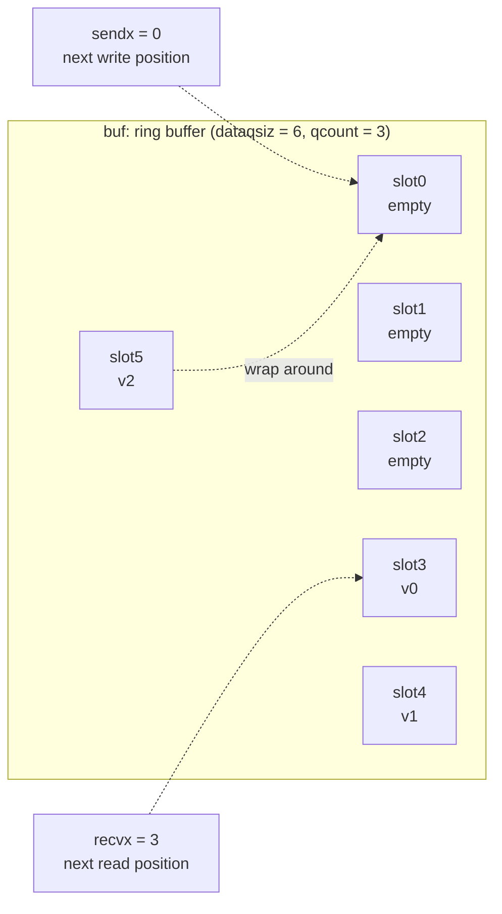

# 10.2 hchan: The Internal Structure of a Channel

[10.1](./readme.md) placed channels within the language from the angle of CSP: a channel is an explicit message conduit that fuses "communication" and "synchronization" into one. This section takes it apart. At runtime a channel is a struct called `hchan`, and its whole secret amounts to a single lock, a ring of buffered storage, plus two wait queues. The structure is small, yet every field exists for a specific design reason. Once you understand these few pieces, the entire logic of sending, receiving, and select that follows ([10.3](./sendrecv.md)–[10.6 The Memory Model and the Move Toward Lock-Free](./lockfree.md)) is just "moving data, parking and waking goroutines on top of this one picture."

Following this book's habit when explaining runtime data structures, the struct given below is a **pared-down sketch**, keeping only the design-relevant fields and noting in the comments why each exists. For the full definition, compare against `runtime/chan.go` and `runtime/runtime2.go`.

## 10.2.1 Three Invariants: Look at the "Why" First

Before dissecting the fields one by one, let us copy down the three invariants laid out in the comment at the top of `chan.go`. They are the design intent of the entire structure, and they explain "why it is this way" better than any field description:

- At least one of `c.sendq` and `c.recvq` is empty (the sole exception is when a single goroutine, on an unbuffered channel, is parked on both the receive and send sides via select);
- For a buffered channel, `c.qcount > 0` implies `c.recvq` is empty;
- For a buffered channel, `c.qcount < c.dataqsiz` implies `c.sendq` is empty.

In everyday language these three boil down to one sentence: **if there is still goods in the buffer, no receiver should be left waiting; if there is still room in the buffer, no sender should be left waiting.** The moment a buffer and someone "left waiting" coexist, it means a deal that could have closed directly was not closed, and that is a bug. The whole send/receive implementation ([10.3](./sendrecv.md), [10.3](./sendrecv.md)) does precisely one thing: it maintains these three invariants at all times, closing a deal directly when it can, and only parking itself in a wait queue when no direct deal is possible. Read the fields below with this intent in mind, and they stop being a dry checklist.

## 10.2.2 The hchan Sketch

```go
// hchan: the runtime representation of one channel (sketch)
type hchan struct {
    qcount   uint           // number of elements currently in the buffer
    dataqsiz uint           // capacity of the ring buffer (the second argument to make)
    buf      unsafe.Pointer // points to a contiguous array that can hold dataqsiz elements
    elemsize uint16         // size of a single element (derived from the element type, cached here to avoid repeated lookups)
    closed   uint32         // whether close has been called
    elemtype *_type         // element type: needed for copying elements, write barriers, and tagging buf with GC info
    sendx    uint           // the write cursor of the ring buffer (the next slot to write)
    recvx    uint           // the read cursor of the ring buffer (the next slot to read)
    recvq    waitq          // queue of blocked receivers ( <-ch )
    sendq    waitq          // queue of blocked senders ( ch<- )

    lock mutex              // one lock, guarding all of the above fields
}
```

The fields fall roughly into three groups. The five fields `qcount`, `dataqsiz`, `buf`, `sendx`, `recvx` together describe the **ring buffer** (10.2.3); `recvq` and `sendq` are the two **wait queues** (10.2.4); `closed` records the closed state, and `elemsize` and `elemtype` are the metadata kept on hand for moving elements. Among them, `dataqsiz` is never written again after creation, so the runtime can read it without a lock to quickly determine whether a channel has a buffer (helper functions such as `full` rely on this). As for `elemtype`, it is used not only for copying elements by value and triggering write barriers, but is also handed to the allocator at creation time to tag `buf` with "which positions in this memory are pointers." We will return to this in 10.2.5. (In go1.26 `hchan` also has two fields, `timer` and `bubble`, serving `time` timers and `testing/synctest` respectively. They are unrelated to this section's main thread and are omitted from the sketch.)

## 10.2.3 The Ring Buffer: sendx and recvx Are Head and Tail Cursors

The buffer of a buffered channel is a **ring buffer**. `buf` points to a stretch of contiguous memory that can hold `dataqsiz` elements, and `sendx` and `recvx` are two cursors: a sender writes an element at `sendx` and then advances it, a receiver reads an element from `recvx` and then advances it, and each wraps back to 0 once it walks off the end. `qcount` records the current count, so "queue full" is `qcount == dataqsiz` and "queue empty" is `qcount == 0`. Locating the `i`-th slot is nothing but a piece of pointer arithmetic:

```go
// chanbuf(c, i): get the address of the i-th slot in buf
func chanbuf(c *hchan, i uint) unsafe.Pointer {
    return add(c.buf, uintptr(i)*uintptr(c.elemsize))
}
```

Why a ring rather than a linear queue? Because channel send and receive are strictly FIFO: what is sent first is received first. A linear array leaves a hole at the head after a dequeue, forcing you either to shift elements or to waste space; a ring buffer lets the read and write ends each circle around, so both enqueue and dequeue are $O(1)$ cursor increments with wraparound, without moving a single byte. The figure below shows a channel of capacity 6 holding 3 elements; `recvx` points at the earliest enqueued element, the next to be read out, and `sendx` points at the next empty slot:



On send, write at `sendx`, then `sendx = (sendx+1) % dataqsiz`, then `qcount++`; on receive, read at `recvx`, then `recvx = (recvx+1) % dataqsiz`, then `qcount--`. The runtime does not take a modulus but writes it as `if sendx == dataqsiz { sendx = 0 }`, saving a division. Tying back to the invariants of 10.2.1: as long as `qcount` is between $0$ and `dataqsiz`, the buffer is neither full nor empty, both send and receive can complete in place, and the two wait queues are necessarily empty at that moment.

## 10.2.4 Wait Queues: a FIFO Linked List of sudog

When the buffer cannot help, for instance sending to a full channel, receiving from an empty channel, or a channel that has no buffer at all, the current goroutine must park and wait for someone on the other side. Where does it park? Into `recvq` or `sendq`. The type of these two queues is `waitq`, a plain doubly linked list that records a head and a tail:

```go
type waitq struct {
    first *sudog // head: parked earliest, woken first
    last  *sudog // tail: parked most recently
}
```

The nodes of the list are `sudog`. To understand channels, `sudog` is unavoidable: it represents **one goroutine currently blocked on some channel, together with the element slot it wants to send or receive**. The pared-down sketch:

```go
// sudog: a goroutine parked on a channel + the element it wants to send/receive (sketch)
type sudog struct {
    g *g                 // the goroutine that was parked

    next *sudog          // successor in the waitq
    prev *sudog          // predecessor in the waitq

    elem maybeTraceablePtr // address of the element to send/receive, may point directly into g's own stack

    isSelect bool        // whether this g is participating in a select (waking requires a CAS to claim it)
    success  bool        // reason for waking: true = successful send/receive, false = channel was closed
    c        maybeTraceableChan // which channel it is blocked on
}
```

Why not thread the `*g` directly into the queue, and instead wrap a layer of `sudog` around it? Because "a goroutine blocked on a channel" is not one-to-one: the same goroutine can be parked on several channels at once within a single select statement, and a single channel can have several goroutines queued on it. `sudog` is exactly the carrier for "this one instance of (goroutine, channel) waiting," and a goroutine may therefore hold several `sudog`s at the same time. `sudog` is not exclusive to channels; the semaphores of the `sync` package ([11.x](../ch11sync)) queue with the same structure, and several of its fields beyond `isSelect` and `success` above are prepared for the semaphore, omitted from the sketch. The runtime reuses `sudog`s through a per-P cache, saving frequent allocation.

The `elem` field deserves a special mention: it points at "the element to be sent or received this time," and this memory **is often right on the goroutine's own stack**. This is the basis of one of the channel's key optimizations: when a sender encounters a receiver already waiting in `recvq`, it can copy the data **directly into the `elem` on the receiver's stack**, skipping the relay through the ring buffer ([10.3](./sendrecv.md) gives the details). This also explains why these fields on `sudog` must be protected by the channel's lock: waking the other party and writing into its stack both have to be done while holding the lock.

The queue itself is strictly FIFO. Enqueue appends to the tail, dequeue removes from the head:

```go
func (q *waitq) enqueue(sgp *sudog) {
    sgp.next = nil
    x := q.last
    if x == nil {            // empty queue
        sgp.prev = nil
        q.first = sgp
        q.last = sgp
        return
    }
    sgp.prev = x             // append to the tail
    x.next = sgp
    q.last = sgp
}

func (q *waitq) dequeue() *sudog {
    // remove from the head; under select wake contention, nodes already woken elsewhere must be skipped, omitted here
    sgp := q.first
    // ... update first / last, return sgp
    return sgp
}
```

The first parked is the first woken, and this guarantees the fairness of channel send and receive: no waiter is cut in front of indefinitely. The "at least one queue is empty" invariant of 10.2.1 also gets an intuitive explanation here: if the buffer has an empty slot or has goods, the newly arriving sender or receiver closes the deal on the spot and never reaches the enqueue step, so the two queues are never both non-empty (the double-park special case of select aside).

## 10.2.5 makechan: One Allocation, the noscan Optimization

`make(chan T, n)` is translated by the compiler into `makechan(t, n)`. Its core job is to compute the memory the buffer needs, request it from the heap, and fill in the metadata. A channel is always allocated on the heap and reclaimed by the GC, which is also why failing to `close` explicitly does not leak memory (closing and reclaiming are two different things). What is worth chewing over is that it splits into three allocation strategies by element type:

```go
func makechan(t *chantype, size int) *hchan {
    elem := t.Elem
    mem, overflow := math.MulUintptr(elem.Size_, uintptr(size)) // total bytes of the buffer
    if overflow || mem > maxAlloc-hchanSize || size < 0 {
        panic(plainError("makechan: size out of range"))
    }

    var c *hchan
    switch {
    case mem == 0:
        // unbuffered (size==0), or zero-sized element (such as struct{}): no buf needed at all
        c = (*hchan)(mallocgc(hchanSize, nil, true))
        c.buf = c.raceaddr()
    case !elem.Pointers():
        // element contains no pointers: hchan and buf are allocated together in one block, and the whole block is noscan
        c = (*hchan)(mallocgc(hchanSize+mem, nil, true))
        c.buf = add(unsafe.Pointer(c), hchanSize)
    default:
        // element contains pointers: buf must be allocated separately, carrying elemtype so the GC can scan it
        c = new(hchan)
        c.buf = mallocgc(mem, elem, true)
    }

    c.elemsize = uint16(elem.Size_)
    c.elemtype = elem
    c.dataqsiz = uint(size)
    lockInit(&c.lock, lockRankHchan)
    return c
}
```

The dividing line between the three branches is "does the GC need to scan this buffer":

- `mem == 0` covers two cases at once: an unbuffered channel (`size == 0`), and an element of a zero-sized type (`chan struct{}`, commonly used as a pure signal). Neither needs a `buf`; only an `hchan` is allocated, and `buf` points at a placeholder that serves merely as a synchronization address for the race detector (`-race`).
- `!elem.Pointers()`, no pointers in the element: `hchan` and `buf` are carved out together in **a single `mallocgc` call**, with `buf` sitting right behind `hchan` (`c.buf = add(c, hchanSize)`). One allocation saves one call, and more importantly the type passed in is `nil`, so the whole block of memory is marked **noscan**, and the GC skips this buffer entirely during scanning. For high-frequency channels whose elements are `int`, `byte`, and the like, this is a real saving in cost.
- The element **contains pointers**: `buf` can only be allocated **separately**, and `elemtype` must be passed in at allocation time. The reason is the flip side of the previous point: the GC must scan the pointers in this buffer, otherwise objects referenced by elements still sitting in the buffer, not yet taken out, would be wrongly reclaimed. Handing `elemtype` to the allocator is what lets it register a bitmap of "which words are pointers" for this memory. Here `hchan` and `buf` belong to two separate blocks of memory and cannot be merged.

So `makechan` is not simply "allocate a chunk of memory"; it works in concert with the GC: noscan when it can, and faithfully tagged when it must scan. This is the same line of thinking as the allocator's distinction between pointer-bearing and pointer-free objects in [12 Memory Allocation](../../part4memory/ch12alloc); a channel is just one of its users.

## 10.2.6 One Lock, and the Synchronization Semantics It Holds Up

The `lock mutex` at the end of `hchan` is the synchronization cornerstone of the entire structure. What it guards is not only all the fields of `hchan` itself, but also **several fields inside the `sudog`s parked on this channel**, as the source comment specifically notes. Receive, send, close, select: every operation that touches this state takes `lock(&c.lock)` as its first step and `unlock` as its last. It is precisely because this lock threads through the whole process that a send on a channel and the corresponding receive establish a happens-before order in the memory model ([11.9](../ch11sync/mem.md)), making the channel both a means of communication and a means of synchronization.

This lock also brings a subtle discipline: **while holding `c.lock`, you must not change the state of another goroutine** (and in particular must not `goready` to wake it). The reason is that waking may trigger a stack shrink, and a stack shrink in turn grabs this very lock, and the crossing of the two deadlocks. The awkward "first remove the `sudog` while holding the lock, then `goready` after unlocking" patterns in the send/receive implementation have their root right here ([10.6 The Memory Model and the Move Toward Lock-Free](./lockfree.md) expands on it).

Guarding the entire channel with one big lock is a deliberate trade-off: the implementation is simple and the correctness is easy to argue, at the cost of concurrent sends and receives on the same channel being serialized on this lock. The community and the runtime authors explored a lock-free channel very early on: Dmitry Vyukov submitted an experimental design for a lock-free channel around 2014, which was ultimately not merged because "the growth in complexity far outweighed the benefit it bought." To this day the standard channel remains this plain combination of a lock and a ring buffer. Once you see this lock clearly, the entire detail of send, receive, and select ([10.3](./sendrecv.md)–[10.6 The Memory Model and the Move Toward Lock-Free](./lockfree.md)) is just "moving data, parking, and waking inside the locked critical section, according to the invariants of 10.2.1."

## Further Reading

1. The Go Authors. *runtime/chan.go* (`hchan`, `waitq`, `makechan`, `chanbuf`, including the invariant comment at the top).
   https://github.com/golang/go/blob/master/src/runtime/chan.go
2. The Go Authors. *runtime/runtime2.go* (the definition and field documentation of `sudog`).
   https://github.com/golang/go/blob/master/src/runtime/runtime2.go
3. Russ Cox. *Go Data Structures.* 2009.
   https://research.swtch.com/godata
4. Dmitry Vyukov. *Go channels on steroids* (the lock-free channel design and the unmerged experiment). 2014.
   https://docs.google.com/document/d/1yIAYmbvL3JxOKOjuCyon7JhW4cSv1wy5hC0ApeGMV9s
5. C. A. R. Hoare. *Communicating Sequential Processes.* Communications of the ACM, 21(8), 1978.
   https://doi.org/10.1145/359576.359585
6. This book: [10.1 CSP and Channels](./readme.md), [10.3 Send, Receive, and Direct Handoff](./sendrecv.md), [11.9 The Memory Consistency Model](../ch11sync/mem.md), [12 Memory Allocation](../../part4memory/ch12alloc).
