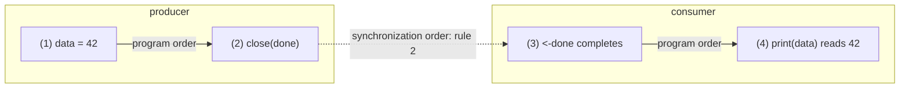

# 10.6 The Memory Model and the Lock-Free Evolution

The previous sections took the channel apart down to its parts: the direct handoff in [10.3](./sendrecv.md)
lets the sending and receiving ends pass a value directly, bypassing the ring buffer, and `select` in
[10.5](./select.md) makes a random choice among several ready branches. These mechanisms explain how a
channel "runs". This section answers two higher-level questions: what **visibility guarantee** a channel
offers to a concurrent program, and an engineering mystery that is often raised, why a channel is still
"a lock plus a queue" to this day rather than the supposedly faster lock-free structure. The former reconnects
the channel to the memory model in [11.9](../ch11sync/mem.md); the latter is a real trade-off about "how
correctness and maintainability win out over peak performance".

## 10.6.1 The Channel's Memory Model Promise

A channel is not just a pipe for carrying data; it is at the same time a synchronization point that establishes
happens-before. [11.9](../ch11sync/mem.md) gives the full picture of the Go memory model. Here we pull out the
four rules in it that concern channels and read through each one for its meaning. The Go memory model
(go.dev/ref/mem, version of June 2022) states the following about channels, and we follow the terminology
revised in 1.19, *synchronized before* (written $<$):

1. A send **is synchronized before** the completion of the corresponding receive. This holds for any channel
   (buffered or not).
2. `close(ch)` **is synchronized before** a receive that returns a zero value because the channel is closed.
3. For an **unbuffered** channel, a receive **is synchronized before** the completion of the corresponding send.
4. For a buffered channel with capacity $C$, the $k$-th receive **is synchronized before** the completion of the
   $(k+C)$-th send.

The first rule is the most plain intuition: every write made before putting the data into the channel is visible
to the receiver once it has taken that data. This is the formal basis of the maxim "do not communicate by sharing
memory; instead, share memory by communicating". A minimal example:

```go
var data int
var done = make(chan struct{})

func producer() {
	data = 42       // (1) ordinary write
	close(done)     // (2) closing is a synchronization
}

func consumer() {
	<-done          // (3) receive completes
	print(data)     // (4) guaranteed to read 42
}
```

(1) is sequenced before (2); by rule 2, (2) is synchronized before (3); (3) is sequenced before (4). The transitive
closure of these three segments gives (1) $<$ (4), so (4) must read 42. If we draw this chain, the cross-goroutine
step (`close` synchronized before the receive) is exactly the edge that glues the two program orders together:



Without this channel rule, all that remains between (1) and (4) is a data race, and the program in
[11.9.1](../ch11sync/mem.md) that prints 0 is the counterexample.

## 10.6.2 The "Inversion" of Unbuffered Send/Receive: The Send Is a Receipt

The third rule is easy to overlook, yet it is the essence of unbuffered channel semantics. Notice that it **inverts**
the direction: for a buffered channel, the send precedes the completion of the receive; for an unbuffered channel, the
**receive** precedes the **completion** of the send.

This inversion corresponds directly to the direct handoff described in [10.3](./sendrecv.md). An unbuffered channel
has no buffer slot, so the sender must wait until a receiver is ready and hand the value to it directly before the send
operation counts as complete. Thus the event "the send returns" is precisely proof that "someone has already received
it". An unbuffered send therefore has the semantics of an **acknowledgement**:

```go
ch := make(chan struct{}) // unbuffered

go func() {
	doWork()
	ch <- struct{}{} // send: returns only after the other side takes it
}()

<-ch       // receive: at this point we can conclude doWork is done and its writes are visible
useResult()
```

Rule 3 guarantees that `<-ch` (the receive) is synchronized before the completion of `ch <- struct{}{}`, and the latter
is in turn sequenced after `doWork()`. The reader thereby obtains a conclusion stronger than "the data has arrived": the
sender has advanced past the send point. A buffered channel cannot give this guarantee, because a send may merely stuff
the value into the buffer and return, while the receiver may not have acted at all. The real divide between unbuffered
and buffered is not "whether a value can be cached" but this inversion in the direction of visibility.

## 10.6.3 The Buffered Channel as a Semaphore

The fourth rule, that the $k$-th receive is synchronized before the completion of the $(k+C)$-th send, looks abstract at
first; it is in fact the formal basis of the idiom "a buffered channel is a counting semaphore". Read the rule backwards:
for the $(k+C)$-th send to complete, the $k$-th receive must happen first. That is, the buffer holds at most $C$ unreceived
values, and the $(C+1)$-th send blocks until someone takes one away and frees a slot. The capacity $C$ is exactly the upper
bound on values "in flight at once".

This is the classic way to cap concurrency at $C$ with a single `chan struct{}`:

```go
// Limit the number of concurrently executing workers to C
func bounded(tasks []Task, C int) {
	sem := make(chan struct{}, C) // a buffered channel of capacity C serving as a semaphore
	var wg sync.WaitGroup
	for _, t := range tasks {
		sem <- struct{}{} // acquire a token: the C+1-th send blocks here
		wg.Add(1)
		go func(t Task) {
			defer wg.Done()
			defer func() { <-sem }() // release a token: one receive lets one waiting send through
			t.Run()
		}(t)
	}
	wg.Wait()
}
```

`sem <- struct{}{}` is the P operation (acquire), and `<-sem` is the V operation (release). At any moment the number of
goroutines inside `t.Run()` does not exceed $C$: once $C$ tokens are taken, the $(C+1)$-th `sem <-` blocks until the
`<-sem` receive of some finished worker frees a slot. Rule 4 nails this down as a guarantee at the level of the memory
model, not just an empirical "happens to work". The element type is chosen as `struct{}` because it is zero bytes; the
buffer is used only for counting, not for storing data.

## 10.6.4 Why the Channel Is Not Lock-Free

After reading the `hchan` structure in [10.1](./readme.md), the careful reader will have noticed that `lock mutex`. In a
Go runtime that chases high concurrency, where even the allocator fast path
([12.2](../../part4memory/ch12alloc/component.md)) and the scheduler's local queues are made lock-free, why does the
channel alone keep a mutex? It is not that no one has tried.

In 2014, Dmitry Vyukov filed the proposal **golang/go#8899 "runtime: lock-free channels"**, with a design document and
an implementation (CL 12544043). The proposal reported that on a real application that had once switched away from channels
because of their performance, the lock-free channel brought an end-to-end speedup of about **23%**. The number is sizable
and the direction tempting. Yet as of go1.26, `hchan` is still a single `lock mutex` protecting the ring buffer and the
send/receive wait queues, and the proposal has long sat in Open / Unplanned status, **without landing**.

```go
// hchan: as of go1.26 still protected entirely by a single mutex (sketch, cf. 10.1)
type hchan struct {
	qcount   uint   // number of elements currently in the buffer
	dataqsiz uint   // ring buffer capacity C
	sendx    uint   // send cursor
	recvx    uint   // receive cursor
	recvq    waitq  // queue of blocked receivers (FIFO)
	sendq    waitq  // queue of blocked senders (FIFO)
	// lock protects all fields of hchan, plus several fields of sudogs blocked on this channel
	lock mutex
}
```

Why would a speedup proposal backed by data be shelved? Here we need to be careful: the project has not published a
"list of rejection reasons", and what follows are inferable difficulties based on channel semantics, not a single
confirmed cause. A channel is not an ordinary concurrent queue; under one lock it maintains several invariants that must
move **in concert**: the **FIFO order** of the send/receive wait queues
([10.6.5](#1065-the-engineering-account-of-fifo-fairness-and-select-fairness)), the **atomic choice** and fairness of
`select` across multiple channels ([10.5](./select.md)), and the **broadcast** wakeup of all waiters on `close` (readying
both `recvq` and `sendq` at once). Making all three lock-free at the same time while still guaranteeing linearizability is
far harder than a pure MPMC queue. The cost of a mutex is contention; what it buys is that the implementation and
verification of these invariants are far simpler. The Go team's leaning here shares the same temperament as its exposing
only sequentially consistent atomics in the memory model ([11.9.10](../ch11sync/mem.md)): **when peak performance conflicts
with correctness and maintainability, lean toward the latter**.

## 10.6.5 The Engineering Account of FIFO, Fairness, and select Fairness

The two invariants that lock guards, FIFO and fairness, have themselves gone through some evolution, each worth a note.

**FIFO of the blocking queue.** The proposal **golang/go#11506 "runtime: make sure blocked channels run operations in FIFO
order"** (filed by Russ Cox, fixed early in Go 1.6) pointed out a hazard: when multiple goroutines are blocked on some channel
and the channel becomes available, a running goroutine that happens to "pass by" may complete the operation ahead of those
already blocked, leaving the blocked ones to suffer arbitrary delay. The fix is exactly the direct handoff of
[10.3](./sendrecv.md): when the channel becomes available, the wakeup hands the value directly to the waiter at the head of
`recvq`, and `recvq` is a first-in-first-out queue ordered by arrival (`enqueue` adds to the tail, `dequeue` removes from the
head). First-come-first-served thereby becomes a guarantee rather than a probability.

**Fairness of select.** When `select` faces several branches ready at the same time, it must pick one at random, otherwise the
branches written earlier would starve the later ones over the long run. The proposal **golang/go#21806 "runtime: select is not
fair"** reported that Go 1.9 lost its randomness under some channel configurations. Today's implementation
([10.5](./select.md)) solves it with a single shuffle:

```go
// Before executing select, shuffle the polling order of branches (pollorder) for fairness (sketch, cf. src/runtime/select.go)
for i := 1; i < ncases; i++ {
	j := cheaprandn(uint32(i + 1)) // cheap random number
	pollorder[i] = pollorder[j]    // Fisher-Yates shuffle
	pollorder[j] = uint16(i)
}
```

`pollorder` decides in what order each branch is checked for readiness, and the shuffle gives every ready branch an equal
probability of being chosen. Note that it and `lockorder` are two separate orderings: `lockorder` sorts by channel address,
ensuring that multiple `select` statements take locks in a consistent order to avoid deadlock; `pollorder` is the one
responsible for fairness. Both live within the protocol of that lock, which is further evidence for the judgment in
[10.6.4](#1064-why-the-channel-is-not-lock-free): invariants like FIFO and `select` fairness, "spanning multiple waiters and
multiple channels", are the concrete reason for keeping the channel inside the lock.

## 10.6.6 Summary: The Trade-off Behind One Lock

The channel's memory model promise and the form of its implementation are two sides of the same trade-off. The four
synchronized-before rules give the user a strong and clear visibility contract: a send establishes happens-before, an
unbuffered send is a receipt, and the buffer capacity is a semaphore. To honor this contract reliably, on top of the
interlocking invariants of FIFO, `select` fairness, and `close` broadcast, the most direct way is one lock. The lock-free
channel (#8899) can indeed be faster on some workloads, but only at the cost of rewriting the correctness proofs of these
invariants, a bill the Go team has not signed to this day. A performance gain never comes for free; here, what it buys is
a concurrency semantics that can be read, maintained, and trusted. The next chapter [11.9](../ch11sync/mem.md) will place
this channel contract back into the complete Go memory model, set side by side with the rules of mutex and atomic.

## Further Reading

1. The Go Authors. *The Go Memory Model* (Version of June 6, 2022). Section "Channel communication".
   https://go.dev/ref/mem
2. Dmitry Vyukov. *runtime: lock-free channels.* Go issue #8899 (with design document and CL 12544043;
   reports about a 23% speedup; as of go1.26 still Unplanned, not merged).
   https://github.com/golang/go/issues/8899
3. Russ Cox. *runtime: make sure blocked channels run operations in FIFO order.* Go issue #11506
   (fixed early in Go 1.6). https://github.com/golang/go/issues/11506
4. The Go Authors. *runtime: select is not fair.* Go issue #21806.
   https://github.com/golang/go/issues/21806
5. The Go Authors. *src/runtime/chan.go, src/runtime/select.go.* (go1.26: `hchan` still protected by
   `lock mutex`; `select` shuffles `pollorder` with `cheaprandn`.)
   https://github.com/golang/go/tree/master/src/runtime
6. C. A. R. Hoare. "Communicating Sequential Processes." *Communications of the ACM*, 21(8), 1978.
   https://doi.org/10.1145/359576.359585
7. This book: [10.3 Send/Receive and Direct Handoff](./sendrecv.md), [10.5 select and Fairness](./select.md),
   [11.9 The Memory Consistency Model](../ch11sync/mem.md).
