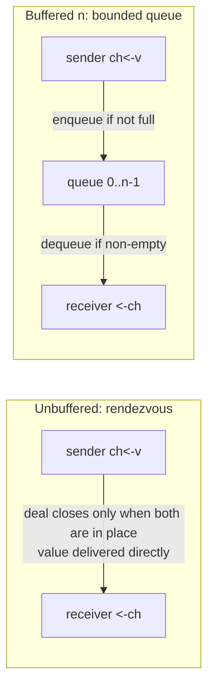

# 10.1 Channels and the Engineering of CSP

> A recorded talk accompanies this section: [online on YouTube](https://www.youtube.com/watch?v=d7fFCGGn0Wc),
> [Google Slides deck](https://changkun.de/s/chansrc/).

CSP gives Go a claim: processes do not share state, they coordinate solely by passing messages
([1.3](../../part1overview/ch01intro/csp.md)). This section is concerned with a different question:
for an engineering language to make this claim real, what shape must "communication" take so that
an ordinary programmer can reach for it and get it right. Go's answer is the channel, a first-class
primitive that is at once synchronization and communication. We begin by laying out its model at the
surface of the language, its type, its send and receive syntax, the two semantics of buffered versus
unbuffered, directional restriction, and nil behavior, building the intuition that the later sections
will need as they descend into the runtime implementation ([10.2](./impl.md)–[10.7](./pattern.md)).

## 10.1.1 Making Communication a First-Class Primitive

"Do not communicate by sharing memory; instead, share memory by communicating." This maxim is often
quoted, but in Go it is not a slogan, it is redeemed by a concrete language construct, the channel.
The lineage of CSP, and how it agrees with and departs from the original 1978 paper, was covered in
[1.3](../../part1overview/ch01intro/csp.md) and is not repeated here; we pick up only with the trade-offs
Go made in engineering it.

Carrying CSP's "communication" into a general-purpose language requires answering at least three things:
through what carrier does communication happen, can that carrier be used like an ordinary value, and how
does it mesh with the type system. The carrier Go offers is the channel, and it made the channel
**first-class**: a channel is a typed value, it can be created by `make`, held in a variable, passed to a
function as an argument, returned from a function, stored in a struct field, placed in a slice or a map.
This differs from Hoare's original CSP, where processes communicate directly by process name
([1.3.2](../../part1overview/ch01intro/csp.md)), and it is exactly what turns the abstract claim into a
composable tool: since a channel is a value, "handing a communication port to another piece of code"
degenerates into ordinary argument passing, requiring no special machinery.

A channel carries out two things that are often kept separate: **synchronization** and **data transfer**.
A single send or receive both moves a value and establishes a happens-before relation between the two
parties, and that relation guarantees that "the memory the sender wrote before sending is certainly
visible to the receiver after receiving." In other words, a channel is not merely a pipe for passing
values, it is also a synchronization primitive. This happens-before guarantee is the foundation that lets
a channel stand in for explicit locking; its precise statement is left to [10.6](./lockfree.md) and
[11.9](../ch11sync/mem.md), and for this section it is enough to remember: **a send or receive carries
its own synchronization**.

## 10.1.2 The Surface Model: From make to select

Let us first run through the surface API of the channel with a small set of code, building operational
intuition, with the details unfolded in the sections that follow.

Creation uses `make`. Unbuffered and buffered differ by a single capacity argument:

```go
ch := make(chan int)      // unbuffered: capacity 0
buf := make(chan int, 8)  // buffered: capacity 8
```

Both send and receive use the arrow operator `<-`, the arrow pointing in the direction data flows:

```go
ch <- 42        // send: put 42 into ch
v := <-ch       // receive: take one value from ch
```

Receive also has a two-value form, where the second boolean `ok` distinguishes "received a real value"
from "the channel is closed and the buffer is empty, so what we received is the zero value":

```go
v, ok := <-ch   // ok == false means ch is closed and has no more data
```

`close` closes a channel, declaring that no more sends will come. After closing, values already in the
buffer can still be received; once the buffer drains, further receives return the zero value and
`ok == false` at once. The full semantics of closing (who should close, that sending to a closed channel
or closing it again will panic) are left to [10.4](./close.md); here we take only its surface behavior.

`range` iterates over a channel, receiving repeatedly until the channel is closed and drained, the
idiomatic way to consume a stream of data:

```go
for v := range ch {   // loops until ch is closed and the buffer is drained, then ends automatically
    use(v)
}
```

`select` chooses one path among several communications. It watches a number of send and receive
operations at once and runs one that is ready; if several are ready at once, it picks one at random; if
none is ready, it blocks, unless a `default` branch is written:

```go
select {
case v := <-in:        // go here if in is readable
    handle(v)
case out <- x:         // go here if out is writable
    x = next()
default:               // when none of the above is ready, return at once, avoiding blocking
    idle()
}
```

`select` is the engineered form of CSP's "guarded and alternative commands"; its random choice, its
fairness, and its two-pass locking implementation are the subject of [10.5](./select.md). With this, the
full set of surface operators on a channel is just these: `make`, `<-`, `close`, `range`, `select`. The
next few subsections take, one by one, the semantic points among them that are easiest to get wrong and
explain them thoroughly.

## 10.1.3 Unbuffered and Buffered: Rendezvous or Queue

The capacity argument splits channels into two semantically very different kinds, and understanding this
dividing line is the precondition for using a channel correctly.

An **unbuffered channel** (capacity 0) is a **rendezvous**. When a sender executes `ch <- v`, if no
receiver is waiting at that moment, the sender blocks in place until some receiver executes `<-ch` and
pairs with it; at the instant the pairing succeeds, the value passes directly from sender to receiver, and
only then do the two continue on their own. A receiver arriving first blocks symmetrically, waiting for a
sender. So one successful send or receive on an unbuffered channel means **the two parties really did meet
at that moment**: when the send returns, you know for certain that the value has been taken by some
receiver.

```go
done := make(chan struct{})
go func() {
    work()
    done <- struct{}{}   // signal: I am finished
}()
<-done                   // blocks until the line above runs; the two rendezvous here
```

A **buffered channel** (capacity $n>0$) is a **bounded queue of capacity $n$**. When a sender executes
`ch <- v`, as long as the queue is not full it puts the value into the queue and returns at once, without
having to wait for a receiver to arrive; only when the queue is full does it block. A receiver takes a
value from the head of the queue, and blocks only when the queue is empty. The key difference here is:
**when a buffered send returns, the value may still be sitting in the queue, not yet taken by a receiver**.
You have bought a decoupling of send and receive in time, at the cost of losing the rendezvous guarantee
that "the send returning means the other side has received."



When to use which comes down to a few plain judgments. When you need a strong synchronization signal of
the form "I am done, and the other side confirms receipt," use unbuffered: its rendezvous semantics are
exactly a handshake. When you want to decouple producer and consumer in their pacing, smooth out bursts,
or set an explicit upper bound on the data in flight, use buffered: the queue capacity is that bound. The
capacity can also serve as a **semaphore**: `make(chan struct{}, k)` together with "send to take a slot,
receive to release it" limits the number of concurrent operations in progress to no more than $k$
([10.7](./pattern.md)).

One common misconception to be wary of is treating buffering as a free speed-up knob. What buffering
decouples is **timing**, not the computation itself; it does not make the total amount of work smaller,
and it introduces new questions: how large should the buffer be, how is back pressure handled once it is
full, what becomes of the data in flight when a crash happens. A buffer set very large on a hunch often
only pushes back "when blocking happens" and hides the risk of the queue piling up. Capacity is a design
parameter that needs to be argued for, not a performance switch that should be turned up by default.

## 10.1.4 Directional Restriction: Let the Type Hold You to Your Promise

A channel type can carry a direction, narrowing a bidirectional channel down to send-only or receive-only:

```go
chan<- int   // send-only
<-chan int   // receive-only
```

Writing a direction into a function signature is a cheap and powerful means of API hygiene. Consider a
producer function that should only write to a channel and should never read from it; declare the parameter
send-only, and the compiler will block any accidental read for you:

```go
func produce(out chan<- int) {   // out is send-only
    for i := 0; i < 10; i++ {
        out <- i
    }
    close(out)                   // closed by the producer, following the convention "the sender closes"
}

func consume(in <-chan int) {    // in is receive-only
    for v := range in {
        use(v)
    }
}
```

A bidirectional channel can be implicitly assigned to a directional type, but not the other way around. So
the usual pattern is: make a bidirectional channel with `make` in one place, then pass it to the producer
and the consumer as two restricted views, send-only and receive-only. Direction does not change runtime
behavior, it is purely a compile-time constraint that writes the intent "this end should only send" and
"that end should only receive" into the type, exposing a broken promise at compile time rather than at
run time. This also conveniently nails the error-prone matter of "who is responsible for `close`" onto the
type: only the party holding the sending end is entitled to call `close`, because calling `close` on a
receive-only view simply will not compile.

## 10.1.5 nil channel: The Usefulness of Blocking Forever

A channel that has not yet been `make`d, whose value is `nil`, **blocks forever** on either receive or
send:

```go
var ch chan int   // nil channel
ch <- 1           // blocks forever
<-ch              // blocks forever
```

In isolation this looks like a trap that does nothing but manufacture deadlocks. But placed inside a
`select`, it becomes a clean switch. `select` ignores branches that will never be ready, and a branch
whose channel is nil is precisely one that is never ready. So "setting a case's channel to nil" amounts to
**dynamically turning that branch off** at run time, with no change to the structure of the `select`.

This trick is especially handy in the scenario "after finishing reading one input, stop listening to it."
The loop below consumes two inputs at once; when one of them closes, it sets the corresponding channel
variable to nil, after which `select` no longer picks that exhausted branch, avoiding a busy spin of
repeatedly receiving the zero value from a closed channel:

```go
for in1 != nil || in2 != nil {
    select {
    case v, ok := <-in1:
        if !ok {
            in1 = nil   // in1 exhausted, turn this branch off
            continue
        }
        handle(v)
    case v, ok := <-in2:
        if !ok {
            in2 = nil   // in2 exhausted, turn this branch off
            continue
        }
        handle(v)
    }
}
```

Putting together the two rules, the nil channel's "block forever" and `select`'s "ignore branches that are
not ready," yields an idiom of considerable expressive power. This also reminds us that the few surface
rules of the channel are not isolated; it is their combination that constitutes a genuinely useful tool,
and when we turn to the implementation we will see again and again how the runtime precisely redeems these
combinations.

## 10.1.6 The Road Map of This Chapter

With the surface model in hand, we descend layer by layer into the channel's implementation in the
runtime. The sections are arranged as follows:

- [10.2 hchan: The Channel's Internal Structure](./impl.md): what a channel looks like in memory, the
  ring buffer, the send and receive wait queues, and that lock.
- [10.3 Send, Receive, and Direct Transfer](./sendrecv.md): how a single send or receive brings two
  goroutines into rendezvous, and the optimization that bypasses the buffer to write data directly onto
  the other side's stack.
- [10.4 The Semantics of Closing](./close.md): how `close` broadcasts to all waiters, and the few
  boundaries that will panic.
- [10.5 The Implementation of select](./select.md): how `selectgo` chooses one among several
  communications randomly, fairly, and without deadlock.
- [10.6 The Memory Model and the Lock-Free Evolution](./lockfree.md): the happens-before guarantee that
  send and receive establish, why the channel chose to use a lock, and whether it could go further.
- [10.7 Engineering Practice and a Cross-Language Comparison](./pattern.md): common channel patterns and
  pitfalls, and a comparison with other languages' concurrency primitives.

Having finished this section, the reader should be able to write correct channel code; having finished the
chapter, the reader will be able to explain why that code runs the way it does.

## Further Reading

1. The Go Authors. *The Go Programming Language Specification: Channel types, Send statements,
   Receive operator, Close.* https://go.dev/ref/spec#Channel_types
2. The Go Authors. *Effective Go: Channels.* https://go.dev/doc/effective_go#channels
3. Rob Pike. *Go Concurrency Patterns.* Google I/O 2012.
   https://go.dev/talks/2012/concurrency.slide
4. Sameer Ajmani. *Advanced Go Concurrency Patterns.* Google I/O 2013.
   https://go.dev/talks/2013/advconc.slide (the trick of turning off a select branch with a nil channel)
5. C. A. R. Hoare. "Communicating Sequential Processes." *Communications of the ACM*,
   21(8), 1978. https://doi.org/10.1145/359576.359585
6. This book, [1.3 Communicating Sequential Processes](../../part1overview/ch01intro/csp.md),
   [10.6 The Memory Model and the Lock-Free Evolution](./lockfree.md),
   [11.9 The Memory Consistency Model](../ch11sync/mem.md).
