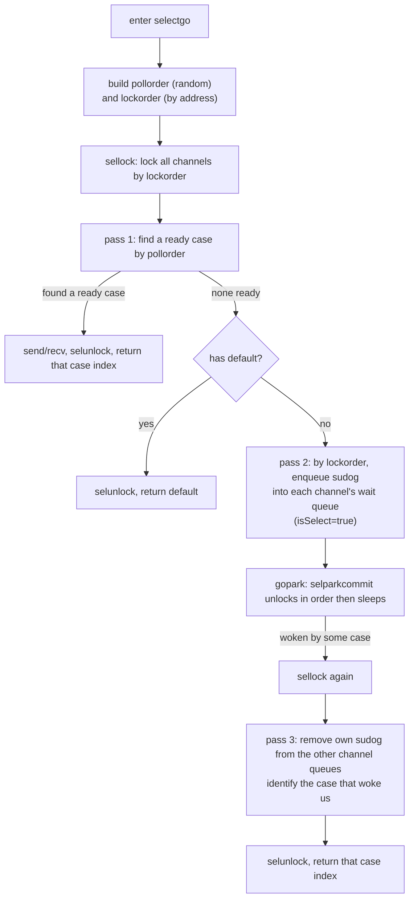

# 10.5 The Implementation of select

The previous sections covered send and receive on a single channel ([10.3](./sendrecv.md)) in
full. In practice, though, a Goroutine rarely watches just one channel: it wants to react to
**whichever operation becomes ready first** among several sends and receives, and it also wants
to avoid blocking when **none of them is ready**. `select` exists exactly for this. Its semantics
look simple, yet the implementation has to solve two thorny problems at once: how to choose
**fairly** when several branches are ready, and how to **avoid deadlock** when locking several
channels to run a single select. These two concerns shape the entire structure of `selectgo`,
and this section is built around them.

```go
select {
case v := <-ch1:   // runs when ch1 can receive
    use(v)
case ch2 <- x:     // runs when ch2 can send
    sent()
default:           // runs when none of the above is ready (optional)
    nonblocking()
}
```

Let us put the conventions up front. Each case describes one channel operation (a receive or a
send), and after evaluating `select`, **at most one** case's communication runs. If several cases
are ready at once, one is chosen **uniformly at random**; if none is ready, then with a `default`
the `default` runs (which makes the whole select non-blocking), and without a `default` the
select blocks until some case becomes ready. The language specification
([Select statements](https://go.dev/ref/spec#Select_statements)) pins down these semantics; the
runtime delivers them, and the compiler translates the source form into data the runtime can
digest.

## 10.5.1 The Compiler's Lowering: Carving Out the Simple Cases

Not every select deserves the full machinery. During the `walk` phase
(`cmd/compile/internal/walk/select.go`), the compiler first translates a few degenerate forms
separately according to scale, and only the rest is handed to the general `selectgo`:

- **Zero cases** (`select {}`): blocks forever. Translated directly into `runtime.block()`,
  which `gopark`s the current Goroutine and never wakes it.
- **A single case** (`select { case ... }`, no `default`): equivalent to writing that channel
  operation out bare. Lowered directly into an ordinary send or receive, without entering
  `selectgo`.
- **A single case plus default** (exactly two cases, one of which is `default`): this is the idiom
  for non-blocking send and receive. Translated into one `if`, calling `selectnbsend` or
  `selectnbrecv`, which are nothing more than thin wrappers that set the `block` argument of
  `chansend` / `chanrecv` to `false`:

```go
// the compiler's lowering of "select { case ch<-v: ...; default: ... }" (sketch)
if selectnbsend(ch, &v) { /* case body */ } else { /* default body */ }

// runtime/chan.go: a non-blocking send is just a chansend with block=false
func selectnbsend(c *hchan, elem unsafe.Pointer) (selected bool) {
    return chansend(c, elem, false)
}
```

The point of this lowering: the select that appears most often in everyday code is exactly the
"single case plus default" kind of non-blocking probe, and keeping these out of `selectgo` saves
the cost of building the case array, computing two orderings, and locking every channel. Only a
select with **two or more real communication branches** truly enters the machinery of the next
section. One more remark is in order: even if the source writes many cases, if most of the
channels are `nil` at runtime (a `nil` channel's case is never ready, equivalent to not existing),
the general code still handles it correctly, so the compiler no longer sets up a separate fast
path for "happens to have only one or two effective cases left".

## 10.5.2 Two Orderings: the Data Structures of selectgo

What enters `selectgo` is an array of `scase`. In go1.26 the `scase` has been pared down to the
bone:

```go
// runtime/select.go: the full description of one case
type scase struct {
    c    *hchan         // the channel this case operates on
    elem unsafe.Pointer // the address of the data to send, or the landing address for a receive
}
```

Whether a case is a send or a receive is no longer marked by a field but encoded by **position**:
the compiler arranges all send cases in the front of the array and all receive cases at the back,
and `selectgo(cas0, order0, pc0, nsends, nrecvs, block)` uses `nsends` / `nrecvs` to draw the
boundary. An index `casi < nsends` is a send, otherwise a receive. This saves one `kind` field
per case.

The real trick is in that `order0` array, of length `2*ncases`, sliced into **two segments** that
carry the two core invariants of select:

```go
ncases := nsends + nrecvs
scases := cas1[:ncases:ncases]
pollorder := order1[:ncases:ncases]        // poll order: decides "which case to check for readiness first"
lockorder := order1[ncases:][:ncases:ncases] // lock order: decides "in what order to lock the channels"
```

`pollorder` serves **fairness**, `lockorder` serves **deadlock freedom**. They solve two orthogonal
problems, which is why two independent orderings are used. Let us look at how each is built.

## 10.5.3 pollorder: Random Polling Brings Fairness

If `selectgo` always checked the cases in source order, then when several cases stay ready, **the
earlier cases would be persistently favored** and the later ones could starve. The spec's "choose
one uniformly at random" is precisely to prevent this favoritism. The way it is implemented:
before checking readiness, first shuffle the check order at random, so that "the first case found
ready" is uniform over all cases.

The shuffle is an in-place Fisher-Yates, with `cheaprandn` (the cheap, lock-free, per-M random
number generator) as the random source:

```go
// building pollorder: in-place Fisher-Yates shuffle (trimmed)
norder := 0
for i := range scases {
    cas := &scases[i]
    if cas.c == nil {       // a nil channel's case is never ready, drop it from polling
        cas.elem = nil
        continue
    }
    j := cheaprandn(uint32(norder + 1)) // pick a position uniformly in [0, norder]
    pollorder[norder] = pollorder[j]
    pollorder[j] = uint16(i)
    norder++
}
pollorder = pollorder[:norder]
```

The correctness of Fisher-Yates is a classic result: it produces all $n!$ permutations with equal
probability, in a single $O(n)$ pass, with no extra space. Attaching it to `cheaprandn` gives
select its fairness, so that **every ready case has an equal probability of being chosen**. There
is one engineering detail worth pointing out here: the random source is `cheaprandn` rather than
cryptographic-grade randomness, because what is needed here is uniformity in the statistical
sense, not resistance to prediction; cheap is the right trade-off.

> A bit of history. The fairness of select was not written out of thin air; it was forced out by a
> real engineering problem. The early issue
> [golang/go#21806](https://github.com/golang/go/issues/21806) discussed it: under certain loads,
> users observed a perceptible skew in which branch of a select was chosen, which then pushed the
> community to write "randomized polling" into both the spec's narrative and the implementation.
> The `cheaprandn` plus Fisher-Yates we read today is how this fairness constraint landed.

## 10.5.4 lockorder: A Globally Consistent Lock Order Avoids Deadlock

To run one select, the runtime must hold **the locks of all the channels involved** at once: it
has to check each of them for readiness one by one, and it may also have to attach itself to each
channel's wait queue, all of which must happen under the locks. As soon as multiple locks are
involved, the specter of deadlock appears. Suppose Goroutine A runs
`select { case <-x: ; case <-y: }` and B runs `select { case <-y: ; case <-x: }`. If each locks
in its written order, A locks `x` and waits on `y` while B locks `y` and waits on `x`, which is
the textbook crossed deadlock.

The way out is the old method of concurrent programming: **prescribe a single globally consistent
acquisition order for all locks, and have everyone lock in that order**. As long as all Goroutines
lock `x` and `y` in the same relative order, a circular wait is impossible. `selectgo` chooses the
channel's **address** as the key of this global order (`sortkey` is the pointer value), sorts the
cases by channel address, and obtains `lockorder`:

```go
func (c *hchan) sortkey() uintptr {
    return uintptr(unsafe.Pointer(c)) // use the channel's address as the key of the global order
}
```

The sort uses **heapsort** rather than the `sort` package, for a very concrete reason: all of
select's data lives on the Goroutine's stack, and heapsort guarantees $O(n\log n)$ time with
**constant stack usage**, so it will not make this supposedly lightweight path heavier through
recursion or extra allocation. The sort starts from `pollorder` (so that multiple cases on the same
channel are stably gathered together along the way), and after heapifying it lands in `lockorder`:

```go
// with the channel address as key, heapsort the cases in place to get the globally consistent lock order (trimmed)
for i := range lockorder {           // build the heap bottom-up, taking elements from pollorder
    j := i
    c := scases[pollorder[i]].c
    for j > 0 && scases[lockorder[(j-1)/2]].c.sortkey() < c.sortkey() {
        k := (j - 1) / 2
        lockorder[j] = lockorder[k]
        j = k
    }
    lockorder[j] = pollorder[i]
}
for i := len(lockorder) - 1; i >= 0; i-- { // pop the heap top one by one to get a sorted sequence
    // ... standard heap sift-down, comparing by sortkey ...
}
```

Locking and unlocking then follow `lockorder`: `sellock` locks in order, `selunlock` unlocks in
reverse, and for the same channel (several cases may use the same one) it locks and unlocks only
once:

```go
func sellock(scases []scase, lockorder []uint16) {
    var c *hchan
    for _, o := range lockorder {
        c0 := scases[o].c
        if c0 != c { c = c0; lock(&c.lock) } // do not re-lock adjacent identical channels
    }
}
```

By now the division of labor between the two orderings is clear: `pollorder` decides **the order
of looking** (for fairness), `lockorder` decides **the order of locking** (for deadlock freedom).
The two do not interfere with each other, which is exactly why two arrays are used instead of one.

## 10.5.5 The Full Flow: Three Scans

With the data prepared, the body of `selectgo` is three passes over the cases. First the panorama:



**Pass one: find a case that is already ready.** Holding the locks, check one by one in
`pollorder`. A receive case looks at whether the peer's send queue has a waiter, whether the
buffer has data, whether the channel is already closed; a send case looks at whether the channel
is already closed (sending to a closed channel must panic), whether the peer's receive queue has a
waiter, whether the buffer has a free slot. As soon as there is a hit, jump to the corresponding
branch to complete the send or receive (direct pairing, going through the buffer, or reading the
zero value of a closed channel), then unlock and return. If this pass hits, the select ends with a
single synchronous send or receive, without any blocking.

```go
// pass 1 - find an already-ready case by the random pollorder (trimmed)
for _, casei := range pollorder {
    casi = int(casei); cas = &scases[casi]; c = cas.c
    if casi >= nsends {            // receive case
        if sg := c.sendq.dequeue(); sg != nil { goto recv }
        if c.qcount > 0 { goto bufrecv }
        if c.closed != 0 { goto rclose }
    } else {                       // send case
        if c.closed != 0 { goto sclose }
        if sg := c.recvq.dequeue(); sg != nil { goto send }
        if c.qcount < c.dataqsiz { goto bufsend }
    }
}
if !block {                        // none ready, and there is a default (block==false)
    selunlock(scases, lockorder)
    casi = -1; goto retc
}
```

`default` appears here in the form of `block == false`: the compiler encodes the presence of a
`default` into the `block` argument. When the first pass finds no one ready, if `block` is false,
it immediately unlocks and returns `-1` (the caller takes the `default` body accordingly), and
select thereby becomes a non-blocking operation.

**Pass two: attach to every channel.** When no case is ready and blocking is required, the
Goroutine cannot wait on just one channel; it has to leave an "I am waiting" token on **each**
channel, so that whichever one becomes ready first can wake this Goroutine. The approach is to take
a `sudog` for each case, set `isSelect = true`, thread them into this Goroutine's `waiting` chain
in `lockorder`, and enqueue each into its channel's send/receive wait queue:

```go
// pass 2 - enqueue a sudog on all channels (trimmed)
nextp = &gp.waiting
for _, casei := range lockorder {
    casi = int(casei); cas = &scases[casi]; c = cas.c
    sg := acquireSudog()
    sg.g = gp
    sg.isSelect = true             // mark: this is a waiter posted by select
    sg.elem.set(cas.elem)
    sg.c.set(c)
    *nextp = sg; nextp = &sg.waitlink // thread into the gp.waiting chain by lockorder
    if casi < nsends { c.sendq.enqueue(sg) } else { c.recvq.enqueue(sg) }
}
gp.param = nil
gopark(selparkcommit, nil, waitReason, traceBlockSelect, 1)
```

The `isSelect` mark cannot be omitted. An ordinary send/receive sudog hangs on only one channel,
and whoever wakes it can simply pull it off; a select's sudog, however, hangs on multiple channels
at once, and the waker must know that "this waiter belongs to a select, and it may be contended for
by another channel at the same time", so as to claim it with a CAS (through `gp.selectDone`),
ensuring that one select is successfully woken by exactly one channel. The `selparkcommit` handed
over by `gopark` walks the `gp.waiting` chain, already ordered by `lockorder`, and releases each
channel lock one by one before truly putting the Goroutine to sleep. The order here matches
`lockorder`, precisely to align with the locking order elsewhere, so as not to introduce a new
cycle on the unlock path.

**Pass three: clean up the battlefield after waking.** Some channel became ready and woke this
Goroutine. It calls `sellock` again to lock all channels back, then walks `lockorder`: on the
channel that woke it, its own sudog has already been pulled off by the other side (it recognizes
it and records the hit case); on every other channel, its own sudog is still lingering, and it must
remove each with `dequeueSudoG`, otherwise it would pollute the wait queues of those "quiet"
channels. Return each with `releaseSudog`, unlock, and return the hit case index.

```go
// pass 3 - after waking, remove self from the queues of the channels that did not hit (trimmed)
sg = (*sudog)(gp.param)            // the waker tells us which sudog through gp.param
sglist = gp.waiting; gp.waiting = nil
for _, casei := range lockorder {
    if sg == sglist {              // this is the case that woke me
        casi = int(casei); cas = &scases[casi]
    } else {                       // the other cases: remove the leftover sudog
        c = scases[casei].c
        if int(casei) < nsends { c.sendq.dequeueSudoG(sglist) } else { c.recvq.dequeueSudoG(sglist) }
    }
    sgnext = sglist.waitlink; sglist.waitlink = nil
    releaseSudog(sglist); sglist = sgnext
}
```

The three passes together are the whole of select's blocking semantics: the first pass grabs what
is already there; if none, the second pass hangs on everything and sleeps; after waking, the third
pass undoes the extra attachments and claims only the one that woke it. `reflect.Select`
(`reflect_rselect`) goes through the same `selectgo`, only translating the reflection-described
cases into an `scase` array on the outside.

## 10.5.6 Design Trade-offs and Lineage

Lining up `selectgo`'s several choices side by side, each one is a clear account:

- **Two orderings rather than one.** Fairness (random polling) and safety (ordered locking) are
  orthogonal demands, and forcing them into one would only have them constrain each other. Splitting
  the load between the two arrays `pollorder` and `lockorder` costs one extra segment of `ncases`
  stack space, in exchange for the cleanest separate solution to each problem.
- **Address as the global lock order.** Taking the pointer value as the sort key is simple to the
  point of seeming like a cheat, yet it exactly satisfies the sole requirement of "globally
  consistent". It demands no semantic precedence between channels, only that all Goroutines see the
  same order. This shares its source with the classic deadlock-prevention technique of "acquiring
  multiple locks in a fixed order", whose shadow can be seen in databases' two-phase locking and in
  the kernel's lock ordering.
- **Heapsort rather than a general sort.** This is for constant stack and a deterministic
  $O(n\log n)$, another example of "haggling over allocation and stack depth on the hot path", of
  the same engineering temperament as the allocator's haggling over cache lines
  ([12.2](../../part4memory/ch12alloc/component.md)).
- **`isSelect` plus CAS claiming.** A select's sudog is one-to-many, which introduces the new
  contention of "the same waiter being fought over by multiple parties", resolved by the `isSelect`
  mark and the atomic claim of `gp.selectDone`, ensuring that one select is settled only once. This
  bit of complexity is the necessary cost of the very ability to "wait on multiple channels".

Placed in its lineage, select is a direct descendant of the **guarded command** in CSP theory. In
Hoare's 1978 CSP ([10.1](./model.md)), a process forms a choice from a set of guarded
communications, and a "selection instruction" picks one among the ready guards to advance; Dijkstra
earlier (1975) abstracted this nondeterminism of "several candidates, execute one" into a language
construct in his guarded commands. Go's `select` lands this theory into the runtime: the guard is
the case, "pick one" is `selectgo`'s three scans, and the theory's vague "nondeterministically pick
one" is made precise by Go as "uniformly at random", delivered with `cheaprandn` plus Fisher-Yates.
Languages such as Occam and Newsqueak (close relatives of Go's concurrency model) chose the same
path for their analogous constructs. Select, then, was not designed out of thin air; it is a
theoretical thread of more than forty years, converged by engineering measure into today's few
hundred lines of `select.go`.

## Further Reading

1. The Go Authors. *runtime/select.go* (`selectgo`, `sellock`, `selparkcommit`, `sortkey`).
   https://github.com/golang/go/blob/master/src/runtime/select.go
2. The Go Authors. *cmd/compile/internal/walk/select.go* (lowering of zero / single case and default).
   https://github.com/golang/go/blob/master/src/cmd/compile/internal/walk/select.go
3. The Go Authors. *The Go Programming Language Specification: Select statements*.
   https://go.dev/ref/spec#Select_statements
4. Go issue #21806. *runtime: select is not fair / biased case selection*.
   https://github.com/golang/go/issues/21806
5. C. A. R. Hoare. "Communicating Sequential Processes." *Communications of the ACM*,
   21(8), 1978. https://doi.org/10.1145/359576.359585
6. Edsger W. Dijkstra. "Guarded Commands, Nondeterminacy and Formal Derivation of Programs."
   *Communications of the ACM*, 18(8), 1975. https://doi.org/10.1145/360933.360975
7. This book: [10.1 Channels and the Engineering of CSP](./model.md),
   [10.3 Send, Receive, and Direct Handoff](./sendrecv.md),
   [10.4 The Semantics of Closing](./close.md),
   [10.6 The Memory Model and the Lock-free Evolution](./lockfree.md).
