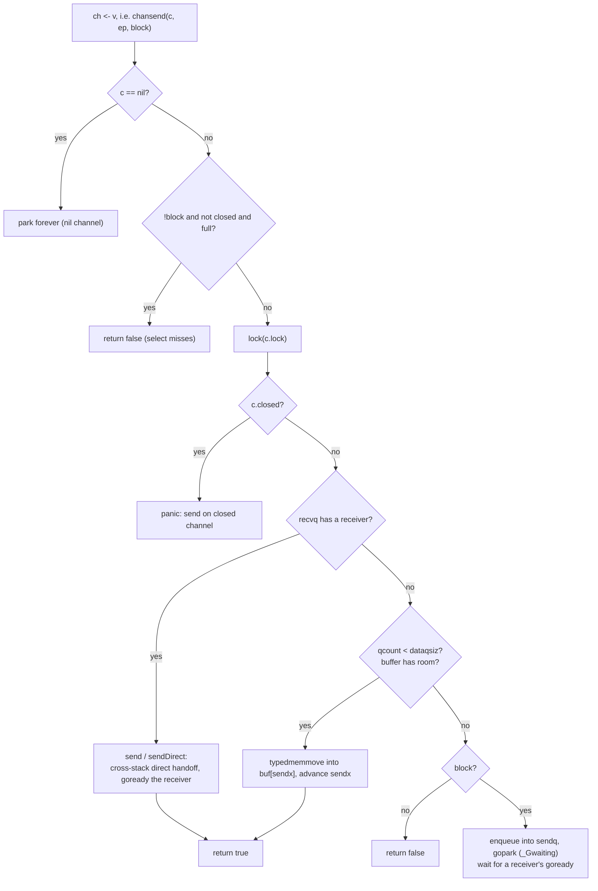

# 10.3 Send, Receive, and Direct Handoff

[10.2](./impl.md) laid out the skeleton of `hchan`: a lock, a ring buffer `buf`, plus a sender
queue `sendq` and a receiver queue `recvq`. This section brings the skeleton to life and answers
what actually happens inside the runtime during a single `ch <- v` and a single `v := <-ch`. Once
you understand this send/receive path, the two most frequently asked properties of a channel, why
an unbuffered channel is a single rendezvous, and why for it a receive happens before the
corresponding send completes ([11.9](../ch11sync/mem.md)), both come down to the same mechanism:
**direct send / receive**.

The design of send and receive has to satisfy three constraints at once. First, correctness: it
must not lose data, and it must not let a closed channel swallow a new value. Second, speed: with
no contention, a single send or receive should be no more than "take the lock, copy once, release
the lock," and on the hot path it should avoid touching even the lock where possible. Third,
fairness: when several senders or receivers block on the same channel, the order in which they are
woken should be predictable ([10.3.5](#1035-fifo-fairness-and-a-lesson-from-history)). Below we
walk through send first, then sketch receive in symmetric strokes, and finally arrive at the
optimization that unifies the two.

## 10.3.1 The Three-Way Decision in chansend

Let us first build intuition with an interactive figure: a buffered channel is a fixed-length
queue, send places a value into the buffer and receive takes one out; when the buffer is full the
sender blocks, when the buffer is empty the receiver blocks. You can adjust `cap`, or send and
receive by hand.

<div class="viz" data-viz="channel"></div>

The compiler translates `ch <- v` into `chansend1`, which forwards to the more general
`chansend`. The third argument of `chansend`, `block`, distinguishes blocking send/receive from
the non-blocking branch inside `select` ([10.5](./select.md)). Strip away the race detector, the
`synctest` bubble, and the statistics code, and its trunk is a clear three-way decision:

```go
// chansend: send the value pointed to by ep into the channel (trimmed sketch)
func chansend(c *hchan, ep unsafe.Pointer, block bool) bool {
    if c == nil {                  // send on a nil channel: block forever
        if !block { return false }
        gopark(nil, nil, waitReasonChanSendNilChan, ...) // never returns
        throw("unreachable")
    }

    // non-blocking fast path: a failure decidable without taking the lock (see 10.3.4)
    if !block && c.closed == 0 && full(c) {
        return false
    }

    lock(&c.lock)

    if c.closed != 0 {             // send on a closed channel: panic
        unlock(&c.lock)
        panic(plainError("send on closed channel"))
    }

    // branch one: a waiting receiver in recvq -> direct handoff, bypass buf
    if sg := c.recvq.dequeue(); sg != nil {
        send(c, sg, ep, func() { unlock(&c.lock) })
        return true
    }

    // branch two: the buffer still has room -> copy the value into the ring buf
    if c.qcount < c.dataqsiz {
        qp := chanbuf(c, c.sendx)
        typedmemmove(c.elemtype, qp, ep) // copy into the sendx slot of buf
        c.sendx++
        if c.sendx == c.dataqsiz { c.sendx = 0 } // ring wraparound
        c.qcount++
        unlock(&c.lock)
        return true
    }

    // branch three: no receiver, buf also full -> enqueue self into sendq and park
    // ... see 10.3.3
}
```

The priority among the three branches is itself a design choice: **when a waiting receiver exists,
always hand the value to it directly**, even if this is a buffered channel that still has room in
its buffer. Intuitively one might think we should "fill the buffer first," but as long as `recvq`
is non-empty, the buffer must be empty right now (otherwise the receiver would have taken from the
buffer long ago and would not be blocked), so bypassing the buffer and delivering directly is not
only legal, it saves a copy. This priority is the premise of the optimization in the next section.

Branch two is the common case for a buffered channel: when the buffer is not full, send degrades
to "copy a value into `buf[sendx]`, advance `sendx`." Together with the receive side's `recvx`,
`sendx` uses the fixed-length array `buf` as a ring queue; when `sendx == dataqsiz` it wraps back
to 0, and that is the whole meaning of "ring."

## 10.3.2 Direct Handoff: Skipping the Copy In and the Copy Out

The `send` that branch one calls is the part of the channel implementation most worth examining
closely. Its core is `sendDirect`:

```go
func send(c *hchan, sg *sudog, ep unsafe.Pointer, unlockf func()) {
    if sg.elem != nil {
        sendDirect(c.elemtype, sg, ep) // copy directly into the slot on the receiver's stack
        sg.elem = nil
    }
    gp := sg.g
    unlockf()                          // unlock first
    gp.param = unsafe.Pointer(sg)
    sg.success = true
    goready(gp, ...)                   // then wake the receiver (see 9.4)
}

func sendDirect(t *_type, sg *sudog, src unsafe.Pointer) {
    // src is on "my" stack, dst is a slot on another goroutine's stack
    dst := sg.elem
    typeBitsBulkBarrier(t, uintptr(dst), uintptr(src), t.Size_) // write barrier
    memmove(dst, src, t.Size_)         // one memmove, straight across stacks
}
```

The receiver blocked in `recvq` had earlier recorded on its own `sudog` a "please put the value at
this address" (`sg.elem`, pointing to the slot of the receive variable on its stack). The sender
therefore does not go through `buf`; with a single `memmove` it carries the data directly from its
own stack slot to the receiver's stack slot. This is the direct handoff.

What does it save? Compare with the clumsy "through the buffer" approach: the sender first copies
the value into `buf` (**in**), and after the receiver wakes it copies from `buf` into its own
variable (**out**), two copies in and out, plus occupying and reclaiming a buffer slot. The direct
handoff merges these two into one cross-stack `memmove`. The cost is that it must happen while
holding the channel lock and while the receiver is in `_Gwaiting`
([9.3](../ch09sched/mpg.md)) and not yet running. Precisely because the receiver is not running at
this moment, no user-mode code will race with this cross-stack write, so writing directly into
"someone else's stack" is safe. The `typeBitsBulkBarrier` here is required: a cross-stack write of
a value that contains pointers must let the garbage collector ([13](../../part4memory/ch13gc)) see
this transfer of a pointer.

There is an easily overlooked ordering: `send` first calls `unlockf()` to release the lock, and
**then** calls `goready` to wake the receiver. The data has already been copied before the unlock,
so the moment the woken receiver opens its eyes the value is already sitting in its variable; it
need not touch the channel again and can return directly. Note that this only marks the receiver
runnable and puts it back on the run queue ([9.4](../ch09sched/schedule.md)); it does not switch
over immediately.

## 10.3.3 The Blocking Path: Enqueue, and Let Someone Finish for You

If there is neither a waiting receiver nor room in the buffer (an unbuffered channel is "always
full," see `full` in the next section), the sender can only block. It wraps itself into a `sudog`,
hangs it on `sendq`, and then calls `gopark` to yield the CPU:

```go
    // chansend branch three: block
    gp := getg()
    mysg := acquireSudog()
    mysg.elem.set(ep)        // record "the value I want to send is at this address"
    mysg.g = gp
    mysg.c.set(c)
    gp.waiting = mysg
    c.sendq.enqueue(mysg)    // hang onto the send wait queue
    gp.parkingOnChan.Store(true)
    // yield, state becomes _Gwaiting; chanparkcommit releases the channel lock after park
    gopark(chanparkcommit, unsafe.Pointer(&c.lock), waitReasonChanSend, ...)

    // == after being woken by some receiver, continue from here ==
    KeepAlive(ep)            // keep the value alive until the receiver has copied it away
    closed := !mysg.success  // if success is false on wake, we were woken by close
    gp.waiting = nil
    releaseSudog(mysg)
    if closed {
        panic(plainError("send on closed channel"))
    }
    return true
```

Note the duality of this path: the blocked sender leaves "where the value is" in `mysg.elem`, and
some future receiver, reaching its own branch one, will call `recv` to take the value out of this
`sudog` (`recvDirect`), then call `goready` to wake the sender. **park and goready are strictly
paired**: a sender parks in `sendq` because the buffer is full, and is freed by a receiver's
`goready`; a receiver parks in `recvq` because the buffer is empty, and is freed by a sender's
`goready`. Either end may arrive first; whoever arrives later is responsible for completing the
whole transaction and waking whoever arrived first. This is exactly the park/ready mechanism of
[9.4](../ch09sched/schedule.md) landing concretely on channels.

The `chanparkcommit` passed to `gopark` is a key detail. A goroutine cannot park while holding the
lock (or the lock would never be released), yet it cannot unlock before parking either (or it
could be woken in the window after unlocking but before it has truly entered `_Gwaiting`, which
would corrupt state). The solution is to defer the unlock to after "park has succeeded," to be
performed by `chanparkcommit`; this is the unlockf callback convention of `gopark`
([9.4](../ch09sched/schedule.md)). The boolean `mysg.success` is the secret signal between the
sender and whoever wakes it: set true when a receiver completes it normally, false when woken by
`close`, and the sender uses it to decide whether to return normally or to panic.

Putting this blocking path together with the previous two branches, the full picture of
`chansend` is as follows:



## 10.3.4 chanrecv and the Rendezvous of an Unbuffered Channel

Receive `v := <-ch` (compiled to `chanrecv1`) and `v, ok := <-ch` (`chanrecv2`) both forward to
`chanrecv`, which is almost the mirror image of `chansend`'s three-way decision, with just one
extra branch for "closed and no data, so return the zero value":

```go
// chanrecv: receive one value from the channel (trimmed sketch)
func chanrecv(c *hchan, ep unsafe.Pointer, block bool) (selected, received bool) {
    if c == nil { /* same as send: a nil channel blocks forever */ }

    // non-blocking fast path: not ready and not closed, miss directly
    if !block && empty(c) {
        if atomic.Load(&c.closed) == 0 { return }
        if empty(c) { /* closed and empty: return the zero value */ }
    }

    lock(&c.lock)
    if c.closed != 0 && c.qcount == 0 {        // closed and no data
        unlock(&c.lock)
        if ep != nil { typedmemclr(c.elemtype, ep) } // write the zero value
        return true, false                     // received == false
    }
    if sg := c.sendq.dequeue(); sg != nil {    // branch one: a waiting sender
        recv(c, sg, ep, func() { unlock(&c.lock) })
        return true, true
    }
    if c.qcount > 0 {                          // branch two: data in the buffer
        qp := chanbuf(c, c.recvx)
        typedmemmove(c.elemtype, ep, qp)       // copy out from buf[recvx]
        typedmemclr(c.elemtype, qp)            // clear the slot, for GC
        c.recvx++
        if c.recvx == c.dataqsiz { c.recvx = 0 }
        c.qcount--
        unlock(&c.lock)
        return true, true
    }
    // branch three: no data to receive -> enqueue into recvq and gopark (dual of send's blocking path)
}
```

The receive-side `recv` completes the symmetry of the direct handoff. It must distinguish between
having a buffer and not having one:

```go
func recv(c *hchan, sg *sudog, ep unsafe.Pointer, unlockf func()) {
    if c.dataqsiz == 0 {
        // unbuffered channel: copy directly from the sender's stack to the receiver
        if ep != nil { recvDirect(c.elemtype, sg, ep) }
    } else {
        // buffered and buffer full: head of queue goes to the receiver, the sender's value fills the tail (same slot)
        qp := chanbuf(c, c.recvx)
        if ep != nil { typedmemmove(c.elemtype, ep, qp) } // buf -> receiver
        typedmemmove(c.elemtype, qp, sg.elem.get())       // sender -> buf
        c.recvx++
        if c.recvx == c.dataqsiz { c.recvx = 0 }
        c.sendx = c.recvx
    }
    sg.elem.set(nil)
    gp := sg.g
    unlockf()
    gp.param = unsafe.Pointer(sg)
    sg.success = true
    goready(gp, ...)   // wake the blocked sender
}
```

An unbuffered channel (`dataqsiz == 0`) takes `recvDirect`, a single `memmove` from the sender's
stack slot to the receiver. It is the same technique as the send side's `sendDirect`, just in two
directions, depending on which of the two parties arrives first and which blocks in the queue. A
buffered channel, when "the buffer is full and a sender is queued," performs a neat trick: it
hands the head value to the receiver, and the freed slot is exactly the one used to take in the
queued sender's value, one dequeue paired with one enqueue, and the ring queue turns forward by
exactly one notch with no idle spinning.

The essence of the unbuffered channel is now clear: its `buf` has capacity zero, and both `full`
and `empty` degrade to "is anyone in the opposite queue." So a successful send/receive **must**
have both parties present at the same time: either the sender meets a queued receiver
(`send`/`sendDirect`), or the receiver meets a queued sender (`recv`/`recvDirect`), and whoever
arrives first always parks and waits. This is the rendezvous: an unbuffered channel stores
nothing, it completes a single cross-stack value transfer only at the instant the two parties
meet.

This also explains directly that rule in the memory model
([11.9](../ch11sync/mem.md)) which seems puzzling at first: for an unbuffered channel, **a receive
happens before the corresponding send completes**. The reason is right there in the code: when the
receiver takes `recvDirect`, or the sender takes `send`/`sendDirect`, the copy of the value and
the `goready` both happen before "the party that arrived first is woken and gets to return from
`chansend` / `chanrecv`." In other words, a blocked sender can only proceed after the receiver has
taken the value away and called `goready` on it. That ordering in the code is exactly the source
of the happens-before in the memory model.

## 10.3.5 The Non-Blocking Fast Path and a Subtlety of Memory Ordering

The `default` branch of `select`, and the non-blocking usage with `ok`, both enter send/receive
with `block == false`. They have a lock-free early exit: on the send side it is
`!block && c.closed == 0 && full(c)`, and on the receive side it is `!block && empty(c)`. Both
`full` and `empty` read only a word or two each:

```go
func full(c *hchan) bool {
    if c.dataqsiz == 0 {
        return c.recvq.first == nil   // unbuffered: no waiting receiver means "full"
    }
    return c.qcount == c.dataqsiz     // buffered: a filled buffer means "full"
}
```

This fast path carries a subtlety about memory ordering ([11.9](../ch11sync/mem.md)) that the
source comments call out specifically. The send side reads `c.closed` first and `full(c)` second,
**confirming not-closed first, then confirming not-ready**. The key argument: a closed channel can
never turn from "cannot send" back into "can send." So even if the channel happens to be closed
between these two reads, there must be some moment between the two reads at which the channel was
both not closed and not sendable, and the runtime treats it as having observed the channel at that
moment, and from this reports "the send cannot proceed." Precisely because this monotonicity
provides a backstop, the two ordinary reads, even if reordered by the processor or the compiler,
still yield the correct conclusion, so here **no atomic operation is needed**, saving the cost on
the hot path. Forward progress does not rest on these two reads; it relies on the side effects
that `chanrecv` and `closechan` produce when they release the lock, which refresh this thread's
view of `c.closed` and `full`. This kind of reasoning, "trading a single monotonicity property for
an atomic operation," is a very typical move in a lock-free fast path (compare the treatment of
memory ordering in [11.9](../ch11sync/mem.md)).

## 10.3.6 FIFO Fairness and a Lesson from History

The send/receive queues `sendq`/`recvq` are FIFO: blockers enqueue at the tail and dequeue at the
head, so several waiters are woken in arrival order. This is not an optional implementation detail.
The Go team once debated in issue #11506 whether "a channel should guarantee FIFO wakeup," and the
conclusion was that the runtime implementation does maintain first-in-first-out, even though the
language specification itself does not write it down as a binding promise. For programs that depend
on wakeup order, this is a boundary to keep in mind: the observable FIFO is the behavior of the
current implementation, not a guarantee of the specification.

Looking at both sides of send and receive together, the channel runtime is a rather compact and
symmetric design: a single lock threads the three-way decision, on the hot path it either hits the
direct handoff or hits the ring buffer, and only on the cold path does it enqueue and park; the
direct handoff trades the premise "the receiver is not running" for skipping a copy in and a copy
out; an unbuffered channel is nothing more than the degenerate form of a buffer with capacity zero,
and the rendezvous semantics and that happens-before in the memory model both come from it. The
bargain of performance is never free: the speed of the direct handoff is built on the park/ready
scheduling mechanism ([9.4](../ch09sched/schedule.md)) having already arranged "let whichever party
arrives first wait, and let the later one complete it." [10.4](./close.md) then explains how close
wakes all the waiters, and the `select` of [10.5](./select.md) extends this single-channel
send/receive to the harder layer of "watching over several channels at once."

## Further Reading

1. The Go Authors. *runtime/chan.go* (`chansend`, `chanrecv`, `send`, `recv`, `sendDirect`,
   `recvDirect`, `full`, `empty`), Go 1.26.
   https://github.com/golang/go/blob/master/src/runtime/chan.go
2. The Go Authors. *runtime/proc.go* (`gopark`, `goready`, `ready`), Go 1.26.
   https://github.com/golang/go/blob/master/src/runtime/proc.go
3. The Go Authors. *The Go Memory Model* (the channel communication section), Version of June 6, 2022.
   https://go.dev/ref/mem
4. Go issue #11506. *runtime: make channel FIFO ordering explicit / guaranteed?*
   https://github.com/golang/go/issues/11506
5. C. A. R. Hoare. "Communicating Sequential Processes." *Communications of the ACM*,
   21(8), 1978. https://doi.org/10.1145/359576.359585
6. This book: [10.2 hchan: The Internal Structure of a Channel](./impl.md), [10.4 The Semantics of
   Close](./close.md), [10.5 The Implementation of select](./select.md), [9.4 The Scheduling
   Loop](../ch09sched/schedule.md), [11.9 The Memory Consistency Model](../ch11sync/mem.md).
