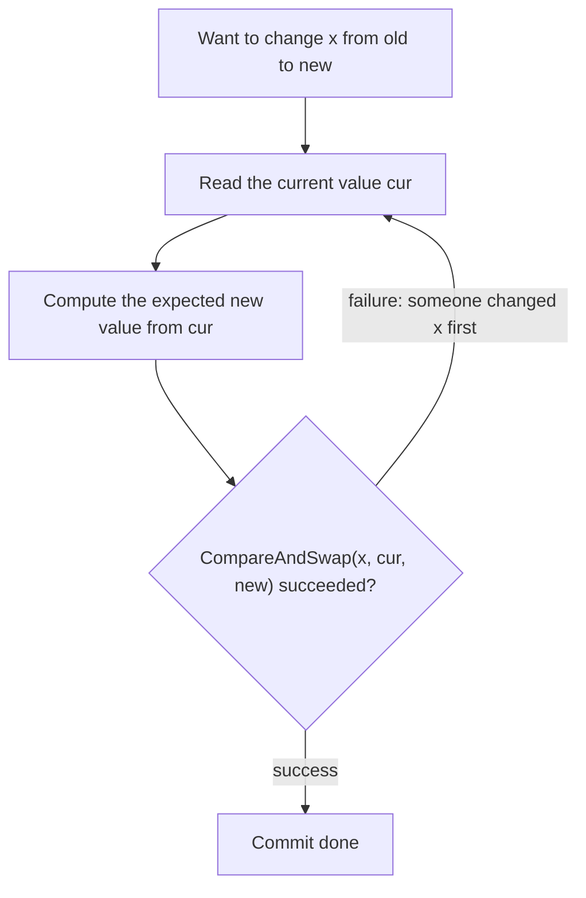
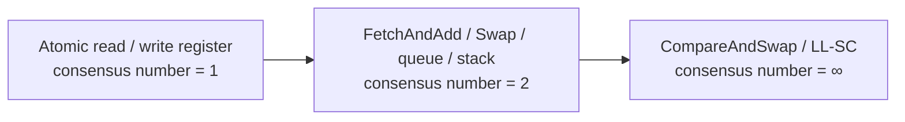
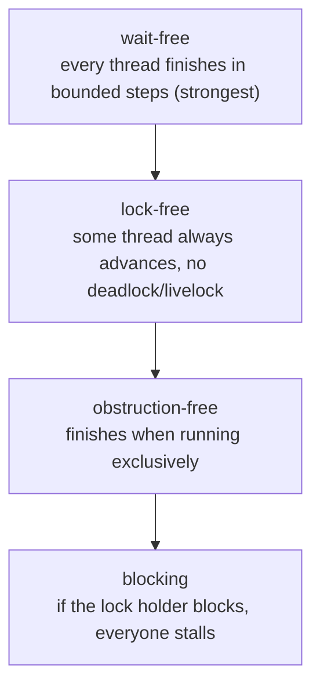
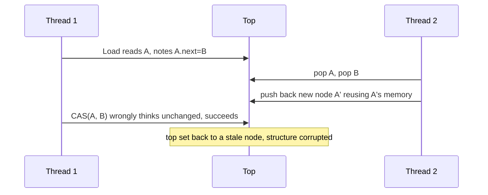

# 11.3 Atomic Operations

`sync/atomic` is the layer of Go's synchronization primitives that sits closest to the hardware.
Higher-level tools such as the mutex ([11.1](./mutex.md)) and channels ([8](../ch08channel)) are all
built on top of atomic operations internally. It provides "indivisible" reads, writes, and
read-modify-writes: an atomic operation either happens in full or not at all, and no other goroutine
ever sees it half-finished. But the meaning of atomic operations goes far beyond "no tearing." It is
the foundation of lock-free programming, and behind lock-free programming lies a profound theory
about "which primitives can do what." That theory is what this section really wants to make clear.

We will first lay out the basic operations and settle on CAS as the cornerstone; then step back and
use Herlihy's consensus hierarchy to answer "why CAS"; next enter the hidden reefs of lock-free
programming, ABA and memory reclamation, to explain why Go keeps the hard lock-free structures inside
the runtime; and finally return to engineering, covering the sequential-consistency promise of
`sync/atomic`, and the Go 1.19 evolution that encoded "this should be accessed atomically" into the
type system.

## 11.3.1 A Few Basic Operations

The family of atomic operations is small: `Load` (atomic read), `Store` (atomic write), `Add`
(atomic increment/decrement), `Swap` (atomic exchange), `CompareAndSwap` (compare-and-swap, CAS),
and `And`/`Or` (atomic bitwise operations) rounded out since Go 1.23. They all come down to a single
CPU instruction carrying the `LOCK` prefix: on x86 CAS is `LOCK CMPXCHG`, on ARMv8 it is a
load-linked / store-conditional retry pair of `LDXR`/`STXR`, and addition is `LOCK XADD`. In other
words, the ultimate guarantee of atomicity comes from the hardware, and `sync/atomic` merely wraps
these instructions into portable Go functions.

Among these, CAS is the cornerstone of lock-free programming. It atomically performs "if the current
value is still the one I think it is, change it to the new value; otherwise do nothing and tell me it
failed":

```go
// The semantics of CompareAndSwap (pseudocode, executed indivisibly as a whole)
func CompareAndSwapInt64(addr *int64, old, new int64) (swapped bool) {
    if *addr == old {
        *addr = new
        return true
    }
    return false
}
```

Why is a single CAS enough to hold up lock-free programming? Because almost every lock-free algorithm
can be written in the same skeleton, a **retry loop**: read the current value, compute the desired new
value from it, then write it back with CAS; CAS succeeds only when "no one touched it in the
meantime," and otherwise the value you read is someone else's update, so you just start over.

```go
for {
    old := atomic.LoadInt64(&x)   // read the current value
    new := f(old)                 // compute the expected new value from it
    if atomic.CompareAndSwapInt64(&x, old, new) {
        break                     // no one got in first; commit succeeded
    }
    // a failed CAS means another goroutine changed x first; grab the new value and recompute
}
```



This loop hides the cost of lock-free programming. Unlike a lock, a failed CAS does not block the
goroutine but retries immediately. When contention is mild this is a good deal, sparing the locking,
the possible sleep and wakeup; but once contention is fierce, multiple goroutines repeatedly read
values that overwrote one another and repeatedly fail their CAS, the CPU is spent entirely on spinning,
and throughput ends up worse than an honest old lock. There is another hazard called **livelock**:
everyone is retrying, the system as a whole looks like it is making progress, yet an individual
goroutine may fail to commit for a long time. So atomic operations suit single-word, low-contention,
or read-mostly scenarios: counters, flags, configuration pointers, and the like; forcibly tearing a
complex critical section into a CAS loop is often not worth it.

## 11.3.2 The Consensus Hierarchy: Why CAS

The reader may wonder: since `Load` and `Store` are atomic too, why can we not build lock-free
structures out of them, and must we insist on CAS? The answer comes from Herlihy's classic 1991 work,
the **consensus hierarchy**, which gives "how strong is a synchronization primitive, really" a
precise, provable measure.

Consider $n$ threads that must agree on a single value: each thread proposes a value, in the end all
threads must read the same chosen proposal, and that value must indeed be one that some thread
proposed. The largest $n$ for which some shared object can solve consensus among $n$ threads in a
**wait-free** manner (each thread finishes within a bounded number of steps, independent of others'
progress) is that object's **consensus number**.



An ordinary atomic read/write register has a consensus number of only **1**, unable to coordinate
even two threads. The intuitive proof goes like this: for two threads to reach consensus on "who came
first," there must be a critical moment at which the system state teeters between "ultimately choose
A" and "ultimately choose B." With a read/write register, the first-moving thread can only either read
or write some cell. If it reads, it leaves no trace, and the latecomer cannot tell whether it has been
there; if it writes, it either writes to a cell the latecomer will immediately overwrite (the trace is
erased), or the two write different cells, and then the order in which the latecomer reads cannot
determine who came first. No matter how the steps are arranged, one can always construct an execution
the two threads cannot tell apart, so wait-free consensus is impossible. This is a classic
**impossibility** result, of the same lineage as FLP.

By contrast, **the consensus number of CAS is infinite**. The proof is surprisingly short: take a
shared cell initialized to "no winner yet," and have every thread try
`CompareAndSwap(&cell, empty, my proposal)`; only the first to succeed writes its own value in, all
the rest fail, and then all threads read `cell` and read out the one unique winner. A single line of
CAS lets arbitrarily many threads reach wait-free consensus.

This gulf between $1$ and $\infty$ is the fundamental reason every language's atomic library places
CAS at the center. Herlihy further proved that any primitive with consensus number $\infty$ is
**universal**: with it, any sequential object can be mechanically turned into an equivalent wait-free
concurrent implementation (the so-called universal construction). CAS is to the lock-free world what
the Turing machine is to computability, the master key. The load-linked / store-conditional (LL/SC)
used by the ARM and POWER families is a close relative of CAS, with consensus number $\infty$ as well;
whereas `FetchAndAdd`, `Swap`, and even atomic queues and stacks all stop at consensus number 2,
unable to build coordination that is wait-free for an arbitrary number of threads. Go gives users
`Add`/`Swap`/`CAS` alike, but only CAS can hold up a general lock-free algorithm, and this is exactly
why.

## 11.3.3 The Lineage of Lock-Free: Blocking, Lock-Free, Wait-Free

"Lock-free" is in fact a family of guarantees, varying in strength. In *The Art of Multiprocessor
Programming*, Herlihy and Shavit give the standard three-tier hierarchy of **progress**:

- **Obstruction-free**: if a thread runs exclusively at some moment (everyone else is paused), it is
  guaranteed to finish within a bounded number of steps. This is the weakest; when multiple threads
  advance at once they may spoil one another and no one gets through (livelock).
- **Lock-free**: at any moment, as long as the system keeps running, **some** thread is always able to
  complete its operation. This rules out deadlock and livelock and guarantees that the whole is making
  progress, but does not guarantee that no individual thread starves. The CAS retry loop of the
  previous section is the typical case: every time someone's CAS fails, another's CAS must have
  succeeded.
- **Wait-free**: **every** thread finishes within a bounded number of steps independent of the other
  threads. This is the strongest and the hardest to implement, usually at the cost of more complex
  algorithms and higher constant overhead.



A common misconception is worth pointing out: Go's channels and mutexes use CAS internally, but they
themselves are **blocking**, they make goroutines block and yield. Using atomic instructions does not
equal "lock-free"; lock-free is a guarantee about progress, not a description of implementation
technique. What truly pursues lock-freedom are dedicated concurrent data structures such as the
Treiber stack and the Michael-Scott queue. Take the simplest Treiber stack as an example: it writes
the entire lock-free push as one CAS loop:

```go
// Push for a lock-free stack: wrap the retry loop of 11.3.1 around "swapping the top pointer"
type node struct {
    val  int
    next *node
}
type Stack struct {
    top atomic.Pointer[node] // the top of the stack, Go 1.19 typed atomic
}

func (s *Stack) Push(v int) {
    n := &node{val: v}
    for {
        old := s.top.Load()  // read the current top
        n.next = old         // point the new node at it
        if s.top.CompareAndSwap(old, n) {
            return           // the top did not change; attached successfully
        }
        // someone changed the top first; retry with the new top
    }
}
```

This code looks harmless, yet it is precisely the fuse for the hidden reef of the next section.

## 11.3.4 ABA and Memory Reclamation: The Hidden Reefs of Lock-Free

CAS has a famous trap, the **ABA problem**. A thread reads value A and is about to CAS; in the
meantime another thread changes it from A to B and back to A again; the CAS sees "still A" and assumes
no one touched it, committing as usual, when in fact the structure has long since been turned upside
down.

Putting it back into the Treiber stack above makes it concrete: thread one `Load`s the top node A,
notes that `A.next` points to B, and is about to `CompareAndSwap(A, B)` to pop A. At this instant
thread two pops twice in a row, removing both A and B, then pushes back a new node A' that **reuses
A's memory block**; A''s `next` has long pointed elsewhere. Thread one's CAS compares pointer values,
A' has the same address as A, so the CAS succeeds, the top is set back to a node whose `next` is
already invalid, and the stack is corrupted. The root of the problem is twofold: CAS recognizes only
values and not "what happened in between," and the memory of the popped node was reclaimed and reused
prematurely.

The classic countermeasures fall into two categories. First, attach a **version number / tag** to the
pointer (tagged pointer), incrementing the tag along with each modification, so that ABA is exposed as
$A_1 \neq A_3$; the CAS compares "pointer + tag" as a whole, and reusing the same address cannot fool
it. The cost is needing an instruction that can atomically operate on double-word width (x86's
`LOCK CMPXCHG16B`), and the tag eventually wraps around. Second, solve "when can memory safely be
reclaimed" from the root, a deeper class of technique:

- **Hazard pointers** (Michael 2004): each thread registers the pointer it is currently accessing into
  a public array, and before actually freeing, the reclaimer scans it first and defers reclamation of
  anything registered.
- **Epoch-based reclamation**: use a globally incrementing "epoch" to form generations, and only once
  it is confirmed that all threads have crossed a certain epoch are the nodes retired before that
  safely freed.
- **RCU** (read-copy-update): the Linux-kernel paradigm where readers have almost zero overhead and
  writers copy then defer the free.



This is the backdrop for Go's choice **not** to encourage users to hand-write complex lock-free
structures. The correctness of lock-free programming is extremely subtle, ABA and memory reclamation
are the reefs that trip up veterans again and again, and Go also has a GC: garbage collection
naturally dissolves one class of ABA, since as long as some pointer still points to a node it will not
be reclaimed and reused, so `atomic.Pointer[T]` is far safer than a bare-pointer CAS in C (the GC acts
as an automatic memory-reclamation scheme). Even so, Go still keeps the truly thorny lock-free
structures inside the runtime, the scheduler's work-stealing queues, the lock-free span sets of the
memory allocator ([12.2](../../part4memory/ch12alloc/component.md)), these repeatedly polished fast
paths, and exposes to the user layer only the foundational primitives, with the advice to prefer
channels and locks. This is the same "keep the complexity outside" trade-off as [11.9](./mem.md)
exposing only sequentially consistent atomics and not weakly ordered ones.

## 11.3.5 Atomic Operations Are Sequentially Consistent

All operations of `sync/atomic` are **sequentially consistent atomics**. Since the Go 1.19 memory
model revision, this has become an explicit promise ([11.9](./mem.md)): all atomic operations have a
single global total order, and if the effect of atomic operation $A$ is observed by atomic operation
$B$, then $A$ happens before $B$. This means an atomic operation is not only indivisible in itself, it
can also establish an ordering of occurrence across goroutines, and can properly be used as a means of
synchronization rather than just "no tearing." An ordinary write before an atomic write is also
visible to a reader who observes that atomic write, and this is exactly what lock-free algorithms rely
on to pass data.

Placed in the lineage of the various languages, Go's trade-off is especially clear-cut:

| Language | Memory orders exposed | Design orientation |
| --- | --- | --- |
| C / C++11 | the full set `relaxed`/`acquire`/`release`/`acq_rel`/`seq_cst` | squeeze the hardware dry, hand the difficulty of weak ordering to the developer |
| Java | `volatile` (SC) + `VarHandle` fine-grained orders | SC by default, experts can dig down |
| Rust | `Ordering::{Relaxed,Acquire,Release,AcqRel,SeqCst}` | the same set of levels as C++ |
| **Go** | **sequential consistency only** | one level only, deliberately not exposing weak ordering |

That memory-order menu of C++ can squeeze every last bit of performance out of the hardware, at the
cost of handing the notoriously hard task of "understanding weak memory models" wholesale to
application developers, and problems like out-of-thin-air values in `relaxed` atomics remain hard
nuts for academia to this day ([11.9](./mem.md)). Go's judgment is: for the vast majority of programs,
the performance of SC atomics is already enough, and the reasonability it buys is worth far more than
that bit of peak. So Go gives only the single level of sequential consistency. This is consistent with
Go's habitual character in scheduling and garbage collection, conceding controllable performance in
exchange for simple, hard-to-misuse semantics. When the reader uses `atomic.AddInt64`, there is no
need to simulate a store buffer in one's head, and that in itself is a kindness in the design.

## 11.3.6 Typed Atomics: Encoding "Should Be Accessed Atomically" into the Type

Early on, `sync/atomic` had only a functional API, such as `atomic.AddInt64(&x, 1)`. It works, but it
has two traps long criticized.

First, **forgetting to use it**. Nothing prevents you from doing an ordinary (non-atomic) access to the
same variable elsewhere; to the compiler, `x++` and `atomic.AddInt64(&x, 1)` access the same ordinary
`int64`, so the moment some place forgets to use the atomic function, a data race is planted, and the
compiler cannot detect it; one can only hope `-race` will bump into it at runtime. Second,
**alignment**. On 32-bit platforms, an atomic operation on a 64-bit variable requires 8-byte
alignment, while the alignment of a bare `int64` field inside a struct depends on the layout of the
fields ahead of it, giving rise to a textbook pitfall: rearrange the struct's field order, and the
same code that ran fine on amd64 crashes on 32-bit ARM due to a misaligned atomic access.

Go 1.19 introduced **typed atomics** (proposal #50860), plugging both holes at once at the type level:

```go
// A trimmed-down sketch of the type: wrap int64 into a type that can only be accessed atomically
type Int64 struct {
    _ noCopy   // go vet uses this to report "copied after first use"
    _ align64  // forces 8-byte alignment, eliminating the 32-bit alignment pitfall
    v int64    // private field, unreachable from outside, only methods can touch it
}

func (x *Int64) Load() int64            { return LoadInt64(&x.v) }
func (x *Int64) Store(val int64)        { StoreInt64(&x.v, val) }
func (x *Int64) Add(delta int64) int64  { return AddInt64(&x.v, delta) }
func (x *Int64) CompareAndSwap(old, new int64) bool {
    return CompareAndSwapInt64(&x.v, old, new)
}
```

Declare the variable as `atomic.Int64`, and since `v` is a private field, accessing it can **only** go
through methods like `Load`/`Store`/`Add`/`CompareAndSwap`; ordinary access is blocked at the type
level, and the possibility of forgetting to use the atomic function disappears at the source. The
zero-width marker field `align64` tells the compiler to impose 8-byte alignment on the whole type, and
the alignment pitfall vanishes with it. `noCopy` lets `go vet` catch "an atomic variable copied by
value," another kind of subtle error. The full set of typed atomics is
`atomic.Int32/Int64/Uint32/Uint64/Uintptr/Bool/Pointer[T]/Value`.

Generics make possible the most interesting of these, `atomic.Pointer[T]`. It uses a type parameter to
express "this is an atomic pointer to a `*T`," reads and writes carry their type, sparing the
`unsafe.Pointer` conversions strewn everywhere. The source code hides a clever touch:

```go
type Pointer[T any] struct {
    _ [0]*T        // mention *T so that different Pointer[T] cannot be converted to one another (issue 56603)
    _ noCopy
    v unsafe.Pointer
}
```

That zero-length array `[0]*T` takes no space, and its sole purpose is to make `atomic.Pointer[A]` and
`atomic.Pointer[B]` type-incompatible with each other, blocking a back door that could otherwise
circumvent type safety. This is an example of API design and language features co-evolving: using the
type to turn "this field must be accessed atomically" from the programmer's conscientiousness into a
contract the compiler can enforce. New code should always prefer typed atomics over the bare functions.

`atomic.Value` is a special one in this family. It is used to **wholly and atomically** replace a value
of an arbitrary type, the typical use being hot configuration reloads: a background routine prepares an
entire new configuration and swaps it in at once with `Store`, and all readers using `Load` either read
the complete old configuration or the complete new configuration, never a "half-changed" intermediate
state.

```go
var cfg atomic.Value           // holds a *Config
cfg.Store(loadConfig())        // put one in at startup

func reload() { cfg.Store(loadConfig()) }          // writer: replace wholesale
func handler() { c := cfg.Load().(*Config); _ = c } // reader: grab a complete snapshot lock-free
```

Its internal implementation is textbook-level carefulness. An `interface{}` is composed at runtime of
two parts, "type pointer + data pointer" ([2](../../part1prologue)); to atomically replace the whole
interface, one must avoid having readers run into the half-finished "type already swapped, data not yet
swapped." `Value`'s approach is: on the first `Store`, it first uses CAS to set the type pointer to a
special in-progress marker `firstStoreInProgress`; during that time `runtime_procPin` forbids the
current goroutine from being preempted, and only once the data pointer and the type pointer have
settled in turn does it release; a reader that `Load`s and sees this marker knows the first write is
not yet complete and returns nil. This is a lightweight form of copy-on-write: readers are lock-free,
the writer replaces wholesale, suited to configuration-like data read far more often than written.
After Go 1.19, most new code can use `atomic.Pointer[Config]` in place of `atomic.Value`, gaining type
safety and avoiding the type assertion; only when one needs to store a value "whose type is determined
only at runtime" does `atomic.Value` remain irreplaceable.

## 11.3.7 Summary: Foundation and Boundary

Atomic operations are the lowest layer of Go's concurrency facilities, holding up the mutex, channels,
and the entire runtime's lock-free fast paths above them. The main thread of this section can be
gathered into three sentences: CAS is the universal primitive of the lock-free world with consensus
number $\infty$, and in theory it can hold up any lock-free structure; but the correctness of
lock-free programming is guarded by reefs such as ABA and memory reclamation, and is extremely hard to
get right in engineering; Go therefore shuts the hard lock-free structures inside the runtime, gives
users only the sequentially consistent foundational primitives, and uses typed atomics to turn "should
be accessed atomically" into a compile-time contract. The next section ([11.9](./mem.md)) will place
the "sequential consistency" and "happens before" here into the complete memory model and explain it
thoroughly, which is the source of every promise made in this section.

## Further Reading

1. Maurice Herlihy. "Wait-Free Synchronization." *ACM TOPLAS*, 13(1), 1991.
   https://doi.org/10.1145/114005.102808 (the consensus hierarchy; read/write consensus number 1, CAS
   $\infty$; universal construction)
2. Maurice Herlihy, Nir Shavit. *The Art of Multiprocessor Programming.* Morgan Kaufmann,
   2008 (revised edition 2020). (the progress hierarchy of obstruction-free/lock-free/wait-free; the
   Treiber stack and lock-free data structures)
3. Maged M. Michael. "Hazard Pointers: Safe Memory Reclamation for Lock-Free Objects."
   *IEEE TPDS*, 15(6), 2004. https://doi.org/10.1109/TPDS.2004.8 (ABA and safe memory reclamation)
4. Maged M. Michael, Michael L. Scott. "Simple, Fast, and Practical Non-Blocking and
   Blocking Concurrent Queue Algorithms." *PODC 1996*.
   https://doi.org/10.1145/248052.248106 (the Michael-Scott lock-free queue)
5. R. Kent Treiber. *Systems Programming: Coping with Parallelism.* IBM Research Report
   RJ 5118, 1986. (the earliest lock-free stack, the prototype of the CAS retry loop)
6. The Go Authors. *The Go Memory Model* (Version of June 6, 2022): Atomic Values.
   https://go.dev/ref/mem (the sequential-consistency promise of `sync/atomic`)
7. Go proposal #50860, *sync/atomic: add typed atomic values.*
   https://github.com/golang/go/issues/50860 (the motivation and design of typed atomics; the
   alignment and forgetting-to-use pitfalls)
8. The Go Authors. *src/sync/atomic/type.go, value.go.*
   https://github.com/golang/go/tree/master/src/sync/atomic (the implementation of
   `align64`/`noCopy`/`Pointer[T]`; the `[0]*T` anti-conversion trick of issue #56603)
