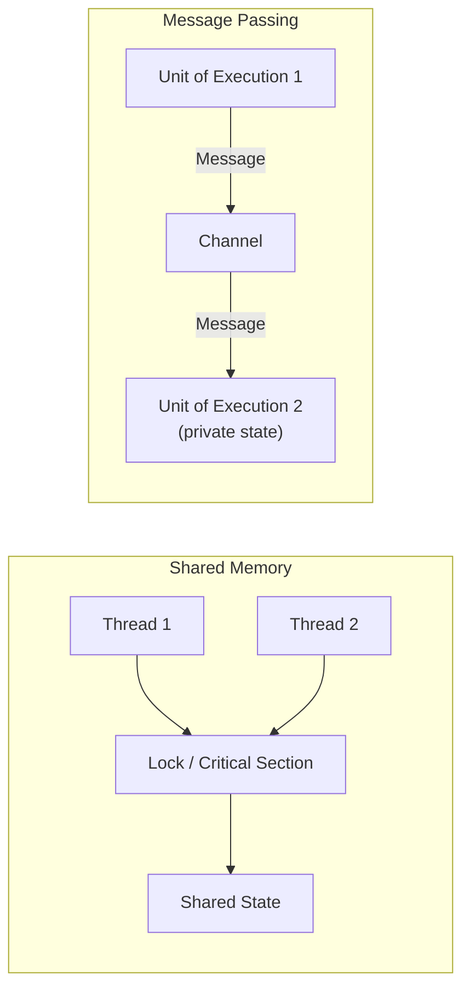

# 11.1 Shared-Memory Synchronization Patterns

> The fact that programs can be constructed from simpler basic primitives is a strong
> guarantee: what these primitives contain stays logically consistent with the rest of the
> programming language.
> -- C. A. R. Hoare

The whole difficulty of concurrent programming can be distilled into a single sentence:
multiple units of execution must cooperate over the same shared state, and the order in
which each of them makes progress cannot be predicted. How to make that cooperation both
correct and efficient has, over more than half a century, split into two great traditions.
This chapter is about one of them, shared memory. Before we take apart the concrete
primitives in Go's standard library `sync` and `sync/atomic`, this section first lays the
two traditions side by side to tell them apart, explains why they are dual to each other,
and then states where Go stands between them. Once you understand this layer of trade-offs,
the sections from [11.2](./mutex.md) through [11.9](./mem.md) are no longer isolated APIs
but the same design philosophy landing on different scenarios.

## 11.1.1 The Two Great Traditions of Concurrency

Concurrent programming has historically had two great traditions. One is **shared memory**:
threads share an address space and coordinate access to shared state through means such as
mutexes, semaphores, and condition variables. Dijkstra's semaphore, proposed in 1965, and
Hoare's monitor, proposed in 1974, are its foundations, and it is also the mainstream
approach of C/C++, Java, and nearly every operating system kernel. The other is **message
passing**: units of execution share no state and coordinate only by sending and receiving
messages. Hoare's CSP ([10.1](../ch10chan)) and Hewitt's Actor model are its two branches,
and Erlang and occam are its representatives.

The dividing line between the two traditions falls on the question of who owns the state. In
shared memory the state is public, anyone can touch it, so locks must carve out a critical
section and stipulate that only one unit of execution may enter at a time. In message
passing the state is private; if someone else wants to read or write it, they can only send
a letter asking its owner to do it on their behalf, and the coordination is completed
naturally by the timing of sends and receives on the channel.



The two are not an either-or choice. The "producer and consumer" and "dining philosophers"
problems that Dijkstra once solved with semaphores can be written just as well with channels
today; conversely, the internal implementation of a channel is itself a stretch of shared
buffer protected by a mutex ([10](../ch10chan)). This sense that "say it a different way and
you can translate from one side to the other" is not an illusion. The next subsection will
show that it was proven a general law as early as 1979.

## 11.1.2 The Lauer-Needham Duality

In 1979, Hugh Lauer and Roger Needham put forward a far-reaching claim: message-passing
systems and shared-memory systems (which they called "procedure-oriented") are **dual** in
expressive power; the two can be mechanically transformed into each other, and after the
transformation their performance is comparable. They gave a correspondence table between the
constituent parts of the two kinds of systems, roughly as follows.

| Message-passing world | Shared-memory (procedure) world |
| --- | --- |
| Process, message port | Lock-protected module, procedure entry |
| Send a request message and wait for a reply | Call a procedure and wait for it to return |
| Wait for a message to arrive on some port | Wait on a condition variable |
| Message queue | A lock plus a condition variable |

What this table says is: every cooperation pattern built out of messages has an equivalent
built out of "a lock plus a condition variable," and vice versa. Its significance lies not
in encouraging you to swap freely between the two, but in revealing something deeper:
**correctness and performance are not determined by which tradition you chose**. In
principle the two paths are two sides of the same mountain. Lauer and Needham thus argued
that the choice should come from the engineering judgment of "which is more natural, less
error-prone, and better suited to the hardware and runtime at hand," rather than from a
belief that one tradition is innately superior.

This duality is exactly the key to understanding Go's position. Since the two paths are
equivalent, Go need not, and indeed does not, treat message passing as the only truth.
Instead it gives message passing a preferred place at the language level while keeping shared
memory fully intact in the standard library.

## 11.1.3 Where Go Stands

Go's position is clear-cut: it makes message passing ([channel](../ch10chan) and select)
the **core at the language level**, condensed into that well-known maxim.

> Do not communicate by sharing memory; instead, share memory by communicating.

But "core" does not mean "only." Go does not reject shared memory. Traditional mutual
exclusion, atomics, condition variables, thread-local resources, and the like are placed in
the standard libraries `sync` and `sync/atomic`, becoming a set of **synchronization
patterns** rather than language primitives. This placement is itself a statement of
position: channels are first-class citizens of the syntax, while locks and atomics are tools
to be picked up as needed.

Why keep them? Because duality is duality, but in engineering the "naturalness" of the two
paths is not symmetric. When all you need to protect is a small piece of state, say a
counter, a configuration table, or a one-time initialization, wrapping it with a lock is
often more direct and faster than dedicating a goroutine to it and routing the read and
write requests through a channel. Every send and receive on a channel must pass through
scheduling and a memory barrier, whereas an uncontended atomic add may be a single CPU
instruction. [10.9](../ch10chan) discussed at length when not to use a channel; this chapter
continues that line and answers "what to use then."

The comparison below shows two ways of writing the same concurrency-safe counter. On the
left, a channel serializes all operations; on the right, a single lock protects an integer.
Both are correct, but when the semantics are as simple as "add one to a number," the
right-hand version fits the problem itself better:

```go
// Approach one: share memory by communicating (channel serializes)
type counter struct{ ch chan int }

func (c *counter) inc()     { c.ch <- 1 }       // send "add one" as a message
func (c *counter) loop() {                       // dedicate a goroutine to hold the state
    n := 0
    for delta := range c.ch {
        n += delta
    }
}

// Approach two: shared memory plus a lock (sync.Mutex)
type counter struct {
    mu sync.Mutex
    n  int
}

func (c *counter) inc() {
    c.mu.Lock()
    c.n++          // critical section: one increment
    c.mu.Unlock()
}
```

The criterion is not mysterious: whether ownership of the state needs to flow among multiple
goroutines, and whether the cooperation logic is itself a data pipeline. If so, lean toward
channels; if it is just a few goroutines occasionally touching the same small piece of
state, lean toward locks or atomics. Go provides both sets of tools so that the person
writing the program can pick by scenario, rather than being forced by the language down a
single path.

## 11.1.4 Map of This Chapter

This chapter takes apart, one by one, the implementations and trade-offs of these
shared-memory synchronization primitives. Each section makes clear both what problem the
primitive solves and the theoretical tradition and engineering evolution behind it, and it
points out the specific trade-off the primitive makes among the three goals of "correct,
simple, fast":

- **Mutex** ([11.2](./mutex.md)): the most basic critical-section protection. From
  Dijkstra's mutual-exclusion problem and the futex foundation provided by the operating
  system, to the trade-off Go itself makes between normal mode and starvation mode.
- **Atomic operations** ([11.3](./atomic.md)): the layer closest to the hardware. The
  consensus hierarchy, the ABA problem, the lineage of lock-free data structures, and why Go
  exposes only sequentially consistent atomics.
- **Condition variable** ([11.4](./cond.md)): waiting for some condition to hold. The
  divergence between Hoare and Mesa signal semantics, and why in Go it is often replaced by a
  channel.
- **Wait group** ([11.5](./waitgroup.md)): the counting latch and barrier of fork-join
  concurrency.
- **Object pool** ([11.6](./pool.md)): object reuse and easing the load on the GC. The
  evolution of per-P sharding and the victim cache.
- **Concurrency-safe hash map** ([11.7](./map.md)): the solution lineage for concurrent hash
  maps, and the trade-offs of the two generations of `sync.Map` implementations.
- **Context** ([11.8](./context.md)): propagating cancellation and deadlines along the task
  tree. Cooperative cancellation and structured concurrency.
- **Memory consistency model** ([11.9](./mem.md)): the underlying contract that makes all of
  the above hold, and also the theoretical wrap-up of this chapter.

By the end you will find a main thread running throughout: every primitive is a specific
trade-off among correctness, simplicity, and performance, and Go's preference is always to
put simplicity and correctness ahead of performance. The mutex would rather give up the
extreme of fairness than allow starvation; atomics offer only the sequentially consistent
tier and do not expose weak ordering; `sync.Map` trades space and complexity for performance
under read-heavy, write-light loads. Each is a footnote to this preference. This is of a
piece with [9 the scheduler](../ch09sched) and [10 channels](../ch10chan), and together the
three form the full picture of Go concurrency.

## Further Reading

1. Edsger W. Dijkstra. "Cooperating Sequential Processes." 1968 (the foundation of
   semaphores and shared-memory synchronization, covering mutual exclusion, producer-consumer,
   the dining philosophers, and other problems).
2. C. A. R. Hoare. "Monitors: An Operating System Structuring Concept." *CACM*, 17(10),
   1974. https://doi.org/10.1145/355620.361161
3. C. A. R. Hoare. "Communicating Sequential Processes." *CACM*, 21(8), 1978.
   https://doi.org/10.1145/359576.359585 (the foundation of the message-passing tradition,
   see [10](../ch10chan)).
4. Hugh C. Lauer, Roger M. Needham. "On the Duality of Operating System Structures."
   *ACM SIGOPS OSR*, 13(2), 1979. https://doi.org/10.1145/850657.850658
   (the duality of message passing and shared memory).
5. Carl Hewitt, Peter Bishop, Richard Steiger. "A Universal Modular ACTOR Formalism for
   Artificial Intelligence." *IJCAI 1973* (the Actor model).
6. The Go Authors. *The Go Memory Model.* https://go.dev/ref/mem .
7. The Go Authors. *Effective Go: Share by communicating.*
   https://go.dev/doc/effective_go#concurrency .
