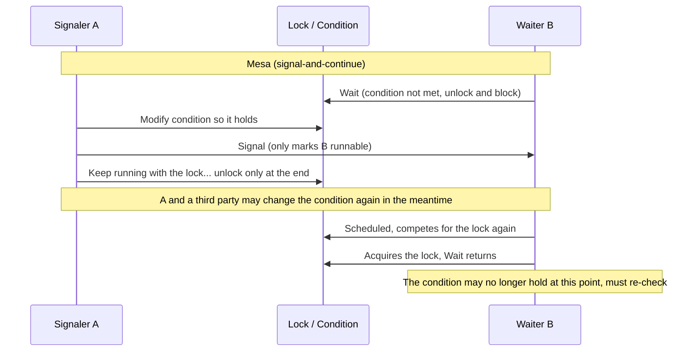

# 11.4 Condition Variables

The mutex ([11.2](./mutex.md)) answers the question of "who may enter the critical section." A condition variable answers a different one: "a Goroutine has already entered the critical section, but finds it cannot do its work yet; how does it wait until the moment it can, while yielding the critical section to others." The producer and consumer is the most common example. When the queue is full, the producer can neither write nor keep spinning while holding the lock, otherwise the consumer can never acquire the lock to free up space, and both sides deadlock together. The condition variable `sync.Cond` offers this way out: let the producer "sleep with the lock," atomically hand off the lock and block, and once the consumer frees up space, wake it back up, with the lock back in its hands on waking.

This section first makes the usage clear, especially that rule almost every textbook stresses yet rarely explains the origin of: `Wait` must be written inside a `for` loop. This rule is not a Go invention; it is rooted in a 1970s dispute over two wakeup semantics for the "monitor." Telling this history makes plain why, from pthread to Java to Go, modern condition variables without exception require a re-check loop. We then sketch the Go implementation (the ticket mechanism of notifyList, the copy-forbidding copyChecker), and finally explain a fact that may come as a surprise: in Go, `sync.Cond` is actually used very rarely, since channels and close-broadcast have largely replaced it.

## 11.4.1 Usage: Why Wait Must Be Inside a for Loop

Look first at a standard producer and consumer. `condition` is the lock-protected shared state, and `cond` is constructed with the same lock:

```go
func main() {
	cond := sync.NewCond(new(sync.Mutex))
	condition := 0

	// consumer
	go func() {
		for {
			cond.L.Lock()
			for condition == 0 { // nothing to consume, sleep with the lock
				cond.Wait()
			}
			condition--
			cond.Signal() // freed up space, wake one producer
			cond.L.Unlock()
		}
	}()

	// producer
	for {
		cond.L.Lock()
		for condition == 100 { // queue is full, sleep with the lock
			cond.Wait()
		}
		condition++
		cond.Signal() // goods are ready, wake one consumer
		cond.L.Unlock()
	}
}
```

The contract of `Wait` is three things in one: atomically unlock `c.L`, block the current Goroutine, and after being woken re-lock `c.L` before returning. "Atomically unlock and block" is the key step, since it closes a lost-wakeup window that would otherwise be inevitable: if unlocking and blocking were two separate steps, then in the instant after unlocking but before blocking, the other side could very well fix the condition and issue `Signal`, and this side, not yet asleep, would miss that signal, and once it does fall asleep no one would come to wake it, so it would miss the wakeup forever. `Wait` makes unlocking and enqueueing one atomic operation precisely to eliminate this window.

What really needs explaining is the loop. Notice that every `Wait` above is wrapped in `for condition == ...`, not `if`. Intuitively, since the consumer only sleeps when "`condition == 0`," it ought to be `condition > 0` after being woken, so a single `if` check would suffice; why loop? The answer: when `Wait` returns, the condition that put you to sleep is **not guaranteed** to still hold. Being woken means only "perhaps it is ready now, go re-check," not "the condition is satisfied." To understand where this "perhaps" comes from, we must return to the wakeup semantics of the monitor.

## 11.4.2 The Monitor's Two Wakeup Semantics: Hoare and Mesa

The condition variable was not designed out of thin air; it is a component of the 1970s concurrency abstraction called the "monitor." The monitor was systematically proposed by Hoare in his 1974 paper *Monitors: An Operating System Structuring Concept* (with Brinch Hansen independently arriving at a similar conception around the same time). It encapsulates shared data together with the procedures that operate on that data, guarantees that at most one process is active inside the monitor at any moment, and provides condition variables so that a process may voluntarily yield the monitor and wait to be woken when a condition is not met.

The divergence arises at the moment of waking. When process $A$, inside the monitor, executes `signal` and wakes process $B$ that was waiting on some condition, the constraint of monitor mutual exclusion requires that the two cannot be active inside simultaneously, so someone must give way. Who gives way, and when, yields two fundamentally different semantics.

**Hoare semantics, also called signal-and-wait.** Hoare's original paper stipulated: `signal` immediately transfers control of the monitor to the woken $B$, while the signaler $A$ suspends itself and resumes only after $B$ leaves the monitor. The benefit of this semantics is that it is extremely friendly to the programmer: $A$ has just made the condition true right before `signal`, and control passes **immediately** to $B$, with no opportunity for any third party to intervene in between, so when $B$ wakes the condition **certainly** holds. Under Hoare semantics, the waiting side may write `if`:

```go
// Pseudo-code under Hoare (signal-and-wait) semantics, for contrast only; Go is not like this
c.L.Lock()
if condition == 0 { // if suffices: on waking the condition is guaranteed to hold
	c.Wait()
}
// here condition > 0 is certain to hold
```

The cost is hidden in the implementation. "Immediate transfer, signaler suspends" requires an extra context switch, and also requires maintaining a special priority queue for the suspended signaler so that it re-enters ahead of ordinary contenders once the woken side yields. This mechanism is complex to implement and switches frequently, and its performance is not appealing.

**Mesa semantics, also called signal-and-continue.** Lampson and Redell, in their 1980 paper *Experience with Processes and Monitors in Mesa*, based on the experience of building real systems with the Mesa language at Xerox PARC, chose the opposite approach: `signal` merely marks $B$ as runnable, and the signaler $A$ **continues** to run holding the lock until it is willing to leave the monitor on its own. The woken $B$ at this point has merely returned to the "ready" state; it still has to compete for that lock again. The problem lies right here: from the moment $A$ issues `signal` to the moment $B$ truly re-acquires the lock and `Wait` returns, there is an indeterminate span of time, during which not only may $A$ keep modifying the shared state, but some third process may also grab the lock first and consume away the very condition $A$ just freed up. By the time $B$ wakes, the condition it was waiting on before sleeping may well **no longer hold**.



The conclusion follows naturally: under Mesa semantics, being woken does **not** equal the condition holding, and the waiting side must re-check the condition after returning, and if it still does not hold, `Wait` again. This is exactly the origin of the `for` loop. Replacing `if` with `for` is equivalent to changing "I trust that on waking it is usable" into "I confirm once more after waking, and if not, go back to sleep":

```go
c.L.Lock()
for !condition() { // for, not if: re-check after waking, Wait again if not met
	c.Wait()
}
// loop exits, condition() is certainly true at this point
c.L.Unlock()
```

## 11.4.3 Why Modern Condition Variables Are Uniformly Mesa Semantics

Since Hoare semantics is friendlier to the programmer (`if` suffices), why do today's condition variables almost uniformly choose Mesa? The reasons Lampson and Redell gave in their paper still hold, and fall into three points.

First, **simpler implementation, better performance**. Under Mesa semantics, `signal` need only mark the waiter as ready, with no extra context switch and no need to maintain a preemptive re-entry queue for the signaler. Waking and scheduling are decoupled, handed back to the general scheduler.

Second, **naturally robust to spurious wakeups**. In real systems, a waiter may be woken for all sorts of reasons unrelated to the condition: operating system signals, timeouts, or the "spurious wakeup" allowed to simplify implementation (POSIX explicitly permits `pthread_cond_wait` to return without cause). Hoare semantics is quite fragile to this, while Mesa semantics, because it already requires a re-check loop, absorbs these accidental wakeups with the same `for`: re-check once, find the condition unmet, and go back to sleep.

Third, **compatible with broadcast semantics**. `Broadcast` wakes all waiters at once, but usually only one (or a few) of them can truly continue, while the rest, once woken, find the condition already taken by those who got there first. This "wake more than available" pattern is safe only under the premise that "waking must be followed by a re-check," and that is exactly the premise built into Mesa semantics.

So we see a unified rule spanning languages and platforms:

| System | Wakeup semantics | Waiting style |
| --- | --- | --- |
| Hoare's original monitor (1974) | signal-and-wait | `if` suffices |
| POSIX `pthread_cond_wait` | signal-and-continue (and permits spurious wakeup) | must `while` |
| Java `Object.wait` / `Condition.await` | signal-and-continue | must `while` (official docs make this explicit) |
| Go `sync.Cond.Wait` | signal-and-continue | must `for` |

Go's documentation states this very plainly: "Because c.L is not locked while Wait is waiting, the caller typically cannot assume that the condition is true when Wait returns. Instead, the caller should Wait in a loop." This sentence is the engineering counsel of Mesa semantics put into words.

## 11.4.4 Go's Implementation: notifyList and copyChecker

With the semantics understood, what remains of Go's implementation is only the mechanical part. The structure of `sync.Cond` is very thin:

```go
// sync.Cond: a thin layer; the real wait queue lives in notifyList (sketch)
type Cond struct {
	noCopy  noCopy      // for go vet -copylocks static checking, forbids copying
	L       Locker      // the lock held while observing / modifying the condition, may be *Mutex or *RWMutex
	notify  notifyList  // notification list: wait queue + ticket counter
	checker copyChecker // detects copying at runtime, panics on copy
}
```

The type of `L` is the `Locker` interface (which needs only the two methods `Lock`/`Unlock`), so both `*Mutex` and `*RWMutex` work. The three methods `Wait`/`Signal`/`Broadcast` each first call `checker.check()` once, and hand off all the remaining work to the runtime's notifyList:

```go
func (c *Cond) Wait() {
	c.checker.check()
	t := runtime_notifyListAdd(&c.notify) // take a ticket
	c.L.Unlock()                          // unlock
	runtime_notifyListWait(&c.notify, t)  // block on the ticket, wait for notification
	c.L.Lock()                            // re-lock after waking
}
func (c *Cond) Signal()    { c.checker.check(); runtime_notifyListNotifyOne(&c.notify) }
func (c *Cond) Broadcast() { c.checker.check(); runtime_notifyListNotifyAll(&c.notify) }
```

**The ticket mechanism.** The core of notifyList is a pair of monotonically increasing counters that, in a "take a number and queue" fashion, resolves a subtle race: inside `Wait`, the order is first `notifyListAdd` to take a number, then `Unlock`, and finally `notifyListWait` to truly enqueue and block, three steps that are not done in one breath. If a `Signal` happens to arrive between taking the number and enqueueing, this not-yet-sleeping waiter must not be missed. The ticket exists precisely for this:

```go
// notifyList: a ticket-based notification list (sketch)
type notifyList struct {
	wait   atomic.Uint32 // the next waiter's number; lock-free atomic increment
	notify uint32        // the next number to be notified; written under lock, readable lock-free
	lock   mutex
	head   *sudog // the linked list of enqueued, blocking waiters
	tail   *sudog
}
```

`Wait` first does `wait.Add(1)` to obtain a number `t`. When it reaches `notifyListWait`, it first compares `t` with `notify`: if `t < notify`, it means "my number" has long been called (`Signal` happened before I enqueued), so it returns immediately without blocking. Otherwise it truly constructs a `sudog`, enqueues, and `goparkunlock`s to suspend itself, a step that unbinds the G from the M, sets it to waiting state, and returns it to the scheduler ([9](../ch09sched)). `Signal` (`notifyListNotifyOne`) then increments `notify` by one, finds the `sudog` holding that number in the linked list, and `goready`s it; `Broadcast` (`notifyListNotifyAll`) advances `notify` directly to catch up with `wait`, waking all waiters in the linked list. Both have a lock-free fast path: if `wait == notify` (no new waiter since the last notification), they return directly without even taking the lock.

**copyChecker: forbidding copying.** Once `Cond` is in use it must not be copied, since copying duplicates an independent notifyList, causing wakeups to be sent to the wrong queue and producing hard-to-diagnose lost wakeups. Go uses two lines of defense to block this: the `noCopy` field is a static marker for `go vet -copylocks` to see, warning at compile time; `copyChecker` is the runtime backstop, a `uintptr` that stores "its own address":

```go
// copyChecker: stores a pointer to itself, using it to detect copying (sketch)
type copyChecker uintptr

func (c *copyChecker) check() {
	if uintptr(*c) != uintptr(unsafe.Pointer(c)) &&
		!atomic.CompareAndSwapUintptr((*uintptr)(c), 0, uintptr(unsafe.Pointer(c))) &&
		uintptr(*c) != uintptr(unsafe.Pointer(c)) {
		panic("sync.Cond is copied")
	}
}
```

Its elegance lies in this: when not copied, `*c` stores `c`'s own address, and the three-step check returns on the fastest first comparison; on first use `*c` is still zero, and the middle CAS writes the address of itself into it. Once a copy happens, `*c` in the new object still stores the address of the **original** object, which does not match the new address, the CAS also fails because it is non-zero, and after all three steps it `panic("sync.Cond is copied")`s. With a single `uintptr` it encodes "have I been moved house," taking no extra space, the same space-saving trick as the free list in [12.2](../../part4memory/ch12alloc/component.md) "storing the pointer in the free block itself."

## 11.4.5 The happens-before Guarantee

`sync.Cond` has an explicit ordering guarantee in the Go memory model ([11.9](./mem.md)): a `Signal` or `Broadcast` call that can wake some `Wait` is **synchronized before** the return of the `Wait` it wakes. That is, the writes the signaler makes to shared state before `Signal` are certain to be visible to the woken side after `Wait` returns. This guarantee covers only the visibility between this one pair of events "wake and woken," however; it does **not** guarantee the condition itself holds for you, which is the separate matter of Mesa semantics already covered in 11.4.2. Visibility and the condition holding are two different things: the former relies on the memory model, the latter on that `for` loop of yours. This also confirms from the memory model side why bare use of `if` is not safe.

## 11.4.6 Why sync.Cond Is Rarely Used in Go

Reading this far the reader may ask: since the condition variable is such a classic, why is it so rarely seen in Go code? The answer is that Go has handed both of its major uses to the handier channel.

The official `sync.Cond` documentation says so itself: "For many simple use cases, users will be better off using channels than a Cond," and gives the correspondence: `Signal` corresponds to "send a value on a channel," and `Broadcast` corresponds to "`close` a channel." The latter is especially common: closing a channel makes **all** Goroutines blocked on receiving from it return the zero value at once, which is naturally a broadcast, and closing is idempotent and observable many times, far less worrisome than `cond.Broadcast`, which needs a lock and a `for` loop to go with it. A typical "one-shot broadcast" is written like this:

```go
done := make(chan struct{})
// waiting side: block until done is closed
go func() {
	<-done
	// woken by the broadcast, continue
}()
// broadcasting side: one close wakes all waiters
close(done)
```

For this reason, even the standard library itself is "de-Cond-ing." In the early days `io.Pipe` once used `sync.Cond` to coordinate the reading and writing ends, but was later rewritten into a pure channel implementation. Today the real use cases of `sync.Cond` in the standard library can be counted on one hand, and all concentrate in those scenarios where channels are instead awkward: the `closemu` of `database/sql` (a read-write lock paired with two Conds, distinguishing read-waiters from write-waiters), the HTTP server waiting for in-flight requests to drain to zero during a graceful shutdown, and so on. What these scenarios have in common is "waiting on a predicate that changes back and forth over time," for which the channel's "one send, one receive" or "one-shot close" semantics happen not to fit, while the condition variable's "wait with the lock on a condition that will change" is born precisely for this.

Placed in the lineage, `sync.Cond` is a remnant of the monitor tradition within Go. Go's concurrency philosophy leans toward CSP (Hoare's other foundational work of 1978), "share memory by communicating," while the condition variable belongs to the other lineage of "share memory with synchronization primitives." Go provides both, but establishes the former as the default, so the condition variable retreats into a corner, becoming one of the few tools called out only when "shared-memory-style coordination is truly needed." It remains in the standard library, yet the documentation turns around and advises you to think of channels first, and this posture of "provided but not encouraged" is itself a footnote to Go's concurrency orientation.

## Further Reading

1. C. A. R. Hoare. "Monitors: An Operating System Structuring Concept."
   *Communications of the ACM*, 17(10), 1974. https://doi.org/10.1145/355620.361161
   (the original proposal of the monitor and signal-and-wait semantics)
2. Butler W. Lampson and David D. Redell. "Experience with Processes and Monitors in Mesa."
   *Communications of the ACM*, 23(2), 1980. https://doi.org/10.1145/358818.358824
   (the source of signal-and-continue semantics and the "re-check loop" rule)
3. C. A. R. Hoare. "Communicating Sequential Processes." *Communications of the ACM*,
   21(8), 1978. https://doi.org/10.1145/359576.359585 (the theoretical source of Go's channel orientation)
4. Per Brinch Hansen. "Structured Multiprogramming." *Communications of the ACM*, 15(7),
   1972. https://doi.org/10.1145/361454.361473 (a monitor conception contemporaneous with Hoare's)
5. The Go Authors. *sync.Cond documentation and source* (`src/sync/cond.go`).
   https://pkg.go.dev/sync#Cond
6. The Go Authors. *The Go Memory Model* (Version of June 6, 2022).
   https://go.dev/ref/mem (Cond's synchronized-before guarantee)
7. This book [11.2 Mutex](./mutex.md), [11.9 Memory Consistency Model](./mem.md),
   [12.2 Components](../../part4memory/ch12alloc/component.md).
